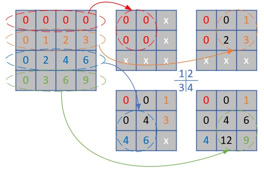

<!--Copyright © Microsoft Corporation. All rights reserved.
  适用于[License](https://github.com/Microsoft/ai-edu/blob/master/LICENSE.md)版权许可-->

## 17.4 卷积反向传播代码实现

### 17.4.1 方法1

完全按照17.3中的讲解来实现反向传播，但是由于有17.2中关于numba帮助，我们在实现代码时，可以考虑把一些模块化的计算放到独立的函数中，用numba在运行时编译加速。

```Python
    def backward_numba(self, delta_in, flag):
        # 如果正向计算中的stride不是1，转换成是1的等价误差数组
        dz_stride_1 = expand_delta_map(delta_in, ...)
        # 计算本层的权重矩阵的梯度
        self._calculate_weightsbias_grad(dz_stride_1)
        # 由于输出误差矩阵的尺寸必须与本层的输入数据的尺寸一致，所以必须根据卷积核的尺寸，调整本层的输入误差矩阵的尺寸
        (pad_h, pad_w) = calculate_padding_size(...)
        dz_padded = np.pad(dz_stride_1, ...)
        # 计算本层输出到下一层的误差矩阵
        delta_out = self._calculate_delta_out(dz_padded, flag)
        #return delta_out
        return delta_out, self.WB.dW, self.WB.dB

    # 用输入数据乘以回传入的误差矩阵,得到卷积核的梯度矩阵
    def _calculate_weightsbias_grad(self, dz):
        self.WB.ClearGrads()
        # 先把输入矩阵扩大，周边加0
        (pad_h, pad_w) = calculate_padding_size(...)
        input_padded = np.pad(self.x, ...)
        # 输入矩阵与误差矩阵卷积得到权重梯度矩阵
        (self.WB.dW, self.WB.dB) = calcalate_weights_grad(...)
        self.WB.MeanGrads(self.batch_size)

    # 用输入误差矩阵乘以（旋转180度后的）卷积核
    def _calculate_delta_out(self, dz, layer_idx):
        if layer_idx == 0:
            return None
        # 旋转卷积核180度
        rot_weights = self.WB.Rotate180()
        # 定义输出矩阵形状
        delta_out = np.zeros(self.x.shape)
        # 输入梯度矩阵卷积旋转后的卷积核，得到输出梯度矩阵
        delta_out = calculate_delta_out(dz, ..., delta_out)

        return delta_out
```
为了节省篇幅，上面的代码中做了一些省略，只保留了基本的实现思路，并给出了详尽的注释，相信读者在充分理解17.3的内容的基础上，可以看懂。

其中，两个计算量大的函数，一个是计算权重矩阵的基础函数calcalate_weights_grad，另一个是计算输出误差矩阵的基础函数calculate_delta_out，都使用了numba的方式实现，以加快反向传播代码的运行速度。

### 17.4.2 方法2

在前向计算中，我们试验了img2col的方法，取得了不错的效果。在反向传播中，也有对应的逆向方法，叫做col2img。下面我们基于它来实现另外一种反向传播算法，其基本思想是：把反向传播也看作是全连接层的方式，直接用矩阵运算代替卷积操作，然后把结果矩阵再转换成卷积操作的反向传播所需要的形状。

#### 代码实现

```Python
    def backward_col2img(self, delta_in, layer_idx):
        OutC, InC, FH, FW = self.WB.W.shape
        # 误差矩阵变换
        delta_in_2d = np.transpose(delta_in, axes=(0,2,3,1)).reshape(-1, OutC)
        # 计算Bias的梯度
        self.WB.dB = np.sum(delta_in_2d, axis=0, keepdims=True).T / self.batch_size
        # 计算Weights的梯度
        dW = np.dot(self.col_x.T, delta_in_2d) / self.batch_size
        # 转换成卷积核的原始形状
        self.WB.dW = np.transpose(dW, axes=(1, 0)).reshape(OutC, InC, FH, FW)# 计算反向传播误差矩阵
        dcol = np.dot(delta_in_2d, self.col_w.T)
        # 转换成与输入数据x相同的形状
        delta_out = col2img(dcol, self.x.shape, FH, FW, self.stride, self.padding)
        return delta_out, self.WB.dW, self.WB.dB
```

#### 单样本单通道的实例讲解

假设有1个样本1个通道且图片为3x3的矩阵：
```
x=
 [[[[0 1 2]
    [3 4 5]
    [6 7 8]]]]

col_x=
 [[0. 1. 3. 4.]
  [1. 2. 4. 5.]
  [3. 4. 6. 7.]
  [4. 5. 7. 8.]]
```
卷积核也只有1个形状为1x1x2x2的矩阵：
```
w=
 [[[[0 1]
    [2 3]]]]
```
卷积核展开后：
```
col_w=
 [[0]
  [1]
  [2]
  [3]]
```
卷积的结果会是一个样本在一个通道上的2x2的输出。

再假设从后端反向传播回来的输入误差矩阵：
```
delta_in=
 [[[[0 1]
    [2 3]]]]
```
误差矩阵经过下式变换：
```Python
delta_in_2d = np.transpose(delta_in, axes=(0,2,3,1)).reshape(-1, OutC)
```
得到：
```
delta_in_2d=
 [[0]
 [1]
 [2]
 [3]]
```
计算dB（这一步和全连接层完全相同）：
```Python
self.WB.dB = np.sum(delta_in_2d, axis=0, keepdims=True).T / self.batch_size
```
得到：
```
dB=
 [[6.]]
```
计算dW（这一步和全连接层完全相同）：
```Python
dW = np.dot(self.col_x.T, delta_in_2d) / self.batch_size
```
得到：
```
dW=
 [[19.]
  [25.]
  [37.]
  [43.]]
```
还原dW到1x1x2x2的卷积核形状：
```Python
self.WB.dW = np.transpose(dW, axes=(1, 0)).reshape(OutC, InC, FH, FW) 
```
得到：
```
dW=
 [[[[19. 25.]
    [37. 43.]]]]
```
至此，dB和dW都已经得到，本层的梯度计算完毕，需要把梯度回传给前一层，所以要计算输出误差矩阵（这一步和全连接层完全相同）：
```Python
dcol = np.dot(delta_in_2d, self.col_w.T)
```
得到：
```
dcol=
 [[0 0 0 0]
 [0 1 2 3]
 [0 2 4 6]
 [0 3 6 9]]
```
转换成正确的矩阵形状：
```Python
delta_out = col2img(dcol, self.x.shape, FH, FW, self.stride, self.padding)
```
得到：
```
delta_out=
 [[[[ 0.  0.  1.]
    [ 0.  4.  6.]
    [ 4. 12.  9.]]]]
```

下面我们解释一下最后一步的运算过程，如图17-30所示。



图17-30 col2img图解

得到上述dcol的4x4矩阵后，我们要把它逆变换到一个3x3的矩阵中，步骤如下：

1. 左侧第一行红色椭圆内的四个元素移到右侧红色圆形内；
2. 在1的基础上，左侧第二行黄色椭圆内的四个元素移到右侧黄色圆形内，其中与原有元素重叠的地方则两个值相加。比如中间那个元素就是0+2=2；
3. 在2的基础上，左侧第三行蓝色椭圆内的四个元素移到右侧蓝色圆形内，其中与原有元素重叠的地方则两个值相加。比如中间那个元素再次加2；
4. 在3的基础上，左侧第四行绿色椭圆内的四个元素移到右侧绿色圆形内，其中与原有元素重叠的地方则两个值相加，中间的元素再次加0，还是4；中间靠下的元素原值是6，加6后为12。

这个结果和最后一步delta_out的结果完全一致。

#### 多样本多通道的实例讲解

图17-31是两个样本的例子，输入通道为3，输出通道为2。


图17-31 两个样本三通道两个卷积核的例子

图17-31中的各组件参数如下：

- batch size = 2
- input channel = 3
- input height = 3
- input width = 3
- filter height = 2
- filter width = 2
- stride = 1
- padding = 0
- output channel = 2
- output height = 2
- output width = 2

#### 误差输入矩阵

delta_in是本层的误差输入矩阵，它的形状应该和本层的前向计算结果一样。在本例中，误差输入矩阵的形状应该是：(batch_size * output_channel * output_height * output_width) = (2 x 2 x 2 x 2)：
```
delta_in=
(样本1)
    (通道1)
 [[[[ 0  1]
   [ 2  3]]
    (通道2)
  [[ 4  5]
   [ 6  7]]]
(样本2)
    (通道1)
 [[[ 8  9]
   [10 11]]
    (通道2)
  [[12 13]
   [14 15]]]]
```

为了做img2col的逆运算col2img，我们把它转换成17.2中的结果数据的形状8x2：

```Python
delta_in_2d = np.transpose(delta_in, axes=(0,2,3,1)).reshape(-1, OutC)
```

```
delta_in_2d=
 [[ 0  4]
  [ 1  5]
  [ 2  6]
  [ 3  7]
  [ 8 12]
  [ 9 13]
  [10 14]
  [11 15]]
```

计算权重矩阵的梯度：

```Python
dW = np.dot(self.col_x.T, delta_in_2d) / self.batch_size
```

结果：

```
dW=
[[ 564.|  812.]
 [ 586.|  850.]
 [ 630.|  926.]
 [ 652.|  964.]
 ------+-------
 [ 762.| 1154.]
 [ 784.| 1192.]
 [ 828.| 1268.]
 [ 850.| 1306.]
 ------+-------
 [ 960.| 1496.]
 [ 982.| 1534.]
 [1026.| 1610.]
 [1048.| 1648.]]
```
但是这个12x2的结果是对应的权重矩阵的二维数组展开形式的，所以要还原成原始的卷积核形式2x3x2x2：

```Python
self.WB.dW = np.transpose(dW, axes=(1, 0)).reshape(OutC, InC, FH, FW)
```

结果：

```
dW=
(过滤器1)                 (过滤器2)
    (卷积核1)                 (卷积核1)
 [[[[ 564.  586.]        [[[ 812.  850.]
   [ 630.  652.]]          [ 926.  964.]]
    (卷积核2)                 (卷积核2)
  [[ 762.  784.]          [[1154. 1192.]
   [ 828.  850.]]          [1268. 1306.]]
    (卷积核3)                 (卷积核3)
  [[ 960.  982.]          [[1496. 1534.]
   [1026. 1048.]]]         [1610. 1648.]]]]
```

计算误差输出矩阵：

```Python
dcol = np.dot(delta_in_2d, self.col_w.T)
```

得到：

```
dcol=
 [[ 48  52  56  60  64  68  72  76  80  84  88  92]
 [ 60  66  72  78  84  90  96 102 108 114 120 126]
 [ 72  80  88  96 104 112 120 128 136 144 152 160]
 [ 84  94 104 114 124 134 144 154 164 174 184 194]
 [144 164 184 204 224 244 264 284 304 324 344 364]
 [156 178 200 222 244 266 288 310 332 354 376 398]
 [168 192 216 240 264 288 312 336 360 384 408 432]
 [180 206 232 258 284 310 336 362 388 414 440 466]]
```

但是dcol对应的是输入数据的二维展开形式4x12，应该把它还原成2x3x3x3的形式：

```Python
delta_out = col2img(dcol, self.x.shape, FH, FW, self.stride, self.padding)
```

得到：

```
delta_out=
(样本1)                     (样本2)
    (通道1)                     (通道1)
[[[[  48.  112.   66.]    [[[ 144.  320.  178.]
   [ 128.  296.  172.]      [ 352.  776.  428.]
   [  88.  200.  114.]]     [ 216.  472.  258.]]
    (通道2)                     (通道2)
  [[  64.  152.   90.]     [[ 224.  488.  266.]
   [ 176.  408.  236.]      [ 528. 1144.  620.]
   [ 120.  272.  154.]]     [ 312.  672.  362.]]
    (通道3)                     (通道3)
  [[  80.  192.  114.]     [[ 304.  656.  354.]
   [ 224.  520.  300.]      [ 704. 1512.  812.]
   [ 152.  344.  194.]]]    [ 408.  872.  466.]]]]
```

### 17.4.3 正确性与性能测试

在正向计算中，numba稍胜一筹，下面我们来测试一下二者的反向计算性能，然后比较梯度输出矩阵的结果来验证正确性。

```Python
def test_performance():
    ...
```

先用numba方法测试1000次的正向+反向，然后再测试1000次img2col的正向+反向，同时我们会比较反向传播的三个输出值：误差矩阵b、权重矩阵梯度dw、偏移矩阵梯度db。

输出结果：

```
method numba: 11.830008506774902
method img2col: 3.543151378631592
compare correctness of method 1 and method 2:
forward: True
backward: True
dW: True
dB: True
```
这次img2col方法完胜，100次的正向+反向用了3.5秒，而numba方法花费的时间是前者的三倍多。再看二者的前向计算和反向传播的结果比较，四个矩阵的比较全都是True，说明我们的代码是没有问题的。

那么我们能不能混用numba方法的前向计算和img2col方法的反向传播呢？不行。因为img2col方法的反向传播需要用到其正向计算方法中的两个缓存数组，一个是输入数据的矩阵变换结果，另一个是权重矩阵变换结果，所以img2col方法必须正向反向配合使用。

### 代码位置

ch17, Level4

Level4_Col2Img_Test.py中有两个方法：

- understand_4d_col2img_simple - 用单样本单通道理解反向传播
- understand_4d_col2img_complex - 用多样本多通道理解反向传播

Level4_BackwardTest.py用来测试两种方法的性能。
