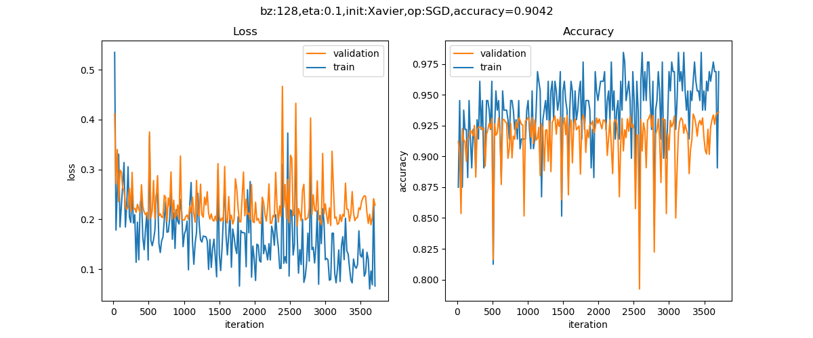

Copyright © Microsoft Corporation. All rights reserved.
  适用于[License](https：//github.com/Microsoft/ai-edu/blob/master/LICENSE.md)版权许可

## 17.6 用卷积神经网络解决MNIST问题


```
epoch=4, total_iteration=2149
loss_train=0.063609, accuracy_train=0.988636
loss_valid=0.050041, accuracy_valid=0.984400
time used: 2447.1001884937286
save parameters
testing...
0.9864
```

可视化
Cifar10

解决二分类问题 poster





```
epoch=2, total_iteration=1101
loss_train=0.173218, accuracy_train=0.937500
loss_valid=0.241649, accuracy_valid=0.907600
time used: 489.35651326179504
save parameters
testing...
0.9207
```