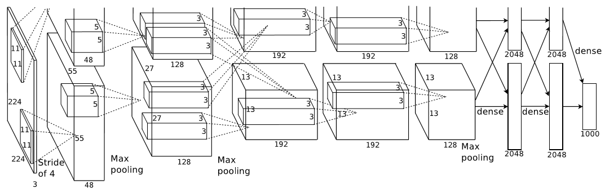
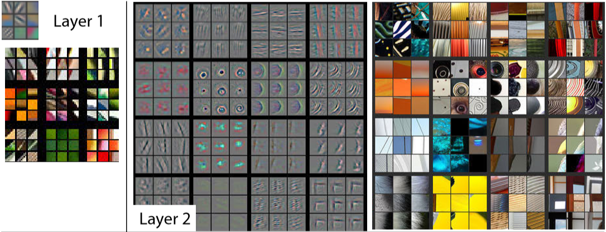
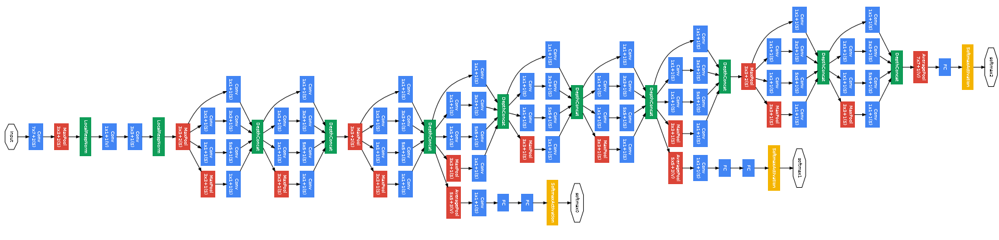
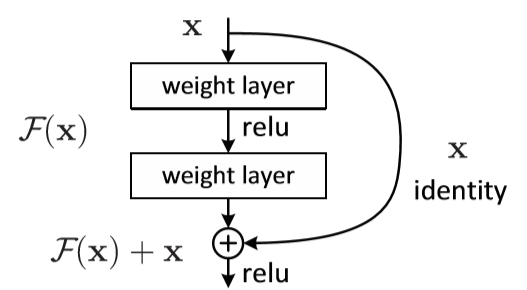
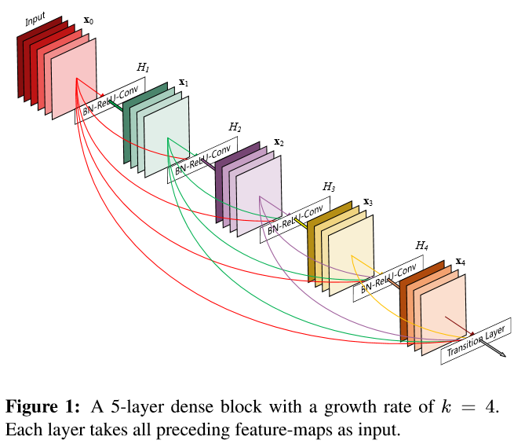

<!--Copyright © Microsoft Corporation. All rights reserved.
  适用于[License](https://github.com/Microsoft/ai-edu/blob/master/LICENSE.md)版权许可-->

# 第18章 卷积神经网络应用

## 18.0 经典的卷积神经网络模型

卷积神经网络是现在深度学习领域中最有用的网络类型，尤其在计算机视觉领域更是一枝独秀。卷积神经网络从90年代的LeNet开始，沉寂了10年，也孵化了10年，直到2012年AlexNet开始再次崛起，后续的ZF Net、VGG、GoogLeNet、ResNet、DenseNet，网络越来越深，架构越来越复杂，解决反向传播时梯度消失的方法也越来越巧妙。下面让我们一起学习一下这些经典的网络模型。$^{[1,2]}$

### 18.0.1 LeNet (1998)

图18-1是卷积神经网络的鼻祖LeNet$^{[3]}$的模型结构。

图18-1 LeNet模型结构图

LeNet是卷积神经网络的开创者LeCun在1998年提出，用于解决手写数字识别的视觉任务。自那时起，卷积神经网络的最基本的架构就定下来了：卷积层、池化层、全连接层。

1. 输入为单通道32x32灰度图
2. 使用6组5x5的过滤器，每个过滤器里有一个卷积核，stride=1，得到6张28x28的特征图
3. 使用2x2的池化，stride=2，得到6张14x14的特征图
4. 使用16组5x5的过滤器，每个过滤器里有6个卷积核，对应上一层的6个特征图，得到16张10x10的特征图
5. 池化，得到16张5x5的特征图
6. 接全连接层，120个神经元
7. 接全连接层，84个神经元
8. 接全连接层，10个神经元，softmax输出

如今各大深度学习框架中所使用的LeNet都是简化改进过的LeNet-5（5表示具有5个层），和原始的LeNet有些许不同，比如把激活函数改为了现在很常用的ReLu。LeNet-5跟现有的conv->pool->ReLU的套路不同，它使用的方式是conv1->pool->conv2->pool2再接全连接层，但是不变的是，卷积层后紧接池化层的模式依旧不变。

### 18.0.2 AlexNet (2012)

AlexNet$^{[4]}$网络结构在整体上类似于LeNet，都是先卷积然后在全连接。但在细节上有很大不同。AlexNet更为复杂。AlexNet有60 million个参数和65000个神经元，五层卷积，三层全连接网络，最终的输出层是1000通道的Softmax。

AlexNet用两块GPU并行计算，大大提高了训练效率，并且在ILSVRC-2012竞赛中获得了top-5测试的15.3%的error rate，获得第二名的方法error rate是26.2%，差距非常大，足以说明这个网络在当时的影响力。

图18-2是AlexNet的模型结构。

图18-2 AlexNet模型结构图

1. 原始图片是3x224x224三通道彩色图片，分开到上下两块GPU上进行训练
2. 卷积，96核，11x11，stride=4，pad=0，输出96x55x55
3. LRN+池化，3x3，stride=2，pad=0，输出96x27x27
4. 卷积，256核，5x5，stride=1，pad=2，输出256x27x27
5. LRN+池化，3x3，stride=2，输出256x13x13
6. 卷积，384核，3x3，stride=1，pad=1，输出384x13x13
7. 卷积，384核，3x3，stride=1，pad=1，输出384x13x13
8. 卷积，256核，3x3，stride=1，pad=1，输出256x13x13
9. 池化，3x3，stride=2，输出256x6x6
10. 全连接层，4096个神经元，接Dropout和Relu
11. 全连接层，4096个神经元，接Dropout和Relu
12. 全连接层，1000个神经元做分类

AlexNet的特点：

- 比LeNet深和宽的网络
  
  使用了5层卷积和3层全连接，一共8层。特征数在最宽处达到384。

- 数据增强
  
  针对原始图片256x256的数据，做了随机剪裁，得到224x224的图片若干张。

- 使用ReLU做激活函数
- 在全连接层使用DropOut
- 使用LRN
  
  LRN的全称为Local Response Normalizatio，局部响应归一化，是想对线性输出做一个归一化，避免上下越界。发展至今，这个技术已经很少使用了。

### 18.0.3 ZFNet (2013)

ZFNet$^{[5]}$是2013年ImageNet分类任务的冠军，其网络结构没什么改进，只是调了调参，性能较Alex提升了不少。ZF-Net只是将AlexNet第一层卷积核由11变成7，步长由4变为2，第3，4，5卷积层转变为384，384，256。这一年的ImageNet还是比较平静的一届，其冠军ZF-Net的名堂也没其他届的经典网络架构响亮。

图18-3是ZFNet的结构示意图。

图18-3 ZFNet模型结构图

但是ZFNet首次系统化地对卷积神经网络做了可视化的研究，从而找到了AlexNet的缺点并加以改正，提高了网络的能力。总的来说，通过卷积神经网络学习后，我们学习到的特征，是具有辨别性的特征，比如要我们区分人脸和狗头，那么通过卷积神经网络学习后，背景部位的激活度基本很少，我们通过可视化就可以看到我们提取到的特征忽视了背景，而是把关键的信息给提取出来了。

图18-5所示，从Layer 1、Layer 2学习到的特征基本上是颜色、边缘等低层特征。

图18-4 前两层卷积核学到的特征

Layer 3则开始稍微变得复杂，学习到的是纹理特征，比如上面的一些网格纹理，见图18-5。

图18-5 第三层卷积核学到的特征

图18-6所示的Layer 4学习到的则是比较有区别性的特征，比如狗头；Layer 5学习到的则是完整的，具有辨别性关键特征。

图18-6 后两层卷积核学到的特征

### 18.0.4 VGGNet (2015)

VGG Net$^{[6]}$由牛津大学的视觉几何组（Visual Geometry Group）和 Google DeepMind公司的研究员一起研发的的深度卷积神经网络，在 ILSVRC 2014 上取得了第二名的成绩，将 Top-5错误率降到7.3%。它主要的贡献是展示出网络的深度（depth）是算法优良性能的关键部分。目前使用比较多的网络结构主要有ResNet（152-1000层），GooleNet（22层），VGGNet（19层），大多数模型都是基于这几个模型上改进，采用新的优化算法，多模型融合等。到目前为止，VGG Net 依然经常被用来提取图像特征。

其论文名称为《VERY DEEP CONVOLUTIONAL NETWORKS FOR LARGE-SCALE IMAGE RECOGNITION》，为大规模图片识别而建立的非常深的卷积网络。短短3、4年时间，现在看起来这个也不能算是“非常深”了。

图18-7为VGG16（16层的VGG）模型结构。

图18-7 VGG16模型结构图

VGG比较出名的是VGG-16和VGG-19，最常用的是VGG-16。

VGGNet的卷积层有一个特点：特征图的空间分辨率单调递减，特征图的通道数单调递增，使得输入图像在维度上流畅地转换到分类向量。用通俗的语言讲，就是特征图尺寸单调递减，特征图数量单调递增。从上面的模型图上来看，立体方块的宽和高逐渐减小，但是厚度逐渐增加。

AlexNet的通道数无此规律，VGGNet后续的GoogLeNet和Resnet均遵循此维度变化的规律。

一些其它的特点如下：

1. 选择采用3x3的卷积核是因为3x3是最小的能够捕捉像素8邻域信息的尺寸。
2. 使用1x1的卷积核目的是在不影响输入输出的维度情况下，对输入进行形变，再通过ReLU进行非线性处理，提高决策函数的非线性。
3. 2个3x3卷积堆叠等于1个5x5卷积，3个3x3堆叠等于1个7x7卷积，感受野大小不变，而采用更多层、更小的卷积核可以引入更多非线性（更多的隐藏层，从而带来更多非线性函数），提高决策函数判决力，并且带来更少参数。
4. 每个VGG网络都有3个FC层，5个池化层，1个softmax层。
5. 在FC层中间采用dropout层，防止过拟合。

虽然 VGGNet 减少了卷积层参数，但实际上其参数空间比 AlexNet 大，其中绝大多数的参数都是来自于第一个全连接层，耗费更多计算资源。在随后的 NIN 中发现将这些全连接层替换为全局平均池化，对于性能影响不大，同时显著降低了参数数量。

采用 Pre-trained 方法训练的 VGG model（主要是 D 和 E），相对其他的方法参数空间很大，所以训练一个 VGG 模型通常要花费更长的时间，所幸有公开的 Pre-trained model 让我们很方便的使用。

### 18.0.5 GoogLeNet (2014)

GoogLeNet$^{[7]}$在2014的ImageNet分类任务上击败了VGG-Nets夺得冠军，其实力肯定是非常深厚的，GoogLeNet跟AlexNet,VGG-Nets这种单纯依靠加深网络结构进而改进网络性能的思路不一样，它另辟幽径，在加深网络的同时（22层），也在网络结构上做了创新，引入Inception结构代替了单纯的卷积+激活的传统操作（这思路最早由Network in Network提出）。GoogLeNet进一步把对卷积神经网络的研究推上新的高度。

图18-8是GoogLeNet的模型结构图。

图18-8 GoogLeNet模型结构图

蓝色为卷积运算，红色为池化运算，黄色为softmax分类。

图18-9 Inception结构图

图18-9的结构就是Inception，结构里的卷积stride都是1，另外为了保持特征响应图大小一致，都用了零填充。最后每个卷积层后面都立刻接了个ReLU层。在输出前有个叫concatenate的层，直译的意思是“并置”，即把4组不同类型但大小相同的特征响应图一张张并排叠起来，形成新的特征响应图。Inception结构里主要做了两件事：1. 通过3×3的池化、以及1×1、3×3和5×5这三种不同尺度的卷积核，一共4种方式对输入的特征响应图做了特征提取。2. 为了降低计算量。同时让信息通过更少的连接传递以达到更加稀疏的特性，采用1×1卷积核来实现降维。

这里想再详细谈谈1×1卷积核的作用，它究竟是怎么实现降维的。现在运算如下：下面图1是3×3卷积核的卷积，图2是1×1卷积核的卷积过程。对于单通道输入，1×1的卷积确实不能起到降维作用，但对于多通道输入，就不同了。假设你有256个特征输入，256个特征输出，同时假设Inception层只执行3×3的卷积。这意味着总共要进行 256×256×3×3的卷积（589000次乘积累加（MAC）运算）。这可能超出了我们的计算预算，比方说，在Google服务器上花0.5毫秒运行该层。作为替代，我们决定减少需要卷积的特征的数量，比如减少到64（256/4）个。在这种情况下，我们首先进行256到64的1×1卷积，然后在所有Inception的分支上进行64次卷积，接着再使用一个64到256的1×1卷积。

- 256×64×1×1 = 16000
- 64×64×3×3 = 36000
- 64×256×1×1 = 16000

现在的计算量大约是70000(即16000+36000+16000)，相比之前的约600000，几乎减少了10倍。这就通过小卷积核实现了降维。
现在再考虑一个问题：为什么一定要用1×1卷积核，3×3不也可以吗？考虑[50,200,200]的矩阵输入，我们可以使用20个1×1的卷积核进行卷积，得到输出[20,200,200]。有人问，我用20个3×3的卷积核不是也能得到[20,200,200]的矩阵输出吗，为什么就使用1×1的卷积核？我们计算一下卷积参数就知道了，对于1×1的参数总数：20×200×200×（1×1），对于3×3的参数总数：20×200×200×（3×3），可以看出，使用1×1的参数总数仅为3×3的总数的九分之一！所以我们使用的是1×1卷积核。

GoogLeNet网络结构中有3个LOSS单元，这样的网络设计是为了帮助网络的收敛。在中间层加入辅助计算的LOSS单元，目的是计算损失时让低层的特征也有很好的区分能力，从而让网络更好地被训练。在论文中，这两个辅助LOSS单元的计算被乘以0.3，然后和最后的LOSS相加作为最终的损失函数来训练网络。

GoogLeNet还有一个闪光点值得一提，那就是将后面的全连接层全部替换为简单的全局平均pooling，在最后参数会变的更少。而在AlexNet中最后3层的全连接层参数差不多占总参数的90%，使用大网络在宽度和深度允许GoogleNet移除全连接层，但并不会影响到结果的精度，在ImageNet中实现93.3%的精度，而且要比VGG还要快。

### 18.0.6 ResNets (2015)

2015年何恺明推出的ResNet$^{[8]}$在ISLVRC和COCO上横扫所有选手，获得冠军。ResNet在网络结构上做了大创新，而不再是简单的堆积层数，ResNet在卷积神经网络的新思路，绝对是深度学习发展历程上里程碑式的事件。

图18-10是ResNets的模型结构。

图18-10 ResNets模型结构图

ResNet称为残差网络。什么是残差呢？

若将输入设为X，将某一有参网络层设为H，那么以X为输入的此层的输出将为H(X)。一般的卷积神经网络网络如Alexnet/VGG等会直接通过训练学习出参数函数H的表达，从而直接学习X -> H(X)。
而残差学习则是致力于使用多个有参网络层来学习输入、输出之间的参差即H(X) - X即学习X -> (H(X) - X) + X。其中X这一部分为直接的identity mapping，而H(X) - X则为有参网络层要学习的输入输出间残差。

图18-11为残差学习这一思想的基本表示。

图18-11 残差结构示意图

图18-12展示了两种形态的残差模块，左图是常规残差模块，有两个3×3卷积核组成，但是随着网络进一步加深，这种残差结构在实践中并不是十分有效。针对这问题，右图的“瓶颈残差模块”（bottleneck residual block）可以有更好的效果，它依次由1×1、3×3、1×1这三个卷积层堆积而成，这里的1×1的卷积能够起降维或升维的作用，从而令3×3的卷积可以在相对较低维度的输入上进行，以达到提高计算效率的目的。

图18-12 两种形态的残差模块

### 18.0.7 DenseNet (2017)

DenseNet$^{[9]}$ 是一种具有密集连接的卷积神经网络。在该网络中，任何两层之间都有直接的连接，也就是说，网络每一层的输入都是前面所有层输出的并集，而该层所学习的特征图也会被直接传给其后面所有层作为输入。下图是 DenseNet 的一个dense block示意图，一个block里面的结构如下，与ResNet中的BottleNeck基本一致：BN-ReLU-Conv(1×1)-BN-ReLU-Conv(3×3) ，而一个DenseNet则由多个这种block组成。每个DenseBlock的之间层称为transition layers，由BN−>Conv(1×1)−>averagePooling(2×2)组成。

图18-13是ResNets的模型结构。

图18-13 DenseNet模型结构图

DenseNet作为另一种拥有较深层数的卷积神经网络，具有如下优点：

1. 相比ResNet拥有更少的参数数量
2. 旁路加强了特征的重用
3. 网络更易于训练,并具有一定的正则效果
4. 缓解了gradient vanishing和model degradation的问题

何恺明先生在提出ResNet时做出了这样的假设：若某一较深的网络多出另一较浅网络的若干层有能力学习到恒等映射，那么这一较深网络训练得到的模型性能一定不会弱于该浅层网络。通俗的说就是如果对某一网络中增添一些可以学到恒等映射的层组成新的网路，那么最差的结果也是新网络中的这些层在训练后成为恒等映射而不会影响原网络的性能。同样DenseNet在提出时也做过假设：与其多次学习冗余的特征，特征复用是一种更好的特征提取方式。

### 参考资料

[1] 冠军的试炼（博客名）在博客园上的随笔，原文地址：https://www.cnblogs.com/skyfsm/p/8451834.html

[2] SIGAI_csdn（博客名）在CSDN上的b博客，原文地址：https://blog.csdn.net/sigai_csdn/article/details/82115254

[3] .LeCun, B.Boser, J.S.Denker, D.Henderson, R.E.Howard, W.Hubbard, and L.D.Jackel. Backpropagation applied to handwritten zip code recognition. Neural Computation, 1989. http://yann.lecun.com/exdb/publis/pdf/lecun-01a.pdf

[4] Alex Krizhevsky, Ilya Sutskever, Geoffrey E.Hinton. ImageNet Classification with Deep Convolutional Neural Networks.

[5] Zeiler M D, Fergus R. Visualizing and Understanding Convolutional Networks. European Conference on Computer Vision, 2013. Arxiv Link: https://arxiv.org/pdf/1311.2901v3.pdf

[6] K. Simonyan and A. Zisserman. Very Deep Convolutional Networks for Large-Scale Image Recognition. Arxiv Link: https://arxiv.org/pdf/1409.1556.pdf

[7] Christian Szegedy, Wei Liu, Yangqing Jia, Pierre Sermanet, Scott Reed, Dragomir Anguelov, Dumitru Erhan, Vincent Vanhoucke, Andrew Rabinovich, Going Deeper with Convolutions, Arxiv Link: 
http://arxiv.org/abs/1409.4842.

[8] Kaiming He, Xiangyu Zhang, Shaoqing Ren, Jian Sun. Deep Residual Learning for Image Recognition. 2015, computer vision and pattern recognition. Arxiv: https://arxiv.org/abs/1512.03385

[9] Lichao Huang, Yi Yang, Yafeng Deng, Yinan Yu. DenseBox: Unifying Landmark Localization with End to End Object Detection. 2015, arXiv Link: https://arxiv.org/pdf/1608.06993.pdf)
