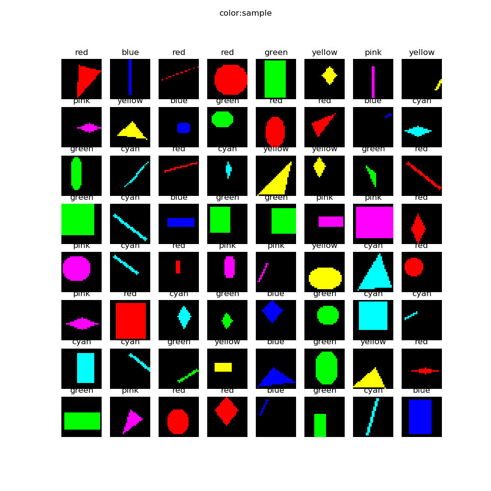
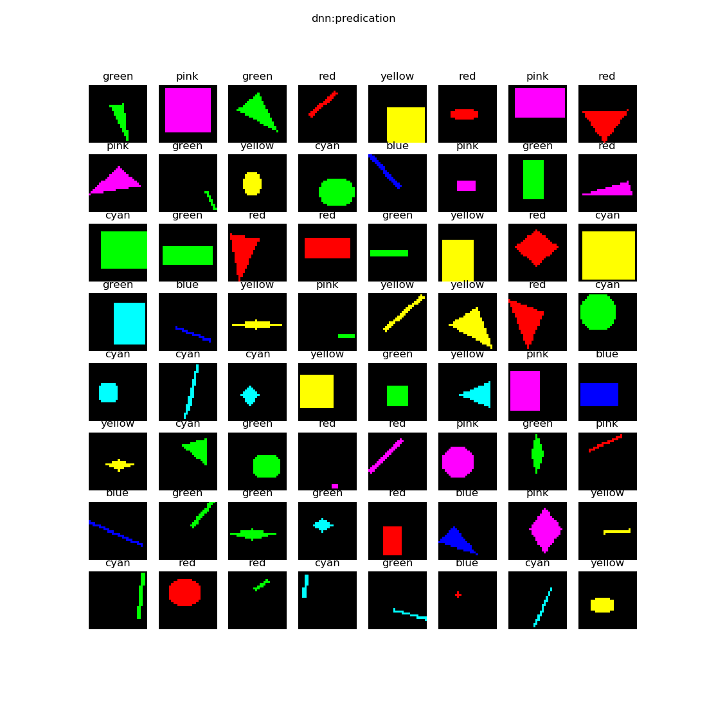
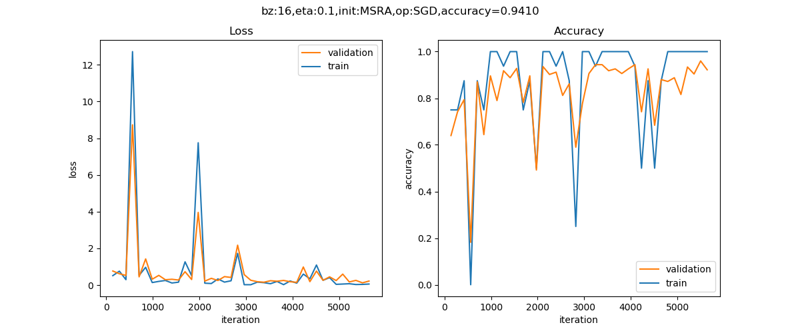
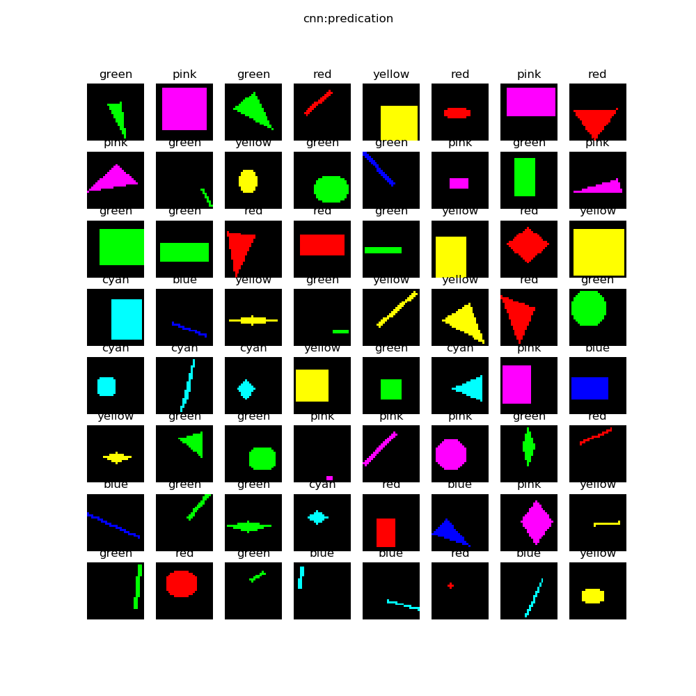

<!--Copyright © Microsoft Corporation. All rights reserved.
  适用于[License](https://github.com/Microsoft/ai-edu/blob/master/LICENSE.md)版权许可-->

## 18.1 实现颜色分类

### 18.1.1 提出问题

大家知道CNN可以在图像分类上发挥作用，而一般的图像都是彩色的，也就是说除了形状以外，CNN也应该可以判别颜色的。这一节中我们来测试一下颜色分类问题，也就是说，不管几何图形是什么样子的，只针对颜色进行分类。

先看一下样本数据：



在样本数据中，一共有6种颜色，分别是：
- 红色 red
- 绿色 green
- 蓝色 blue
- 青色（蓝+绿） cyan
- 黄色（红+绿） yellow
- 粉色（红+蓝） pink

而这6种颜色是分布在5种形状之上的：

- 圆形
- 菱形
- 直线
- 矩形
- 三角形

我们看看神经网络能否排除形状的干扰，而单独把颜色区分开来。

### 18.1.2 用DNN解决问题

#### 数据处理

由于输入图片是三通道的彩色图片，我们先把它转换成灰度图，

```Python
class GeometryDataReader(DataReader_2_0):
    def ConvertToGray(self, data):
        (N,C,H,W) = data.shape
        new_data = np.empty((N,H*W))
        if C == 3: # color
            for i in range(N):
                new_data[i] = np.dot(
                    [0.299,0.587,0.114], 
                    data[i].reshape(3,-1)).reshape(1,784)
        elif C == 1: # gray
            new_data[i] = data[i,0].reshape(1,784)
        #end if
        return new_data
```

向量[0.299,0.587,0.114]的作用是，把三通道的彩色图片的RGB值与此向量相乘，得到灰度图，三个因子相加等于1，这样如果原来是[255,255,255]的话，最后的灰度图的值还是255。如果是[255,255,0]的话，最后的结果是：

$$
\begin{aligned}
Y &= 0.299 \cdot R + 0.586 \cdot G + 0.114 \cdot B \\
&= 0.299 \cdot 255 + 0.586 \cdot 255 + 0.114 \cdot 0 \\
&=225.675
\end{aligned}
$$

也就是说粉色的数值本来是(255,255,0)，变成了单一的值225.675。六种颜色中的每一种都会有不同的值，所以即使是在灰度图中，也不会丢失“彩色”信息。

在转换成灰度图后，立刻用reshape(1,784)把它转变成矢量，该矢量就是每个样本的784维的特征值。

#### 搭建模型

我们搭建DNN的模型如下：

```Python
def dnn_model():
    num_output = 6
    max_epoch = 100
    batch_size = 16
    learning_rate = 0.01
    params = HyperParameters_4_2(
        learning_rate, max_epoch, batch_size,
        net_type=NetType.MultipleClassifier,
        init_method=InitialMethod.MSRA,
        optimizer_name=OptimizerName.SGD)

    net = NeuralNet_4_2(params, "color_dnn")
    
    f1 = FcLayer_2_0(784, 128, params)
    net.add_layer(f1, "f1")
    r1 = ActivationLayer(Relu())
    net.add_layer(r1, "relu1")

    f2 = FcLayer_2_0(f1.output_size, 64, params)
    net.add_layer(f2, "f2")
    r2 = ActivationLayer(Relu())
    net.add_layer(r2, "relu2")
    
    f3 = FcLayer_2_0(f2.output_size, num_output, params)
    net.add_layer(f3, "f3")
    s3 = ClassificationLayer(Softmax())
    net.add_layer(s3, "s3")

    return net
```

这就是一个普通的三层网络，两个隐层，神经元数量分别是128和64，一个输出层，最后接一个6分类Softmax。

#### 运行结果

训练100个epoch后，得到如下损失函数图：


从loss曲线可以看到，此网络已经有些轻微的过拟合了，如果重复多次运行训练过程，会得到75%到85%之间的一个准确度值，并不是非常稳定，但偏差也不会太大，这与样本的噪音有很大关系，比如一条很细的红色直线，可能会给训练带来一些不确定因素。

最后我们考察一下该模型在测试集上的表现：

```
......
epoch=99, total_iteration=28199
loss_train=0.005832, accuracy_train=1.000000
loss_valid=0.593325, accuracy_valid=0.804000
save parameters
time used: 30.822062015533447
testing...
0.816
```

在看下面的可视化结果，一共64张图，是测试集中1000个样本的前64个样本，每张图上方的标签是预测的结果：



可以看到有很多直线的颜色被识别错了，比如最后一行的第1、3、5、6列，颜色错误。另外有一些大色块也没有识别对，比如第3行最后一列和第4行的头尾两个，都是大色块识别错误。也就是说，DNN对两类形状上的颜色判断不准：

- 很细的线
- 很大的色块

这是什么原因呢？笔者猜想是因为：

1. 针对细直线，由于带颜色的像素点的数量非常少，被拆成向量后，这些像素点就会在1x784的矢量中彼此相距很远，特征不明显，很容易被判别成噪音
2. 针对大色块，由于带颜色的像素点的数量非常多，即使被拆成向量，也会占据很大的部分，这样特征点与背景点的比例失衡，导致DNN无法判断出到底哪个是特征点

笔者认为以上两点是DNN在训练上的不稳定，以及最后准确度不高的主要原因。

### 18.1.3 用CNN解决问题

DNN的结果并不理想，下面我们看看CNN的表现。我们直接使用三通道的彩色图片，不需要再做数据转换了。

### 搭建模型

```Python
def cnn_model():
    num_output = 6
    max_epoch = 20
    batch_size = 16
    learning_rate = 0.1
    params = HyperParameters_4_2(
        learning_rate, max_epoch, batch_size,
        net_type=NetType.MultipleClassifier,
        init_method=InitialMethod.MSRA,
        optimizer_name=OptimizerName.SGD)

    net = NeuralNet_4_2(params, "color_conv")
    
    c1 = ConvLayer((3,28,28), (2,1,1), (1,0), params)
    net.add_layer(c1, "c1")
    r1 = ActivationLayer(Relu())
    net.add_layer(r1, "relu1")
    p1 = PoolingLayer(c1.output_shape, (2,2), 2, PoolingTypes.MAX)
    net.add_layer(p1, "p1") 

    c2 = ConvLayer(p1.output_shape, (3,3,3), (1,0), params)
    net.add_layer(c2, "c2")
    r2 = ActivationLayer(Relu())
    net.add_layer(r2, "relu2")
    p2 = PoolingLayer(c2.output_shape, (2,2), 2, PoolingTypes.MAX)
    net.add_layer(p2, "p2") 

    params.learning_rate = 0.1

    f3 = FcLayer_2_0(p2.output_size, 32, params)
    net.add_layer(f3, "f3")
    bn3 = BnLayer(f3.output_size)
    net.add_layer(bn3, "bn3")
    r3 = ActivationLayer(Relu())
    net.add_layer(r3, "relu3")
    
    f4 = FcLayer_2_0(f3.output_size, num_output, params)
    net.add_layer(f4, "f4")
    s4 = ClassificationLayer(Softmax())
    net.add_layer(s4, "s4")

    return net
```

在这个模型中，我们的layer的设计是：

|ID|类型|参数|输入尺寸|输出尺寸|
|---|---|---|---|---|
|1|卷积|2x1x1, S=1|3x28x28|2x28x28|
|2|激活|Relu|2x28x28|2x28x28|
|3|池化|2x2, S=2, Max|2x14x14|2x14x14|
|4|卷积|3x3x3, S=1|2x14x14|3x12x12|
|5|激活|Relu|3x12x12|3x12x12|
|6|池化|2x2, S=2, Max|3x12x12|3x6x6|
|7|全连接|32|108|32|
|8|归一化||32|32|
|9|激活|Relu|32|32|
|10|全连接|6|32|6|
|11|分类|Softmax|6|6|

#### 运行结果

经过20个epoch的训练后，得到的结果如下：



以下是打印输出的最后几行：

```
......
epoch=19, total_iteration=5639
loss_train=0.005293, accuracy_train=1.000000
loss_valid=0.106723, accuracy_valid=0.968000
save parameters
time used: 17.295073986053467
testing...
0.963
```

可以看到我们在测试集上得到了96.3%的准确度，比DNN模型要高出很多，这也证明了CNN在图像识别上的能力。

下图是测试集中前64个测试样本的预测结果：



在这一批的样本中，只有左下角的一个绿色直线被预测成蓝色了，其它的没发生错误。

### 18.1.4 1x1卷积

读者可能还记得在GoogLeNet的Inception模块中，有1x1的卷积核。这初看起来是一个非常奇怪的做法，因为1x1的卷积核基本上失去了卷积的作用，并没有建立在同一个通道上的相邻像素之间的相关性。

在本例中，为了识别颜色，我们也使用了1x1的卷积核，并且能够完成颜色分类的任务，这是为什么呢？

我们以三通道的数据举例：


假设有一个三通道的1x1的卷积核，其值为[1,2,-1]，则相当于把每个通道的同一位置的像素值乘以卷积核，然后把结果相加，作为输出通道的同一位置的像素值。以左上角的像素点为例：

$$
1 \times 1 + 1 \times 2 + 1 \times (-1)=2
$$

相当于把上图拆开成9个样本，其值为：

```
[1,1,1] # 左上角点
[3,3,0] # 中上点
[0,0,0] # 右上角点
[2,0,0] # 左中点
[0,1,1] # 中点
[4,2,1] # 右中点
[1,1,1] # 左下角点
[2,1,1] # 下中点
[0,0,0] # 右下角点
```

上述值排成一个9行3列的矩阵，然后与一个3行1列的向量$(1,2,-1)^T$相乘，得到9行1列的向量，然后再转换成3x3的矩阵。当然在实际过程中，这个1x1的卷积核的数值是学习出来的，而不是人为指定的。

这样做可以达到两个目的：
1. 跨通道信息整合
2. 降维以减少学习参数

所以1x1的卷积核关注的是不同通道的相同位置的像素之间的相关性，而不是同一通道内的像素的相关性。

一般情况下，会使用小于输入通道数的卷积核数量，比如输入通道为3，则使用2个或1个卷积核。在上例中，如果使用2个卷积核，则输出两张9x9的特征图，这样才能达到降维的目的。如果想升维，那么使用4个以上的卷积核就可以了。

### 代码位置

ch18, Level1

### 思考与练习

1. 从彩色图转换成灰度图会损失一些信息，有可能会导致DNN准确度不高。请尝试用2352(=784x3)的矢量做为样本特征值，送入DNN进行训练。
2. 从结果上看细线和大色块对DNN的影响较大，请尝试去掉细线样本，看看DNN的准确度是否可以提高。
3. 读者可以尝试使用4个以上的1x1卷积核，看看是否能提高准确度。
