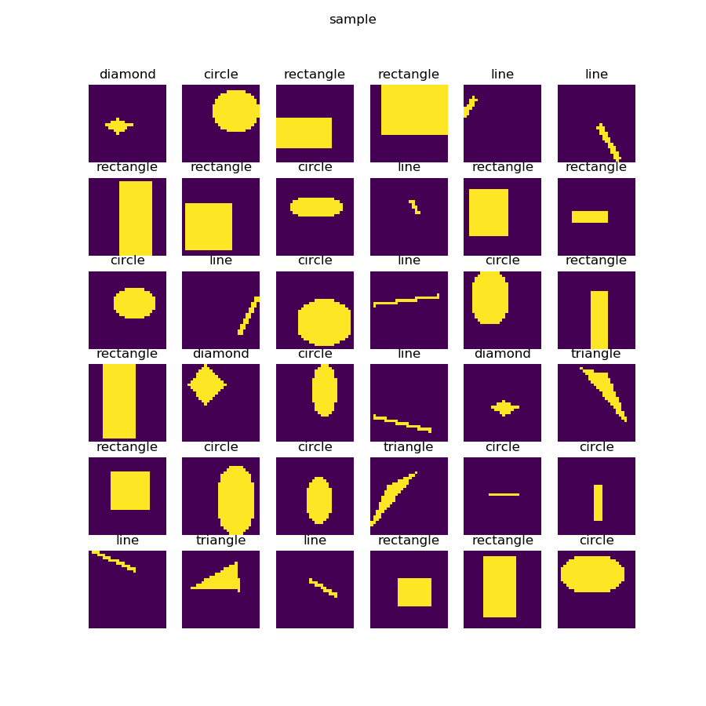
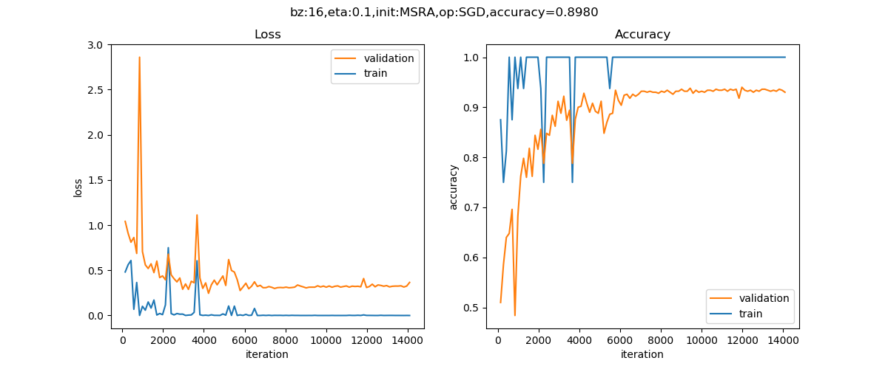
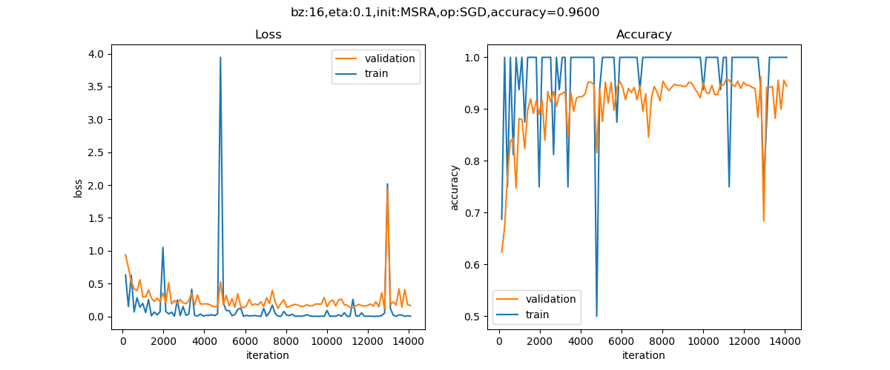
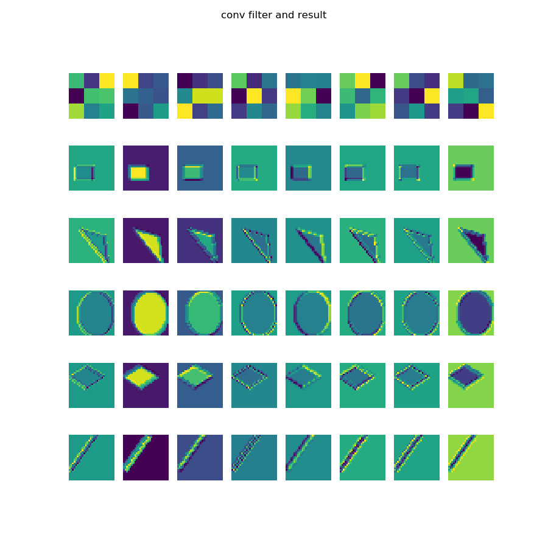

<!--Copyright © Microsoft Corporation. All rights reserved.
  适用于[License](https://github.com/Microsoft/ai-edu/blob/master/LICENSE.md)版权许可-->

## 18.2 实现几何图形分类

### 18.2.1 提出问题

有一种儿童玩具：在一个平板上面有三种形状的洞：圆形、三角形、正方形，让小朋友们拿着这三种形状的积木从对应的洞中穿过那个平板就算成功。如果形状不对是穿不过去的，比如一个圆形的积木无法穿过一个方形的洞。这就要求儿童先学会识别几何形状，学会匹配，然后手眼脑配合才能成功。

人工智能现在还是初期阶段，它能否达到3岁儿童的能力呢？先看一下图18-21所示的样本数据。



图18-21 样本数据

一共有5种形状：圆形、菱形、直线、矩形、三角形。上图中列出了一些样本，由于图片尺寸是28x28的灰度图，所以在放大显示后可以看到很多锯齿，读者可以忽略。需要强调的是，每种形状的尺寸和位置在每个样本上都是有差异的，它们的大小和位置都是随机的，比如圆形的圆心位置和半径都是不一样的，还有可能是个椭圆。

其实二维几何形状识别是一个经典的话题了，如果不用神经网络的话，用一些传统的算法已经实现了，有兴趣的读者可以查询相关的知识，比如OpenCV库中就提供了一套方法。

### 18.2.2 用前馈神经网络解决问题

我们下面要考验一下神经网络的能力。我们先用前面学过的全连接网络来解决这个问题，搭建一个三层的网络如下：

```Python
def dnn_model():
    num_output = 5
    max_epoch = 50
    batch_size = 16
    learning_rate = 0.1
    params = HyperParameters_4_2(
        learning_rate, max_epoch, batch_size,
        net_type=NetType.MultipleClassifier,
        init_method=InitialMethod.MSRA,
        optimizer_name=OptimizerName.SGD)

    net = NeuralNet_4_2(params, "pic_dnn")
    
    f1 = FcLayer_2_0(784, 128, params)
    net.add_layer(f1, "f1")
    r1 = ActivationLayer(Relu())
    net.add_layer(r1, "relu1")

    f2 = FcLayer_2_0(f1.output_size, 64, params)
    net.add_layer(f2, "f2")
    r2 = ActivationLayer(Relu())
    net.add_layer(r2, "relu2")
    
    f3 = FcLayer_2_0(f2.output_size, num_output, params)
    net.add_layer(f3, "f3")
    s3 = ClassificationLayer(Softmax())
    net.add_layer(s3, "s3")

    return net
```

样本数据为28x28的灰度图，所以我们要把它展开成1x784的向量，第一层用128个神经元，第二层用64个神经元，输出层5个神经元接Softmax分类函数。

最后可以得到如下训练结果。



图18-22 训练过程中损失函数值和准确度的变化

在测试集上得到的准确度是89.8%，这已经超出笔者的预期了，本来猜测准确度会小于80%。有兴趣的读者可以再精调一下这个前馈神经网络网络，看看是否可以得到更高的准确度。

### 18.2.3 用卷积神经网络解决问题

下面我们来看看卷积神经网络能不能完成这个工作。首先搭建网络模型如下：

```Python
def cnn_model():
    num_output = 5
    max_epoch = 50
    batch_size = 16
    learning_rate = 0.1
    params = HyperParameters_4_2(
        learning_rate, max_epoch, batch_size,
        net_type=NetType.MultipleClassifier,
        init_method=InitialMethod.MSRA,
        optimizer_name=OptimizerName.SGD)

    net = NeuralNet_4_2(params, "shape_cnn")
    
    c1 = ConvLayer((1,28,28), (8,3,3), (1,1), params)
    net.add_layer(c1, "c1")
    r1 = ActivationLayer(Relu())
    net.add_layer(r1, "relu1")
    p1 = PoolingLayer(c1.output_shape, (2,2), 2, PoolingTypes.MAX)
    net.add_layer(p1, "p1") 

    c2 = ConvLayer(p1.output_shape, (16,3,3), (1,0), params)
    net.add_layer(c2, "c2")
    r2 = ActivationLayer(Relu())
    net.add_layer(r2, "relu2")
    p2 = PoolingLayer(c2.output_shape, (2,2), 2, PoolingTypes.MAX)
    net.add_layer(p2, "p2") 

    params.learning_rate = 0.1

    f3 = FcLayer_2_0(p2.output_size, 32, params)
    net.add_layer(f3, "f3")
    bn3 = BnLayer(f3.output_size)
    net.add_layer(bn3, "bn3")
    r3 = ActivationLayer(Relu())
    net.add_layer(r3, "relu3")
    
    f4 = FcLayer_2_0(f3.output_size, num_output, params)
    net.add_layer(f4, "f4")
    s4 = ClassificationLayer(Softmax())
    net.add_layer(s4, "s4")

    return net
```
表18-2展示了模型中各层的作用和参数。

表18-2 模型各层的作用和参数

|ID|类型|参数|输入尺寸|输出尺寸|
|---|---|---|---|---|
|1|卷积|8x3x3, S=1,P=1|1x28x28|8x28x28|
|2|激活|Relu|8x28x28|8x28x28|
|3|池化|2x2, S=2, Max|8x28x28|8x14x14|
|4|卷积|16x3x3, S=1|8x14x14|16x12x12|
|5|激活|Relu|16x12x12|16x12x12|
|6|池化|2x2, S=2, Max|16x6x6|16x6x6|
|7|全连接|32|576|32|
|8|归一化||32|32|
|9|激活|Relu|32|32|
|10|全连接|5|32|5|
|11|分类|Softmax|5|5|

经过50个epoch的训练后，我们得到的结果如图18-23。



图18-23 训练过程中损失函数值和准确度的变化

以下是打印输出的最后几行：

```
......
epoch=49, total_iteration=14099
loss_train=0.002093, accuracy_train=1.000000
loss_valid=0.163053, accuracy_valid=0.944000
time used: 259.32207012176514
testing...
0.935
load parameters
0.96
```

可以看到我们在测试集上得到了96%的准确度，比前馈神经网络模型要高出很多，这也证明了卷积神经网络在图像识别上的能力。

图18-24是部分测试集中的测试样本的预测结果。


图18-24 测试结果

绝大部分样本预测是正确的，只有最后一个样本，看上去应该是一个很扁的三角形，被预测成了菱形。

### 18.2.4 形状分类可视化解释



图18-25 可视化解释

参看图18-25，表18-3解释了8个卷积核的作用。

表18-3 8个卷积核的作用

|卷积核序号|作用|直线|三角形|菱形|矩形|圆形|
|:--:|---|:--:|:--:|:--:|:--:|:--:|
|1|左侧边缘|0|1|0|1|1|
|2|大色块区域|0|1|1|1|1|
|3|左上侧边缘|0|1|1|0|1|
|4|45度短边|1|1|1|0|1|
|5|右侧边缘、上横边|0|0|0|1|1|
|6|左上、右上、右下|0|1|1|0|1|
|7|左边框和右下角|0|0|0|1|1|
|8|左上和右下，及背景|0|0|1|0|1|

表18-3中，左侧为卷积核的作用，右侧为某个特征对于5种形状的判别力度，0表示该特征无法找到，1表示可以找到该特征。

1. 比如第一个卷积核，其作用为判断是否有左侧边缘，那么第一行的数据为[0,1,0,1,1]，表示对直线和菱形来说，没有左侧边缘特征，而对于三角形、矩形、圆形来说，有左侧边缘特征。这样的话，就可以根据这个特征把5种形状分为两类：

   - A类有左侧边缘特征：三角形、矩形、圆形
   - B类无左侧边缘特征：直线、菱形

2. 再看第二个卷积核，是判断是否有大色块区域的，只有直线没有该特征，其它4种形状都有。那么看第1个特征的B类种，包括直线、菱形，则第2个特征就可以把直线和菱形分开了。

3. 然后我们只关注A类形状，看第三个卷积核，判断是否有左上侧边缘，对于三角形、矩形、圆形的取值为[1,0,1]，即矩形没有左上侧边缘，这样就可以把矩形从A类中分出来。

4. 对于三角形和圆形，卷积核5、7、8都可以给出不同的值，这就可以把二者分开了。

当然，神经网络可能不是按照我们分析的顺序来判定形状的，这只是其中的一种解释路径，还可以有很多其它种路径的组合，但最终总能够把5种形状分开来。

### 代码位置

ch18, Level2

### 思考和练习

1. 我们使用了3x3的卷积核，如果用5x5的卷积核，但是在其它参数不变的情况下，其效果会不会更好？
2. 可以建立一个数据集，只包括正圆、椭圆、正方形、矩形等四种形状，看看卷积神经网络是不是能分辨出来。
