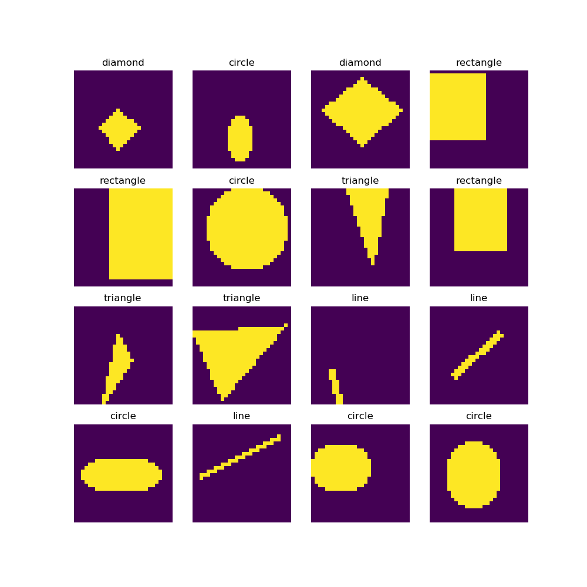
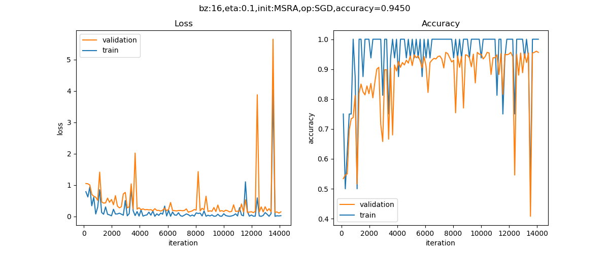
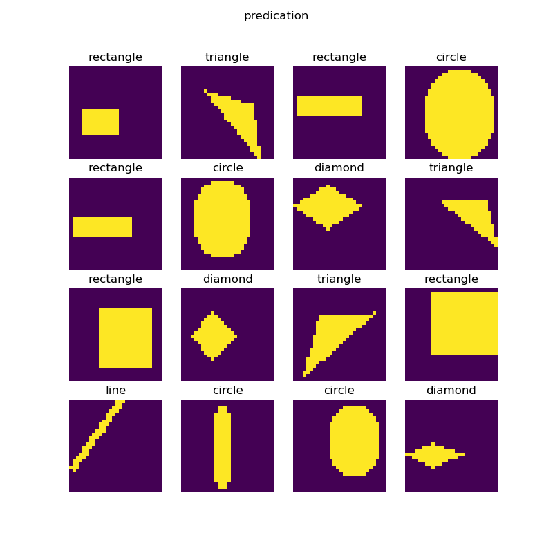

<!--Copyright © Microsoft Corporation. All rights reserved.
  适用于[License](https://github.com/Microsoft/ai-edu/blob/master/LICENSE.md)版权许可-->

## 18.1 实现几何图形分类

### 18.1.1 提出问题

有一种儿童玩具：在一个平板上面有三种形状的洞：圆形、三角形、正方形，让小朋友们拿着这三种形状的积木从对应的洞中穿过那个平板就算成功，如果形状不对应是穿不过去的，比如一个圆形的积木无法穿过一个方形的洞。这就要求儿童先学会识别几何形状，学会匹配，然后手眼脑配合，才能成功穿过。

人工智能现在还是初期阶段，它能否达到3岁儿童的能力呢？先看一下样本数据：



一共有5种形状：圆形、菱形、直线、矩形、三角形。上图中列出了一些样本，由于图片尺寸是28x28的灰度图，所以在放大显示后可以看到很多锯齿，读者可以忽略。需要强调的是，每种形状的尺寸和位置在每个样本上都是有差异的，它们的大小和位置都是随机的，比如圆形的圆心位置和半径都是不一样的，还有可能是个椭圆。

其实二维几何形状识别是一个经典的话题了，如果不用神经网络的话，用一些传统的算法已经实现了，有兴趣的读者可以查询相关的知识，比如OpenCV库中就提供了一套方法。

### 18.1.2 用DNN解决问题

我们下面要考验一下神经网络的能力。我们先用前面学过的全连接网络来解决这个问题，搭建一个三层的网络如下：

```Python
def dnn_model():
    num_output = 5
    max_epoch = 50
    batch_size = 16
    learning_rate = 0.1
    params = HyperParameters_4_2(
        learning_rate, max_epoch, batch_size,
        net_type=NetType.MultipleClassifier,
        init_method=InitialMethod.MSRA,
        optimizer_name=OptimizerName.SGD)

    net = NeuralNet_4_2(params, "pic_dnn")
    
    f1 = FcLayer_2_0(784, 128, params)
    net.add_layer(f1, "f1")
    r1 = ActivationLayer(Relu())
    net.add_layer(r1, "relu1")

    f2 = FcLayer_2_0(f1.output_size, 64, params)
    net.add_layer(f2, "f2")
    r2 = ActivationLayer(Relu())
    net.add_layer(r2, "relu2")
    
    f3 = FcLayer_2_0(f2.output_size, num_output, params)
    net.add_layer(f3, "f3")
    s3 = ClassificationLayer(Softmax())
    net.add_layer(s3, "s3")

    return net
```

样本数据为28x28的灰度图，所以我们要把它展开成1x784的向量，第一层用128个神经元，第二层用64个神经元，输出层5个神经元接Softmax分类函数。

最后可以得到如下训练结果：


在测试集上得到的的准确度是89.8%，这已经超出笔者的预期了，本来猜测准确度会小于80%。有兴趣的读者可以再精调一下这个DNN网络，看看是否可以得到更高的准确度。

### 18.1.3 用CNN解决问题

下面我们来看看卷积神经网络能不能完成这个工作。首先搭建网络模型如下：

```Python
def cnn_model():
    num_output = 5
    max_epoch = 50
    batch_size = 16
    learning_rate = 0.1
    params = HyperParameters_4_2(
        learning_rate, max_epoch, batch_size,
        net_type=NetType.MultipleClassifier,
        init_method=InitialMethod.MSRA,
        optimizer_name=OptimizerName.SGD)

    net = NeuralNet_4_2(params, "pic_conv")
    
    c1 = ConvLayer((1,28,28), (8,5,5), (1,0), params)
    net.add_layer(c1, "c1")
    r1 = ActivationLayer(Relu())
    net.add_layer(r1, "relu1")
    p1 = PoolingLayer(c1.output_shape, (2,2), 2, PoolingTypes.MAX)
    net.add_layer(p1, "p1") 

    c2 = ConvLayer(p1.output_shape, (16,5,5), (1,0), params)
    net.add_layer(c2, "c2")
    r2 = ActivationLayer(Relu())
    net.add_layer(r2, "relu2")
    p2 = PoolingLayer(c2.output_shape, (2,2), 2, PoolingTypes.MAX)
    net.add_layer(p2, "p2") 

    f3 = FcLayer_2_0(p2.output_size, 32, params)
    net.add_layer(f3, "f3")
    bn3 = BnLayer(f3.output_size)
    net.add_layer(bn3, "bn3")
    r3 = ActivationLayer(Relu())
    net.add_layer(r3, "relu3")
    
    f4 = FcLayer_2_0(f3.output_size, num_output, params)
    net.add_layer(f4, "f4")
    s4 = ClassificationLayer(Softmax())
    net.add_layer(s4, "s4")

    return net
```

在这个模型中，我们的layer的设计是：

|ID|类型|参数|输入尺寸|输出尺寸|
|---|---|---|---|---|
|1|卷积|8x5x5, S=1|1x28x28|8x24x24|
|2|激活|Relu|8x24x24|8x24x24|
|3|池化|2x2, S=2, Max|8x24x24|8x12x12|
|4|卷积|16x5x5, S=1|8x12x12|16x8x8|
|5|激活|Relu|16x8x8|16x8x8|
|6|池化|2x2, S=2, Max|16x8x8|16x4x4|
|7|全连接|32|256|32|
|8|归一化||32|32|
|9|激活|Relu|32|32|
|10|全连接|5|32|5|
|11|分类|Softmax|5|5|

经过50个epoch的训练后，我们得到的结果如下：



以下是打印输出的最后几行：

```
......
epoch=49, total_iteration=14099
loss_train=0.000894, accuracy_train=1.000000
loss_valid=0.114166, accuracy_valid=0.974000
save parameters
time used: 198.2265076637268
testing...
0.965
```

可以看到我们在测试集上得到了96.5%的准确度，比DNN模型要高出很多，这也证明了CNN在图像识别上的能力。

下图是部分测试集中的测试样本的预测结果：



绝大部分样本预测是正确的，但是第4行第2列的样本，应该是个椭圆，被预测成矩形，原因是这个椭圆太扁了，分辨率又低，基本上和矩形一样了。

### 代码位置

ch17, Level6_ShapeConvNet.py

### 思考和练习

我们使用了5x5的卷积核，笔者也曾经试验过3x3的卷积核，但是在其它参数不变的情况下，其效果不如5x5的卷积核好。但是如果使用4层卷积，每层的卷积核都是3x3的话，其效果也应该不错，有兴趣的读者可以自己试验一下。

1. 使用3x3的卷积核，只是用两层卷积，试验效果
2. 使用3x3的卷积核，搭建四层卷积，试验效果
