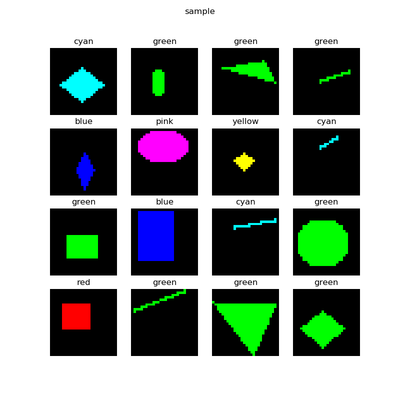
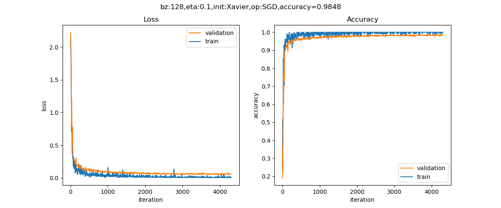
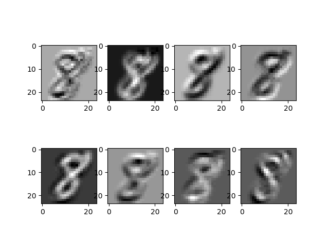
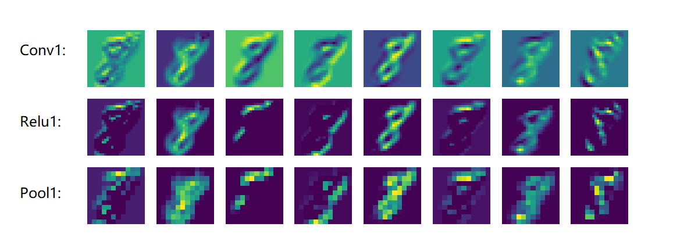
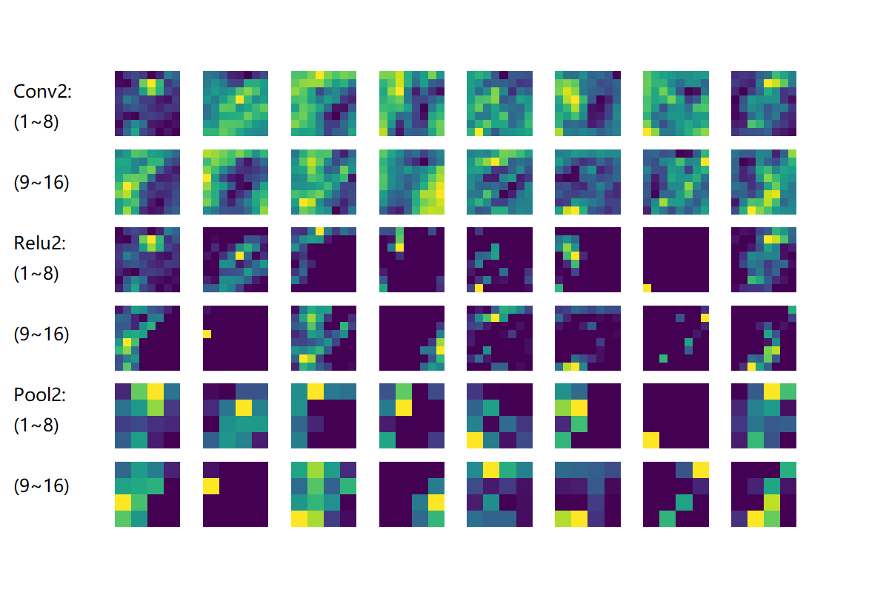

Copyright © Microsoft Corporation. All rights reserved.
  适用于[License](https：//github.com/Microsoft/ai-edu/blob/master/LICENSE.md)版权许可

## 18.2 实现颜色分类

### 18.2.1 提出问题

在上一小节中，我们学习了如何使用CNN进行形状分类，这一节中我们来测试一下稍微简单些的问题，颜色分类问题，也就是说，不管几何图形是什么样子的，只看颜色进行分类，颜色的分类比起形状分类要简单一些。

先看一下样本数据：



一共有5种形状：圆形、菱形、直线、矩形、三角形。上图中列出了一些样本，由于图片尺寸是28x28的灰度图，所以在放大显示后可以看到很多锯齿，读者可以忽略。需要强调的是，每种形状的尺寸和位置在每个样本上都是有差异的，它们的大小和位置都是随机的，比如圆形的圆心位置和半径都是不一样的，还有可能是个椭圆。

其实二维几何形状识别是一个经典的话题了，如果不用神经网络的话，用一些传统的算法已经实现了，有兴趣的读者可以查询相关的知识，比如OpenCV库中就提供了一套方法。

### 17.6.2 用DNN解决问题

我们下面要考验一下神经网络的能力。我们先用前面学过的全连接网络来解决这个问题，搭建一个三层的网络如下：

```Python
def dnn_model():
    num_output = 5
    max_epoch = 50
    batch_size = 16
    learning_rate = 0.1
    params = HyperParameters_4_2(
        learning_rate, max_epoch, batch_size,
        net_type=NetType.MultipleClassifier,
        init_method=InitialMethod.MSRA,
        optimizer_name=OptimizerName.SGD)

    net = NeuralNet_4_2(params, "pic_dnn")
    
    f1 = FcLayer_2_0(784, 128, params)
    net.add_layer(f1, "f1")
    r1 = ActivationLayer(Relu())
    net.add_layer(r1, "relu1")

    f2 = FcLayer_2_0(f1.output_size, 64, params)
    net.add_layer(f2, "f2")
    r2 = ActivationLayer(Relu())
    net.add_layer(r2, "relu2")
    
    f3 = FcLayer_2_0(f2.output_size, num_output, params)
    net.add_layer(f3, "f3")
    s3 = ClassificationLayer(Softmax())
    net.add_layer(s3, "s3")

    return net
```

样本数据为28x28的灰度图，所以我们要把它展开成1x784的向量，第一层用128个神经元，第二层用64个神经元，输出层5个神经元接Softmax分类函数。

最后可以得到如下训练结果：


在测试集上得到的的准确度是89.8%，这已经超出笔者的预期了，本来猜测准确度会小于80%。有兴趣的读者可以再精调一下这个DNN网络，看看是否可以得到更高的准确度。

### 17.6.3 用CNN解决问题

下面我们来看看卷积神经网络能不能完成这个工作。首先搭建网络模型如下：

```Python
def cnn_model():
    num_output = 5
    max_epoch = 50
    batch_size = 16
    learning_rate = 0.1
    params = HyperParameters_4_2(
        learning_rate, max_epoch, batch_size,
        net_type=NetType.MultipleClassifier,
        init_method=InitialMethod.MSRA,
        optimizer_name=OptimizerName.SGD)

    net = NeuralNet_4_2(params, "pic_conv")
    
    c1 = ConvLayer((1,28,28), (8,5,5), (1,0), params)
    net.add_layer(c1, "c1")
    r1 = ActivationLayer(Relu())
    net.add_layer(r1, "relu1")
    p1 = PoolingLayer(c1.output_shape, (2,2), 2, PoolingTypes.MAX)
    net.add_layer(p1, "p1") 

    c2 = ConvLayer(p1.output_shape, (16,5,5), (1,0), params)
    net.add_layer(c2, "c2")
    r2 = ActivationLayer(Relu())
    net.add_layer(r2, "relu2")
    p2 = PoolingLayer(c2.output_shape, (2,2), 2, PoolingTypes.MAX)
    net.add_layer(p2, "p2") 

    f3 = FcLayer_2_0(p2.output_size, 32, params)
    net.add_layer(f3, "f3")
    bn3 = BnLayer(f3.output_size)
    net.add_layer(bn3, "bn3")
    r3 = ActivationLayer(Relu())
    net.add_layer(r3, "relu3")
    
    f4 = FcLayer_2_0(f3.output_size, num_output, params)
    net.add_layer(f4, "f4")
    s4 = ClassificationLayer(Softmax())
    net.add_layer(s4, "s4")

    return net
```

在这个模型中，我们的layer的设计是：

|ID|类型|参数|输入尺寸|输出尺寸|
|---|---|---|---|---|
|1|卷积|8x5x5, S=1|1x28x28|8x24x24|
|2|激活|Relu|8x24x24|8x24x24|
|3|池化|2x2, S=2, Max|8x24x24|8x12x12|
|4|卷积|16x5x5, S=1|8x12x12|16x8x8|
|5|激活|Relu|16x8x8|16x8x8|
|6|池化|2x2, S=2, Max|16x8x8|16x4x4|
|7|全连接|32|256|32|
|8|归一化||32|32|
|9|激活|Relu|32|32|
|10|全连接|5|32|5|
|11|分类|Softmax|5|5|

经过50个epoch的训练后，我们得到的结果如下：


以下是打印输出的最后几行：

```
......
epoch=49, total_iteration=14099
loss_train=0.000894, accuracy_train=1.000000
loss_valid=0.114166, accuracy_valid=0.974000
save parameters
time used: 198.2265076637268
testing...
0.965
```

可以看到我们在测试集上得到了96.5%的准确度，比DNN模型要高出很多，这也证明了CNN在图像识别上的能力。


下图是部分测试集中的测试样本的预测结果：


绝大部分样本预测是正确的，但是第4行第2列的样本，应该是个椭圆，被预测成矩形，原因是这个椭圆太扁了，分辨率又低，基本上和矩形一样了。


### 17.6.1 模型搭建

在12.1中，我们用一个三层的神经网络解决MNIST问题，并得到了97.49%的准确率。当时使用的模型是这样的：


这一节中，我们将学习如何使用卷积网络来解决MNIST问题。首先搭建模型如下：


|Layer|参数|输入|输出|参数个数|
|---|---|---|---|---|
|卷积层|8x5x5,s=1|1x28x28|8x24x24|200+8|
|激活层|2x2,s=2, max|8x24x24|8x24x24||
|池化层|Relu|8x24x24|8x12x12||
|卷积层|16x5x5,s=1|8x12x12|16x8x8|400+16|
|激活层|Relu|16x8x8|16x8x8||
|池化层|2x2, s=2, max|16x8x8|16x4x4||
|全连接层|256x32|256|32|8192+32|
|批归一化层||32|32||
|激活层|Relu|32|32||
|全连接层|32x10|32|10|320+10|
|分类层|softmax,10|10|10|

卷积核的大小如何选取呢？大部分卷积神经网络都会用1、3、5、7的方式递增，还要注意在做池化时，应该尽量让输入的矩阵尺寸是偶数，如果不是的话，应该在上一层卷积层加padding，使得卷积的输出结果矩阵的宽和高为偶数。

### 17.6.2 代码实现

```Python
def model():
    num_output = 10
    dataReader = LoadData(num_output)

    max_epoch = 5
    batch_size = 128
    learning_rate = 0.1
    params = HyperParameters_4_2(
        learning_rate, max_epoch, batch_size,
        net_type=NetType.MultipleClassifier,
        init_method=InitialMethod.Xavier,
        optimizer_name=OptimizerName.Momentum)

    net = NeuralNet_4_2(params, "mnist_conv_test")
    
    c1 = ConvLayer((1,28,28), (8,5,5), (1,0), params)
    net.add_layer(c1, "c1")
    r1 = ActivationLayer(Relu())
    net.add_layer(r1, "relu1")
    p1 = PoolingLayer(c1.output_shape, (2,2), 2, PoolingTypes.MAX)
    net.add_layer(p1, "p1") 
  
    c2 = ConvLayer(p1.output_shape, (16,5,5), (1,0), params)
    net.add_layer(c2, "23")
    r2 = ActivationLayer(Relu())
    net.add_layer(r2, "relu2")
    p2 = PoolingLayer(c2.output_shape, (2,2), 2, PoolingTypes.MAX)
    net.add_layer(p2, "p2")  

    f3 = FcLayer_2_0(p2.output_size, 32, params)
    net.add_layer(f3, "f3")
    bn3 = BnLayer(f3.output_size)
    net.add_layer(bn3, "bn3")
    r3 = ActivationLayer(Relu())
    net.add_layer(r3, "relu3")

    f4 = FcLayer_2_0(f3.output_size, 10, params)
    net.add_layer(f4, "f2")
    s4 = ClassificationLayer(Softmax())
    net.add_layer(s4, "s4")

    net.train(dataReader, checkpoint=0.05, need_test=True)
    net.ShowLossHistory(XCoordinate.Iteration)
```

### 17.6.3 运行结果

训练5个epoch后的损失函数值和准确率的历史记录曲线如下：



打印输出结果如下：

```
...
epoch=4, total_iteration=2089
loss_train=0.105681, accuracy_train=0.976562
loss_valid=0.090841, accuracy_valid=0.974600
epoch=4, total_iteration=2111
loss_train=0.030109, accuracy_train=0.992188
loss_valid=0.064819, accuracy_valid=0.981000
epoch=4, total_iteration=2133
loss_train=0.054449, accuracy_train=0.984375
loss_valid=0.060550, accuracy_valid=0.982000
save parameters
time used: 513.3446323871613
testing...
0.9865
```

最后可以得到98.44%的的准确率，比全连接网络要高1个百分点。如果想进一步提高准确率，可以尝试增加卷积层的能力，比如使用更多的卷积核来提取更多的特征。

### 17.6.4 可视化

#### 第一层卷积核


||1|2|3|4|
|--|:--:|:--:|:--:|:--:|
|1|边框|局部密集区域|左上侧轮廓|右下侧轮廓|
|2|骨干偏上|上侧轮廓|骨干偏下|左斜45度|

#### 第一层卷积结果

|||
|--|--|
|||
|||
|||
|||
|||


下图是第一梯队的卷积、激活、池化层的输出结果：


- Conv1：是卷积的结果
- Relu1：是卷积后激活的结果，一些负值会被去掉
- Pool1：是激活后的池化的结果

从池化后的结果可以大致分析出：
- 第2、5、7个卷积核的效果并不好，图像模糊一团，看不出什么典型特征
- 第1、3个卷积核，找到的是左上边缘的信息
- 第4个卷积核，找到的是右下边缘的信息
- 第6个卷积核，找到上边缘的信息
- 第8个卷积核找到了左斜45度的骨干信息

下图是第二梯队的卷积、激活、池化层的输出结果：



- Conv2：由于是在第一层的特征图上卷积后叠加的结果，所以基本不能理解
- Relu2：能看出的是如果黑色区域多的话，说明基本没有激活值，此卷积核效果就没用
- Pool2：池化后分化明显的特征图是比较有用的的特征，比如3、6、12、15、16，信息太多或者太少的特征图，都用途偏小

### 参考资料

- http://scs.ryerson.ca/~aharley/vis/conv/

读者可以在上面这个网站看到MNIST的可视化结果，用鼠标可以改变三维视图的视角。
