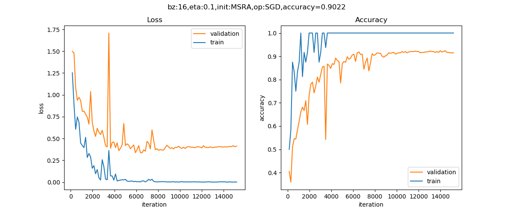

<!--Copyright © Microsoft Corporation. All rights reserved.
  适用于[License](https://github.com/Microsoft/ai-edu/blob/master/LICENSE.md)版权许可-->

## 18.3 实现几何图形及颜色分类

### 18.3.1 提出问题

在前两节我们学习了如何按颜色分类和按形状分类几何图形，现在我们自然地想到如果把颜色和图形结合起来，卷积神经网络能不能正确分类呢？

请看样本数据，如图18-26。


图18-26 样本数据

一共有3种形状及3种颜色，如表18-4所示。

表18-4 样本数据分类和数量

||红色|蓝色|绿色|
|---|---|---|---|
|圆形|600:100|600:100|600:100|
|矩形|600:100|600:100|600:100|
|三角形|600:100|600:100|600:100|

表中列出了9种样本的训练集和测试集的样本数量比例，都是600:100，

### 18.3.2 用前馈神经网络解决问题

我们仍然先使用全连接网络来解决这个问题，搭建一个三层的网络如下：

```Python
ef dnn_model():
    num_output = 9
    max_epoch = 50
    batch_size = 16
    learning_rate = 0.01
    params = HyperParameters_4_2(
        learning_rate, max_epoch, batch_size,
        net_type=NetType.MultipleClassifier,
        init_method=InitialMethod.MSRA,
        optimizer_name=OptimizerName.Momentum)

    net = NeuralNet_4_2(params, "color_shape_dnn")
    
    f1 = FcLayer_2_0(784, 128, params)
    net.add_layer(f1, "f1")
    r1 = ActivationLayer(Relu())
    net.add_layer(r1, "relu1")

    f2 = FcLayer_2_0(f1.output_size, 64, params)
    net.add_layer(f2, "f2")
    r2 = ActivationLayer(Relu())
    net.add_layer(r2, "relu2")
    
    f3 = FcLayer_2_0(f2.output_size, num_output, params)
    net.add_layer(f3, "f3")
    s3 = ClassificationLayer(Softmax())
    net.add_layer(s3, "s3")

    return net
```

样本数据为3x28x28的彩色图，所以我们要把它转换成灰度图，然后再展开成1x784的向量，第一层用128个神经元，第二层用64个神经元，输出层用9个神经元接Softmax分类函数。

训练50个epoch后可以得到如下如图18-27所示的训练结果。



图18-27 训练过程中损失函数值和准确度的变化

```
......
epoch=49, total_iteration=15199
loss_train=0.003370, accuracy_train=1.000000
loss_valid=0.510589, accuracy_valid=0.883333
time used: 25.34346342086792
testing...
0.9011111111111111
load parameters
0.8988888888888888
```

在测试集上得到的准确度是89%，这已经超出笔者的预期了，本来猜测准确度会小于80%。有兴趣的读者可以再精调一下这个前馈神经网络网络，看看是否可以得到更高的准确度。

图18-28是部分测试集中的测试样本的预测结果。


图18-28 测试结果

绝大部分样本预测是正确的，但是第3行第2列的样本，应该是green-rect，被预测成green-circle；最后两行的两个green-tri也被预测错了形状，颜色并没有错。

### 18.3.3 用卷积神经网络解决问题

下面我们来看看卷积神经网络能不能完成这个工作。首先搭建网络模型如下：

```Python
def cnn_model():
    num_output = 9
    max_epoch = 20
    batch_size = 16
    learning_rate = 0.1
    params = HyperParameters_4_2(
        learning_rate, max_epoch, batch_size,
        net_type=NetType.MultipleClassifier,
        init_method=InitialMethod.MSRA,
        optimizer_name=OptimizerName.SGD)

    net = NeuralNet_4_2(params, "shape_color_cnn")
    
    c1 = ConvLayer((3,28,28), (8,3,3), (1,1), params)
    net.add_layer(c1, "c1")
    r1 = ActivationLayer(Relu())
    net.add_layer(r1, "relu1")
    p1 = PoolingLayer(c1.output_shape, (2,2), 2, PoolingTypes.MAX)
    net.add_layer(p1, "p1") 

    c2 = ConvLayer(p1.output_shape, (16,3,3), (1,0), params)
    net.add_layer(c2, "c2")
    r2 = ActivationLayer(Relu())
    net.add_layer(r2, "relu2")
    p2 = PoolingLayer(c2.output_shape, (2,2), 2, PoolingTypes.MAX)
    net.add_layer(p2, "p2") 

    params.learning_rate = 0.1

    f3 = FcLayer_2_0(p2.output_size, 32, params)
    net.add_layer(f3, "f3")
    bn3 = BnLayer(f3.output_size)
    net.add_layer(bn3, "bn3")
    r3 = ActivationLayer(Relu())
    net.add_layer(r3, "relu3")
    
    f4 = FcLayer_2_0(f3.output_size, num_output, params)
    net.add_layer(f4, "f4")
    s4 = ClassificationLayer(Softmax())
    net.add_layer(s4, "s4")

    return net
```

经过20个epoch的训练后，我们得到的结果如图18-29。


图18-29 训练过程中损失函数值和准确度的变化

以下是打印输出的最后几行：

```
......
epoch=19, total_iteration=6079
loss_train=0.005184, accuracy_train=1.000000
loss_valid=0.118708, accuracy_valid=0.957407
time used: 131.77996039390564
testing...
0.97
load parameters
0.97
```

可以看到我们在测试集上得到了97%的准确度，比DNN模型要高出很多，这也证明了卷积神经网络在图像识别上的能力。

图18-30是部分测试集中的测试样本的预测结果。


图18-30 测试结果

绝大部分样本预测是正确的，只有最后一行第4个样本，本来是green-triangle，被预测成green-circle。

### 代码位置

ch18, Level3_ColorAndShapeConvNet.py

### 思考和练习

1. 我们使用了3x3的卷积核，如果用5x5的卷积核，但是在其它参数不变的情况下，其效果会不会更好？
