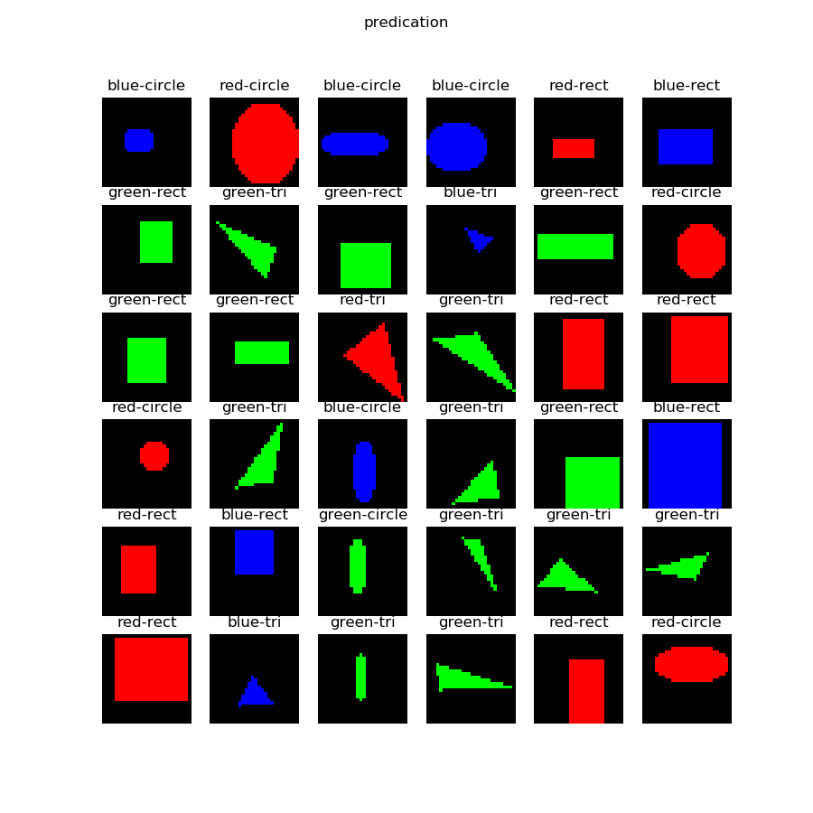

<!--Copyright © Microsoft Corporation. All rights reserved.
  适用于[License](https://github.com/Microsoft/ai-edu/blob/master/LICENSE.md)版权许可-->

## 18.3 实现几何图形及颜色分类

### 18.3.1 提出问题

在前两节我们学习了如何按颜色分类和按形状分类几何图形，现在我们自然地想到如果把颜色和图形结合起来，CNN能不能正确分类呢？

请看样本数据：


一共有3种形状及3种颜色：

||红色|蓝色|绿色|
|---|---|---|---|
|圆形|600:100|600:100|600:100|
|矩形|600:100|600:100|600:100|
|三角形|600:100|600:100|600:100|

表中列出了9种样本的训练集和测试集的样本数量比例，都是600:100，

### 18.2.2 用DNN解决问题

我们下面要考验一下神经网络的能力。我们先用前面学过的全连接网络来解决这个问题，搭建一个三层的网络如下：

```Python
def dnn_model():
    num_output = 5
    max_epoch = 50
    batch_size = 16
    learning_rate = 0.1
    params = HyperParameters_4_2(
        learning_rate, max_epoch, batch_size,
        net_type=NetType.MultipleClassifier,
        init_method=InitialMethod.MSRA,
        optimizer_name=OptimizerName.SGD)

    net = NeuralNet_4_2(params, "pic_dnn")
    
    f1 = FcLayer_2_0(784, 128, params)
    net.add_layer(f1, "f1")
    r1 = ActivationLayer(Relu())
    net.add_layer(r1, "relu1")

    f2 = FcLayer_2_0(f1.output_size, 64, params)
    net.add_layer(f2, "f2")
    r2 = ActivationLayer(Relu())
    net.add_layer(r2, "relu2")
    
    f3 = FcLayer_2_0(f2.output_size, num_output, params)
    net.add_layer(f3, "f3")
    s3 = ClassificationLayer(Softmax())
    net.add_layer(s3, "s3")

    return net
```

样本数据为28x28的灰度图，所以我们要把它展开成1x784的向量，第一层用128个神经元，第二层用64个神经元，输出层5个神经元接Softmax分类函数。

最后可以得到如下训练结果：


在测试集上得到的的准确度是89.8%，这已经超出笔者的预期了，本来猜测准确度会小于80%。有兴趣的读者可以再精调一下这个DNN网络，看看是否可以得到更高的准确度。

### 18.2.3 用CNN解决问题

下面我们来看看卷积神经网络能不能完成这个工作。首先搭建网络模型如下：

```Python
def cnn_model():
    num_output = 9
    max_epoch = 20
    batch_size = 16
    learning_rate = 0.1
    params = HyperParameters_4_2(
        learning_rate, max_epoch, batch_size,
        net_type=NetType.MultipleClassifier,
        init_method=InitialMethod.MSRA,
        optimizer_name=OptimizerName.SGD)

    net = NeuralNet_4_2(params, "shape_color_cnn")
    
    c1 = ConvLayer((3,28,28), (8,3,3), (1,1), params)
    net.add_layer(c1, "c1")
    r1 = ActivationLayer(Relu())
    net.add_layer(r1, "relu1")
    p1 = PoolingLayer(c1.output_shape, (2,2), 2, PoolingTypes.MAX)
    net.add_layer(p1, "p1") 

    c2 = ConvLayer(p1.output_shape, (16,3,3), (1,0), params)
    net.add_layer(c2, "c2")
    r2 = ActivationLayer(Relu())
    net.add_layer(r2, "relu2")
    p2 = PoolingLayer(c2.output_shape, (2,2), 2, PoolingTypes.MAX)
    net.add_layer(p2, "p2") 

    params.learning_rate = 0.1

    f3 = FcLayer_2_0(p2.output_size, 32, params)
    net.add_layer(f3, "f3")
    bn3 = BnLayer(f3.output_size)
    net.add_layer(bn3, "bn3")
    r3 = ActivationLayer(Relu())
    net.add_layer(r3, "relu3")
    
    f4 = FcLayer_2_0(f3.output_size, num_output, params)
    net.add_layer(f4, "f4")
    s4 = ClassificationLayer(Softmax())
    net.add_layer(s4, "s4")

    return net
```

经过20个epoch的训练后，我们得到的结果如下：


以下是打印输出的最后几行：

```
......
epoch=19, total_iteration=6079
loss_train=0.017084, accuracy_train=1.000000
loss_valid=0.485080, accuracy_valid=0.885185
time used: 145.0406792163849
testing...
0.8722222222222222
load parameters
0.97
```

可以看到我们在测试集上得到了97%的准确度，比DNN模型要高出很多，这也证明了CNN在图像识别上的能力。

下图是部分测试集中的测试样本的预测结果：



绝大部分样本预测是正确的，但是第4行第2列的样本，应该是个椭圆，被预测成矩形，原因是这个椭圆太扁了，分辨率又低，基本上和矩形一样了。

### 代码位置

ch18, Level3_ColorAndShapeConvNet.py

### 思考和练习

我们使用了5x5的卷积核，笔者也曾经试验过3x3的卷积核，但是在其它参数不变的情况下，其效果不如5x5的卷积核好。但是如果使用4层卷积，每层的卷积核都是3x3的话，其效果也应该不错，有兴趣的读者可以自己试验一下。

1. 使用3x3的卷积核，只是用两层卷积，试验效果
2. 使用3x3的卷积核，搭建四层卷积，试验效果
