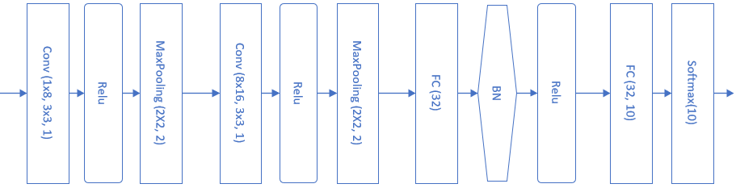

<!--Copyright © Microsoft Corporation. All rights reserved.
  适用于[License](https://github.com/Microsoft/ai-edu/blob/master/LICENSE.md)版权许可-->

## 18.4 解决MNIST分类问题

### 18.4.1 模型搭建

在12.1中，我们用一个三层的神经网络解决MNIST问题，并得到了97.49%的准确率。当时使用的模型如图18-31。


图18-31 前馈神经网络模型解决MNIST问题

这一节中，我们将学习如何使用卷积网络来解决MNIST问题。首先搭建模型如图18-32。



图18-32 卷积神经网络模型解决MNIST问题

表18-5展示了模型中各层的功能和参数。

表18-5 模型中各层的功能和参数

|Layer|参数|输入|输出|参数个数|
|---|---|---|---|---|
|卷积层|8x5x5,s=1|1x28x28|8x24x24|200+8|
|激活层|2x2,s=2, max|8x24x24|8x24x24||
|池化层|Relu|8x24x24|8x12x12||
|卷积层|16x5x5,s=1|8x12x12|16x8x8|400+16|
|激活层|Relu|16x8x8|16x8x8||
|池化层|2x2, s=2, max|16x8x8|16x4x4||
|全连接层|256x32|256|32|8192+32|
|批归一化层||32|32||
|激活层|Relu|32|32||
|全连接层|32x10|32|10|320+10|
|分类层|softmax,10|10|10|

卷积核的大小如何选取呢？大部分卷积神经网络都会用1、3、5、7的方式递增，还要注意在做池化时，应该尽量让输入的矩阵尺寸是偶数，如果不是的话，应该在上一层卷积层加padding，使得卷积的输出结果矩阵的宽和高为偶数。

### 18.4.2 代码实现

```Python
def model():
    num_output = 10
    dataReader = LoadData(num_output)

    max_epoch = 5
    batch_size = 128
    learning_rate = 0.1
    params = HyperParameters_4_2(
        learning_rate, max_epoch, batch_size,
        net_type=NetType.MultipleClassifier,
        init_method=InitialMethod.Xavier,
        optimizer_name=OptimizerName.Momentum)

    net = NeuralNet_4_2(params, "mnist_conv_test")
    
    c1 = ConvLayer((1,28,28), (8,5,5), (1,0), params)
    net.add_layer(c1, "c1")
    r1 = ActivationLayer(Relu())
    net.add_layer(r1, "relu1")
    p1 = PoolingLayer(c1.output_shape, (2,2), 2, PoolingTypes.MAX)
    net.add_layer(p1, "p1") 
  
    c2 = ConvLayer(p1.output_shape, (16,5,5), (1,0), params)
    net.add_layer(c2, "23")
    r2 = ActivationLayer(Relu())
    net.add_layer(r2, "relu2")
    p2 = PoolingLayer(c2.output_shape, (2,2), 2, PoolingTypes.MAX)
    net.add_layer(p2, "p2")  

    f3 = FcLayer_2_0(p2.output_size, 32, params)
    net.add_layer(f3, "f3")
    bn3 = BnLayer(f3.output_size)
    net.add_layer(bn3, "bn3")
    r3 = ActivationLayer(Relu())
    net.add_layer(r3, "relu3")

    f4 = FcLayer_2_0(f3.output_size, 10, params)
    net.add_layer(f4, "f2")
    s4 = ClassificationLayer(Softmax())
    net.add_layer(s4, "s4")

    net.train(dataReader, checkpoint=0.05, need_test=True)
    net.ShowLossHistory(XCoordinate.Iteration)
```

### 18.4.3 运行结果

训练5个epoch后的损失函数值和准确率的历史记录曲线如图18-33。


图18-33 训练过程中损失函数值和准确度的变化

打印输出结果如下：

```
...
epoch=4, total_iteration=2133
loss_train=0.054449, accuracy_train=0.984375
loss_valid=0.060550, accuracy_valid=0.982000
save parameters
time used: 513.3446323871613
testing...
0.9865
```

最后可以得到98.44%的准确率，比全连接网络要高1个百分点。如果想进一步提高准确率，可以尝试增加卷积层的能力，比如使用更多的卷积核来提取更多的特征。

### 18.4.4 可视化

#### 第一组的卷积可视化

下图按行显示了以下内容：

1. 卷积核数值
2. 卷积核抽象
3. 卷积结果
4. 激活结果
5. 池化结果


图18-34 卷积结果可视化

卷积核是5x5的，一共8个卷积核，所以第一行直接展示了卷积核的数值图形化以后的结果，但是由于色块太大，不容易看清楚其具体的模式，那么第二行的模式是如何抽象出来的呢？

因为特征是未知的，所以卷积神经网络不可能学习出类似下面的两个矩阵中左侧矩阵的整齐的数值，而很可能是如同右侧的矩阵一样具有很多噪音，但是大致轮廓还是个左上到右下的三角形，只是一些局部点上有一些值的波动。

```
2  2  1  1  0               2  0  1  1  0
2  1  1  0  0               2  1  1  2  0
1  1  0 -1 -2               0  1  0 -1 -2
1  0 -1 -2 -3               1 -1  1 -4 -3
0 -1 -2 -3 -4               0 -1 -2 -3 -2
```

如何“看”出一个大概符合某个规律的模板呢？对此，笔者的心得是：

1. 摘掉眼镜（或者眯起眼睛）看第一行的卷积核的明暗变化模式；
2. 也可以用图像处理的办法，把卷积核形成的5x5的点阵做一个模糊处理；
3. 结合第三行的卷积结果推想卷积核的行为。

由此可以得到表18-6的模式。

表18-6 卷积核的抽象模式

|卷积核序号|1|2|3|4|5|6|7|8|
|:--:|:--:|:--:|:--:|:--:|:--:|:--:|:--:|:--:|
|抽象模式|右斜|下|中心|竖中|左下|上|右|左上|

这些模式实际上就是特征，是卷积网络自己学习出来的，每一个卷积核关注图像的一个特征，比如上部边缘、下部边缘、左下边缘、右下边缘等。这些特征的排列有什么顺序吗？没有。每一次重新训练后，特征可能会变成其它几种组合，顺序也会发生改变，这取决于初始化数值及样本顺序、批大小等等因素。

当然可以用更高级的图像处理算法，对5x5的图像进行模糊处理，再从中提取模式。

#### 第二组的卷积可视化

图18-35是第二组的卷积、激活、池化层的输出结果。


图18-35 第二组卷积核、激活、池化的可视化

- Conv2：由于是在第一层的特征图上卷积后叠加的结果，所以基本不能按照原图理解，但也能大致看出是是一些轮廓抽取的作用；
- Relu2：能看出的是如果黑色区域多的话，说明基本没有激活值，此卷积核效果就没用；
- Pool2：池化后分化明显的特征图是比较有用的特征，比如3、6、12、15、16；信息太多或者太少的特征图，都用途偏小，比如1、7、10、11。

### 参考资料

- http://scs.ryerson.ca/~aharley/vis/conv/

读者可以在上面这个网站看到MNIST的可视化结果，用鼠标可以改变三维视图的视角。
