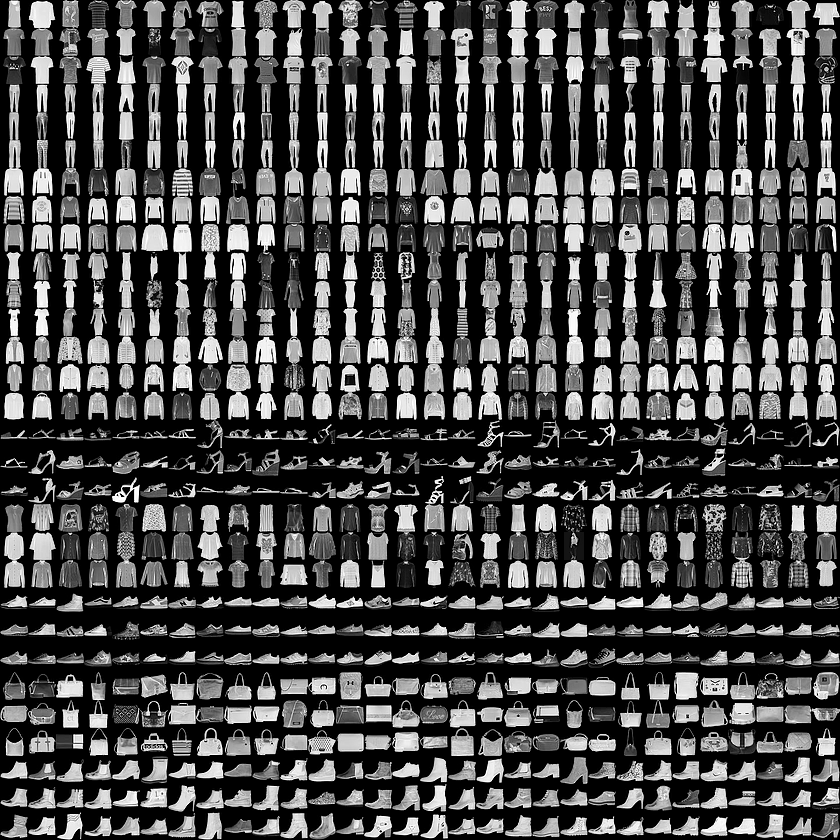
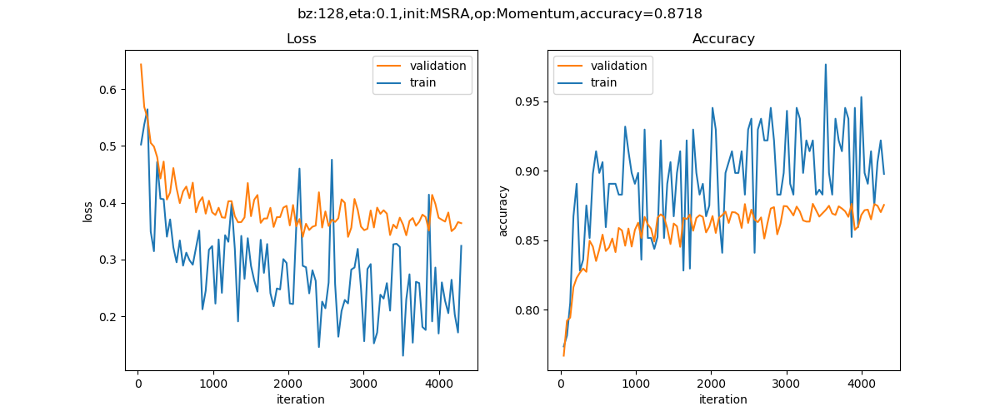
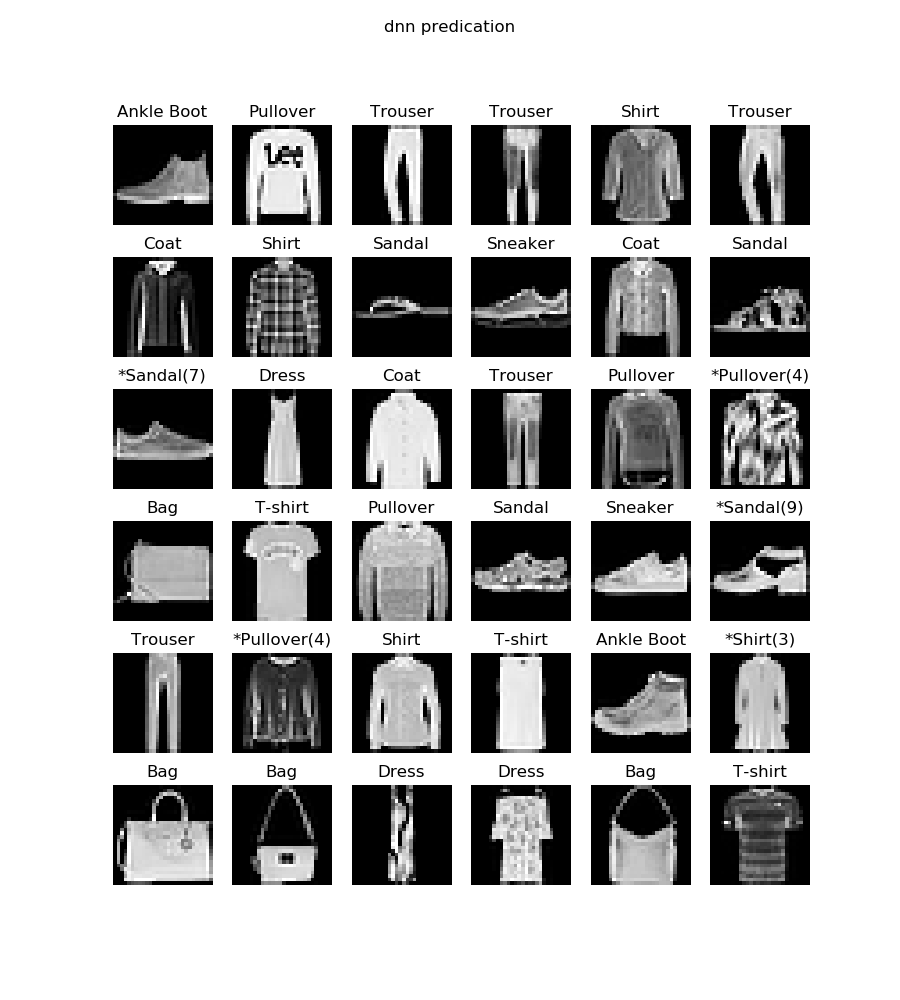
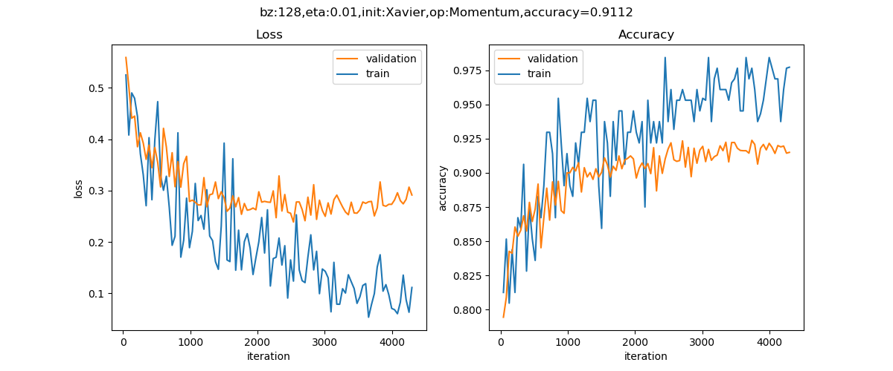

 <!--Copyright © Microsoft Corporation. All rights reserved.
  适用于[License](https://github.com/Microsoft/ai-edu/blob/master/LICENSE.md)版权许可-->

## 18.5 Fashion-MNIST分类

### 18.5.1 提出问题

MNIST手写识别数据集，对卷积神经网络来说已经太简单了，于是科学家们增加了图片的复杂度，用10种物品代替了10个数字，图18-36是它们的部分样本。



图18-36 部分样本图展示

每3行是一类样本，按样本类别（从0开始计数）分行显示：

0. T-Shirt，T恤衫（1-3行）
1. Trouser，裤子（4-6行）
2. Pullover，套头衫（7-9行）
3. Dress，连衣裙（10-12行）
4. Coat，外套（13-15行）
5. Sandal，凉鞋（16-18行）
6. Shirt，衬衫（19-21行）
7. Sneaker，运动鞋（22-24行）
8. Bag，包（25-27行）
9. Ankle Boot，短靴（28-30行）

### 18.5.2 用前馈神经网络来解决问题

#### 搭建模型

```Python
def dnn_model():
    num_output = 10
    max_epoch = 10
    batch_size = 128
    learning_rate = 0.1
    params = HyperParameters_4_2(
        learning_rate, max_epoch, batch_size,
        net_type=NetType.MultipleClassifier,
        init_method=InitialMethod.MSRA,
        optimizer_name=OptimizerName.Momentum)

    net = NeuralNet_4_2(params, "fashion_mnist_dnn")
    
    f1 = FcLayer_2_0(784, 128, params)
    net.add_layer(f1, "f1")
    bn1 = BnLayer(f1.output_size)
    net.add_layer(bn1, "bn1")
    r1 = ActivationLayer(Relu())
    net.add_layer(r1, "relu1")

    f2 = FcLayer_2_0(f1.output_size, 64, params)
    net.add_layer(f2, "f2")
    bn2 = BnLayer(f2.output_size)
    net.add_layer(bn2, "bn2")
    r2 = ActivationLayer(Relu())
    net.add_layer(r2, "relu2")
    
    f3 = FcLayer_2_0(f2.output_size, num_output, params)
    net.add_layer(f3, "f3")
    s3 = ClassificationLayer(Softmax())
    net.add_layer(s3, "s3")

    return net
```

#### 训练结果

训练10个epoch后得到如图18-37所示曲线，可以看到网络能力已经接近极限了，再训练下去会出现过拟合现象，准确度也不一定能提高。



图18-37 训练过程中损失函数值和准确度的变化

图18-38是在测试集上的预测结果。



图18-38 测试结果

凡是类别名字前面带*号的，表示预测错误，比如第3行第1列，本来应该是第7类“运动鞋”，却被预测成了“凉鞋”。

### 18.5.3 用卷积神经网络来解决问题

#### 搭建模型

```Python
def cnn_model():
    num_output = 10
    max_epoch = 10
    batch_size = 128
    learning_rate = 0.01
    params = HyperParameters_4_2(
        learning_rate, max_epoch, batch_size,
        net_type=NetType.MultipleClassifier,
        init_method=InitialMethod.Xavier,
        optimizer_name=OptimizerName.Momentum)

    net = NeuralNet_4_2(params, "fashion_mnist_conv_test")
    
    c1 = ConvLayer((1,28,28), (32,3,3), (1,0), params)
    net.add_layer(c1, "c1")
    r1 = ActivationLayer(Relu())
    net.add_layer(r1, "relu1")
    p1 = PoolingLayer(c1.output_shape, (2,2), 2, PoolingTypes.MAX)
    net.add_layer(p1, "p1") 

    f3 = FcLayer_2_0(p1.output_size, 128, params)
    net.add_layer(f3, "f3")
    r3 = ActivationLayer(Relu())
    net.add_layer(r3, "relu3")

    f4 = FcLayer_2_0(f3.output_size, 10, params)
    net.add_layer(f4, "f4")
    s4 = ClassificationLayer(Softmax())
    net.add_layer(s4, "s4")

    return net
```

此模型只有一层卷积层，使用了32个卷积核，尺寸为3x3，后接最大池化层，然后两个全连接层。

#### 训练结果

训练10个epoch后得到如图18-39的曲线。



图18-39 训练过程中损失函数值和准确度的变化

在测试集上得到91.12%的准确率，在测试集上的前几个样本的预测结果如图18-40所示。


图18-40 测试结果

与前馈神经网络方案相比，这32个样本里只有一个错误，第4行最后一列，把第9类“短靴”预测成了“凉鞋”，因为这个样本中间有一个三角形的黑色块，与凉鞋的镂空设计很像。

### 代码位置

ch18, Level5

### 思考与练习

1. 读者可以尝试增加此卷积神经网络模型的卷积层数，来提高准确度。
