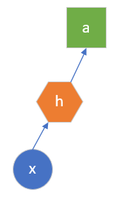
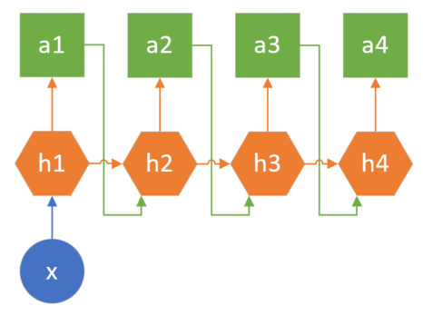

<!--Copyright © Microsoft Corporation. All rights reserved.
  适用于[License](https://github.com/Microsoft/ai-edu/blob/master/LICENSE.md)版权许可-->

## 19.0 循环神经网络

通过学习前面的章节，读者可以发现所有的神经网络的输入都是一个或者一批静态的数据，比如一个人的身高、体重、年龄、性别等组成的特征值用于表示一个人当前的属性，这些属性是采样时获得的，并且会保持相对稳定，可以用这些属性来通过深度神经网络来预测一个人的健康状况。再次输入的下一个数据会是另外一个人的特征值，与前一个人丝毫不相关。

或者输入的是一张青蛙的图片，通过卷积神经网络来判断图片中的物体的类别。而下一张图片可能会是另外一只青蛙的图片，或者干脆变成了一张汽车的图片。

所以，前面学习的内容可以用于一张非常简单的图来概括，如图19.1所示：

图19.1 前向神经网络的简单概括

即，根据一个静态的输入数据x，经过一系列隐层h的计算，最终得到结果a。这里的h是全连接神经网络或者卷积神经网络，a是回归或分类的结果。

而在自然界中，还有很多随着时间而变化的数据需要处理，比如，对一个人来说，在不同的年龄会有不同的身高、体重、健康状况，只有性别是固定的。如果需要根据年龄来预测此人的健康状况，则需要每年对此人的情况进行一次采样，按时间排序后记录到数据库中。

另外一个例子是如果想从一只青蛙的跳跃动作中分析出其跳跃的高度和距离，则需要获得一段视频，然后从视频的每一帧图片中获得青蛙的当前动作。

从上面两个例子中可以看到，对于与时间相关的数据，到目前为止并没有一个很好的解决方案，这就是循环神经网络存在的意义。

循环神经网络的典型用途

#### 音乐、诗歌生成

在国外，用户可以指定一个风格，或者一段旋律，让机器自动生成一段具有巴赫风格的乐曲。在中国，有藏头诗的娱乐形式，比如以“春”字开头的一句五言绝句可以是“春眠不觉晓”、“春草细还生”等等。这两个例子都是只给出一个输入，生成多个输出的情况，如图19.2所示：

图19.2 一对多的示意图

这种情况的特殊性在于，第一个时间步生成的结果要做为第二个时间步的输入，使得前后有连贯性。

情感分类

机器翻译

视频动作识别

语音识别
