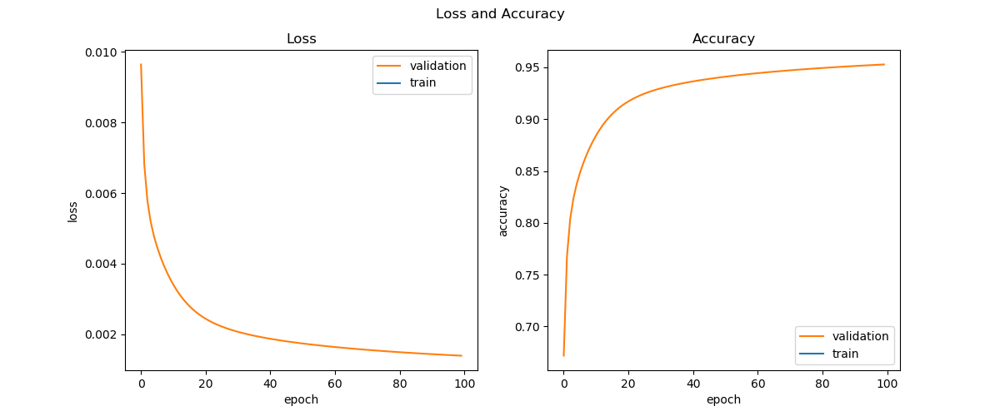
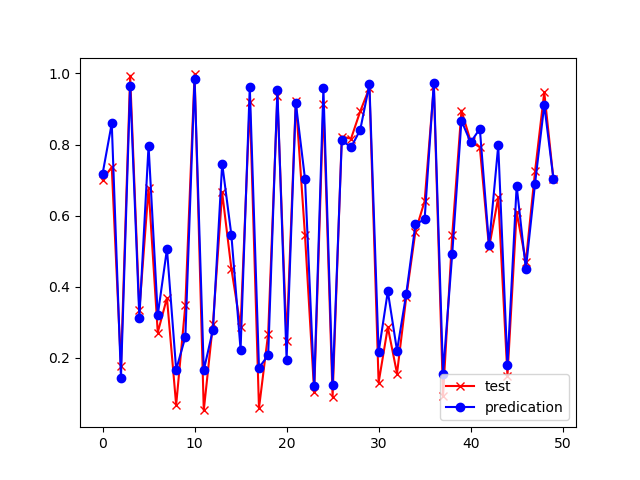

<!--Copyright © Microsoft Corporation. All rights reserved.
  适用于[License](https://github.com/Microsoft/ai-edu/blob/master/LICENSE.md)版权许可-->

## 19.1 两个时间步的循环神经网络

本小节中，我们将学习具有两个时间步的前馈神经网络组成的简单循环神经网络，用于实现回归/拟合功能。

### 19.1.1 提出问题

我们先用一个最简单的序列问题来了解一下循环神经网络的基本运作方式。

假设有一个随机信号发射器，每秒产生一个随机信号，随机值为(0,1)之间。信号发出后，碰到一面墙壁反射回来，来回的时间相加正好是1秒，于是接收器就收到了1秒钟之前的信号。对于接收端来说，接收到的数据序列如表19-1。

表19-1 每一时刻的发射信号和回波信号

|时刻|t1|t2|t3|t4|t5|t6|...|
|---|---|---|---|---|---|---|---|
|发射随机信号X|0.35|0.46|0.12|0.69|0.24|0.94|...|
|接收回波信号Y|0|0.35|0.46|0.12|0.69|0.24|...|

具体地描述此问题：当接收端接收到两个连续的值，如0.35、0.46时，系统响应为0.35；下一个时间点接收到了0.12，考虑到上一个时间点的0.46，则二者组合成0.46、0.12序列，此时系统响应为0.46；依此类推，即接收到第二个数值时，总要返回相邻的第一个数值。

我们可以把发射信号看作X，把接收信号看作是Y，则此问题变成了给定样本X和标签值Y，训练一个神经网络，令其当接收到两个序列的值时，总返回第一个值。

读者可能会产生疑问：这个问题用一个最简单不过的程序就可以解决，我们为什么还要大动干戈地使用神经网络呢？如：

```Python
def echo(x1,x2):
    return x2
```

因为这是一个最基本的序列问题，我们先用它投石问路，逐步地理解RNN的精髓所在。

如果把发射信号和回波信号绘制成图，如图19-6和图19-7所示。


图19-6 信号及回波样本序列


图19-7 信号及回波样本序列局部放大图

其中，红色叉子为样本数据点，蓝色圆点为标签数据点，它总是落后于样本数据一个时间步。还可以看到以上数据形成的曲线完全随机，毫无规律。

### 19.1.2 准备数据

与前面前馈神经网络和卷积神经网络中使用的样本数据的形状不同，在循环神经网络中的样本数据为三维：

- 第一维：样本 x[0,:,:]表示第0个样本
- 第二维：时间 x[:,1,:]表示第1个时间点
- 第三维：特征 x[:,:,2]表示第2个特征

举个例子来说，x[10, 5, 4] 表示第10个样本的第5个时间点的第4个特征值数据。

标签数据为两维：

- 第一维：样本
- 第二维：标签值

所以，在本问题中，样本数据如表19-2所示。

表19-2 样本数据形状

|样本|特征值|标签值|
|---|---|---|
|0|0.35|0|
|1|0.46|0.35|
|2|0.12|0.46|
|3|0.69|0.12|
|4|0.24|0.69|
|5|0.94|0.24|
|...|...|...|


### 19.1.3 用前馈神经网络的知识来解决问题

#### 搭建网络

我们回忆一下，在验证万能近似定理时，我们学习了曲线拟合问题，即带有一个隐层和非线性激活函数的前馈神经网络，可以拟合任意曲线。但是在这个问题里，有几点不同：

1. 不是连续值，而是时间序列的离散值
2. 完全随机的离散值，而不是满足一定的规律
3. 测试数据不在样本序列里，完全独立

所以，即使使用前馈神经网络中的曲线拟合技术得到了一个拟合网络，也不能正确地预测不在样本序列里的测试集数据。但是，我们可以把前馈神经网络做一个变形，让它能够处理时间序列数据，如图19-8所示。


图19-8 两个时间步的前馈神经网络

图19-8中含有两个简单的前馈神经网络，t1和t2，每个节点上都只有一个神经元，其中，各个节点的名称和含义如表19-3所示。

表19-3 图19-8中的各个节点的名称和含义

|名称|含义|在t1,t2上的取值|
|---|---|---|
|x|输入层样本|根据样本值|
|U|x到h的权重值|相同|
|h|隐层|依赖于x的值|
|bh|h节点的偏移值|相同|
|tanh|激活函数|函数形式相同|
|s|隐层激活状态|依赖于h的值|
|V|s到z的权重值|相同|
|z|输出层|依赖于s的值|
|bz|z的偏移值|相同|
|loss|损失函数|函数形式相同|
|y|标签值|根据标签值|

由于是一个拟合值的网络，相当于线性/非线性回归，所以在输出层不使用分类函数，损失函数使用均方差。在这个具体的问题中，t2的标签值y应该和t1的样本值x相同。

请读者注意，在很多关于循环神经网络的文字资料中，通常把h和s合并在一起。在这里我们把它们分开画，便于后面的反向传播的推导和理解。

还有一个问题是，为什么t1的后半部分是虚线的？因为在这个问题中，我们只对t2的输出感兴趣，检测t2的输出值z和y的差距是多少，而不关心t1的输出是什么，所以不必计算t1的z值和损失函数值，处于无监督状态。

#### 前向计算

t1和t2是两个独立的网络，在t1和t2之间，用一个W连接t1的隐层激活状态值到t2的隐层输入，对t2来说，相当于有两个输入：一个是t2时刻的样本值x，一个是t1时刻的隐层激活值s。所以，它们的前向计算公式为：

对于t1：

$$
h_{t1}=x_{t1} \cdot U + b_h\tag{1}
$$

$$
s_{t1} = Tanh(h_{t1}) \tag{2}
$$

对于t2：
$$
h_{t2}=x_{t2} \cdot U + s_{t1} \cdot W +b_h\tag{3}
$$

$$
s_{t2} = Tanh(h_{t2}) \tag{4}
$$

$$
z_{t2} = s_{t2} \cdot V + b_z\tag{5}
$$

$$
J = \frac{1}{2}(z_{t2}-y_{t2})^2\tag{6}
$$

在本例中，公式1至公式6中，所有的变量均为标量，这就有利于我们对反向传播的推导，不用考虑矩阵、向量的求导运算。

本来整体的损失函数值$J$应该是两个时间步的损失函数值之和，但是第一个时间步没有输出，所以不需要计算损失函数值，因此$J$就等于第二个时间步的损失函数值。

#### 反向传播

我们首先对t2网络进行反向传播推导：

$$
\frac{\partial J}{\partial z_{t2}}=z_{t2}-y_{t2} \rightarrow dz_{t2} \tag{7}
$$
$$
\begin{aligned}
\frac{\partial J}{\partial h_{t2}}&=\frac{\partial J}{\partial z_{t2}}\frac{\partial z_{t2}}{\partial s_{t2}}\frac{\partial s_{t2}}{\partial h_{t2}} \\
&=dz_{t2} \cdot V \cdot Tanh'(s_{t2}) \\
&=dz_{t2} \cdot V \cdot (1-s_{t2}^2) \rightarrow dh_{t2} \tag{8}
\end{aligned}
$$

$$
\frac{\partial J}{\partial b_z}=\frac{\partial J}{\partial z_{t2}}\frac{\partial z_{t2}}{\partial b_z}=dz_{t2} \rightarrow db_{z_{t2}} \tag{9}
$$

$$
\frac{\partial J}{\partial b_h}=\frac{\partial J}{\partial h_{t2}}\frac{\partial h_{t2}}{\partial b_h}=dh_{t2} \rightarrow db_{h_{t2}} \tag{10}
$$

$$
\frac{\partial J}{\partial V}=\frac{\partial J}{\partial z_{t2}}\frac{\partial z_{t2}}{\partial V}=dz_{t2} \cdot s \rightarrow dV_{t1}  \tag{11}
$$

$$
\frac{\partial J}{\partial U}=\frac{\partial J}{\partial h_{t2}}\frac{\partial h_{t2}}{\partial U}=dh_{t2} \cdot x_{t2} \rightarrow dU_{t1} \tag{12}
$$

$$
\frac{\partial J}{\partial W}=\frac{\partial J}{\partial h_{t2}}\frac{\partial h_{t2}}{\partial W}=dh_{t2} \cdot s_{t1} \rightarrow dW_{t2} \tag{13}
$$

下面我们对t1网络进行反向传播推导。由于t1的后半部分输出是没有监督的，所以我们不必考虑后半部分的反向传播问题，只从s节点开始向后计算。同样的原因，下面的公式中的J，其实都是

$$
\frac{\partial J}{\partial h_{t1}}=\frac{\partial J}{\partial h_{t2}}\frac{\partial h_{t2}}{\partial s_{t1}}\frac{\partial s_{t1}}{\partial h_{t1}}=dh_{t2} \cdot W \cdot (1-s_{t1}^2) \rightarrow dh_{t1} \tag{14}
$$

$$
\frac{\partial J}{\partial b_h}=\frac{\partial J}{\partial h_{t1}}\frac{\partial h_{t1}}{\partial b_h}=dh_{t1} \rightarrow db_{h_{t1}} \tag{15}
$$
$$
db_{z_{t1}} = 0 \tag{16}
$$
$$
\frac{\partial J}{\partial U}=\frac{\partial J}{\partial h_{t1}}\frac{\partial h_{t1}}{\partial U}=dh_{t1} \cdot x_{t1} \rightarrow dU_{t1} \tag{17}
$$
$$
dV_{t1} = 0 \tag{18}
$$
$$
dW_{t1}=0 \tag{19}
$$

#### 梯度更新

到目前为止，我们得到了两个时间步内部的所有参数的误差值，如何更新参数呢？因为在循环神经网络中，U、V、W、bz、bh都是共享的，所以不能单独更新独立时间步中的参数，而是要一起更新。

$$
U = U - \eta \cdot (dU_{t1} + dU_{t2})
$$

$$
V = V - \eta \cdot (dV_{t1} + dV_{t2})
$$

$$
W = W - \eta \cdot (dW_{t1} + dW_{t2})
$$

$$
b_h = b_h - \eta \cdot (db_{h_{t1}} + db_{h_{t2}})
$$

$$
b_z = b_z - \eta \cdot (db_{z_{t1}} + db_{z_{t2}})
$$


### 19.1.4 代码实现

按照图19-8的设计，我们实现两个前馈神经网络来模拟两个时序。

#### 时序1的网络实现

时序1的类名叫做timestep_1，其前向计算过程遵循公式1、2，其反向传播过程遵循公式14至公式19。

```Python
class timestep_1(object):
    def forward(self,x,U,V,W,bh):
        self.W = W
        self.x = x
        # 公式1
        self.h = np.dot(self.x, U) + bh
        # 公式2
        self.s = Tanh().forward(self.h)
        self.z = 0

    def backward(self, y, dh_t2):
        # 公式14
        self.dh = np.dot(dh_t2, self.W.T) * Tanh().backward(self.s)
        # 公式15
        self.dbh = self.dh       
        # 公式16
        self.dbz = 0
        # 公式17
        self.dU = np.dot(self.x.T, self.dh)
        # 公式18
        self.dV = 0        
        # 公式19
        self.dW = 0
```

#### 时序2的网络实现

时序2的类名叫做timestep_2，其前向计算过程遵循公式3至公式3，其反向传播过程遵循公式7至公式13。

```Python
class timestep_2(object):
    def forward(self,x,U,V,W,bh,bz,s_t1):
        self.V = V
        self.x = x
        # 公式3
        self.h = np.dot(x, U) + np.dot(s_t1, W) + bh
        # 公式4
        self.s = Tanh().forward(self.h)
        # 公式5
        self.z = np.dot(self.s, V) + bz

    def backward(self, y, s_t1):
        # 公式7
        self.dz = self.z - y
        # 公式8
        self.dh = np.dot(self.dz, self.V.T) * Tanh().backward(self.s)
        # 公式9
        self.dbz = self.dz
        # 公式10
        self.dbh = self.dh        
        # 公式11
        self.dV = np.dot(self.s.T, self.dz)
        # 公式12
        self.dU = np.dot(self.x.T, self.dh)
        # 公式13
        self.dW = np.dot(s_t1.T, self.dh)
```

#### 网络训练代码

在初始化函数中，先建立好一些基本的类，如损失函数计算、训练历史记录，再建立好两个时序的类，分别命名为t1和t2。

```Python
class net(object):
    def __init__(self, dr):
        self.dr = dr
        self.loss_fun = LossFunction_1_1(NetType.Fitting)
        self.loss_trace = TrainingHistory_3_0()
        self.t1 = timestep_1()
        self.t2 = timestep_2()
```

在训练函数中，仍然采用DNN/CNN中学习过的双重循环的方法，外循环为epoch，内循环为iteration，每次只用一个样本做训练，分别取出它的时序1和时序2的样本值和标签值，先做前向计算，再做反向传播，然后更新参数。

```Python
    def train(self):
        num_input = 1
        num_hidden = 1
        num_output = 1
        max_epoch = 100
        eta = 0.1
        self.U = np.random.random((num_input,num_hidden))*2-1
        self.W = np.random.random((num_hidden,num_hidden))*2-1
        self.V = np.random.random((num_hidden,num_output))*2-1
        self.bh = np.zeros((1,num_hidden))
        self.bz = np.zeros((1,num_output))
        max_iteration = dr.num_train
        for epoch in range(max_epoch):
            for iteration in range(max_iteration):
                # get data
                batch_x, batch_y = self.dr.GetBatchTrainSamples(1, iteration)
                xt1 = batch_x[:,0,:]
                xt2 = batch_x[:,1,:]
                yt1 = batch_y[:,0]
                yt2 = batch_y[:,1]
                # forward
                self.t1.forward(xt1,self.U,self.V,self.W,self.bh)
                self.t2.forward(xt2,self.U,self.V,self.W,self.bh,self.bz,self.t1.s)
                # backward
                self.t2.backward(yt2, self.t1.h)
                self.t1.backward(yt1, self.t2.dh)
                # update
                self.U = self.U - (self.t1.dU + self.t2.dU)*eta
                self.V = self.V - (self.t1.dV + self.t2.dV)*eta
                self.W = self.W - (self.t1.dW + self.t2.dW)*eta
                self.bh = self.bh - (self.t1.dbh + self.t2.dbh)*eta
                self.bz = self.bz - (self.t1.dbz + self.t2.dbz)*eta
            #end for
            total_iteration = epoch * max_iteration + iteration
            if (epoch % 5 == 0):
                loss_vld,acc_vld = self.check_loss(dr)
                self.loss_trace.Add(epoch, total_iteration, None, None, loss_vld, acc_vld, None)
                print(epoch)
                print(str.format("validation: loss={0:6f}, acc={1:6f}", loss_vld, acc_vld))
        #end for
        self.loss_trace.ShowLossHistory("Loss and Accuracy", XCoordinate.Epoch)
```

### 19.1.5 运行结果



图19-9 损失函数值和准确度的历史记录曲线

从图19-9的训练过程看，网络收敛情况比较理想。由于使用单样本训练，所以训练集的损失函数变化曲线和准确度变化曲线计算不准确，所以在图中没有画出，下同。

以下是打印输出的最后几行信息：

```
...
98
loss=0.001396, acc=0.952491
99
loss=0.001392, acc=0.952647
testing...
loss=0.002230, acc=0.952609
```

使用完全不同的测试集数据，得到的准确度为95.26%。最后在测试集上得到的拟合结果如图19-10所示。



图19-10 测试集上的拟合结果

红色x是测试集样本，蓝色圆点是模型的预测值，可以看到波动的趋势全都预测准确，具体的值上面有一些微小的误差。

以下是训练出来的各个参数的值：

```
U=[[-0.54717934]], bh=[[0.26514691]],
V=[[0.50609376]], bz=[[0.53271514]],
W=[[-4.39099762]]
```

可以看到W的值比其他值大出一个数量级，对照图19-8理解，这就意味着在t2上的输出主要来自于t1的样本输入，这也符合我们的预期，即：接收到两个序列的数值时，返回第一个序列的数值。

至此，我们解决了本章开始时提出的问题。注意，我们没有使用到RNN的任何概念，而是完全通过以前学习到的DNN的概念来做正向和反向推导。但是通过t1、t2两个时序的衔接，我们已经可以体会到RNN的妙处了，后面我们会用它来解决更复杂的问题。

### 代码位置

ch19, Level1

### 思考和练习

1. 如果不加bh和bz两个值，即令其衡为0，试验一下网络训练的效果。
