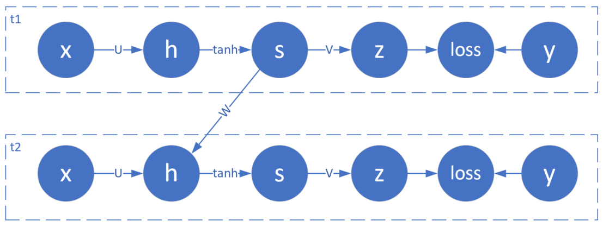

<!--Copyright © Microsoft Corporation. All rights reserved.
  适用于[License](https://github.com/Microsoft/ai-edu/blob/master/LICENSE.md)版权许可-->

## 初步认识RNN

### 提出问题

我们先用一个最简单的序列问题来了解一下RNN的基本运作方式。

假设有一个随机信号发射器，每秒产生一个随机信号，随机值为(0,1)之间。信号发出后，碰到一面墙壁反射回来，来回的时间相加正好是1秒，于是接收器就收到了1秒钟之前的信号。对于接收端来说，可以把接收到的数据序列列表如下：

|时刻|t1|t2|t3|t4|t5|t6|...|
|---|---|---|---|---|---|---|---|
|发射随机信号X|0.35|0.46|0.12|0.69|0.24|0.94|...|
|接收回波信号Y|0|0.35|0.46|0.12|0.69|0.24|...|

具体的描述此问题：当接收端接收到两个连续的值，如0.35、0.46时，系统响应为0.35；下一个时间点接收到了0.12，考虑到上一个时间点的0.46，则二者组合成0.46、0.12序列，此时系统响应为0.46；依此类推，即接收到第二个数值时，总要返回相邻的第一个数值。

我们可以把发射信号看作X，把接收信号看作是Y，则此问题变成了给定样本X和标签值Y，训练一个神经网络，令其当接收到两个序列的值时，总返回第一个值。

读者可能会产生疑问：这个问题用一个最简单不过的程序就可以解决，我们为什么还要大动干戈地使用神经网络呢？如：

```Python
def echo(x1,x2):
    return x2
```

因为这是一个最基本的序列问题，我们先用它投石问路，逐步地理解RNN的精髓所在。

如果把发射信号和回波信号绘制成图，如下图所示：

|样本图|局部放大图|
|---|---|
|||
图一：信号及回波样本序列

其中，红色叉子为样本数据点，蓝色圆点为标签数据点，它总是落后于样本数据一个时间步。还可以看到以上数据形成的曲线完全随机，毫无规律。

我们回忆一下，在验证万能近似定理时，我们学习了曲线拟合问题，即带有一个隐层和非线性激活函数的前馈神经网络，可以拟合任意曲线。但是在这个问题里，有几点不同：

1. 不是连续值，而是时间序列的离散值
2. 完全随机的离散值，而不是满足一定的规律
3. 测试数据不在样本序列里，完全独立

所以，即使使用DNN技术中曲线拟合技术得到了一个拟合网络，也不能正确地预测不在样本序列里的测试集数据。但是，我们可以把DNN做一个变形，让它能够处理时间序列数据：


图二：两个时间步的DNN

图二中含有两个简单的DNN网络，t1和t2，每个节点上都只有一个神经元，其中，各个节点的名称和含义是：

|名称|含义|
|---|---|
|x|输入层样本|
|h|隐层|
|s|隐层激活状态|
|z|输出层|
|loss|损失函数|
|y|标签值|

由于是一个值拟合的网络，所以在输出层不使用分类函数，损失函数使用 MSE 均方差。

t1和t2是两个独立的网络，在t1和t2之间，用一个W连接t1的隐层激活状态值到t2的隐层输入，对t2来说，相当于有两个输入：一个是t2时刻的x样本值，一个是t1时刻的隐层激活值。

