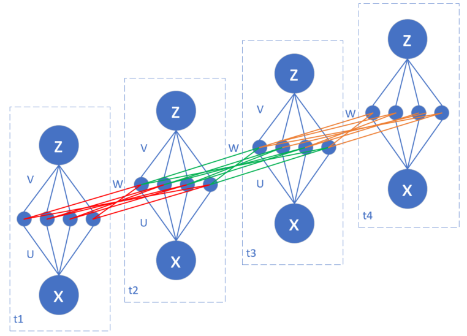

<!--Copyright © Microsoft Corporation. All rights reserved.
  适用于[License](https://github.com/Microsoft/ai-edu/blob/master/LICENSE.md)版权许可-->

## 19.2 更多时序的RNN

本小节中，我们将学习具有四个时间步的RNN网络，用于二分类功能。

### 19.2.1 提出问题

在加减法运算中，总会遇到进位或者退位的问题，我们以二进制为例，比如13-6=7这个十进制的减法，变成二进制后如下所示：

```
13 - 6 = 7
====================
  x1: [1, 1, 0, 1]
- x2: [0, 1, 1, 0]
------------------
  y:  [0, 1, 1, 1]
====================
```
- 被减数13变成了[1, 1, 0, 1]
- 减数6变成了[0, 1, 1, 0]
- 结果的7变成了[0, 1, 1, 1]

在减法过程中：
- x1和x2的最后一位是1和0，相减为1
- 倒数第二位是0和1，需要从前面借一位，相减后得1
- 倒数第三位本来是1和1，借位后变成了0和1，再从前面借一位，相减后得1
- 倒数第四位现在是0和0，相减为0

也就是说，在减法过程中，后面的计算会影响前面的值，所以必须逐位计算，这也就是序列的概念，所以应该可以用RNN的技术来解决。

由于计算是从最后一位开始的，我们认为最后一位是第一个时间步，所以需要把样本数据的前后顺序颠倒一下，比如13，从二进制的 [1, 1, 0, 1] 倒序变成 [1, 0, 1, 1]。相应地，标签数据7也要从二进制的 [0, 1, 1, 1] 倒序变成 [1, 1, 1, 0]。

在这里个例子中，因为是4位二进制减法，所以最大值是15，即 [1, 1, 1, 1]；最小值是0，并且要求被减数必须大于减数，所以样本的数量一共是136个，每个样本含有两组4位的二进制数，表示被减数和减数。标签值为一组4位二进制数。三组二进制数都是倒序。

### 19.2.2 搭建多个时序的网络

#### 搭建网络

在本例中，我们仍然从DNN的结构扩展到含有4个时序的网络结构：


图一：含有4个时序的网络结构图

图一中，最左侧的简易结构是通常的RNN的画法，而右侧是其展开后的细节，由此可见细节有很多，如果不展开的话，对于初学者来说很难理解，而且也不利于我们进行反向传播的推导。

再重复一下，请读者记住，t1是二进制数的最低位，但是由于我们把样本倒序了，所以，现在的t1就是样本的第0个单元的值。并且由于涉及到被减数和减数，所以每个样本的第0个单元（时间步）都有两个特征值，其它3个单元也一样。

在图一中，连接x和h的是一条线标记为U，在19.1节的例子中，U是一个参数，但是在本节中，U是一个 1x4 的参数矩阵，V是一个 4x1 的参数矩阵，而W就是一个 4x4 的参数矩阵。我们把它们展开画成下图（其中把s和h合并在一起了）：



图二：W权重矩阵的展开图

U和V都比较容易理解，而W是一个连接相邻时序的参数矩阵，并且共享相同的参数值，这一点在刚开始接触RNN时不太容易理解。图二中把W绘制成3种颜色，代表它们在不同的时间步中的作用，是想让读者看得清楚些，并不代表它们是不同的值。

与19.1节不同的是，在每个时间步的结构中，多出来一个a，是从z经过Logistic函数生成的。这是为什么呢？因为在本例中，我们想模拟二进制数的减法，所以结果应该是0或1，于是我们把它看作是二分类问题，z的值是一个浮点数，用Logistic作为二分类函数后，使得a的值尽量向两端（0或1）靠近。

二分类问题的损失函数使用交叉熵函数，这与我们在DNN中学习的二分类问题完全相同。

#### 正向计算

下面我们先看看4个时序的正向计算过程。

从图一中看，t2、t3、t4的结构是一样的，只有t1缺少了从前面的时间步的输入，因为它是第一个时序，前面没有输入，所以我们单独定义t1的前向计算函数：

$$
h = x \cdot U \tag{1}
$$

$$
s = tanh(h) \tag{2}
$$

$$
z = s \cdot V \tag{3}
$$

$$
a = Logistic(z) \tag{4}
$$

单个时间步的loss值：

$$
loss = -[y \ln a + (1-y) \ln (1-a)]
$$

所有时间步的loss值计算：

$$
LOSS = \frac{1}{4} \sum_{t=1}^4 loss_t \tag{5}
$$


细心的读者可能会注意到在公式1和公式3中，我们并没有添加偏移项b，是因为在此问题中，没有偏移项一样可以完成任务。

```Python
class timestep_1(timestep):
    # compare with timestep class: no h_t value from previous layer
    def forward(self,x,U,V,W):
        self.U = U
        self.V = V
        self.W = W
        self.x = x
        # 公式1
        self.h = np.dot(self.x, U)
        # 公式2
        self.s = Tanh().forward(self.h)
        # 公式3
        self.z = np.dot(self.s, V)
        # 公式4
        self.a = Logistic().forward(self.z)
```        

其它三个时间步的前向计算过程是一样的，它们与t1的不同之处在于公式1，所以我们单独说明一下：

$$
h = x \cdot U + s_{t-1} \cdot W \tag{6}
$$

```Python
class timestep(object):
    def forward(self,x,U,V,W,prev_s):
        ...
        # 公式6
        self.h = np.dot(x, U) + np.dot(prev_s, W)
        ...
```

#### 反向传播

反向传播的计算对于4个时间步来说，分为3种过程，但是它们之间只有微小的区别。我们先把公共的部分列出来，再说明每个时间步的差异。

首先是损失函数对z节点的偏导数，对于4个时间步来说都一样：

$$
\begin{aligned}
\frac{\partial loss}{\partial z}&=\frac{\partial loss}{\partial a}\frac{\partial a}{\partial z} \\
&=\frac{a-y}{a(1-a)}a(1-a) \\
&= a-y \rightarrow dz_t \tag{7}
\end{aligned}
$$

再进一步计算s和h的误差。对于t4来说，s和h节点的路径比较单一，直接从loss节点向下反向推导即可：

$$
\frac{\partial loss}{\partial s}=\frac{\partial loss}{\partial z}\frac{\partial z}{\partial s} = dz \cdot V^T \tag{8}
$$

$$
\frac{\partial loss}{\partial h}=\frac{\partial loss}{\partial s}\frac{\partial s}{\partial h}=dz \cdot V^T \odot (1-s^2) \rightarrow dh_{t4} \tag{9}
$$

对于t1、t2、t3的s节点来说，都有两个方向的反向路径，第一个是从本时间步的z节点，第二个是从后一个时间步的h节点，因此，s的反向计算应该是两个路径的和。

我们先以t3为例推导：

$$
\begin{aligned}
\frac{\partial LOSS}{\partial s_{t3}}&=\frac{\partial loss_{t3}}{\partial s_{t3}} + \frac{\partial loss_{t4}}{\partial s_{t3}} \\
&=\frac{\partial loss_{t3}}{\partial s_{t3}} + \frac{\partial loss_{t4}}{\partial h_{t4}}\frac{\partial h_{t4}}{\partial s_{t3}} \\
&=dz_{t3} \cdot V^T + dh_{t4} \cdot W^T
\end{aligned}
$$

再扩展到一般情况：

$$
\begin{aligned}
\frac{\partial LOSS}{\partial s_t}&=\frac{\partial loss_t}{\partial s_t} + \frac{\partial loss_{t+1}}{\partial s_t} \\
&=\frac{\partial loss_t}{\partial s_t} + \frac{\partial loss_{t+1}}{\partial h_{t+1}}\frac{\partial h_{t+1}}{\partial s_t} \\
&=dz_t \cdot V^T + dh_{t+1} \cdot W^T \tag{10}
\end{aligned}
$$

再进一步计算t1、t2、t3的h节点的误差：

$$
\begin{aligned}
\frac{\partial LOSS}{\partial h_t} &= \frac{\partial LOSS}{\partial s_t} \frac{\partial s_t}{\partial h_t} \\
&= (dz \cdot V^T + dh_{t+1} \cdot W^T) \odot (1-s_t^2) \rightarrow dh_t \tag{11}
\end{aligned}
$$

上式中最后一项是tanh函数的导数。

下面计算V的误差，V只与z节点和s节点有关，而且4个时间步是相同的：

$$
\frac{\partial loss}{\partial V_t}=\frac{\partial loss}{\partial z_t}\frac{\partial z_t}{\partial V_t}=s_t^T \cdot dz_t \rightarrow dV_t  \tag{12}
$$

下面计算U的误差，U只与节点h和输入x有关，而且4个时间步是相同的：

$$
\frac{\partial loss}{\partial U_t}=\frac{\partial loss}{\partial h_t}\frac{\partial h_t}{\partial U_t}=x_t^T \cdot dh_t \rightarrow dU_t \tag{13}
$$

下面计算W的误差，从图一中看，t1是没有W参与计算的，与其它三个时间步不同，所以对于t1来说：

$$
dW_{t1} = 0 \tag{14}
$$

对于t2、t3、t4：

$$
\frac{\partial loss_t}{\partial W_t}=\frac{\partial loss_t}{\partial h_t}\frac{\partial h_t}{\partial W_t}=s_{t-1}^T \cdot dh_{t} \rightarrow dW_{t} \tag{15}
$$

下面是t1的反向传播函数，与其他3个t不同的是dW部分为0：

```Python
class timestep_1(timestep):
    # for the first timestep, there has no prev_s
    def backward(self, y, next_dh):
        # 公式7
        self.dz = (self.a - y)
        # 公式11
        self.dh = (np.dot(self.dz, self.V.T) + np.dot(next_dh, self.W.T)) * Tanh().backward(self.s)
        # 公式12
        self.dV = np.dot(self.s.T, self.dz)
        # 公式13
        self.dU = np.dot(self.x.T, self.dh)
        # 公式14
        self.dW = 0
```

下面是t2、t3的反向传播函数：

```Python
class timestep(object):
    def backward(self, y, prev_s, next_dh):
        # 公式7
        self.dz = (self.a - y)
        # 公式11
        self.dh = (np.dot(self.dz, self.V.T) + np.dot(next_dh, self.W.T)) * Tanh().backward(self.s)
        # 公式12
        self.dV = np.dot(self.s.T, self.dz)
        # 公式13
        self.dU = np.dot(self.x.T, self.dh)
        # 公式15
        self.dW = np.dot(prev_s.T, self.dh)
```

下面是t4的反向传播函数，与前三个t不同的是dh的求导公式中少一项：

```Python
class timestep_4(timestep):
    # compare with timestep class: no next_dh from future layer
    def backward(self, y, prev_s):
        # 公式7
        self.dz = self.a - y
        # 公式9
        self.dh = np.dot(self.dz, self.V.T) * Tanh().backward(self.s)
        # 公式12
        self.dV = np.dot(self.s.T, self.dz)
        # 公式13
        self.dU = np.dot(self.x.T, self.dh)
        # 公式15
        self.dW = np.dot(prev_s.T, self.dh)
```
### 19.2.3 代码实现

在上一小节我们已经讲解了正向和反向的代码实现，本小节讲一下训练部分的主要代码。

#### 初始化

初始化loss function和loss trace，然后初始化4个时间步的实例。

```Python
class net(object):
    def __init__(self, dr):
        self.dr = dr
        self.loss_fun = LossFunction_1_1(NetType.BinaryClassifier)
        self.loss_trace = TrainingHistory_3_0()
        self.t1 = timestep_1()
        self.t2 = timestep()
        self.t3 = timestep()
        self.t4 = timestep_4()
```

#### 前向计算

按顺序分别调用4个时间步的前向计算函数，注意在t2到t4时，需要把t-1时刻的s值代进去。

```Python
    def forward(self,X):
        self.t1.forward(X[:,0],self.U,self.V,self.W)
        self.t2.forward(X[:,1],self.U,self.V,self.W,self.t1.s)
        self.t3.forward(X[:,2],self.U,self.V,self.W,self.t2.s)
        self.t4.forward(X[:,3],self.U,self.V,self.W,self.t3.s)
```

#### 反向传播

按相反的顺序调用4个时间步的反向传播函数，注意在t3、t2、t1时，要把t+1时刻的dh代进去，以便计算当前时刻的dh；而在t4、t3、t2时，需要把t+1时刻的s值代进去，以便计算dW的值。

```Python
    def backward(self,Y):
        self.t4.backward(Y[:,3], self.t3.s)
        self.t3.backward(Y[:,2], self.t2.s, self.t4.dh)
        self.t2.backward(Y[:,1], self.t1.s, self.t3.dh)
        self.t1.backward(Y[:,0],            self.t2.dh)
```

#### 损失函数

4个时间步都参与损失函数计算，所以总体的损失函数是4个时间步的损失函数值的和。

```Python
    def check_loss(self,X,Y):
        self.forward(X)
        loss1,acc1 = self.loss_fun.CheckLoss(self.t1.a,Y[:,0:1])
        loss2,acc2 = self.loss_fun.CheckLoss(self.t2.a,Y[:,1:2])
        loss3,acc3 = self.loss_fun.CheckLoss(self.t3.a,Y[:,2:3])
        loss4,acc4 = self.loss_fun.CheckLoss(self.t4.a,Y[:,3:4])
        output = np.concatenate((self.t1.a,self.t2.a,self.t3.a,self.t4.a), axis=1)
        result = np.round(output).astype(int)
        correct = 0
        for i in range(X.shape[0]):
            if (np.allclose(result[i], Y[i])):
                correct += 1
        acc = correct/X.shape[0]
        loss = (loss1 + loss2 + loss3 + loss4)/4
        return loss,acc,result
```

#### 训练过程

先初始化参数矩阵，然后用双重循环进行训练，每次只用一个样本，因此batch_size=1。

```Python
    def train(self, batch_size, checkpoint=0.1):
        num_input = 2
        num_hidden = 4
        num_output = 1
        max_epoch = 100
        eta = 0.1
        self.U = np.random.random((num_input,num_hidden))
        self.W = np.random.random((num_hidden,num_hidden))
        self.V = np.random.random((num_hidden,num_output))
        
        max_iteration = math.ceil(self.dr.num_train/batch_size)
        checkpoint_iteration = (int)(math.ceil(max_iteration * checkpoint))

        for epoch in range(max_epoch):
            dr.Shuffle()
            for iteration in range(max_iteration):
                # get data
                batch_x, batch_y = self.dr.GetBatchTrainSamples(1, iteration)
                # forward
                self.forward(batch_x)
                self.backward(batch_y)
                # update
                self.U = self.U - (self.t1.dU + self.t2.dU + self.t3.dU + self.t4.dU)*eta
                self.V = self.V - (self.t1.dV + self.t2.dV + self.t3.dV + self.t4.dV)*eta
                self.W = self.W - (self.t1.dW + self.t2.dW + self.t3.dW + self.t4.dW)*eta
                # check loss
                ...
            #enf for
            if (acc == 1.0):
                break
        #end for
        self.loss_trace.ShowLossHistory("Loss and Accuracy", XCoordinate.Iteration)
```        

在参数更新部分，需要把4个时间步的参数梯度相加再乘以学习率，做为整个网络的梯度。

### 19.2.4 运行结果

我们设定在验证集上的准确率为1.0时即停止训练，图三为训练过程曲线：


图三：训练过程中的损失函数和准确率变化

下面是最后几轮的打印输出结果：

```
...
5 741
loss=0.156525, acc=0.867647
5 755
loss=0.131925, acc=0.963235
5 769
loss=0.117635, acc=1.000000
5 783
loss=0.113057, acc=1.000000
5 797
loss=0.109516, acc=1.000000
5 811
loss=0.106093, acc=1.000000

testing...
loss=0.105319, acc=1.000000
```
我们在验证集上（实际上和测试集一致）得到了100%的准确率，即所有136个测试样本都可以得到正确的预测值。

下面随机列出了几个测试样本及其预测结果：

```
  x1: [1, 0, 1, 1]
- x2: [0, 0, 0, 1]
------------------
true: [1, 0, 1, 0]
pred: [1, 0, 1, 0]
11 - 1 = 10
====================

  x1: [1, 1, 1, 1]
- x2: [0, 0, 1, 1]
------------------
true: [1, 1, 0, 0]
pred: [1, 1, 0, 0]
15 - 3 = 12
====================

  x1: [1, 1, 0, 1]
- x2: [0, 1, 1, 0]
------------------
true: [0, 1, 1, 1]
pred: [0, 1, 1, 1]
13 - 6 = 7
====================
```

我们如何理解RNN的概念在这个问题中的作用呢？在每个时间步中，U、V负责的是0、1相减可以得到正确的值，而W的作用是借位，在相邻的时间步之间传递借位信息，以便当t-1时刻的计算发生借位时，在t时刻也可以得到正确的结果。

### 代码位置

ch19, Level2

### 思考和练习

1. 把tanh函数变成sigmoid函数，试试看有什么不同？
2. 给h和z节点增加偏移值，看看有什么不同？
3. 把h节点的神经元数量增加到8个或16个，看看训练过程有何不同？减少到2个会得到正确结果吗？
4. 把二进制数扩展为8位，即最大值255时，这个网络还能正确工作吗？
