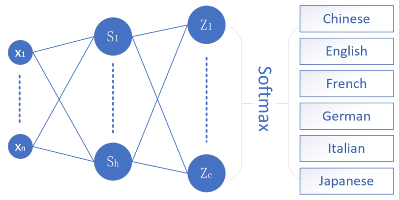
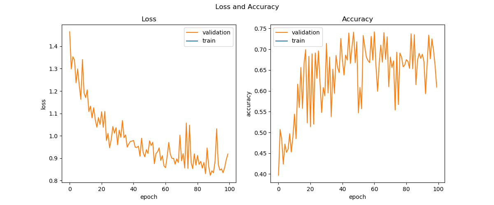
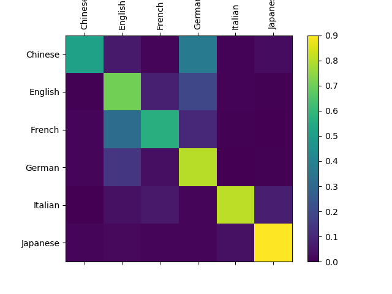
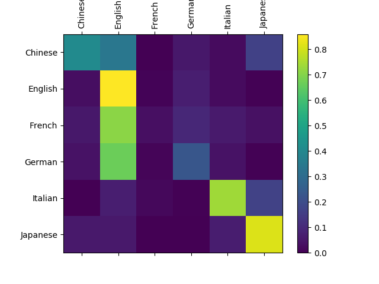

<!--Copyright © Microsoft Corporation. All rights reserved.
  适用于[License](https://github.com/Microsoft/ai-edu/blob/master/LICENSE.md)版权许可-->

## 19.3 不定长时序的RNN

本小节中，我们将学习具有不固定的时间步的RNN网络，用于多分类功能。

### 19.3.1 提出问题

各个国家的人都有自己习惯的一些名字，下面列举出了6个国家/语种的典型名字：

```
Guan    Chinese
Rong    Chinese
Bond    English
Stone   English
Pierre	French
Vipond	French
Metz    German
Neuman  German
Aggio   Italian
Falco   Italian
Akimoto Japanese
Hitomi	Japanese
```

名字都是以ASCII字母展现的，以便于不同语种直接的比较。

如果隐藏掉第二列，只看前面的名字的话，根据发音、拼写习惯等，我们可以大致猜测出这些名字属于哪个国家/语种。当然也有一些名字是重叠的，比如Lang，会同时出现在English、Chinese、German等几种语种里。

既然人类可以凭借一些模糊的知识分辨名字与国家/语种的关系，那么神经网络能否也具备这个能力呢？

下面我们仍然借助于RNN来完成这个任务。

### 19.3.2 准备数据

循环神经网络的要点是“循环”二字，也就是说一个样本中的数据要分成连续若干个时间步，然后逐个喂给网络进行训练。如果两个样本的时间步总数不同，是不能做为一个批量一起喂给网络的。

在本例中，由于名字的长度不同，所以不同长度的两个名字，是不能放在一个batch里做批量运算的。但是如果一个一个地训练样本，将会花费很长的时间，所以需要我们对本例中的数据做一个特殊的处理：

1. 先按字母个数（名字的长度）把所有数据分开，由于最短的名字是2个字母，最长的是19个字母，所以一共应该有18组数据（实际上只有15组，中间有些长度的名字不存在）。
2. 使用OneHot编码把名字转换成向量，比如：名字为“Duan”，变成小写字母“duan”，则OneHot编码是：

```
[[0,0,0,1,0,0,0,0,0,0,0,0,0,0,0,0,0,0,0,0,0,0,0,0,0,0],  # d
 [0,0,0,0,0,0,0,0,0,0,0,0,0,0,0,0,0,0,0,0,1,0,0,0,0,0],  # u
 [1,0,0,0,0,0,0,0,0,0,0,0,0,0,0,0,0,0,0,0,0,0,0,0,0,0],  # a
 [0,0,0,0,0,0,0,0,0,0,0,0,0,1,0,0,0,0,0,0,0,0,0,0,0,0]]  # n
```

3. 把所有相同长度的名字的OneHot编码都堆放在一个矩阵中，形成批量，这样就是成为了一个三维矩阵：
   - 第一维是名字的数量，假设一共有230个4个字母的名字，175个5个字母的名字，等等；
   - 第二维是4或者5或者其它值，即字母个数，也是时间步的个数；
   - 第三维是26，即a~z的小写字母的个数，相应的位为1，其它位为0。

在用SGD方法训练时，先随机选择一个组，假设是6个字母的名字，再从这一组中随机选择一个小批量，比如8个名字，这样就形成了一个8x6x26的三维批量数据。如果随机选到了7个字母的组，最后会形成8x7x26的三维批量数据。

### 19.3.3 搭建不定长时序的网络

#### 搭建网络

为什么是不定长时序的网络呢？因为名字的单词中的字母个数不是固定的，最少的两个字母，最多的有19个字母。

<center>


图一：不定长时序的网络
</center>

在图一中，max_n=19，可以容纳最长的单词。为了节省空间，把最后一个时序的y和loss画在了拐弯的位置。

并不是所有的时序都需要做分类输出，而是只有最后一个时序需要。比如当名字是“guan”时，需要在第4个时序做分类输出，并加监督信号做反向传播，而前面3个时序不需要。但是当名字是“baevsky”时，需要在第7个时序做分类输出。所以n值并不是固定的。

对于最后一个序列，展开成DNN网络如图二：
<center>


图二：某个名字的最后一个时序的展开图</center>

图二中，n为当前名字的长度，即字母个数，也就是时序数；h为4~8之间的一个数，表示隐层神经元的个数；c为最后的分类数，此处为6，即6种语言；最后输出为预测该名字属于6种语言的概率。

#### 前向计算

对于第一个时序：

$$
h = x \cdot U \tag{1}
$$

对于后面的时序：

$$
h = x \cdot U + s_{t-1} \cdot W \tag{2}
$$

$$
s = tanh(h) \tag{3}
$$

对于最后一个时序：

$$
z = s \cdot V \tag{4}
$$

$$
a = Softmax(z) \tag{5}
$$

$$
loss = -y \cdot \ln a \tag{6}
$$

下面是正向计算的代码实现：

```Python
class timestep(object):
    # for the first cell, prev_s should be zero
    def forward(self, x, U, V, W, prev_s, isFirst, isLast):
        self.U = U
        self.V = V
        self.W = W
        self.x = x

        if (isFirst):
            # 公式1
            self.h = np.dot(x, U)
        else:
            # 公式2
            self.h = np.dot(x, U) + np.dot(prev_s, W) 
        # 公式3
        self.s = Tanh().forward(self.h)
        if (isLast):
            # 公式4
            self.z = np.dot(self.s, V)
            # 公式5
            self.a = Softmax().forward(self.z)
```

参数中，isFirst为True时表示是第一个时序，isLast为True时表示最后一个时序。


#### 反向传播

反向传播的推导和前面两节区别不大，唯一的变化是Softmax接多分类交叉熵损失函数，但这也是我们在DNN部分学习过的。

对于最后一个时序：

$$
\frac{\partial loss}{\partial z}= a-y \rightarrow dz_t \tag{7}
$$

$$
\frac{\partial loss}{\partial h}=dz \cdot V^T \odot tanh'(s) \rightarrow dh \tag{8}
$$

对于前面的所有时序，由于不参与输出，没有监督信号，所以只有从后一个时序传回来的误差：

$$
\begin{aligned}
\frac{\partial loss}{\partial h_t} &= \frac{\partial loss}{\partial h_{t+1}} \frac{\partial h_{t+1}}{\partial s_t} \frac{\partial s_t}{\partial h_t}\\
&= (dh_{t+1} \cdot W^T) \odot tanh'(s_t) \rightarrow dh_t \tag{9}
\end{aligned}
$$

对于最后一个时序：

$$
\frac{\partial loss}{\partial V}=\frac{\partial loss}{\partial z}\frac{\partial z}{\partial V}=s^T \cdot dz \rightarrow dV  \tag{10}
$$

对于前面的所有时序，由于V没有参与输出，所以dV为0矩阵。

对于所有时序，U都参与了计算：

$$
\frac{\partial loss}{\partial U_t}=\frac{\partial loss}{\partial h_t}\frac{\partial h_t}{\partial U_t}=x_t^T \cdot dh_t \rightarrow dU_t \tag{11}
$$

除了第一个时序外，其它时序都有W参与计算，所以：

$$
\frac{\partial loss_t}{\partial W_t}=\frac{\partial loss_t}{\partial h_t}\frac{\partial h_t}{\partial W_t}=s_{t-1}^T \cdot dh_{t} \rightarrow dW_{t} \tag{12}
$$

而第一个时序的dW是0矩阵。

下面是反向传播的代码：

```Python
    def backward(self, y, prev_s, next_dh, isFirst, isLast):
        if (isLast):
            # 公式7
            self.dz = (self.a - y)
        else:
            self.dz = np.zeros_like(y)
        # end if
        if (isLast):
            # 公式8
            self.dh = np.dot(self.dz, self.V.T) * Tanh().backward(self.s)
        else:
            # 公式9
            self.dh = np.dot(next_dh, self.W.T) * Tanh().backward(self.s)
        # end if
        if (isLast):
            # 公式10
            self.dV = np.dot(self.s.T, self.dz)
        else:
            self.dV = np.zeros_like(self.V)
        # 公式11
        self.dU = np.dot(self.x.T, self.dh)
        if (isFirst):
            self.dW = np.zeros_like(self.W)
        else:
            # 公式12
            self.dW = np.dot(prev_s.T, self.dh)
        # end if
```

参数中，isFirst为True时表示是第一个时序，isLast为True时表示最后一个时序。

### 19.3.4 代码实现

在主过程调用代码中，我们主要讲解几个核心函数。下面是前向计算的调用函数：

```Python
    def forward(self,X):
        self.x = X
        self.batch = self.x.shape[0]
        self.ts = self.x.shape[1]
        for i in range(0, self.ts):
            if (i == 0):
                self.ts_list[i].forward(X[:,i], self.U, self.V, self.W, None, True, False)
            elif (i == self.ts - 1):
                self.ts_list[i].forward(X[:,i], self.U, self.V, self.W, self.ts_list[i-1].s[0:self.batch], False, True)
            else:
                self.ts_list[i].forward(X[:,i], self.U, self.V, self.W, self.ts_list[i-1].s[0:self.batch], False, False)
        #end for
        return self.ts_list[self.ts-1].a
```
在这个函数中，先得到批数量batch和时序数量ts，然后根据当前循环所处的时序来给前向计算函数不同的参数，尤其是isFirst和isLast参数，最后返回最后一个时序的a值。

为什么不适用超参中给定的批大小数值呢？因为在取批数据时，不一定能得到和超参中指定的值同样的批大小，很有可能会少。比如超参中batch_size=4，但是数据总量也许不能被4整除，或者随机选定的位置到该组数据结尾的位置的数量不足4，所以要以实际获得批数量为准。

下面是反向传播的调用函数，也是要根据当前时序来设置正确的参数：

```Python
    def backward(self,Y):
        for i in range(self.ts-1, -1, -1):
            if (i == 0):
                self.ts_list[i].backward(Y, None, self.ts_list[i+1].dh[0:self.batch], True, False)
            elif (i == self.ts - 1):
                self.ts_list[i].backward(Y, self.ts_list[i-1].s[0:self.batch], None, False, True)
            else:
                self.ts_list[i].backward(Y, self.ts_list[i-1].s[0:self.batch], self.ts_list[i+1].dh[0:self.batch], False, False)
        #end for
```

下面是参数更新函数，注意要在更新前清空梯度，然后把每个时序的dU、dV、dW各自相加，尽管有的时序中该梯度值为0：

```Python
    def update(self):
        du = np.zeros_like(self.U)
        dv = np.zeros_like(self.V)
        dw = np.zeros_like(self.W)
        for i in range(self.ts):
            du += self.ts_list[i].dU
            dv += self.ts_list[i].dV
            dw += self.ts_list[i].dW
        #end for
        self.U = self.U - du * self.hp.eta
        self.V = self.V - dv * self.hp.eta
        self.W = self.W - dw * self.hp.eta
```

下面是训练部分的代码：

```Python
    def train(self, dataReader, checkpoint=0.1):
        self.dataReader = dataReader
        min_loss = 10
        total_iter = 0
        for epoch in range(self.hp.max_epoch):
            self.hp.eta = self.lr_decay(epoch)
            dataReader.Shuffle()
            while(True):
                # get data
                batch_x, batch_y = dataReader.GetBatchTrainSamples(self.hp.batch_size)
                if (batch_x is None):
                    break
                # forward
                self.forward(batch_x)
                # backward
                self.backward(batch_y)
                # update
                self.update()
                total_iter += 1
            #enf while
            # check loss
            X,Y = dataReader.GetValidationSet()
            loss,acc = self.check_loss(X,Y)
            self.loss_trace.Add(epoch, total_iter, None, None, loss, acc, None)
            print(str.format("{0}:{1}:{2} loss={3:6f}, acc={4:6f}", epoch, total_iter, self.hp.eta, loss, acc))
            if (loss < min_loss):
                min_loss = loss
                self.save_parameters()
            #endif
        #end for
        self.loss_trace.ShowLossHistory("Loss and Accuracy", XCoordinate.Epoch)
```

获得批量训练数据函数，可以保证去到相同时间步的一组样本，这样就可以进行批量训练了，提高速度和准确度。如果取回None数据，说明所有样本数据都被使用过一次了，则结束本轮训练，检查损失函数值，然后进行下一个epoch的训练。

在检测损失函数值时，要和历史记录比较，如果本epoch的损失函数值更小，则记录下来，并保存当前的网络参数。也就是说，在磁盘中保存的参数，是整个训练过程中的最优解。

### 19.3.5 运行结果

我们需要下面一组超参来控制模型训练：

```Python
    eta = 0.005
    max_epoch = 100
    batch_size = 4
    num_input = dataReader.num_feature
    num_hidden = 10
    num_output = dataReader.num_category
```

几个值得注意的地方是：

1. 学习率为0.005，经过笔者试验，稍微大一些的学习率会造成网络不收敛，损失函数高居不下
2. 隐层神经元数量为6，虽然输入的x的特征值向量数为26，但却是OneHot编码，有效信息很少，所以不需要很多的神经元数量

最后得到的损失函数曲线如图三所示：

<center>


图三：损失函数曲线和验证集准确度曲线
</center>

由于是多分类问题，所以我们尝试使用混淆矩阵的方式来分析结果：

<center>


图四：混淆矩阵
</center>

在图四中，对角线上的方块越亮，表示识别越准确。对于Chinese，被识别为Chinese和English类别的数量差不多，也就是说很多中文名字被识别成了英语，这与英语名字的数量多有关系。

我们再来看另一张图：

<center>


图五：准确率较低的混淆矩阵
</center>

```

在图五中，French和German很不理想，于是笔者把这两者的数据样本重复了一份放在训练数据集里，重新训练从而得到了图四，可以起到一些作用，German的结果正常了，French的结果还差一些，但可以看到图四中的French:French的方块的亮度，比图五的对应位置的方块的亮度要高很多。

...
134:296190:0.0005 loss=0.678457, acc=0.781000
save parameters...
135:298384:0.0005 loss=0.673253, acc=0.783000
save parameters...
136:300578:0.0005 loss=0.687567, acc=0.781000
137:302772:0.0005 loss=0.745999, acc=0.766000
138:304966:0.0005 loss=0.691581, acc=0.776000
139:307160:0.0005 loss=0.679019, acc=0.779000
140:309354:0.0005 loss=0.732922, acc=0.770000
141:311548:0.0005 loss=0.749266, acc=0.762000
142:313742:0.0005 loss=0.721853, acc=0.773000
143:315936:0.0005 loss=0.687402, acc=0.781000
144:318130:0.0005 loss=0.701688, acc=0.774000
145:320324:0.0005 loss=0.686707, acc=0.780000
146:322518:0.0005 loss=0.713086, acc=0.779000
147:324712:0.0005 loss=0.711115, acc=0.773000
148:326906:0.0005 loss=0.691707, acc=0.773000
149:329100:0.0005 loss=0.676991, acc=0.777000
correctness=6475/8759=0.7392396392282224
```

在第134和135个epoch处，都有最低的loss值，所以保存了网络参数，但是后面的参数会覆盖前面的参数。最后在整个训练集上得到的准确率是73.9%。由于数据的特殊性，没有测试集，所以只能在训练集上做测试了。

### 代码位置

ch19, Level3

### 参考资料

- https://pytorch.org/tutorials/intermediate/char_rnn_classification_tutorial.html