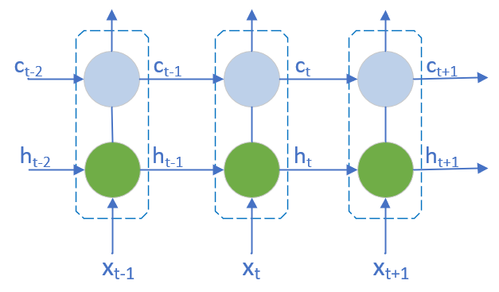
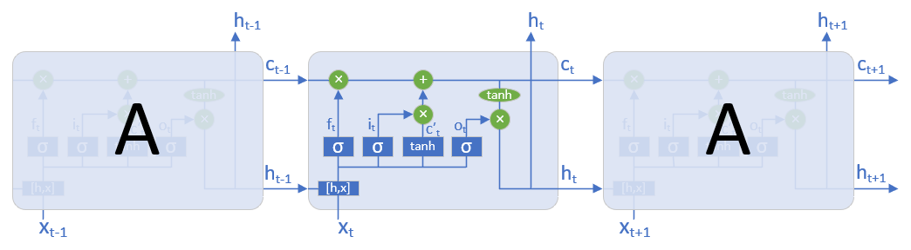

<!--Copyright © Microsoft Corporation. All rights reserved.
  适用于[License](https://github.com/Microsoft/ai-edu/blob/master/LICENSE.md)版权许可-->

## 19.4 长短时记忆网络的基本原理

循环神经网络的提出，使神经网络可以训练和解决带有时序信息的任务，大大拓宽了神经网络的使用范围。但是原始的RNN有明显的缺陷，不管是双向RNN，还是深度RNN，都有一个严重的缺陷：在训练过程冲经常会出现梯度爆炸和梯度消失的问题，以至于原始的RNN很难处理长距离的依赖。

### 19.4.1 RNN中的梯度爆炸和梯度消失

在 `19.2` 节中，我们推导了循环神经网络的反向传播算法，得到了任意时刻k, 误差项沿时间反向传播的公式，如下：
$$
\delta^T_k=\delta^T_t \prod_{i=k}^{t-1} diag[f'(net_i)]W
$$

其中 $f$ 为激活函数，$net_i$ 为神经网络在第 $i$ 时刻的加权输入， $W$ 为权重矩阵，$diag$ 表示一个对角矩阵。

注意，其中有一个连乘项 $\prod_{i=k}^{t-1} diag[f'(net_i)]W$ , 如果激活函数是挤压型，例如 $Tanh$ 或 $sigmoid$ , 从 `8.1` 节可以知道，他们的导数值在 [0,1] 之间。我们再来看 $W$。
1. 如果 $W$ 的值在 (0,1) 的范围内， 则随着 $t$ 的增大，连乘项会越来越趋近于0， 误差无法传播，这就导致了 **梯度消失** 的问题。
2. 如果 $W$ 的值很大，使得$diag[f'(net_i)]W$ 的值大于 $1$， 则随着 $t$ 的增大，连乘项的值会呈指数增长，并趋向于无穷，产生 **梯度爆炸**。

梯度消失使得误差无法传递到较早的时刻，权重无法更新，网络停止学习。梯度爆炸又会使网络不稳定，梯度过大，权重变化太大，无法很好学习，最坏情况还会产生溢出（NaN）错误而无法更新权重。

为了解决这个问题，科学家们想了很多办法。

1. 采用半线性激活函数 ReLU 代替 挤压型激活函数，ReLU函数在定义域大于0的部分，导数恒等于1，来解决梯度消失问题。
2. 合理初始化权重 $W$ ，使 $diag[f'(net_i)]W$ 的值尽量趋近于1，避免梯度消失和梯度爆炸。

但是上面两种办法都有一定的缺陷，ReLU函数有自身的缺点，而初始化权重的策略也抵不过连乘操作带来的指数增长问题。

要想根本解决问题，最终还是要去掉连乘项。经过不懈的努力，科学家们发明了长短时记忆网络（Long Short Term Memory Network, 简称LSTM），最终从根本上解决了这个问题。

### 19.4.2 长短时记忆网络（LSTM）

#### 19.4.2.1 LSTM的结构

LSTM 的设计思路比较简单，原来的RNN中隐藏层只有一个状态 h，对短期输入敏感，现在再增加一个状态 c，来保存长期状态。这个新增状态称为 **单元状态（cell state）**或**细胞状态**。
增加单元状态前后的网络对比图如下：

那么，如何控制长期状态 c 呢？LSTM 设计了 **门控（gate）** 结构，来控制信息向单元状态的流通或丢弃。LSTM 使用了三个门：遗忘门（forget gate），输入门(input gate)和输出门（output gate）。

加入了门之后的网络结构如下：

上面的图看起来挺复杂，下面我们来具体分析LSTM网络是如何工作的。

#### 19.4.2.2 LSTM的前向计算

1. 遗忘门

   LSTM网络中，第一步我们需要决定从上一单元状态中丢弃什么信息。遗忘门决定了上一单元状态 $c_{t-1}$ 有多少能进入当前状态 $c_t$。首先读取 $h_{t-1}$ 和 $x_t$, 经过 sigmoid 激活函数, 最后输出0-1之前的数。该数值为 1 表示完全保留，为 0 表示完全丢弃。这个数会与每个 $c_{t-1}$ 中的数值相乘（元素乘）。
   $$
   f_t=\sigma(W_f\cdot[h_{t-1}, x_t] + b_f) \tag 1
   $$
   上式中，$\sigma$为激活函数，$W_f=[W_{fh}\;W_{fx}]$ 为遗忘门权重矩阵，$[h_{t-1}, x_t]$ 为两个向量的连接。所以，上面的公式又可转化为
   $$
   f_t = \sigma([W_{fh}\;W_{fx}] \begin{bmatrix}h_{t-1}\\\\x_t \end{bmatrix}+b_f) \\
   = \sigma(W_{fh}h_{t-1}+W_{fx}x_t+b_f) \tag{1'}
   $$
   令 $W_{fh}=W_f$，$W_{fx}=U_f$，则公式也可以写成：
   $$ f_t = \sigma(W_fh_{t-1}+U_fx_t+b_f) \tag{1''}$$

2. 输入门

   第二步是确定单元状态要保存什么新的信息。这包含两部分。

   第一部分，输入门决定了当前时刻输入 $x_t$ 有多少能保留到 $c_t$。
   $$
   i_t=\sigma(W_i\cdot[h_{t-1}, x_t] + b_i) \tag 2
   $$

   第二部分，增加并计算当前的即时状态 $\tilde{c}_t$:
   $$
   \tilde{c}_t=\tanh(W_c\cdot[h_{t-1}, x_t] + b_c) \tag 3
   $$
   于是，开始更新单元状态, $c_{t-1} \to c_t$：
   $$
   c_t=f_t \circ c_{t-1}+i_t \circ \tilde{c}_t \tag 4
   $$
   其中，符号 $\cdot$ 表示矩阵乘积， $\circ$ 表示 Hadamard 乘积，即元素乘积。
   $c_t$的值由两部分构成，$+$ 号前面的部分确定要丢弃的信息，$+$ 号后面确定要更新的候选值。

3. 输出门

   最后，我们要确定输出什么，它也又两部分组成。

   第一部分，输出门决定 $h_{t-1}$ 和 $x_t$ 中哪些信息将被输出：
   $$
   o_t=\sigma(W_o\cdot[h_{t-1}, x_t] + b_o) \tag 5
   $$

   第二部分，将单元状态通过tanh映射到（-1，1）区间，与输出门结果相乘，得到 LSTM 最终的隐藏状态。
   $$
   h_t=o_t \circ \tanh(c_t) \tag 6
   $$

所以，时刻t的预测输出为：
$$
\hat{y}_t = \sigma(Vh_t + b_y) \tag 7
$$

经过上面的步骤，LSTM 就完成了当前时刻的前向计算工作。

下一节，我们来推导LSTM的反向传播过程。