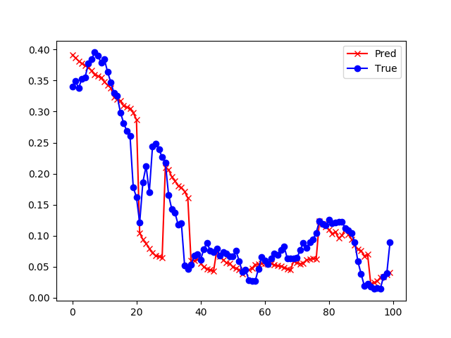
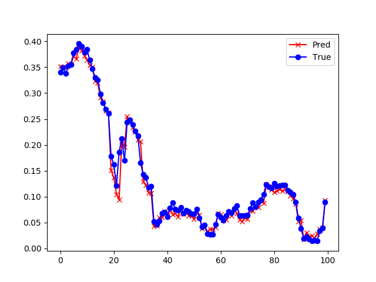
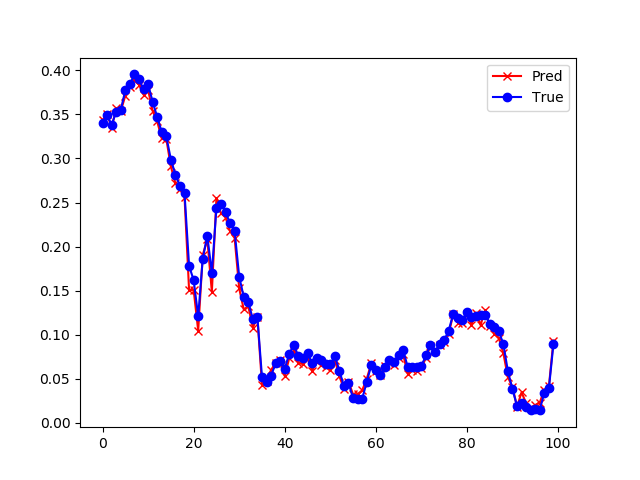

<!--Copyright © Microsoft Corporation. All rights reserved.
  适用于[License](https://github.com/Microsoft/ai-edu/blob/master/LICENSE.md)版权许可-->

## 19.6 深度循环神经网络

### 19.6.1 深度循环神经网络的结构图

前面的几个例子中，单独看每一时刻的网络结构，其实都是由“输入层->隐层->输出层”所组成的，这与我们在前馈神经网络中学到的单隐层的知识一样，由于输入层不算做网络的一层，输出层是必须具备的，所以网络只有一个隐层。我们知道单隐层的能力是有限的，所以人们会使用更深（更多隐层）的网络来解决复杂的问题。

在循环神经网络中，会有同样的需求，要求每一时刻的网络是由多个隐层组成。比如图19-23为两个隐层的循环神经网络，用于解决和19.4节中的同样的问题。


图19-23 两个隐层的循环神经网络

注意图19-23中最左侧的两个隐藏状态s1和s2是同时展开为右侧的图的，
这样的循环神经网络称为深度循环神经网络，它可以具备比单隐层的循环神经网络更强大的能力。

### 19.6.2 前向计算

#### 公式推导

对于第一个时间步：
$$
h1 = x \cdot U \tag{1}
$$
$$
h2 = s1 \cdot Q \tag{2}
$$

对于后面的时间步：
$$
h1 = x \cdot U + s1_{t-1} \cdot W1 \tag{3}
$$

$$
h2 = s1 \cdot Q + s2_{t-1} \cdot W2 \tag{4}
$$

对于所有的时间步：

$$
s1 = Tanh(h1) \tag{5}
$$

$$
s2 = Tanh(h2) \tag{6}
$$

对于最后一个时间步：
$$
z = s2 \cdot V \tag{7}
$$
$$
a = Identity(z) \tag{8}
$$
$$
J = loss_{\tau} = \frac{1}{2} (a-y)^2 \tag{9}
$$

由于是拟合任务，所以公式8的Identity()函数只是简单地令a=z，以便统一编程接口，最后用均方差做为损失函数。

注意并不是所有的循环神经网络都只在最后一个时间步有监督学习信号，而只是我们这个问题需要这样。在19.2节中的例子就是需要在每一个时间步都要有输出并计算损失函数值的。所以，公式9中只计算了最后一个时间步的损失函数值，做为整体的损失函数值。

#### 代码实现

注意前向计算时需要把prev_s1和prev_s2传入，即上一个时间步的两个隐层的节点值（矩阵）。

```Python
class timestep(object):
    def forward(self, x, U, V, Q, W1, W2, prev_s1, prev_s2, isFirst, isLast):
        ......
        # level 1
        if (isFirst):
            # 公式1
            self.h1 = np.dot(x, U)
        else:
            # 公式5
            self.h1 = np.dot(x, U) + np.dot(prev_s1, W1) 
        # 公式2
        self.s1 = Tanh().forward(self.h1)

        # level 2
        if (isFirst):
            # 公式3
            self.h2 = np.dot(self.s1, self.Q)
        else:
            # 公式6
            self.h2 = np.dot(self.s1, self.Q) + np.dot(prev_s2, W2)
        # 公式4
        self.s2 = Tanh().forward(self.h2)

        if (isLast):
            # 公式7
            self.z = np.dot(self.s2, V)
            # 公式8
            self.a = self.z
```

### 19.6.3 反向传播

#### 公式推导

反向传播部分和前面章节的内容大致相似，我们只把几个关键步骤直接列出来，不做具体推导：

对于所有时间步：

$$
\frac{\partial J}{\partial Q}=s1^T \cdot dh2 \rightarrow dQ \tag{10}
$$

$$
\frac{\partial J}{\partial U}=x^T \cdot dh1 \rightarrow dU \tag{11}
$$

对于最后一个时间步：
$$
\frac{\partial J}{\partial z} = a-y \rightarrow dz \tag{12}
$$

$$
\frac{\partial J}{\partial h2} = (dz \cdot V^T) \odot \sigma'(s2) \rightarrow dh2 \tag{13}
$$

$$
\frac{\partial J}{\partial V}=s2 \cdot dz \rightarrow dV \tag{14}
$$

$$
\frac{\partial J}{\partial h1} = (dh2 \cdot Q^T) \odot \sigma'(s1) \rightarrow dh1 \tag{15}
$$

对于其他时间步：

$$
dz = 0 \tag{16}
$$

$$
\frac{\partial J}{\partial h2} = (dh2_{t+1} \cdot W2^T) \odot \sigma'(s2) \rightarrow dh2 \tag{17}
$$

$$
dV = 0 \tag{18}
$$

$$
\frac{\partial J}{\partial h1} = (dh1_{t+1} \cdot W1^T) \odot \sigma'(s1) \rightarrow dh1 \tag{19}
$$

对于第一个时间步：

$$
dW1 = 0, dW2 = 0 \tag{20}
$$

对于其他时间步：

$$
\frac{\partial J}{\partial W1}=s1^T_{t-1} \cdot dh_1 \rightarrow dW1 \tag{21}
$$

$$
\frac{\partial J}{\partial W2}=s2^T_{t-1} \cdot dh2 \rightarrow dW2 \tag{22}
$$

#### 代码实现

```Python
class timestep(object):
    def backward(self, y, prev_s1, prev_s2, next_dh1, next_dh2, isFirst, isLast):
        if (isLast):
            # 公式12
            self.dz = (self.a - y)
        else:
            # 公式16
            self.dz = np.zeros_like(y)
        # end if

        if (isLast):
            # 公式13
            self.dh2 = np.dot(self.dz, self.V.T) * Tanh().backward(self.s2)
        else:
            # 公式17
            self.dh2 = np.dot(next_dh2, self.W2.T) * Tanh().backward(self.s2)
        # end if

        if (isLast):
            # 公式14
            self.dV = np.dot(self.s2.T, self.dz)
        else:
            # 公式18
            self.dV = np.zeros_like(self.V)
        
        # 公式10
        self.dQ = np.dot(self.s1.T, self.dh2)
        
        if (isLast):
            # 公式15
            self.dh1 = np.dot(self.dh2, self.Q.T) * Tanh().backward(self.s1)
        else:
            # 公式19
            self.dh1 = np.dot(next_dh1, self.W1.T) * Tanh().backward(self.s1)

        # 公式11
        self.dU = np.dot(self.x.T, self.dh1)
        
        if (isFirst):
            # 公式20
            self.dW1 = np.zeros_like(self.W1)
            self.dW2 = np.zeros_like(self.W2)
        else:
            # 公式21,22
            self.dW1 = np.dot(prev_s1.T, self.dh1)
            self.dW2 = np.dot(prev_s2.T, self.dh2)
        # end if
```

### 19.6.4 运行结果

#### 超参设置

我们搭建一个双隐层的循环神经网络，隐层1的神经元数为3，隐层2的神经元数为2，其它参数保持与单隐层的循环神经网络一致：

- 网络类型：回归
- 时间步数：48
- 学习率：0.1
- 最大迭代数：200
- 批大小：64
- 输入特征数：6
- 输出维度：1

#### 训练结果

训练过程如图19-24所示，训练结果如表19-10所示。


图19-24 训练过程中的损失函数值和准确度的变化

表19-10 预测时长与准确度的关系

|预测时长|结果|预测结果|
|---|---|---|
|8|损失函数值：<br/>0.001225<br/>准确度：<br/>0.725709|
|4|损失函数值：<br/>0.000668<br/>准确度：<br/>0.850514|
|2|损失函数值：<br/>0.000386<br/>准确度：<br/>0.913654|
|1|损失函数值：<br/>0.000240<br/>准确度：<br/>0.946374|

#### 与单层循环神经网络的比较

对于19.3节中的单层循环神经网络，参数配置如下：
```
U: 6x4+4=28
V: 4x1+1= 5
W: 4x4  =16
-----------
Total:   49
```

对于两层的循环神经网络来说，参数配置如下：

```
U: 6x3=18
Q: 3x2= 6
V: 2x1= 2
W1:3x3= 9
W2:2x2= 4
---------
Total: 39
```

表19-11 预测4个小时的结果比较

||单隐层循环神经网络|深度（双层）循环神经网络|
|---|---|---|
|参数个数|49|39|
|损失函数值（4小时）|0.001239|0.001225|
|损失函数值（3小时）|0.000669|0.000668|
|损失函数值（2小时）|0.000388|0.000386|
|损失函数值（1小时）|0.000242|0.000240|
|准确度值（4小时）|0.722895|0.725709|
|准确度值（3小时）|0.850332|0.850514|
|准确度值（2小时）|0.913302|0.913654|
|准确度值（1小时）|0.945949|0.946374|

从表19-11可以看到，双层的循环神经网络在参数少的情况下，取得了比单层循环神经网络好的效果。


### 代码位置

ch19, Level6
