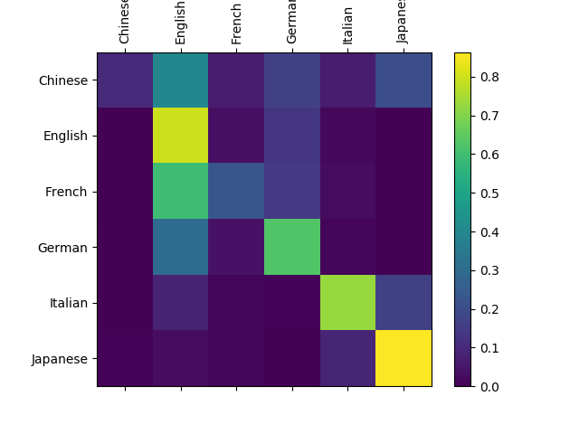

<!--Copyright © Microsoft Corporation. All rights reserved.
  适用于[License](https://github.com/Microsoft/ai-edu/blob/master/LICENSE.md)版权许可-->

## 19.4 深度循环神经网络

前面的几个例子中，单独看每一时刻的网络结构，其实都是由“输入层->隐层->输出层”所组成的，这与我们在DNN中学到的单隐层的知识一样，由于输入层不算做网络的一层，输出层是必须具备的，所以网络只有一个隐层。我们知道单隐层的能力是有限的，所以人们会在DNN中使用更深（更多隐层）的网络来解决复杂的问题。

在RNN中，会有同样的需求，要求每一时刻的网络是由多个隐层组成。比如下图为两个隐层的循环神经网络，用于解决和19.3节中的同样的问题：


图一：

注意图一中最左侧的两个隐藏状态s1和s2是同时展开为右侧的图的，
这样的循环神经网络称为深度循环神经网络，它可以具备比单隐层的“简单”循环神经网络更强大的能力。


正向计算


对第一个时间步：
$$
h_1 = x \cdot U \tag{1}
$$
$$
s_1 = tanh(h_1) \tag{2}
$$
$$
h_2 = s_1 \cdot Q \tag{3}
$$
$$
s_2 = tanh(h_2) \tag{4}
$$

对后面的时间步：
$$
h_1 = x \cdot U + s_{1<t-1>} \cdot W_1 \tag{5}
$$

$$
h_2 = s_1 \cdot Q + s_{2<t-1>} \cdot W_2 \tag{6}
$$

对于最后一个时间步：
$$
z = s_2 \cdot V \tag{7}
$$
$$
a = Softmax(z) \tag{8}
$$
$$
J = loss_{\tau} = -y \odot \ln a \tag{9}
$$

注意并不是所有的循环神经网络都只在最后一个时间步有监督学习信号，而是我们这个问题只需要这样。在19.2节中的例子就是需要在每一个时间步都要有输出并计算损失函数值的。

反向传播

反向传播部分和前面章节的内容大致相似，我们只把几个关键步骤直接列出来，不做具体推导：

对于所有时间步：

$$
\frac{\partial J}{\partial Q}=s_1^T \cdot dh_2 \rightarrow dQ \tag{10}
$$

$$
\frac{\partial J}{\partial U}=x^T \cdot dh_1 \rightarrow dU \tag{11}
$$

对于最后一个时间步：
$$
\frac{\partial J}{\partial z} = a-y \rightarrow dz \tag{12}
$$

$$
\frac{\partial J}{\partial h_2} = (dz \cdot V^T) \odot \sigma'(s_2) \rightarrow dh_2 \tag{13}
$$

$$
\frac{\partial J}{\partial V}=s_2 \cdot dz \rightarrow dV \tag{14}
$$

$$
\frac{\partial J}{\partial h_1} = (dh_2 \cdot Q^T) \odot \sigma'(s_1) \rightarrow dh_1 \tag{15}
$$

对于其他时间步：

$$
dz = 0 \tag{16}
$$

$$
\frac{\partial J}{\partial h_2} = (dh_{2<t+1>} \cdot W_2^T) \odot \sigma'(s_2) \rightarrow dh_2 \tag{17}
$$

$$
dV = 0 \tag{18}
$$

$$
\frac{\partial J}{\partial h_1} = (dh_{1<t+1>} \cdot W_1^T) \odot \sigma'(s_1) \rightarrow dh_1 \tag{19}
$$

对于第一个时间步：

$$
dW_1 = 0, dW_2 = 0 \tag{20}
$$

对于其他时间步：

$$
\frac{\partial J}{\partial W_1}=s^T_{1<t-1>} \cdot dh_1 \rightarrow dW_1 \tag{21}
$$

$$
\frac{\partial J}{\partial W_2}=s^T_{2<t-1>} \cdot dh_2 \rightarrow dW_2 \tag{22}
$$





参数量计算

对于19.3节中的单层RNN，参数配置如下：

|参数|尺寸|数量|
|---|---|---|
|U|26x8|208|
|V|8x6|48|
|W|8x8|64|
|Total||320|

对于两层的RNN来说，参数配置如下：

|参数|尺寸|数量|
|---|---|---|
|U|26x6|156|
|Q|6x6|36|
|V|6x6|36|
|W1|6x6|36|
|W2|6x6|36|
|Total||300|

通过上面两张表的比较，可以看出，单层RNN的参数总量为320个，双层RNN（代表了深度RNN）的参数总量为156个，只有前者的一半，但是可以达到同样的效果，甚至更好的效果。


```
...
198:219099:0.0005 loss=0.914243, acc=0.633000
199:220200:0.0005 loss=0.906956, acc=0.637000
save last parameters...
correctness=6295/8759=0.7186893480990981
```


### 代码位置

ch19, Level4
