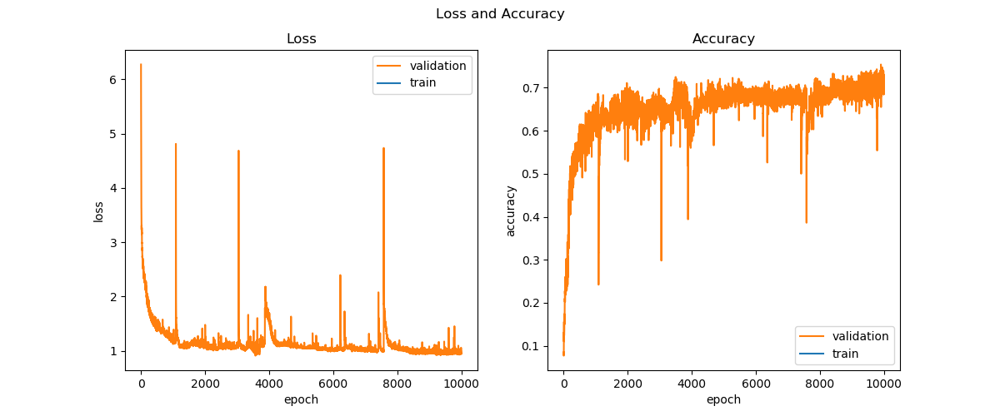
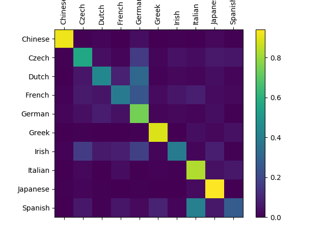

<!--Copyright © Microsoft Corporation. All rights reserved.
  适用于[License](https://github.com/Microsoft/ai-edu/blob/master/LICENSE.md)版权许可-->

## 19.5 双向循环神经网络


图一：双向循环神经网络结构图

对于图一中的t2来说，其前向计算公式如下：

$$
h1 = x \cdot U1 + s1_{t-1} \cdot W1 \tag{1}
$$

$$
s1 = \sigma(h1) \tag{2}
$$

$$
h2 = x \cdot U2 + s2_{t+1} \cdot W2 \tag{3}
$$

$$
s2 = \sigma(h2) \tag{4}
$$

$$
z = s1 \cdot V1 + s2 \cdot V2 \tag{5}
$$

$$
a = Softmax(z) \tag{6}
$$

反向传播


$$
\frac{\partial loss}{\partial z}=a-y \rightarrow dz
$$

对于最后一个时间步：

$$
\frac{\partial loss}{\partial h1}=\frac{\partial loss}{\partial z}\frac{\partial z}{\partial s1}\frac{\partial s1}{\partial h1}=dz\cdot V1^T \odot \sigma'(s1) \rightarrow dh1
$$

对于前面的时间步：

$$
\begin{aligned}
\frac{\partial Loss}{\partial h1_t} &= \frac{\partial loss_t}{\partial z_t}\frac{\partial z_t}{\partial s1_t}\frac{\partial s1_t}{\partial h1_t} + \frac{\partial loss_{t+1}}{\partial z_{t+1}}\frac{\partial z_{t+1}}{\partial s1_{t+1}}\frac{\partial s1_{t+1}}{\partial h1_{t+1}}\frac{\partial h1_{t+1}}{\partial s1_{t}}\frac{\partial s1_t}{\partial h1_t}
\\
&=dz_t \cdot V1^T \odot \sigma'(s1_t) + \frac{\partial loss_{t+1}}{\partial h1_{t+1}} \cdot W1^T \odot \sigma'(s1_t)
\\
&=(dz_t \cdot V1^T + dh1_{t+1} \cdot W1^T) \odot \sigma'(s1_t)
\end{aligned}
$$

对于第一个时间步：

$$
\frac{\partial loss}{\partial h2}=\frac{\partial loss}{\partial z}\frac{\partial z}{\partial s2}\frac{\partial s2}{\partial h2}=dz\cdot (V2)^T \odot \sigma'(s2) \rightarrow dh2
$$

对于后面的时间步：

$$
\begin{aligned}
\frac{\partial Loss}{\partial h2_t} &= \frac{\partial loss_t}{\partial z_t}\frac{\partial z_t}{\partial s2_t}\frac{\partial s2_t}{\partial h2_t} + \frac{\partial loss_{t-1}}{\partial z_{t-1}}\frac{\partial z_{t-1}}{\partial s2_{t-1}}\frac{\partial s2_{t-1}}{\partial h2_{t-1}}\frac{\partial h2_{t-1}}{\partial s2_{t}}\frac{\partial s2_t}{\partial h2_t}
\\
&=dz_t \cdot V2^T \odot \sigma'(s2_t) + \frac{\partial loss_{t-1}}{\partial h2_{t-1}} \cdot W2^T \odot \sigma'(s2_t)
\\
&=(dz_t \cdot V2^T + dh2_{t-1} \cdot W2^T) \odot \sigma'(s2_t)
\end{aligned}
$$


$$
\frac{\partial loss}{\partial V1} = \frac{\partial loss}{\partial z}\frac{\partial z}{\partial V1}= s1^T \cdot dz \rightarrow dV1
$$

$$
\frac{\partial loss}{\partial V2} = \frac{\partial loss}{\partial z}\frac{\partial z}{\partial V2}= s2^T \cdot dz \rightarrow dV2
$$

$$
\frac{\partial loss}{\partial U1} = \frac{\partial loss}{\partial h1}\frac{\partial h1}{\partial U1}= x^T \cdot dh1 \rightarrow dU1
$$

$$
\frac{\partial loss}{\partial U2} = \frac{\partial loss}{\partial h2}\frac{\partial h2}{\partial U2}= x^T \cdot dh2 \rightarrow dU2
$$

对于第一个时间步：

$$
dW1 = 0
$$

$$
\frac{\partial loss}{\partial W1} = \frac{\partial loss}{\partial h1}\frac{\partial h1}{\partial W1}= s1_{t-1}^T \cdot dh1 \rightarrow dW1
$$

$$
\frac{\partial loss}{\partial W2} = \frac{\partial loss}{\partial h2}\frac{\partial h2}{\partial W2}= s2_{t+1}^T \cdot dh2 \rightarrow dW2
$$

对于最后一个时间步：

$$
dW2 = 0
$$





```
......
9998:11058894:0.001 loss=0.969669, acc=0.685000
9999:11060000:0.001 loss=0.946195, acc=0.702000
save last parameters...
correctness=3114/4400=0.7077272727272728
```