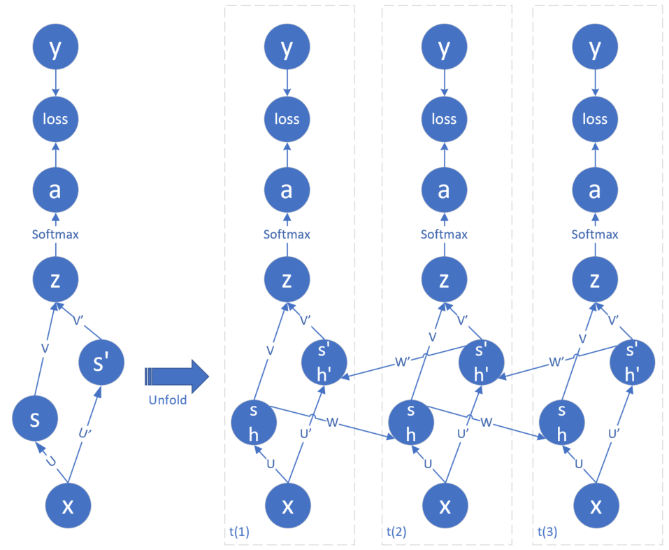

<!--Copyright © Microsoft Corporation. All rights reserved.
  适用于[License](https://github.com/Microsoft/ai-edu/blob/master/LICENSE.md)版权许可-->

## 19.7 双向循环神经网络

### 19.7.1 深度循环神经网络的结构图

前面学习的内容，都是因为“过去”的时间步的状态对“未来”的时间步的状态有影响，才产生了不同种类的循环神经网络结构，在本节中，我们将学习一种双向影响的结构，即双向循环神经网络。

比如在一个语音识别的模型中，可能前面的一个词听上去比较模糊，会产生多个猜测，但是后面的词都很清晰，于是可以用后面的词来为前面的词提供一个最有把握（概率最大）的猜测。



图19-25 双向循环神经网络结构图

在图中，用h1、s1表示正向计算的状态，h2、s2表示反向计算的状态。而U、W参数矩阵也有就对应的变化，从1个变成了1对，所有的U1共享相同的参数，以此类推。s1和s2会进行向量（矩阵）拼接生成s，与V相乘后生成z。V还保持一个参数矩阵。

另外请注意，图19-25仍然是一个有向无环图，仔细沿着每一个箭头搜索，会发现并不会产生首尾相连的封闭状态，这里的“封闭”与循环神经网络中的“循环”的含义不同。

所以在本节中会出现两组相似的词：前向、反向、正向、逆向。区别如下：

- 前向：是指神经网络中通常所说的前向计算。
- 反向：是指神经网络中通常所说的反向传播。
- 正向：是指双向循环神经网络中的从左到右时间步。在正向过程中，会存在前向计算和反向传播。
- 逆向：是指双向循环神经网络中的从右到左时间步。在逆向过程中，也会存在前向计算和反向传播。

### 19.7.2 前向计算

我们先假设应用场景只需要在最后一个时间步有输出（比如19.4节和19.5节中的应用就是如此），所以t2所代表的所有中间步都没有a、loss、y三个节点（用空心的圆表示），只有最后一个时间步有输出。

与前面的单向循环网络不同的是，由于有逆向网络的存在，在逆向过程中，t3是第一个时间步，t1是最后一个时间步，所以t1也应该有输出。

#### 公式推导

$$
h1 = x \cdot U1 + s1_{t-1} \cdot W1 \tag{1}
$$

注意公式1在t1时，$s1_{t-1}$是空，所以加法的第二项不存在。

$$
s1 = Tanh(h1) \tag{2}
$$

$$
h2 = x \cdot U2 + s2_{t+1} \cdot W2 \tag{3}
$$

注意公式3在t3时，$s2_{t+1}$是空，所以加法的第二项不存在。

$$
s2 = Tanh(h2) \tag{4}
$$

$$
s = s1 \oplus s2 \tag{5}
$$

公式5有几种实现方式，比如sum（矩阵求和）、concat（矩阵拼接）、mul（矩阵相乘）、ave（矩阵平均），我们在这里使用矩阵求和，这样在反向传播时的公式比较容易推导。

$$
z = s \cdot V \tag{6}
$$

$$
a = Softmax(z) \tag{7}
$$

公式6只对t1、t3有效，对于所有其他中间的时间步来说，不需要计算。

#### 代码实现

由于是双向的，所以在主过程中，存在一正一反两个计算链。

```Python
class timestep(object):
    def forward_f2e(self, x, U1, U2, V1, V2, W1, W2, prev_s1, isFirst):
        ......

    def forward_e2f(self, next_s2, isFirst, isLast):
        ......
```

正向的前向计算函数叫做forward_f2e，意为front to end，即从前向后的方向；逆向的前向计算函数叫做forward_e2f，意为end to front，即从后向前的方向。

注意对输出部分的计算，即节点z和a，只有在第一个和最后一个节点才发生（本应用场景的需要），而且只能在forward_e2f函数里才能出现，因为此时s1和s2的值都计算好了，而在forward_f2e函数中，s2的值并没有计算好。

### 19.7.3 反向传播

#### 正向计算链的反向传播

先推导正向计算链的反向传播公式，即关于h1、s1节点的计算。

对于最后一个时间步（t3）：

$$
\frac{\partial loss_\tau}{\partial z_\tau}=a_\tau-y_\tau \rightarrow dz_\tau \tag{8}
$$

对于其它时间步来说$dz_t=0$，因为不需要输出。

因为$s=s1 \oplus s2$，所以$\frac{\partial s}{\partial s1}=1$，代入下面的公式中：

$$
\frac{\partial loss_\tau}{\partial h1_\tau}=\frac{\partial loss_\tau}{\partial z_\tau}\frac{\partial z_\tau}{\partial s_\tau}\frac{\partial s_\tau}{\partial s1_\tau}\frac{\partial s1_\tau}{\partial h1_\tau}=dz_\tau \cdot V^T \odot \sigma'(s1_\tau) \rightarrow dh1_\tau \tag{9}
$$

其中，下标$\tau$表示最后一个时间步，$\sigma'(s1)$表示激活函数的导数，$s1$是激活函数的数值。下同。

比较公式9和19.3节通用循环神经网络模型中的公式9，形式上是完全相同的，原因是$\frac{\partial s}{\partial s1}=1$，并没有给我们带来任何额外的计算，所以关于其他时间步的推导也应该相同。

对于中间的所有时间步，除了本时间步的$loss_t$回传误差外，后一个时间步的$h1_t$也会回传误差：

$$
\begin{aligned}
\frac{\partial J}{\partial h1_t} &= \frac{\partial loss_t}{\partial z_t}\frac{\partial z_t}{\partial s_t}\frac{\partial s_t}{\partial s1_t}\frac{\partial s1_t}{\partial h1_t} + \frac{\partial loss_{t+1}}{\partial h1_{t+1}}\frac{\partial h1_{t+1}}{\partial s1_{t}}\frac{\partial s1_t}{\partial h1_t}
\\
&=dz_t \cdot V^T \odot \sigma'(s1_t) + \frac{\partial loss_{t+1}}{\partial h1_{t+1}} \cdot W1^T \odot \sigma'(s1_t)
\\
&=(dz_t \cdot V^T + dh1_{t+1} \cdot W1^T) \odot \sigma'(s1_t) \rightarrow dh1_t
\end{aligned} \tag{10}
$$

公式10中的$dh1_{t+1}$，就是上一步中计算得到的$dh1_t$，如果追溯到最开始，即公式9中的$dh1_\tau$。因此，先有最后一个时间步的$dh1_\tau$，然后依次向前推，就可以得到所有时间步的$dh1_t$。

对于$V$来说，只有当前时间步的损失函数会给它反向传播的误差，与别的时间步没有关系，所以有：

$$
\frac{\partial loss_t}{\partial V_t} = \frac{\partial loss_t}{\partial z_t}\frac{\partial z_t}{\partial V_t}= s_t^T \cdot dz_t \rightarrow dV_t \tag{11}
$$

对于$U1$，后面的时间步都会给它反向传播误差，但是我们只从$h1$节点考虑：

$$
\frac{\partial J}{\partial U1_t} = \frac{\partial J}{\partial h1_t}\frac{\partial h1_t}{\partial U1_t}= x^T_t \cdot dh1_t \rightarrow dU1_t \tag{12}
$$

对于$W1$，和$U1$的考虑是一样的，只从当前时间步的$h1$节点考虑：

$$
\frac{\partial J}{\partial W1_t} = \frac{\partial J}{\partial h1_t}\frac{\partial h1_t}{\partial W1_t}= s1_{t-1}^T \cdot dh1_t \rightarrow dW1_t \tag{13}
$$

对于第一个时间步，$s1_{t-1}$不存在，所以没有$dW1$：

$$
dW1 = 0 \tag{14}
$$

#### 逆向计算链的反向传播

逆向计算链的反向传播是从第1个时间步开始的：

$$
\frac{\partial loss_1}{\partial z_1}=a_1-y_1 \rightarrow dz_1 \tag{15}
$$

对于其它时间步来说$dz_t=0$，因为不需要输出。

下面推导反向计算链的反向传播公式，即关于h2、s2节点的计算。

对于第一个时间步，同样有$\frac{\partial s}{\partial s2}=1$：

$$
\frac{\partial loss_1}{\partial h2_1}=\frac{\partial loss_1}{\partial z_1}\frac{\partial z_1}{\partial s_1}\frac{\partial s_1}{\partial s2_1}\frac{\partial s2_1}{\partial h2_1}
=dz_1 \cdot V^T \odot \sigma'(s2_1) \rightarrow dh2_1
\tag{16}
$$

对于中间的所有时间步，除了本时间步的$loss_t$回传误差外，还有前一个时间步的$h2$节点回传的误差：

$$
\begin{aligned}
\frac{\partial J}{\partial h2_t} &= \frac{\partial loss_t}{\partial z_t}\frac{\partial z_t}{\partial s_t}\frac{\partial s_t}{\partial s2_t}\frac{\partial s2_t}{\partial h2_t} + \frac{\partial J}{\partial h2_{t-1}}\frac{\partial h2_{t-1}}{\partial s2_{t}}\frac{\partial s2_t}{\partial h2_t}
\\
&=dz_t \cdot V^T \odot \sigma'(s2_t) + \frac{\partial J}{\partial h2_{t-1}} \cdot W2^T \odot \sigma'(s2_t)
\\
&=(dz_t \cdot V^T + dh2_{t-1} \cdot W2^T) \odot \sigma'(s2_t) \rightarrow dh2_t
\end{aligned} 
\tag{17}
$$

$$
\frac{\partial J}{\partial U2_t} = \frac{\partial J}{\partial h2_t}\frac{\partial h2_t}{\partial U2_t}= x^T_t \cdot dh2_t \rightarrow dU2_t
\tag{18}
$$

$$
\frac{\partial J}{\partial W2_t} = \frac{\partial J}{\partial h2_t}\frac{\partial h2_t}{\partial W2_t}= s2_{t+1}^T \cdot dh2_t \rightarrow dW2_t
\tag{19}
$$

对于最后一个时间步：

$$
dW2 = 0 \tag{20}
$$

### 19.7.4 代码实现

由于没找到合适的例子，所以只实现了网络基础部分的代码，并没有带入应用实例。所以请读者自行到代码库中阅读学习。

### 代码位置

ch19, Level7
