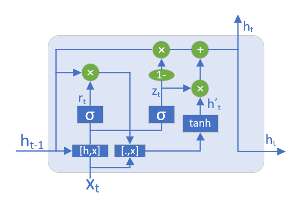

<!--Copyright © Microsoft Corporation. All rights reserved.
  适用于[License](https://github.com/Microsoft/ai-edu/blob/master/LICENSE.md)版权许可-->

## 20.3 GRU基本原理

### 20.3.1 GRU 的基本概念

LSTM 存在很多变体，其中门控循环单元（Gated Recurrent Unit, GRU）是最常见的一种，也是目前比较流行的一种。GRU是由 [Cho](https://arxiv.org/pdf/1406.1078v3.pdf) 等人在2014年提出的，它对LSTM做了一些简化：

1. GRU将LSTM原来的三个门简化成为两个：重置门 $r_t$（Reset Gate）和更新门 $z_t$ (Update Gate)。
2. GRU不保留单元状态 $c_t$，只保留隐藏状态 $h_t$作为单元输出，这样就和传统RNN的结构保持一致。
3. 重置门直接作用于前一时刻的隐藏状态 $h_{t-1}$。

### 20.3.2 GRU的前向计算

#### GRU的单元结构

图20-7展示了GRU的单元结构。

图20-7 GRU单元结构图

GRU单元的前向计算公式如下：

1. 更新门

   $$
   z_t = \sigma(h_{t-1} \cdot W_z + x_t \cdot U_z)
   \tag{1}
   $$

2. 重置门

   $$
   r_t = \sigma(h_{t-1} \cdot W_r + x_t \cdot U_r)
   \tag{2}
   $$

3. 候选隐藏状态

   $$
   \tilde{h}_t = \tanh((r_t \circ h_{t-1}) \cdot W_h + x_t \cdot U_h)
   \tag{3}
   $$

4. 隐藏状态

   $$
   h = (1 - z_t) \circ h_{t-1} + z_t \circ \tilde{h}_t
   \tag{4}
   $$

#### GRU的原理浅析

从上面的公式可以看出，GRU通过更新们和重置门控制长期状态的遗忘和保留，以及当前输入信息的选择。更新门和重置门通过$sigmoid$函数，将输入信息映射到$[0,1]$区间，实现门控功能。

首先，上一时刻的状态$h_{t-1}$通过重置门，加上当前时刻输入信息，共同构成当前时刻的即时状态$\tilde{h}_t$，并通过$\tanh$函数映射到$[-1,1]$区间。

然后，通过更新门实现遗忘和记忆两个部分。从隐藏状态的公式可以看出，通过$z_t$进行选择性的遗忘和记忆。$(1-z_t)$和$z_t$有联动关系，上一时刻信息遗忘的越多，当前信息记住的就越多，实现了LSTM中$f_t$和$i_t$的功能。

### 20.3.3 GRU的反向传播

学习了LSTM的反向传播的推导，GRU的推导就相对简单了。我们仍然以$l$层$t$时刻的GRU单元为例，推导反向传播过程。

同LSTM， 令：$l$层$t$时刻传入误差为$\delta_{t}^l$，为下一时刻传入误差$\delta_{h_t}^l$和上一层传入误差$\delta_{x_t}^{l+1}$之和，简写为$\delta_{t}$。

令：

$$
z_{zt} = h_{t-1} \cdot W_z + x_t \cdot U_z
\tag{5}
$$

$$
z_{rt} = h_{t-1} \cdot W_r + x_t \cdot U_r
\tag{6}
$$

$$
z_{\tilde{h}_t} = (r_t \circ h_{t-1}) \cdot W_h + x_t \cdot U_h
\tag{7}
$$

则：

$$
\begin{aligned}
    \delta_{z_{zt}} &= \frac{\partial{loss}}{\partial{h_t}} \cdot \frac{\partial{h_t}}{\partial{z_t}} \cdot \frac{\partial{z_t}}{\partial{z_{z_t}}} \\
    &= \delta_t \cdot (-diag[h_{t-1}] + diag[\tilde{h}_t]) \cdot diag[z_t \circ (1-z_t)] \\
    &= \delta_t \circ (\tilde{h}_t - h_{t-1}) \circ z_t \circ (1-z_t)
\end{aligned}
\tag{8}
$$

$$
\begin{aligned}
    \delta_{z_{\tilde{h}t}} &= \frac{\partial{loss}}{\partial{h_t}} \cdot \frac{\partial{h_t}}{\partial{\tilde{h}_t}} \cdot \frac{\partial{\tilde{h}_t}}{\partial{z_{\tilde{h}_t}}} \\
    &= \delta_t \cdot diag[z_t] \cdot diag[1-(\tilde{h}_t)^2] \\
    &= \delta_t \circ z_t \circ (1-(\tilde{h}_t)^2)
\end{aligned}
\tag{9}
$$

$$
\begin{aligned}
    \delta_{z_{rt}} &= \frac{\partial{loss}}{\partial{\tilde{h}_t}} \cdot \frac{\partial{\tilde{h}_t}}{\partial{z_{\tilde{h}_t}}} \cdot \frac{\partial{z_{\tilde{h}_t}}}{\partial{r_t}} \cdot \frac{\partial{r_t}}{\partial{z_{r_t}}} \\
    &= \delta_{z_{\tilde{h}t}} \cdot W_h^T \cdot diag[h_{t-1}] \cdot diag[r_t \circ (1-r_t)] \\
    &= \delta_{z_{\tilde{h}t}} \cdot W_h^T \circ h_{t-1} \circ r_t \circ (1-r_t)
\end{aligned}
\tag{10}
$$

由此可求出，$t$时刻各个可学习参数的误差：

$$
\begin{aligned}
    d_{W_{h,t}} = \frac{\partial{loss}}{\partial{z_{\tilde{h}_t}}} \cdot \frac{\partial{z_{\tilde{h}_t}}}{\partial{W_h}} = (r_t \circ h_{t-1})^T \cdot \delta_{z_{\tilde{h}t}}
\end{aligned}
\tag{11}
$$

$$
\begin{aligned}
    d_{U_{h,t}} = \frac{\partial{loss}}{\partial{z_{\tilde{h}_t}}} \cdot \frac{\partial{z_{\tilde{h}_t}}}{\partial{U_h}} = x_t^T \cdot \delta_{z_{\tilde{h}t}}
\end{aligned}
\tag{12}
$$

$$
\begin{aligned}
    d_{W_{r,t}} = \frac{\partial{loss}}{\partial{z_{r_t}}} \cdot \frac{\partial{z_{r_t}}}{\partial{W_r}} = h_{t-1}^T \cdot \delta_{z_{rt}}
\end{aligned}
\tag{13}
$$

$$
\begin{aligned}
    d_{U_{r,t}} = \frac{\partial{loss}}{\partial{z_{r_t}}} \cdot \frac{\partial{z_{r_t}}}{\partial{U_r}} = x_t^T \cdot \delta_{z_{rt}}
\end{aligned}
\tag{14}
$$

$$
\begin{aligned}
    d_{W_{z,t}} = \frac{\partial{loss}}{\partial{z_{z_t}}} \cdot \frac{\partial{z_{z_t}}}{\partial{W_z}} = h_{t-1}^T \cdot \delta_{z_{zt}}
\end{aligned}
\tag{15}
$$

$$
\begin{aligned}
    d_{U_{z,t}} = \frac{\partial{loss}}{\partial{z_{z_t}}} \cdot \frac{\partial{z_{z_t}}}{\partial{U_z}} = x_t^T \cdot \delta_{z_{zt}}
\end{aligned}
\tag{16}
$$

可学习参数的最终误差为各个时刻误差之和，即：

$$
d_{W_h} = \sum_{t=1}^{\tau} d_{W_{h,t}} = \sum_{t=1}^{\tau} (r_t \circ h_{t-1})^T \cdot \delta_{z_{\tilde{h}t}}
\tag{17}
$$

$$
d_{U_h} = \sum_{t=1}^{\tau} d_{U_{h,t}} = \sum_{t=1}^{\tau} x_t^T \cdot \delta_{z_{\tilde{h}t}}
\tag{18}
$$

$$
d_{W_r} = \sum_{t=1}^{\tau} d_{W_{r,t}} = \sum_{t=1}^{\tau} h_{t-1}^T \cdot \delta_{z_{rt}}
\tag{19}
$$

$$
d_{U_r} = \sum_{t=1}^{\tau} d_{U_{r,t}} = \sum_{t=1}^{\tau} x_t^T \cdot \delta_{z_{rt}}
\tag{20}
$$

$$
d_{W_z} = \sum_{t=1}^{\tau} d_{W_{z,t}} = \sum_{t=1}^{\tau} h_{t-1}^T \cdot \delta_{z_{zt}}
\tag{21}
$$

$$
d_{U_z} = \sum_{t=1}^{\tau} d_{U_{z,t}} = \sum_{t=1}^{\tau} x_t^T \cdot \delta_{z_{zt}}
\tag{22}
$$

当前GRU cell分别向前一时刻（$t-1$）和下一层（$l-1$）传递误差，公式如下：

沿时间向前传递：

$$
\begin{aligned}
\delta_{h_{t-1}} = \frac{\partial{loss}}{\partial{h_{t-1}}} &= \frac{\partial{loss}}{\partial{h_t}} \cdot \frac{\partial{h_t}}{\partial{h_{t-1}}} + \frac{\partial{loss}}{\partial{z_{\tilde{h}_t}}} \cdot \frac{\partial{z_{\tilde{h}_t}}}{\partial{h_{t-1}}} \\
&+ \frac{\partial{loss}}{\partial{z_{rt}}} \cdot \frac{\partial{z_{rt}}}{\partial{h_{t-1}}} + \frac{\partial{loss}}{\partial{z_{zt}}} \cdot \frac{\partial{z_{zt}}}{\partial{h_{t-1}}} \\
&= \delta_{t} \circ (1-z_t) + \delta_{z_{\tilde{h}t}} \cdot W_h^T \circ r_t \\
&+ \delta_{z_{rt}} \cdot W_r^T + \delta_{z_{zt}} \cdot W_z^T
\end{aligned}
\tag{23}
$$

沿层次向下传递：

$$
\begin{aligned}
\delta_{x_t} &= \frac{\partial{loss}}{\partial{x_t}} = \frac{\partial{loss}}{\partial{z_{\tilde{h}_t}}} \cdot \frac{\partial{z_{\tilde{h}_t}}}{\partial{x_t}} \\
&+ \frac{\partial{loss}}{\partial{z_{r_t}}} \cdot \frac{\partial{z_{r_t}}}{\partial{x_t}} + \frac{\partial{loss}}{\partial{z_{z_t}}} \cdot \frac{\partial{z_{z_t}}}{\partial{x_t}} \\
&= \delta_{z_{\tilde{h}t}} \cdot U_h^T + \delta_{z_{rt}} \cdot U_r^T + \delta_{z_{zt}} \cdot U_z^T
\end{aligned}
\tag{24}
$$

以上，GRU反向传播公式推导完毕。

### 20.3.4 代码实现

本节进行了GRU网络单元前向计算和反向传播的实现，没有引入实例。具体可参照代码库中内容。

### 代码位置

ch20, Level2

### 思考和练习

1. 仿照LSTM的实现方式，自己实现GRU单元的前向计算和反向传播。
2. 仿照LSTM的实例，使用GRU进行训练，并比较效果。