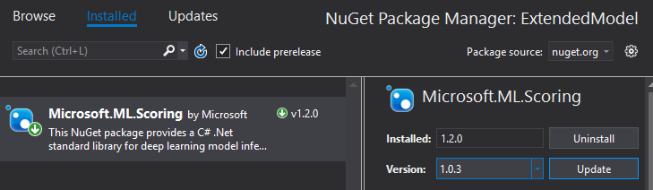

Copyright © Microsoft Corporation. All rights reserved.
  适用于[License](https://github.com/Microsoft/ai-edu/blob/master/LICENSE.md)版权许可
  
  扩展手写数字识别应用
===
识别并计算简单手写数学表达式
---

# 主要知识点
- 了解MNIST数据集
- 了解如何扩展数据集
- 实现手写算式计算器

# 简介
本文将介绍一例支持识别手写数学表达式并对其进行计算的人工智能应用的开发案例。本文的应用是基于前文“手写数字识别应用”中的基础应用进行扩展实现的。本文将通过这一案例，展示基本的数据整理和扩展人工智能模型的过程，以及介绍如何利用手写输入的特性来简化字符分割的过程。并且本文将演示如何利用Visual Studio Tools for AI进行批量推理，以便利用底层人工智能框架的并行计算，实现推理加速。此外，本文还将对该应用的主要代码逻辑进行分析、讲解，并介绍现实场景中识别手写数学表达式的一些潜在问题。
 
# 背景
在手写数字识别课程中，我们介绍了能识别单个手写字母、基于MNIST数据集的人工智能应用，并且在我们的几次试验中，该应用表现良好，能比较准确地将手写的数字图形识别成对应的数字。那么，该应用能不能识别更多种类的手写字符，甚至是同时的出现多个字符呢？这样的情形有很多，比如生活中常见的数学表达式（形如`1+2x3`）。这样的复合情形更为常见，也更具现实意义。相比之下，如果一次识别仅能一个手写数字，应用就会有比较大的局限性。

首先，我们可以尝试一下多个字符同时出现这类情形中最基本的特例，即一次出现两个数字的情况。请启动手写数字识别课程中构建的应用，并在现有的应用里一次写下两个数字，看看识别效果（为了更方便书写及展示效果，我们将前一课程示例中笔画的宽度由40调整为20。可以体验出这一改动对单个数字的识别并无大的影响）：


上图是一次试验的结果。进行多次试验，我们看到现有应用对两个数字的识别效果不尽人意。

如上图所示，应用窗口右上角展示的结果准确地反应了模型对我们手写输入的推理结果（即`result.First().First().ToString()`），然而这一结果并不像期望的那样，是我们在左侧绘图区写下的“42”。

其实对这个现象的解释已经蕴含在我们之前的课程中了。在手写数字识别课程的模型介绍章节中，我们对用于训练模型的MNIST数据集做了大致的介绍。归根结底，上述现象的症结在于：作为我们人工智能应用核心的模型，本身并不具备识别多个数字的能力——作为模型的源头，也即是训练数据的MNIST数据集只覆盖了单个的手写数字。并且，在应用的输入处理部分，我们并未对笔迹图形作额外的处理。

这两点的综合结果就是，在写下多个数字的情况下，我们实际上在“强行”让AI模型做超出其适应性范围的推理。这属于AI模型的误用。其结果自然难以令人满意。

那么，为了增强应用的可用性，我们能不能改善这款应用，让其能处理常见的数学表达式呢？这要求我们的应用既能识别数字和符号，又能识别同时出现的多个字符：首先对于多个数字这种情况，我们很自然地想到，既然MNIST模型已经能很好地识别单个数字，那我们只需要把多个数字分开，一个一个地让MNIST模型进行识别就好了；对于识别其他数学符号，我们可以尝试通过扩展MNIST模型的识别范围，也即扩展MNIST数据集来实现。两者合二为一，就是一种非常可行的解决方案。这样，我们就引入了两个新的子问题，即“扩充MNIST数据集”和“多个手写字符的分割”。

结合上文陈述的问题和潜在的解决方案，本文将以“识别并计算简单的数学表达式”这一问题为导向，对现有的手写数字识别应用进行扩展。

我们的目标是对克服现存的只能对单个数字进行识别这一局限，让新应用可以识别数字、加减乘除和括号这些能构成简单数学表达式的元素，并对识别出的数学表达式进行计算。本文希望通过这些，能最终获得一款更具现实意义的人工智能应用。

最终的应用效果如下图：


> **注意**
>
> “识别可能出现的多种字符”和“识别同时出现的多个字符”是完全不同的，请注意区别。

 
# 子问题：扩展MNIST数据集

## 准备数据

### 数据格式

为了让我们的新模型能支持除了数字以外的字符，一个简单的做法是扩展MNIST数据集并尝试复用已有的模型训练算法（卷积神经网络）。在手写数字识别课程的数据预处理章节中，我们部分了解了MNIST数据集所采用的数据格式和规范。为了尽可能地复用已有的资源，我们有必要让扩展的那部分数据贴近原始的MNIST数据。

Samples-for-ai样例库中使用的MNIST示例，在初运行时会从<http://yann.lecun.com/exdb/mnist/>下载MNIST数据集并作为训练数据。当我们顺利运行mnist.py脚本并完成训练后，我们可以在`samples-for-ai\examples\tensorflow\MNIST\input`目录中看到四个扩展名为`.gz`的文件，这四个文件就是从网上下载下来的MNIST数据集，即手写数字的位图和标记。不过这些文件是经过压缩的数据，我们使用的训练程序在下载完成后还会对这些压缩文件进行解压。训练程序只将解压后的数据储存在内存中，并没有回写到硬盘上，所以我们在input目录下找不到储存了原始位图数据的文件。 

> *小提示*
>
> 我们仍可以使用支持这种压缩格式的工具将其解压。并使用二进制工具查看其内容。

从<http://yann.lecun.com/exdb/mnist/>页面上，我们可以了解到MNIST数据集的位图文件和标签文件的文件格式。其中最主要的，是用于训练的位图都是`28x28`尺寸的、单通道的灰度图，前景色（笔画）对应值为255，背景色对应值0。一般作为像素值考虑时，255是白色，而0是黑色。从上一课中我们已经了解到，MNIST数据集是取反保存位图像素的，如果将其直接显示为位图，则和我们在界面上所见的白底黑字相反。

> **注意**
>
> <http://yann.lecun.com/exdb/mnist/>页面提到`0 means background (white), 255 means foreground (black)`，其对颜色的解释和一般的色值解释相反。请注意厘清这两种颜色的解释方法。
>
> 但是无论视觉上的颜色是什么，我们真正要遵守的规则是将前景的值转换到255，背景的值转换到0（在输入模型时，分别表现为0.5和-0.5）。
 
结合页面上的描述和`mnist.py`中数据预处理部分的相关逻辑，我们了解到目前使用的卷积神经网络要求的最终的输入数据格式如下：

图像数据 | 标记数据
--- | ---
**四维数组** | **一维数组**
第一维大小为输入的图片总数； <br>第二维、第三维大小为输入位图的宽高，此处皆为28；<br>第四维大小为输入位图的颜色通道数，MNIST只使用灰度图片，故为1。  | 大小为输入的图片总数。
每个元素（在第四维）都是32位浮点数。取值大于等于-0.5，小于等于0.5。其中0.5表示前景像素的最大值，-0.5表示背景像素的最大值。 |  每个元素都是64位整数。取值0-9，分别代表对应的手写0-9的数字。

根据上述的输入格式，我们已经可以确定我们扩展训练数据的方向了。这里我们需要注意，这些格式是最终输入到卷积神经网络的数据必须满足的，而非我们即将搜集、准备的新数据。虽然这表明了我们新搜集的数据不一定要精确地满足这些条件，这些输入格式仍然对我们的数据搜集起到重要的指导作用。

下图是按照一般的像素值-视觉颜色对应关系，将MNIST中的数据、UI上绘制的数据、作为模型输入的数据三者可视化之后的示意图。图上还标记了**像素值**到输入数据格式中32位浮点数的映射方式（上方的橙色箭头），以便形象地展示这一转换过程（F表示 **F**oreground 即前景，B表示 **B**ackground 即背景）：


UI上绘制的数据的格式，同时也是我们下文中要准备的新数据的格式。之所以使用和MNIST内部数据相反的形式，是为了在界面和其他地方进行可视化展示时，更符合一般的书写习惯。之后我们可以在进行训练之前，再进行反色操作，如同我们上一课处理从界面上来的位图数据一样。

### 收集并格式化数据

搜集数据的方式多种多样。就本文的需要来说，我们可以在网络上搜索已有的数据集，可以自行开发小型应用以在触摸屏甚至手机上搜集手写图形，或者扫描手写文档并通过图像分割的方式提取运算符。并且，在搜集完原始数据之后，我们还可以通过缩放、扭曲、添加噪点等方式来扩展、增强我们的数据集，以获得更广泛的适应性。

在我们搜集足够多的新图片后（考虑到原始MNIST数据集共70000张图片，我们搜集40000张左右比较合适，虽然数量不是绝对的），我们还需要对其进行一定的格式化，以方便我们最终将其作为神经网络的输入。

位图部分所需的处理非常直观。我们可以参考前一篇手写数字识别课程中对应用图形界面上捕获的手写图形的处理方式，将搜集的图片（可能具有RGB通道）转换成**28x28像素的、单通道的灰度图片，并且前景色（即笔画）色值为0（黑色），背景色色值为255（白色）**。符合要求的位图样例如下：


 
此处更需要注意的是对图片标记的处理。在原始MNIST数据集中我们看到整数0-9被用来标记对应的图形，这是非常自然的做法。因为我们此处要解决的是多分类问题，解决这类问题的一个先决条件就是我们必须为每个分类提供一一对应的标记。我们很容易就想到用诸如10、11、12来标记加号、减号、乘号等图形类别。这是可行的。

此处我们不由得思考，延续已被占用的自然数取标记新类别，虽然可行，但让对应关系变得混乱了。10和加号、11和减号之间，并不像0-9的整数和图形之间有那么自然的联系。作为开发者的我们不禁想到，能否用ASCII表里加减乘除的字符对应的数值来做标记呢（如加号对应53，减号对应55）？这种标记的设定方法实际上是很难使用的，特别是本文中出现的MNIST训练程序基于的是TensorFlow框架，框架本身要求了标记占用的整数值必须小于类别总数。在保证标记和类别一一对应的前提条件下，我们接着已有0-9标记，再为我们新搜集的图形类别增加标记。此时我们需要清楚的定义标记到类别的对应关系，以便我们正确处理模型的输入和输出。

我们用10-15分别表示加号、减号、乘号、除号、正括号、反括号。并且，为了便于训练，我们要求这六种数学符号对应的位图，分别放置于`add、minus、mul、div、lp、rp`这六个文件夹中，并且这六个文件夹需要在同一个目录下。如下图所示：


## 训练模型

为了支持我们新增的六种数学符号，我们需要修改原始的MNIST模型训练脚本（即上一课中的`mnist.py`）。
 
这一仓库包含两部分内容：
- 在[`./tensorflow_model/`](./tensorflow_model/)路径下，是支持扩展的MNIST数据集的训练脚本`mnist_extension.py`。这一脚本要求额外的命令行参数`--extension_dir`，用于指定我们扩展的六种数学符号的位图所在；
- 在[`./extended_mnist_calculator/MNIST.App`](./extended_mnist_calculator/MNIST.App/)目录下，是本文这款应用的主体代码。我们会在下文中用到。
上文中，我们要求新搜集的数据最后需要被格式化为以色值0（黑色）为前景色，以色值255（白色）为前景色的单通道位图。我们修改后的训练脚本会读取这些位图并其反色，以到达和原始MNIST数据同样的效果（也和我们应用中输入处理的部分一致）。
假设我们存放`add、minus`等六个文件夹的目录是`D:\extension_images`，我们就可以在克隆好了的仓库的`/training`目录下，通过命令行执行：
```cmd
python mnist_extension.py --extension_dir D:\extension_images
```
 
来启动针对包含了六种数学符号的扩展数据集的训练。该训练脚本在导入原始MNIST数据之后，还会从`D:\extension_images`目录分别读取六种新类别的数据。再混合新旧数据之后进行训练。可能的训练结果如下图：


> *小提示*
>
> 混合新旧数据在这里非常有用。因为训练过程中，目前的脚本是一次仅将一部分数据用于迭代优化和模型参数更新。如果不进行混合，就会发生新数据迟迟不被利用的情况，影响模型的训练结果。
 
我们对MNIST模型的训练是基于卷积神经网络的。并且上本中的脚本在处理扩展的符号位图之外，并没有对用于训练原始MNIST模型的卷积神经网络的结构进行修改。我们知道系统的结构决定其功能，那么我们针对原始MNIST数据设计的网络结构能否支撑扩展后的数据集呢？对这一问题最简单的回答就是进行一次训练并观察模型性能。

用这种方法进行试验后，我们通过错误率（主要是Validation error，即每100次小批量训练之后，模型当前在整个验证集上的错误率；和Test error，即训练结束后模型在整个测试集上的错误率）发现新模型的性能还是不错的。足以支持我们接下来的应用。

# 子问题：分割多个手写字符

如上文所述，我们为了对多个同时出现的字符进行识别，还必须解决一个子问题，那就是要对这些同时出现的字符进行分割。

我们注意到本文介绍的应用有一个特点，那就是最终用作输入的图形，是用户当场写下的，而非通过图片文件导入的静态图片。也就是说，我们拥有笔画产生过程中的全部动态信息，比如笔画的先后顺序，笔画的重叠关系等等。而且我们期望这些笔画基本都是横向书写的。考虑到这些信息，我们可以设计一种基本的分割规则：在水平面上的投影相重叠的笔画，我们就认为它们同属于一个数字。

笔画和水平方向上投影的关系示意如下图：


 
因此书写时，就要求不同的数字之间尽量隔开。当然为了尽可能处理不经意的重叠，我们还可以为重叠部分相对每一笔画的位置设定一个阈值，如至少进入笔画一端的10%以内。

加入对重叠的容忍阈值后，对笔画的分割的结果可以参看下图。在分割后被认为是属于同一字符的笔画我们使用了相同的颜色绘制，并且用不同的颜色区分了不属于同一字符的笔画。在字符的上方，我们用一系列水平方向的半透明色块表现了每一笔画在水平方向上的的有效重叠区域和字符之间的重叠关系。


 
应用这样的规则后，我们就能简便而又有效地对多个笔画进行分割，并能利用Visual Studio Tools for AI提供的批量推理功能，一次性对所有分割出的图形做推理。

# 应用的构建和理解

## 完成应用

同手写数字识别课程类似，我们还是先于GitHub克隆主体的应用代码，再加以引用模型来完成本文中这款应用。

> **注意**
>
> 由于本教程使用的工具对中文路径的支持不好，请务必将 `extended_mnist_calculator` 文件夹复制到 **没有中文字符的路径** 下，再从那里打开解决方案。

按照训练模型一节中所述，成功获取代码后，我们可以通过Visual Studio打开 `extended_mnist_calculator\MnistDemo.sln` 解决方案，并和上一课一样，在解决方案里添加AI Tools – Inference模型项目。不过与上一课程稍有不同的是，为了对我们扩展的新模型加以区分，我们需要将新模型项目命名为**ExtendedModel**（同时也是默认的命名空间名字），并将新的模型包装类命名为`MnistExtension`。并且这一次，在模型项目创建向导中，我们需要选择上文中训练出的新模型。

新的Inference模型项目和模型包装类配置如下图：


推理类库创建成功后，我们还需要调整一个依赖项的版本，否则会出现不兼容的错误。要调整依赖项版本，请在解决方案管理器中，于 **ExtendedModel** 项目下的 **引用** 上右键，选择 **管理NuGet包**，如下图所示。


然后在弹出的NuGet包管理页面里，找到 Microsoft.ML.Scoring 项（已经被自动安装了，比如下图中显示的 1.2.0 版），我们需要将它换成其他版本。请在下图所示的高亮区里，选择 **1.0.3** 版本并安装。之后等待安装完备。这样就设置好可以运行本教程的软件环境了。



完成NuGet包的版本替换之后，请不要忘记在主体界面的项目上，引用我们的模型推理类库。
 
## 理解代码

### 输入处理

在新应用的代码部分，和我们在手写数字识别课程介绍的代码比起来，差别最大的地方就在于如何处理输入。在上个案例中，我们只需要简单地将正方形区域中的图像格式调整一下，即可用作MNIST模型的输入。而在本文的案例中，我们必须先对笔画进行分割处理。分割笔画之后我们再将每一个笔画组合转换成MNIST模型所需的单个输入。

新应用需要响应的界面事件，还是和之前一致：需要响应鼠标的按下、移动和抬起三类事件。我们对其中按下和移动的响应事件的修改比较简单，我们只需要在这些响应时间里对新写下的笔画做记录就好了。

#### 记录笔画的产生过程

首先我们为窗体类新增一个`List<Point>`类型的字段，用于记录每次鼠标按下、抬起之间鼠标移动过的点，将这些点按顺序连接起来就形成了一道笔画。我们在鼠标按下事件里清空以前记录的所有鼠标移动点，以便记录这次书写产生的新一动点；并在鼠标抬起事件里将这些点转换成笔画对应的数据结构`StrokeRecord`（定义见后文）。同样的，我们也为窗体类新增一个`List<StrokeRecord>`类型的字段，用于记录已经写下的所有笔画。
```cs
private List<Point> strokePoints = new List<Point>();
private List<StrokeRecord> allStrokes = new List<StrokeRecord>();
```

在`writeArea_MouseDown`方法中新增以下语句用于清空以前记录的鼠标移动点：
```cs
strokePoints.Clear();
```

并在`writeArea_MouseMove`方法中记录鼠标这次移动所到达的点：
```cs
strokePoints.Add(e.Location);
```

在`writeArea_MouseUp`方法里将这次鼠标按下、抬起之间产生的所有点转换成笔画对应的数据结构。并且因为如果鼠标在抬起之前并没有移动，就不会有点被记录，在这之前我们还通过`strokePoints.Any()`先判断一下是否有点被记录。下面是转化移动点的代码：
```cs
var thisStrokeRecord = new StrokeRecord(strokePoints);
allStrokes.Add(thisStrokeRecord);
```
 
包括构造函数在内的StrokeRecord结构定义如下：
```cs
/// <summary>
/// 用于记录历史笔画信息的数据结构。
/// </summary>
class StrokeRecord
{
    public StrokeRecord(List<Point> strokePoints)
    {
        // 拷贝所有Point以避免列表在外部被修改。
        Points = new List<Point>(strokePoints);

        HorizontalStart = Points.Min(pt => pt.X);
        HorizontalEnd = Points.Max(pt => pt.X);
        HorizontalLength = HorizontalEnd - HorizontalStart;

        OverlayMaxStart = HorizontalStart + (int)(HorizontalLength * (1 - ProjectionOverlayRatioThreshold));
        OverlayMinEnd = HorizontalStart + (int)(HorizontalLength * ProjectionOverlayRatioThreshold);
    }

    /// <summary>
    /// 构成这一笔画的点。
    /// </summary>
    public List<Point> Points { get; }

    /// <summary>
    /// 这一笔画在水平方向上的起点。
    /// </summary>
    public int HorizontalStart { get; }

    /// <summary>
    /// 这一笔画在水平方向上的终点。
    /// </summary>
    public int HorizontalEnd { get; }

    /// <summary>
    /// 这一笔画在水平方向上的长度。
    /// </summary>
    public int HorizontalLength { get; }

    /// <summary>
    /// 另一笔画必须越过这些阈值点，才被认为和这一笔画重合。
    /// </summary>
    public int OverlayMaxStart { get; }
    public int OverlayMinEnd { get; }

    private bool CheckPosition(StrokeRecord other)
    {
        return (other.HorizontalStart < OverlayMaxStart) || (OverlayMinEnd < other.HorizontalEnd);
    }

    /// <summary>
    /// 检查另一笔画是否和这一笔画重叠。
    /// </summary>
    /// <param name="other"></param>
    public bool OverlayWith(StrokeRecord other)
    {
        return this.CheckPosition(other) || other.CheckPosition(this);
    }
}
```

#### 分割笔画

在将新产生的笔画添加到所有笔画的列表中之后，我们就有了当前用户写下的所有笔画了，接下来我们要对这些笔画进行分组。

本文在这里对上文所述的“快速”分割的实现非常简单。在按笔画在水平方向上最左端的坐标，将笔画有小到大排序后，我们从最左边开始扫描所有笔画。如果一个笔画还没有分组，我们就为它指定唯一分组编号，然后再看其右侧有哪些笔画和当前笔画在水平方向上的投影是有效重合的（如上文所述，此处有阈值10%），并将这些重合的笔画定为属于同一组。直到所有笔画都被扫描。
```cs
allStrokes = allStrokes.OrderBy(s => s.HorizontalStart).ToList();
int[] strokeGroupIds = new int[allStrokes.Count];
int nextGroupId = 1;

for (int i = 0; i < allStrokes.Count; i++)
{
    // 为了避免水平方向太多笔画被连在一起，我们采取一种简单的办法：
    // 当1、2笔画重叠时，我们就不会在检查笔画2和更右侧笔画是否重叠。
    if (strokeGroupIds[i] != 0)
    {
        continue;
    }

    strokeGroupIds[i] = nextGroupId;
    nextGroupId++;

    var s1 = allStrokes[i];
    for (int j = 1; i + j < allStrokes.Count; j++)
    {
        var s2 = allStrokes[i + j];

        if (s2.HorizontalStart < s1.OverlayMaxStart) // 先判断临界条件（阈值10%）
        {
            if (strokeGroupIds[i + j] == 0)
            {
                if (s1.OverlayWith(s2)) // 在考虑阈值的条件下做完整地判断重合
                {
                    strokeGroupIds[i + j] = strokeGroupIds[i];
                }
            }
        }
        else
        {
            break;
        }
    }
}
```

之后即可按对应的分组编号将笔画归组：
```cs
List<IGrouping<int, StrokeRecord>> groups = allStrokes
    .Zip(strokeGroupIds, Tuple.Create)
    .GroupBy(tuple => tuple.Item2, tuple => tuple.Item1) // Item2是分组编号, Item1是StrokeRecord
    .ToList();
```

> *小提示*
>
> 为了方便理解笔画的分割效果，应用界面上预留了“显示笔画分组”的开关。勾选之后写下的笔画会像上文那样被不同的颜色标记出其所在的分组。
 
#### 为每个分组生成单一位图

分割完成后，我们得到了一个数组`groups`，它的每个元素都是一个分组，包括了分组编号和组内的所有笔画。这里我们得到的每一个分组都对应着一个字符。如果分组里有多个笔画，那么这些笔画就是这个字符的组成部分（想象加号和乘号，它们都需要两笔才能写成）。我们可以想到，这个数组`groups`里的元素的顺序是很重要的，因为我们要保证最终识别出的表达式里的字符的顺序，才能正确地计算表达式。

我们在循环中顺序访问`groups`的每个元素。命名循环变量为`group`：
```cs
foreach (IGrouping<int, StrokeRecord> group in groups)
```
 
循环变量`group`的类型是`IGrouping<int, StrokeRecord>`，它代表着一个分组，包括分组的编号（一个整数）和其中的元素（元素都是`StrokeRecord`）。`IGrouping<TKey, TElement>`泛型接口同时也是一个可迭代的`IEnumerable<TElement>`泛型接口，所以我们可以把`group`变量直接当做`IEnumerable<StrokeRecord>`类型的对象来使用。

然后我们需要确定这个分组（即其中所有笔画组合成的图形）的位置区域，其中我们最关心水平方向上最左端、最右端的坐标（水平方向的坐标轴是从左向右的）。

通过这两个坐标我们就能确定该分组在水平方向上的投影的长度。我们计算这个长度的目的，是为了在我们为每个分组生成单一位图时，尽量将这个分组的图形放置在单一位图的中间位置。虽然我们还是先创建一个大尺寸的正方形位图（边长为绘图区高度），但是分割后的图形在这个正方形区域上不再具有天然的位置。下面的代码进行了这些位置的计算，和居中该分组所需的水平方向的偏移量的计算：

```cs
var groupedStrokes = group.ToList(); // IGrouping<TKey, TElement>本质上也是一个可迭代的IEnumerable<TElement>

// 确定整个分组的所有笔画的范围。
int grpHorizontalStart = groupedStrokes.Min(s => s.HorizontalStart);
int grpHorizontalEnd = groupedStrokes.Max(s => s.HorizontalEnd);
int grpHorizontalLength = grpHorizontalEnd - grpHorizontalStart;

int canvasEdgeLen = writeArea.Height;
Bitmap canvas = new Bitmap(canvasEdgeLen, canvasEdgeLen);
Graphics canvasGraphics = Graphics.FromImage(canvas);
canvasGraphics.Clear(Color.White);

// 因为我们提取了每个笔画，就不能把长方形的绘图区直接当做输入了。
// 这里我们把宽度小于 writeArea.Height 的分组在 canvas 内居中。
int halfOffsetX = Math.Max(canvasEdgeLen - grpHorizontalLength, 0) / 2;
```

之后我们就在新创建出的位图上绘制当前分组内的笔画了（通过`canvasGraphics`对象进行绘制）：
```cs
foreach (var stroke in groupedStrokes)
{
    Point startPoint = stroke.Points[0];
    foreach (var point in stroke.Points.Skip(1))
    {
        var from = startPoint;
        var to = point;

        // 因为每个分组都是在长方形的绘图区被记录的，所以在单一位图上，需要先减去相对于长方形绘图区的偏移量 grpHorizontalStart
        from.X = from.X - grpHorizontalStart + halfOffsetX;
        to.X = to.X - grpHorizontalStart + halfOffsetX;
        canvasGraphics.DrawLine(penStyle, from, to);

        startPoint = point;
    }
}
```
 
### 批量推理

在新应用中，我们一次需要识别多个字符。而以前我们一次只需要识别一个字符，哪怕我们每次都为了识别一个字符调用了一次模型的推理方法（`model.Infer(...)`）。

不过我们现在已经准备好了多组数据，这使得我们有机会利用底层AI框架的并行处理能力，来加速我们的推理过程，还省去了手动处理多线程的麻烦。在这里我们采用Visual Studio Tools for AI提供的批量推理功能，一次对所有数据进行推理并得到全部结果。

首先我们在为所得分组创建位图之前，需要先创建一个用于储存所有数据的动态数组：
```cs
var batchInferInput = new List<IEnumerable<float>>();
```

在处理所有分组的循环内部，处理完每个分组后，我们需要将该分组对应的像素数据暂时存放在动态数组`batchInferInput`中：
```cs
// 1. 将分割出的笔画图片缩小至 28 x 28，与训练数据格式一致。
Bitmap clonedBmp = new Bitmap(canvas, ImageSize, ImageSize);

var image = new List<float>(ImageSize * ImageSize);
for (var x = 0; x < ImageSize; x++)
{
    for (var y = 0; y < ImageSize; y++)
    {
        var color = clonedBmp.GetPixel(y, x);
        image.Add((float)(0.5 - (color.R + color.G + color.B) / (3.0 * 255)));
    }
}

// 将这一组笔画对应的矩阵保存下来，以备批量推理。
batchInferInput.Add(image);
```
 
可以看到我们对每个分组的处理，都和以前对整个正方形绘图区的像素的处理，是完全一致的。唯一的不同是在以前的应用代码中，`List<IEnumerable<float>>`类型的数组（在上文中为`batchInferInput`变量）仅有一个元素，就是唯一一张位图的像素数据。而在本文中这个数组可能有很多元素，每个元素都是一组位图数据。对这样的位图数据集合进行批量推理后，得到的结果（即`inferResult`变量）是一个可枚举的类型，我们叫它“第一层枚举”。第一层枚举得到的每个元素也是一个可枚举类型，我们叫它“第二层枚举”。

第一层枚举中的每个元素都对应着一组位图数据的推理结果。同时第一层枚举也是对应着批量推理的输入数组，枚举的结果总数和输入数组的长度相同。对于第二层枚举，由于我们的推理结果只是一个整数，所以第二层枚举总是只有一个元素。我们可以通过`.First()`将其取出。这里我们可以看到，在以前的应用代码里，我们通过`inferResult.First().First()`取出了唯一的结果，而在这里我们则需要考虑批量推理结果的二维结构。

进行推理的代码如下：

```cs
// 2. 进行批量推理
//    batchInferInput 是一个列表，它的每个元素都是一次推量的输入。
IEnumerable<IEnumerable<long>> inferResult = model.Infer(batchInferInput);

//    推量的结果是一个可枚举对象，它的每个元素代表了批量推理中一次推理的结果。我们用 仅一次.First() 将它们的结果都取出来，并格式化。
outputText.Text = string.Join("", inferResult.Select(singleResult => singleResult.First().ToString()));
```
 
### 计算表达式

至此，我们对于多个手写字符的识别就完成了。我们已经得到了可以表示用户手写图形的、易于计算机程序处理的字符串。接下来我们开始对字符串记载的数学表达式进行计算。

本文需要计算的数学表达式的格式，由上文的数据准备和模型训练部分可知，是相对简单的。其中只涉及数字0-9、加减乘除和小括号。对这样的表达式进行求值，是一种非常典型的问题。因为这样的数学表达式有非常清晰、确定的语法规则，对其最直观的处理方法，就是先根据其语法进行解析，构造语法树后进行求值即可。或者，因为这种问题非常经典，我们也可以寻找已有的组件来解决这个问题。

本文直接复用`System.Data.DataTable`类提供的`Compute`方法来进行表达式的计算。这个方法完全支持本文案例中出现的表达式语法。

因为表达式的计算这部分逻辑边界非常清晰，我们引入一个独立的方法来获取最后的结果：

```cs
string EvaluateAndFormatExpression(List<int> recognizedLabels)
```

`EvaluateAndFormatExpression`方法接受一个标签序列，其中我们仍在用整数10-15来表示各种数学符号。在这个方法内我们对字符标签做两种映射，分别将标签序列转换成用于输入到计算器进行求值的，和用于在用户界面上展示的。`EvaluateAndFormatExpression`方法的返回结果形如“(3+2)÷2=2.5”。其中各种符号皆采用传统的数学写法。该方法的实现如下：
```cs
private string EvaluateAndFormatExpression(List<int> recognizedLabels)
{
    string[] operatorsToEval = { "+", "-", "*", "/", "(", ")" };
    string[] operatorsToDisplay = { "+", "-", "×", "÷", "(", ")" };

    string toEval = string.Join("", recognizedLabels.Select(label =>
    {
        if (0 <= label && label <= 9)
        {
            return label.ToString();
        }

        return operatorsToEval[label - 10];
    }));

    var evalResult = new DataTable().Compute(toEval, null);
    if (evalResult is DBNull)
    {
        return "Error";
    }
    else
    {
        string toDisplay = string.Join("", recognizedLabels.Select(label =>
        {
            if (0 <= label && label <= 9)
            {
                return label.ToString();
            }

            return operatorsToDisplay[label - 10];
        }));

        return $"{toDisplay}={evalResult}";
    }
}
```

同时需要注意的是，根据表达式求值方案的不同，我们可能需要对表达式中的字符进行对应的调整。比如当我们希望在用户界面上将除号显示为更可读的“÷”时，我们采用的求值方案可能并不支持这种除号，而只支持C#语言中的除号`/`。那么我们在将识别出的结果输入到表达式计算器中之前，还需要对识别的结果进行合适的映射。

## 实际场景

经过一番扩展，我们的新应用已经具备一些不错的功能，初步满足了现实规格的应用需求。从本文的案例中，我们也能得到关于如何将人工智能和传统的技术手段融合起来，帮助我们更好地解决问题的一些启示。当然，这款新应用仍然不够强大和健壮。本文在此列举一些实际场景中的典型问题，这些问题既包括本文案例中没有非常完善地解决的一些问题，也包括“识别手写表达式”这一应用主题在现实中面临的一些主要问题。解决这些问题，正是人工智能技术赋能我们的具体表现，也是“识别手写表达式”这一应用主题更多的价值之所在。

### 更复杂的表达式

现实生活中大家遇到的数学表达式无疑要比本文目标的表达式格式要复杂的多。这一复杂性不仅体现在数学表达式所包含的字符、元素之多，还包括数学的——特别是手写时的——表达方法里存在的复杂问题。这些问题通常包括：

#### 二维结构

二维结构是数学表达式里常见的情形，比如上下结构的分数形式、存在大小关系的指数形式、呈包围状的平方根符号、矩阵等等。要正确地处理这些二维结构，我们在识别过程中，必须要准确地识别每种结构所关联的范围，否则哪怕极小的偏差也会对整个表达式造成差之千里的误导。对于这些二维结构，本文介绍的应用还不能处理，因此其应用场景还比较有限。

为了正确地处理这些结构相关的问题，我们可能需要更多模型来识别图形结构上的关系。另外，由于数学的表达方法有一些基本的规则需要遵循，在这些识别过程中如果能融合基于规则的判别手段，有时甚至可以达到更好的效果和更简单的实现。

#### 符号计算

在成功识别并生成了易于计算机程序处理的数据结构之后，我们还需要保证这些算式在数学层面得到正确的、满足用户期望的计算。比如按照用户需求，我们不能将结果用小数形式表示而应使用分数形式，或是需要保留结果为无理数的一些开平方运算（如）等等。对于这些多样的数学计算，一些现有的工具，如上文提到的`System.Data.DataTable`类，可能就不足以满足我们的需求了。

不过这类问题是比较典型的代数和符号计算。与机器学习和人工智能有所不同，这类问题往往有清晰、具体、可读的定义和结构。我们从这些角度出发，还是能得出较为有效的解决方案。

### 更多的手写风格

我们从MNIST数据集的规模就可以看出，哪怕只是单纯的数字0-9，不同人的手写风格也是千差万别的。如果我们要在手写输入的领域创造价值，这一客观因素是不能不考虑的。

对于我们“识别手写数学表达式”这一应用主题来说，相较于只针对单个手写数字的MNIST数据集，在手写风格的问题上我们面临更加广阔的挑战。上文已经就一部分这类问题进行了介绍，比如笔画相互重叠的问题。我们用所谓的“快速”分割一定程度上处理这个问题。但在多种多样的手写风格里，多个数字、字符之间的重叠情形并不少见，甚至还会有连笔（一笔写出多个数字）、笔画断开、噪点、涂改等问题。并且上文所用方法所依赖的笔画的动态信息也可能不存在，比如我们需要处理静态的图片时。

对这类实际问题，我们可以采用图像分割、聚类或目标检测等技术来对笔画进行分割和分组。

不过需要注意的是，在实际的数学表达式中，上述诸多问题往往是相互融合的、难以分割的。如何综合解决这些问题，也是计算机处理复杂手写数学表达式所面临的难题。

### 更全面的计算功能

除了上述的一些问题外，对于一款计算器产品，我们还有许多额外的期望，比如我们希望能对输入错误的内容或矫正，对历史结果进行存储等等。相对于借力人工智能，我们有很多经典的技术手段可以实现这些传统的功能。

不过由于我们采用了智能的手写输入方式，这些在传统的计算器产品上常见的一些需求，我们可以考虑将其变得更加人性化。比如对于使用电磁笔在屏幕上书写这一使用场景，我们可以提供通过用笔涂改来进行矫正的功能，这就要求应用能识别特性的涂改图形，并对相应区域的输入数据进行调整；对历史结果的储存，我们可以借鉴更多的数学书写方式，通过支持代数方式来储存历史或局部数据，如通过手写`p=3.14`和`2xpx5`来完成圆周长的计算（需要注意乘号和变量名`x`的区别）。

# 常见问题

## 新模型对括号和数字1的识别很差

这是一种非常容易出现的情况。因为在手写时，正反小括号和数字1极易混淆。这一问题有时会在扩展数据中体现。我们观察到原始MNIST数据集中（参见上文的数据可视化），很多数字1的形状和弯曲程度已经和括号相近。如果我们在扩展数据部分不做明显的区分，并且我们采用的卷积神经网络对这样微小的数据差别不敏感的话，就会导致造型相近的字符被错误识别的情况。

同理，这样的问题还可能发生在加号和乘号之间。因为加号和乘号的形状基本完全一样，只是靠角度得以区分。如果我们搜集的扩展数据里，这两种符号各自都具有一定的旋转角度，以致角度区分不够明显，这也会导致模型对其识别能力不强的情况出现。

