# 使用[Video Indexer](https://www.videoindexer.ai/)创建视频AI应用

随着互联网的发展，信息的承载形式不再局限于文字和图片，越来越多的视频媒体占据了互联网流量的主题地位。利用 AI 技术，针对视频影像内容进行分析、理解、认知和扩展，变得更加重要。

# Video Indexer 

## 简介

Video Indexer 是 Microsoft 的一款基于 Azure 媒体分析、Azure 搜索、认知服务等技术构建的云应用程序，利用它丰富的视频AI功能，用户可以很方便的从视频中提取见解和信息，以此为基础构建功能更加丰富的应用。

## 功能

Video Indexer 可以从视频、音频或二者混合的内容中提取见解，包括：

**视频见解**：人脸检测、名人识别、基于账户的人脸识别、人脸缩略图提取、视频文本识别（OCR）、视觉内容审核、标签识别、场景分段、快照检测、黑帧检测、关键帧提取、滚动信用额度等。

**音频见解**：自动语言检测、音频听录及转化文本、隐藏式字幕、双通道处理、噪声消减、脚本自定义（CRIS）、说话人枚举、说话人统计信息、文本内容审核、音效、情感检测、翻译等。

**视频和音频见解**：关键字提取、品牌提取、主题推理、情绪分析等。

对于功能的详细解释请参考官方网站或[相关说明](https://docs.microsoft.com/zh-cn/azure/media-services/video-indexer/video-indexer-overview)。或进一步的查看[示例](https://www.videoindexer.ai/accounts/00000000-0000-0000-0000-000000000000/videos/9a296c6ec3/)。


Video Indexer既可以在线使用，也可以使用提供的 RESTful 风格 API 来制作应用，能够实现上传文件、获取详细的视频见解、获取见解和播放小组件的 URL 以将其嵌入应用程序等，以及其他的一些功能。

## 申请免费试用账户

无论哪种使用方式，都需要申请一个平台账户。在创建账户时，可以选择免费试用帐户（提供特定分钟数的免费索引时间）或付费选项（不受配额的限制）。

使用免费试用版时，视频索引器为网站用户提供最多 600 分钟的免费索引，为 API 用户提供最多 2400 分钟的免费索引。 

使用付费选项时，可以[创建连接到 Azure 订阅和 Azure 媒体服务帐户的视频索引器帐户](https://docs.microsoft.com/zh-cn/azure/media-services/video-indexer/connect-to-azure)。 你需要为编制索引的分钟数付费，此外还需要支付 Azure 媒体服务帐户相关的费用。

**首先**，进入官网，选择“注册一个免费账户”：


**进一步的**，在弹出的窗口中，根据提示登录相应账号即可（在这一步前，可以先行注册一个 Outlook 账户）：


> ***注意***：
>
> - 只能使用 Google 和 Microsoft (Outlook/Live) 个人帐户作为试用帐户。 连接到 Azure 的帐户需要 Azure AD。
>
> - 只能为电子邮件地址提供一个活动帐户。 如果用户尝试使用 user@gmail.com 进行 LinkedIn 登录，然后又使用 user@gmail.com 进行 Google 登录，则后一次登录时会显示错误页，指出该用户已存在。

## 在线使用

注册/登录成功后，进入到 Video Indexer 主页面。若要上传视频，请按“上传”按钮：

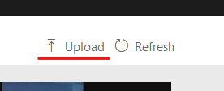

根据提示进行操作：

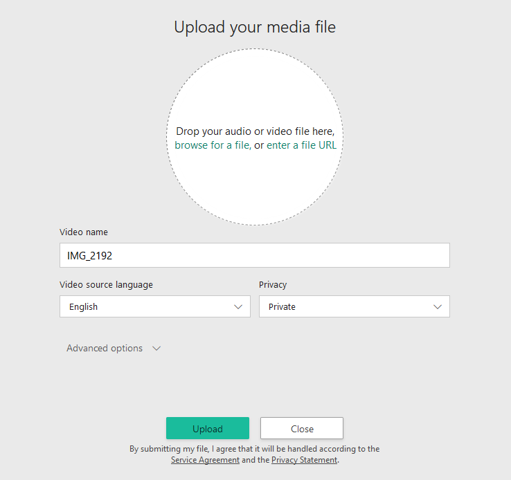

视频上传完成后，视频索引器就会开始对视频进行索引和分析：

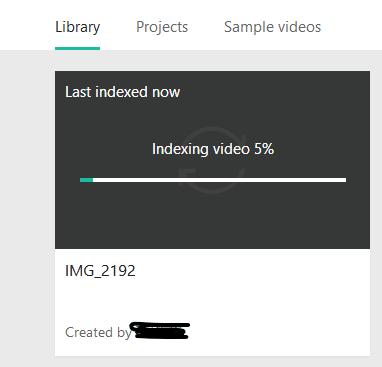

当视频索引器分析完以后，你会获得一个通知邮件。此时，点击播放该视频，页面将跳转到新页面，其中包含视频以及视频的一些见解。 例如：人物、主题、OCR等：

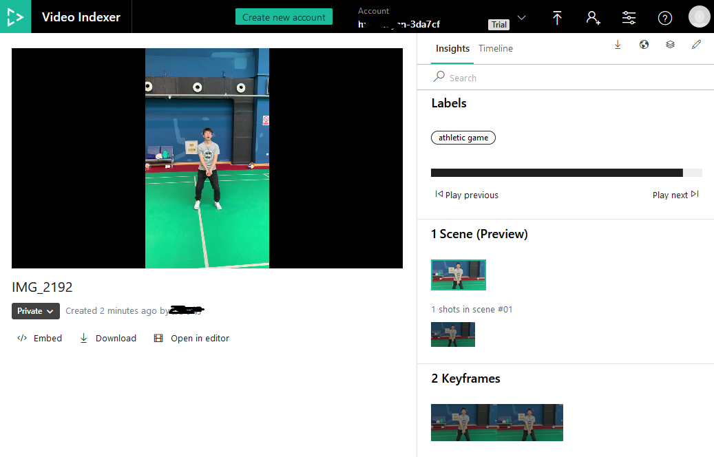

## 使用 [API](https://api-portal.videoindexer.ai/docs/services)

Video Indexer 在一个集成式服务中整合了 Microsoft 提供的多种音频和视频人工智能 (AI) 技术，使开发变得更简单。 API 可让开发人员专注于使用媒体 AI 技术，而无需考虑云平台的规模、全球覆盖度、可用性和可靠性的问题。 可以使用 API 来上传文件、获取详细的视频见解、获取见解和播放器小组件的 URL 以将其嵌入应用程序，以及执行其他任务。

为了能够使用 Video Indexer 的 API ，需要两个最基本的信息：Account ID 和 Primary Key。

### Account ID 

可以在 [Video Indexer 官网](https://www.videoindexer.ai/)的个人信息里找到：

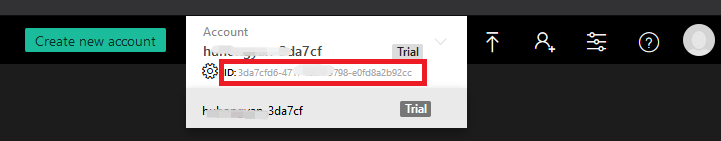


### Primary Key

登录到[开发人员门户](https://api-portal.videoindexer.ai/)，点击登录：


登录成功后，点击用户名，点击"PROFILE"：

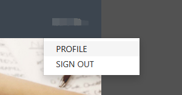

点击"Show"显示 Primary Key ：

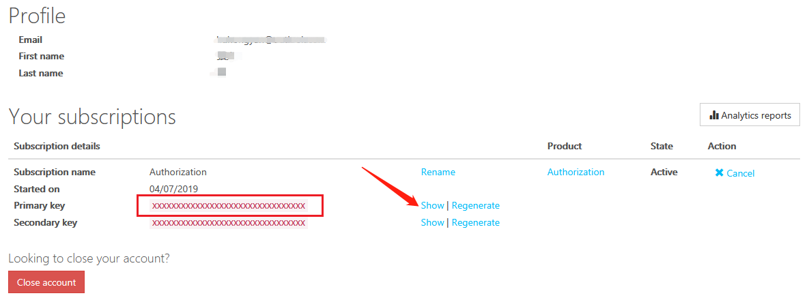

### 基本流程

Video Indexer 的 API 分为两大部分：认证和操作。一个基本的流程：“获取 Token ->上传视频->（等待处理）获取结果”如下图所示：

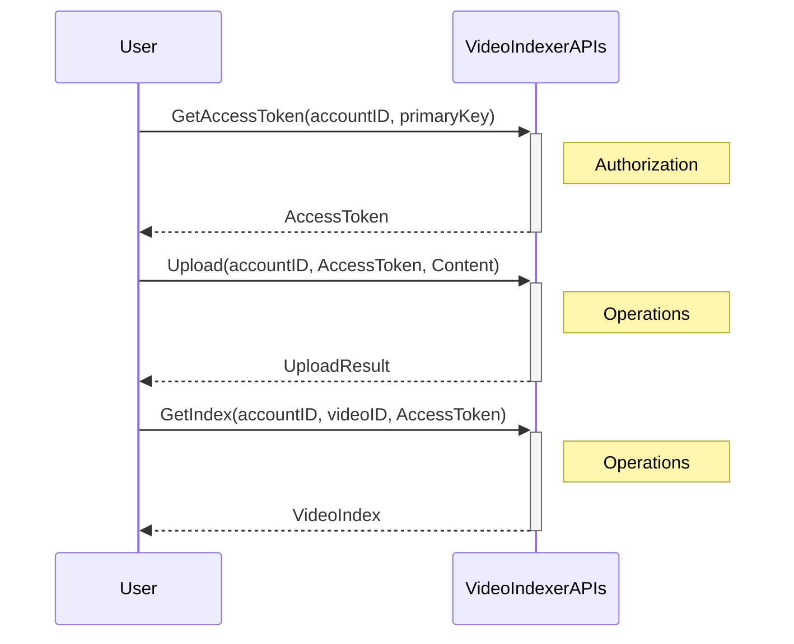

需要注意的是，Access Token 分为三种类型，针对不同的级别的活动，对 Token 的要求也不同。在针对账户做操作时，通常需要 Account Access Token， 而针对视频做操作时，则使用 Video Access Token。具体说明参考：

>Ref: https://docs.microsoft.com/zh-cn/azure/media-services/video-indexer/video-indexer-use-apis#obtain-access-token-using-the-authorization-api
>
>订阅授权 API 后，可以获取访问令牌。 这些访问令牌用于对操作 API 进行身份验证。
>
>对操作 API 的每个调用应该与匹配调用授权范围的访问令牌相关联。
>
>- 用户级别 - 使用用户级访问令牌可在**用户**级别执行操作。 例如，获取关联的帐户。
>- 帐户级别 – 使用帐户级访问令牌可在**帐户**级别或**视频**级别执行操作。 例如，上传视频、列出所有视频、获取视频见解，等等。
>- 视频级别 – 使用视频级访问令牌可对特定的**视频**执行操作。 例如，获取视频见解、下载隐藏式字幕、获取小组件，等等。
>
>可以通过指定 **allowEdit=true/false**，来控制这些令牌是只读的还是可编辑的。
>
>对于大多数的服务器到服务器方案，也许可以使用相同的**帐户**令牌，因为它同时涵盖了**帐户**操作和**视频**操作。 但是，若要对视频索引器发出客户端调用（例如，从 javascript），可能需要使用**视频**访问令牌，以防止客户端访问整个帐户。 这也是在客户端中嵌入 VideoIndexer 客户端代码（例如，使用“获取见解小组件”或“获取播放器小组件”）时，必须提供**视频**访问令牌的原因。
>
>为简化操作，可以使用**授权** API > **GetAccounts** 来获取帐户，而不是先获取用户令牌。 还可以请求获取具有有效令牌的帐户，以便跳过附加的调用即可获取帐户令牌。
>
>访问令牌在 1 小时后过期。 在使用操作 API 之前，请确保访问令牌有效。 如果令牌已过期，请再次调用授权 API 来获取新访问令牌。
>
>现在，便可以开始与 API 集成。 查找[每个视频索引器 REST API 的详细说明](https://api-portal.videoindexer.ai/)。

# 构建应用

经过以上的了解，我们可以着手开始应用的开发，这里以 Windows 窗体应用为例，编程语言为 C#，利用 Video Indexer API，获取所选视频的标签，使用户在不看视频的情况下了解视频的内容概况。

## 创建Windows 窗体应用

打开 Visual Studio 2017，新建项目，在 Visual C# 分类中选择`Windows 窗体应用(.NET Framework)`，填写项目名称为`VideoLabels`，点击确定

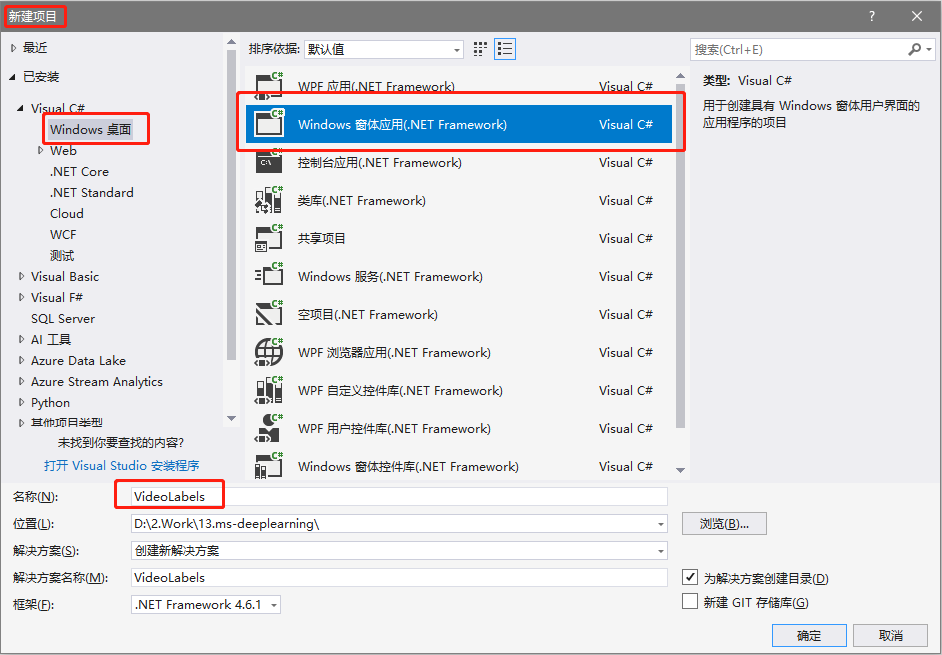

## 增加 `System.Net.Http` 引用

项目内“引用”处，点击右键，点击“添加引用”：

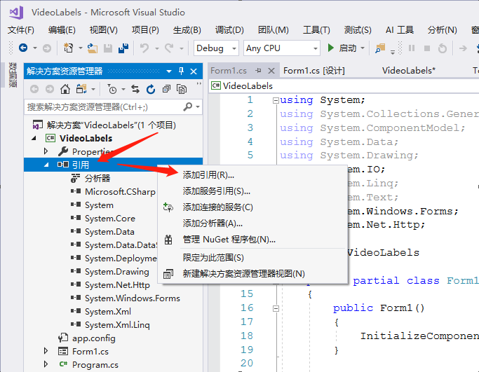

在弹出的窗口中点击“程序集”，在右上角搜索处输入“System.Net.Http“，勾选相应的搜索结果，并点击“确定”：


在代码中增加引用：

```c#
using System.Net.Http;
```

## 增加 `Newtonsoft.Json` 引用

用以解析JSON文件，项目名称处右键，选择“管理NuGet程序包”：


在“浏览”选项卡下，输入“newtonsoft json”进行搜索，选择对应项目进行安装：

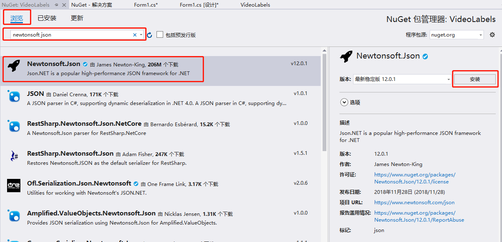

在弹出的页面中点击“确定”：


在代码中增加引用：

```c#
using Newtonsoft.Json;
```


## 编辑界面

在解决方案资源管理器中找到Form1.cs，双击打开对应的设计界面，如下图所示，增加若干控件：

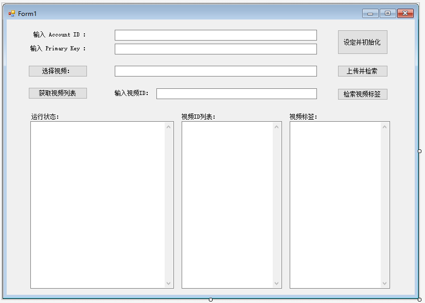

## 功能简介

- 设定 Account ID 和 Primary Key，初始化网络连接和 Video Indexer API 的访问令牌。
- 选择本地视频，上传至 Video Indexer 并由其进行解析
- 获取 Account ID 下已上传的所有视频 ID ，获取指定视频的标签。
- 下面三个文本框分别输出：运行状态（日志）信息、视频ID信息、视频标签信息。

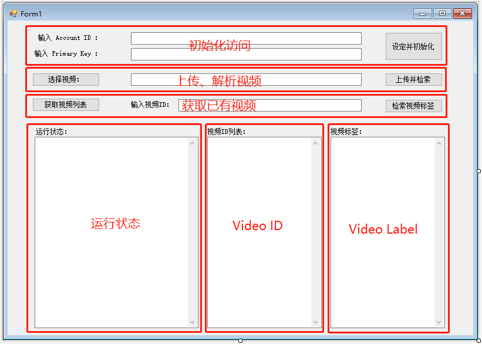

### 初始化访问

对于 Video Indexer 的访问，依赖于访问令牌，在初始状态时（或令牌超期需要重新获取时），将 Account ID 和 Primary Key 填写到相应位置，点击右侧“设定并初始化”，程序将根据这两个信息获取访问令牌，并将对应的状态显示在“运行状态”窗口中：


获取令牌的过程持续了约4秒左右，请耐心等待。虽然在执行操作时采用了异步的方法，UI不会阻塞（即界面不会“卡住”），但是此时进行操作，可能会引起其他的一些异常。

异步操作是 C# 的特性，可以使指定的任务分配到其他线程上执行，对于 WinForm （或者一些其他的 GUI 编程）来说，在 UI 交互响应中执行耗时的操作，会使界面“卡住”直到操作完成，造成不良的用户体验。实现异步操作有很多种方法，有兴趣的同学可以自行查阅一些相关资料，这里使用`Task.Run()`：

```c#
using System.Threading.Tasks;
...
// 设定 Account ID 和 Primary Key
private void Button_Setting_Click(object sender, EventArgs e)
{
    ...
    // 异步初始化，避免阻塞UI线程
    Task.Run(() => Initialize());
}
```

其中` Initialize()`是我们的初始化函数，耗时操作放在这个函数中执行。

在获取访问令牌时，根据[API要求](https://api-portal.videoindexer.ai/docs/services/authorization/operations/Get-Account-Access-Token?)对请求体进行设定。

```c#
// 设定Request headers 为 Primary Key
client.DefaultRequestHeaders.Add("Ocp-Apim-Subscription-Key", apiKey);
// 设定访问请求体
var accountAccessTokenRequestResult = client.GetAsync($"{apiUrl}/auth/{location}/Accounts/{accountID}/AccessToken?allowEdit=true").Result;
// 获取访问令牌
var accountAccessToken = accountAccessTokenRequestResult.Content.ReadAsStringAsync().Result.Replace("\"", "");
```

> 参考：https://docs.microsoft.com/zh-cn/azure/media-services/video-indexer/video-indexer-use-apis。

在获取到访问令牌后，就可以进行其他的操作了。

### 选择、上传、处理视频并获取结果

点击“选择视频”按钮，将会弹出文件浏览器，选择相应格式的视频文件即可。


该功能的实现通过`OpenFileDialog`类完成：

```c#
using (OpenFileDialog openFileDialog = new OpenFileDialog())
{
    // 设定起始位置
    openFileDialog.InitialDirectory = "C:\\";
    // 设定可选文件类型
    openFileDialog.Filter = "Video files (*.mp4;*.mov)|*.mp4;*.mov";
    openFileDialog.FilterIndex = 1;
    openFileDialog.RestoreDirectory = true;

    if (openFileDialog.ShowDialog() == DialogResult.OK)
    {
        // 获取被选文件路径
        filePath = openFileDialog.FileName;
    }
}
```

被选择文件的路径会显示在该按钮右侧文本框中，继续点击文本框右侧按钮“上传并检索”，程序将按顺序完成：上传视频、获取已上传视频的ID、获取视频访问令牌（Video Access Token）、获取视频处理状态、获取视频处理结果等一系列功能。其执行状态将显示在左下角的文本框中。

在点击完“上传并检索”按钮后，耗时的动作依旧作为异步任务，此时UI是非阻塞的，但是为了避免其他异常，在本次处理结果完毕前，不要重复点击该按钮。

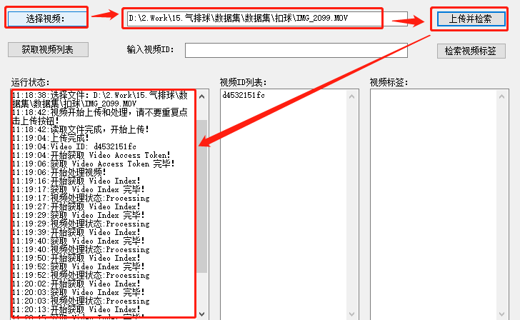

根据服务器性能不同，处理时间会有所差异，请耐心等待至解析完成：


此时，将会在右侧文本框内显示出该视频的标签信息。这里只对视频标签做了解析和展示，其实返回的JSON格式的处理结果中，包含了很多视频信息，具体请参考：https://docs.microsoft.com/zh-cn/azure/media-services/video-indexer/video-indexer-output-json-v2。

概要流程如下所示，由于处理时间不确定，需要循环从服务器获取视频处理状态直到处理完成。

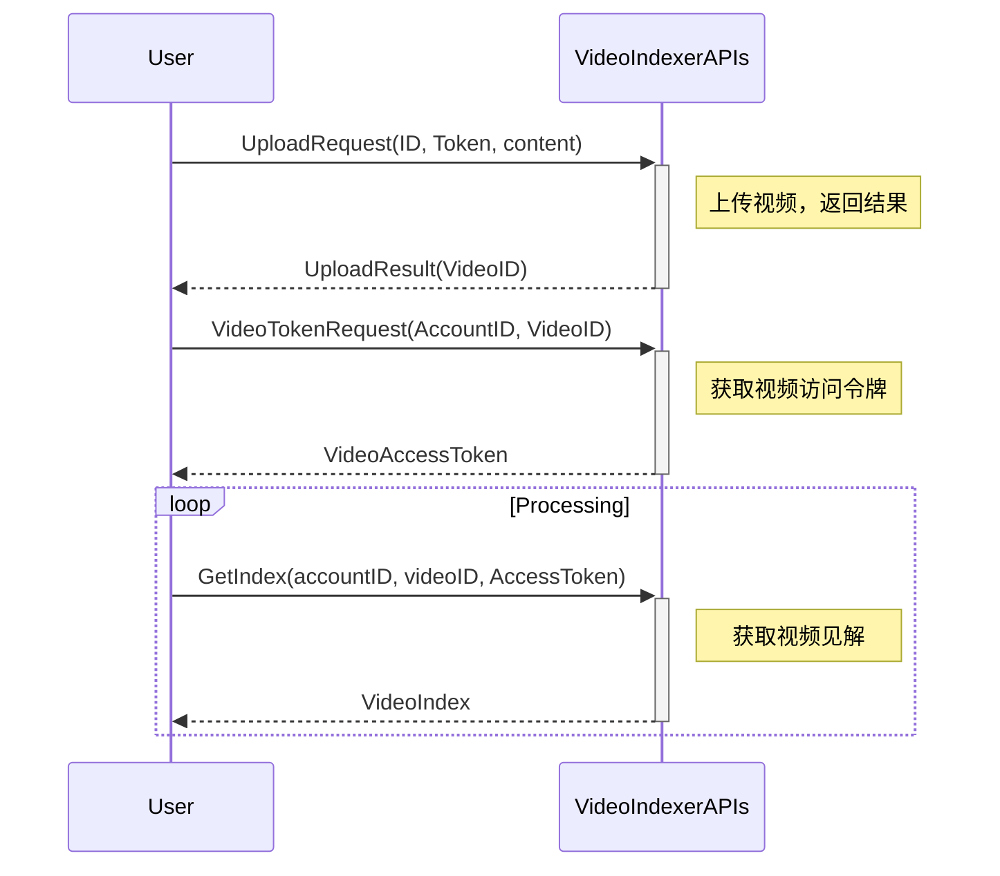

与API的通信，主要分为：请求、获取结果、解析三部分组成，如上传文件内容使用 POST 方法：

```c#
// API 请求
var uploadRequestResult = client.PostAsync(
                $"{apiUrl}/{location}/Accounts/{accountID}" +
                $"/Videos?accessToken={accountAccessToken}" +
                $"&name=some_name" +
                $"&description=some_description" +
                $"&privacy=private" +
                $"&partition=some_partition",
                content
                ).Result;

// 读取请求处理结果
var uploadResult = uploadRequestResult.Content.ReadAsStringAsync().Result;

// 解析结果，得到信息
videoID = JsonConvert.DeserializeObject<dynamic>(uploadResult)["id"];
```

> 参考：https://docs.microsoft.com/zh-cn/azure/media-services/video-indexer/video-indexer-use-apis。

### 获取已有视频

通过点击“获取视频列表”按钮，可以获取当前账户下已经上传的所有视频的视频ID，并显示在下部分中间文本框内：

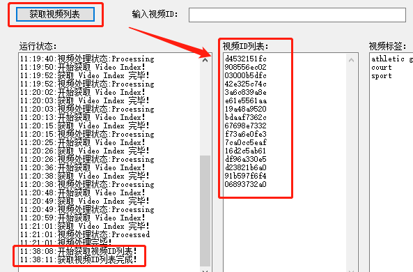

该过程主要使用了 API : [List Videos](https://api-portal.videoindexer.ai/docs/services/operations/operations/List-videos?)  。具体实现与前面类似，不再赘述。

### 获取指定视频的标签

在“输入视频ID”后面的文本框内，输入视频ID，并点击右侧“检索视频标签”按钮，将会从该视频的见解结果中，解析出视频标签，并显示在下部右侧文本框内：


需要注意的是，由于该次是对某个视频做操作，所以必须要先获取该视频的访问令牌（Video Access Token）才可以。

该过程主要使用了API：

[Get Video Access Token](https://api-portal.videoindexer.ai/docs/services/authorization/operations/Get-Video-Access-Token?)
[Get Video List](https://api-portal.videoindexer.ai/docs/services/operations/operations/Get-Video-Index/console)

# 总结

通过使用 Video Indexer 的 API，创建了本地WinForm应用程序，实现了在不看视频的情况下得到视频内容标签的功能，场景和案列可能稍显简陋，但涵盖了基本的过程。

 Video Indexer 基于微软强大的人工智能平台开发，能够对视频进行解析，得到丰富的见解。其功能丰富且不断增长，基于RESTful风格的API，有很好的适用性，开发者可以快速开发出多平台上丰富多彩的视频应用。