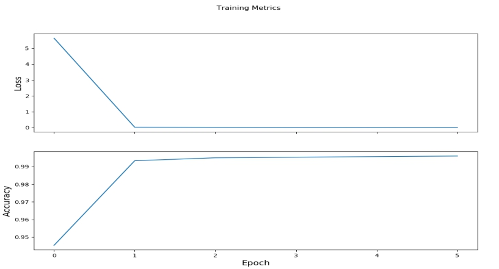
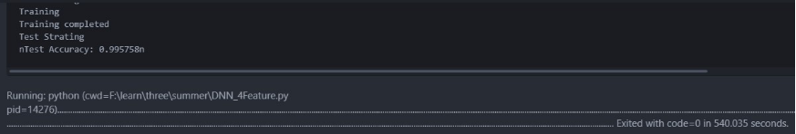
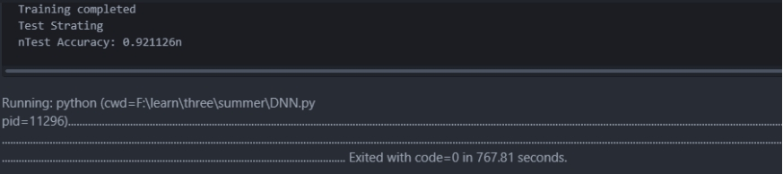

# 基于监督学习的恶意攻击特征识别

# **1.** **背景介绍**

## 1.1 恶意攻击

恶意攻击是指在[信息安全技术](https://baike.baidu.com/item/%E4%BF%A1%E6%81%AF%E5%AE%89%E5%85%A8%E6%8A%80%E6%9C%AF/2253817)中，内部人员有计划地窃听、偷窃、或损坏信息，或拒绝其他授权用户的访问。恶意攻击自从产生到现在，已经危害了无数的电脑网络，给人们的造成了严重的经济损失。对恶意攻击的识别作为一项可以极大降低恶意攻击危害的手段，一直受到高度关注。在本项目中，将会使用较为新颖的机器学习方法，对恶意攻击进行识别，为对恶意攻击的研究、预防提供基础。

在本项目中，我们使用的数据中攻击主要有4大类共39种攻击，四种攻击类型为：

* DOS, denial-of-service.拒绝服务攻击，例如ping-of-death, syn flood, smurf等；

* R2L, unauthorized access from a remote machine to a local machine. 来自远程主机的未授权访问，例如guessing password；

* U2R, unauthorized access to local superuser privileges by a local unpivileged user. 未授权的本地超级用户特权访问，例如buffer overflow attacks；

* PROBING, surveillance and probing, 端口监视或扫描，例如port-scan, ping-sweep等。

具体种类见2.4节数据集介绍。

## 1.2 Tensorflow

​	TensorFlow™ 是一个开放源代码软件库，用于进行高性能数值计算。借助其灵活的架构，用户可以轻松地将计算工作部署到多种平台（CPU、GPU、TPU）和设备（桌面设备、服务器集群、移动设备、边缘设备等）。TensorFlow™ 最初是由 Google Brain 团队（隶属于 Google 的 AI 部门）中的研究人员和工程师开发的，可为机器学习和深度学习提供强力支持，并且其灵活的数值计算核心广泛应用于许多其他科学领域。

 

# **2.** **相关技术简介**

## 2.1 深度神经网络简介

神经网络是一组大致模仿人类大脑构造设计的算法，用于识别模式。神经网络通过机器感知系统解释传感器数据，对原始输入进行标记或聚类。神经网络所能识别的模式是包含在向量中的数值形式，因此图像、声音、文本、时间序列等一切现实世界的数据必须转换为数值。

深度神经网络(Deep Neural Network,DNN)可以理解为除一个输入层与一个输出层以外具有很多隐藏层的神经网络，DNN的大致结构如下图所示:

 


## 2.2 Keras简介

Keras 是一个用 Python 编写的高级神经网络 API，它可以以Tensorflow作为后端运行，Keras库能够很快的运算出实验结果，对本次实验有较大帮助。

特点：

* 用户友好。 Keras 是为人类而不是为机器设计的 API。它把用户体验放在首要和中心位置。Keras 遵循减少认知困难的最佳实践：它提供一致且简单的 API，将常见用例所需的用户操作数量降至最低，并且在用户错误时提供清晰和可操作的反馈。

* 模块化。 模型被理解为由独立的、完全可配置的模块构成的序列或图。这些模块可以以尽可能少的限制组装在一起。特别是神经网络层、损失函数、优化器、初始化方法、激活函数、正则化方法，它们都是可以结合起来构建新模型的模块。

* 易扩展性。 新的模块是很容易添加的（作为新的类和函数），现有的模块已经提供了充足的示例。由于能够轻松地创建可以提高表现力的新模块，Keras 更加适合高级研究。

* 基于 Python 实现。 Keras 没有特定格式的单独配置文件。模型定义在 Python 代码中，这些代码紧凑，易于调试，并且易于扩展。

## 2.3 Eager Execution简介

TensorFlow 的 Eager Execution 是一种命令式编程环境，可立即评估操作，无需构建图：操作会返回具体的值，而不是构建以后再运行的计算图（动态图模型）。

## 2.4 数据集KDD cup 1999介绍

此数据集首先是美国国防部高级规划署（DARPA）在MIT林肯实验室进行的研究收集数据随后来自哥伦比亚大学的Sal Stolfo 教授和来自北卡罗莱纳州立大学的 Wenke Lee 教授采用数据挖掘等技术对以上的数据集进行特征分析和数据预处理，形成了一个新的数据集。该数据集用于1999年举行的KDD CUP竞赛中，成为著名的KDD99数据集。虽然年代有些久远，但KDD99数据集仍然是网络入侵检测领域的事实Benckmark，为基于计算智能的网络入侵检测研究奠定基础。

训练集大概包含5,000,000多个网络连接记录，测试数据大概包含2,000,000个网络连接记录。每个网络连接被标记为正常（normal）或异常（attack），异常类型被细分为4大类共39种攻击类型，其中22种攻击类型出现在训练集中，另有17种未知攻击类型出现在测试集中。

KDD99数据集中每个连接（*）用41个特征来描述，加上最后的标记（label），一共有42项：如下所示

```
2, tcp, smtp, SF, 1684, 363, 0, 0, 0, 0, 0, 1, 0, 0, 0, 0, 0, 0, 0, 0, 0, 0, 1, 1, 0.00, 0.00, 0.00, 0.00, 1.00, 0.00, 0.00, 104, 66, 0.63, 0.03, 0.01, 0.00, 0.00, 0.00, 0.00, 0.00, normal.
0, tcp, private, REJ, 0, 0, 0, 0, 0, 0, 0, 0, 0, 0, 0, 0, 0, 0, 0, 0, 0, 0, 38, 1, 0.00, 0.00, 1.00, 1.00, 0.03, 0.55, 0.00, 208, 1, 0.00, 0.11, 0.18, 0.00, 0.01, 0.00, 0.42, 1.00, portsweep.
```

41项特征分为4大类，具体介绍见附录7.1。

 

# **3.** **实现目标**

由于网络恶意行为多种多样且在不断出现新的攻击方式，且有些攻击类型数量十分稀少，如果对每一个攻击类型都进行训练，构建模型需要消耗大量的资源，且准确度不高，且无法保证完全覆盖一些新出现的或者数量较少的攻击类型。我们可以使用如下策略：首先将所有类型的攻击标记恶意行为标签，其他行为标记正常标签，通过相关算法识别恶意行为与正常行为，并可以识别在训练集中没有的，新出现的恶意行为。但是此方法损失了数据集攻击类型的信息，造成了信息的浪费。

由此，本项目使用如下策略：将出现频率最高的几种恶意行为进行训练形成一个模型，此模型可以准确识别出攻击类型，但是仅能识别出特定的几种，我们将其称为细粒度识别，即，可以识别出具体攻击类型的模型。将这几种攻击之外恶意行为统一标记为恶意行为标签，进行训练得出可以分辨恶意行为与正常行为的二分类模型，将此模型称为粗粒度识别即，只能识别出是恶意攻击还是正常行为的模型。需要注意的是此模型不包含细粒度识别中的攻击类型，目的是缩短训练时间，提高准确度。

在识别时首先使用细粒度识别，如果无法识别为细粒度识别中包含的任意一种攻击类型，再使用粗粒度识别。得到的结果有两种情况：1. 具体的攻击类型；2. 恶意行为或正常行为标签。由此即可形成一种基于Tensorflow的有监督恶意行为特征识别方案。

根据我们数据集的实际情况，我们的细粒度识别可以识别的四种攻击类型为：

* Ipsweep攻击：IPsweep：严格的说，IPsweep并不能算是正式的攻击，IPsweep的过程只是向各个地址发送ping包等待回应，用以探测网络中存活的主机，从而为下一步的攻击做准备。

* Neptune(SYN flood)攻击：利用了TCP三次握手中的弱点。具体的方法是：攻击主机向目标主机发出SYN报文发起TCP连接，但是攻击主机并不回复最后一个ack报文，使得TCP握手无法完成，而目标主机在TCP握手中需要分配资源维持这些未完成的连接，当这样的连接到达一定数目后，目标主机就无法再响应其他的连接请求。构造出Synflood报文比较容易，只要将syn位置1，然后连接目标主机的某个可用服务的端口即可。

* Smurf攻击： Smurf攻击通过使用将回复地址设置成受害网络的[广播地址](https://baike.baidu.com/item/%E5%B9%BF%E6%92%AD%E5%9C%B0%E5%9D%80)的ICMP应答请求(ping)数据包，来淹没受害主机，最终导致该网络的所有主机都对此ICMP应答请求做出答复，导致[网络阻塞](https://baike.baidu.com/item/%E7%BD%91%E7%BB%9C%E9%98%BB%E5%A1%9E)。更加复杂的Smurf将源地址改为第三方的受害者，最终导致第三方崩溃。

* Portsweep攻击：一种端口扫描方式。其方法是对指定目标的端口发送SYN报文发起TCP连接，如果主机返回的是SYN+ACK，那么表示这个端口上有相应的服务开放，如果主机返回的是RST，那么说明这个端口没有服务在监听。

其他类型的攻击统一归入粗粒度识别中，标记为恶意行为。

 

# **4.** **实现步骤**

## 4.1 数据集预处理

### 4.1.1 细粒度识别数据集预处理

我们的数据集使用的是KDD cup 1999，为了测试方案能否识别全新的恶意行为，在测试集中包含训练集中所没有的攻击类型。

本次实验中，我们一共选取了四种最具有代表性同时也是数据集中出现次数最多的4种攻击方式，分别为Ipsweep攻击，Neptune攻击，Smurf攻击，以及Portsweep攻击，加上正常访问的网络行为，一共有5种不同的网络访问行为，将数据集合中带有这四种攻击的访问条目提取出来组成新的数据集，具体实现如下：

```
import csv  
  
def f_to_csv():  
    file = open("G:\\TensorflowPJ\\kddcup.data_10_percent_corrected.csv","r")  
    csvfile = open('G:\\TensorflowPJ\\Dataget\\train_data_4K.csv','w',newline='')  
    list = []  
    swriter = csv.writer(csvfile,dialect='excel')  
    for line in file:  
        line_list = line.strip().split(',')  
        if line_list[41] == 'normal.':  
            line_list[41] = '0'  
            for i in range(42):  
                list.append(line_list[i])  
        elif line_list[41] == 'ipsweep.':  
            line_list[41] = '1'  
            for i in range(42):  
                list.append(line_list[i])  
        elif line_list[41] == 'neptune.':  
            line_list[41] = '2'  
            for i in range(42):  
                list.append(line_list[i])  
        elif line_list[41] == 'smurf.':  
            line_list[41] = '3'  
            for i in range(42):  
                list.append(line_list[i])  
        elif line_list[41] == 'portsweep.':  
            line_list[41] = '4'  
            for i in range(42):  
                list.append(line_list[i])  
        if list:  
            swriter.writerow(list)  
        list = []  
  
if __name__ == '__main__':  
    f_to_csv()  
```

在原始KDD CUP 99数据集中，不同网络访问行为的标签以字符串形式进行存储，因此，我们在将数据转换成CSV格式文件时将原始数据中的标签转换为了可供Tensorflow识别并使用的int型数据(0~5)来分别代表不同的网络访问行为。

由于细粒度识别只识别特定的4种攻击，特征较为明显，在测试后发现，每种类型只需要600条，包含正常类别，训练集一共只需要3000条访问条目即可产生识别较为准确的模型。测试集则使用提取的全部数据为28345条访问数据。

### 4.1.2 粗粒度识别数据集预处理

粗粒度数据集将上述4种类型的访问条目剔除。余下的数据集分为恶意行为与正常行为两种，其中恶意行为使用1表示，正常行为使用0表示，处理完成后，训练集大小为494021条访问信息，测试集大小为311029条访问信息。具体代码如下：

```
def Transfor_Data():  
    print("Transfor_Data() Starting")  
  
    in_file = open(TRANING_FILE, 'r', encoding='UTF-8')  
    out_file = open(DEALED_TRAINING_DATA, 'w', newline="")  
    out_writer = csv.writer(out_file)  
  
    #第一行空出留最后写统计数据  
    out_writer.writerow([])  
  
    #开始按行读取，提出所需特征值，写入csv  
    dealed_data = []  
    line = in_file.readline()  
  
    while line:  
        #4~9行是TCP连接基本特征, 共9种   
        #10~22是TCP连接的内容特征，共13种  
        #23~30是基于时间的网络流量特征统计，共9种  
        #31~41基于主机的网络流量统计特征, 共10种  
        #提取37种特征  
        line = line.split(',')  
        for i in range(4,41):  
            dealed_data.append(line[i])  
        if(line[41].strip() == "normal."):  
            #如果不是攻击标记为0，是攻击标记为1  
            dealed_data.append(0)  
        else:     
            dealed_data.append(1)  
        #将dealed_data写回文件  
        out_writer.writerow(dealed_data)  
        dealed_data = []  
        #下一轮读取  
        line = in_file.readline()  
  
    in_file.close()  
    out_file.close()  
    print("Transfor_Data() Completed") 
```

## 4.2 基于Keras库的Sequential模型和Eager Execution动态图机制实现细粒度识别

​	具体实验步骤：

* 载入所需要的库并进行预操作；

* 构建神经网络；

* 进行训练，建立模型；

* 使用测试集带入所建立模型，并计算预测准确度，同时对模型进行改进。

### 4.2.1 载入所需要的库进行预操作

细粒度识别中训练集一共3000条访问条目，测试集则使用提取的全部数据为28345条访问数据。本次实验所需要的库如下所示：

```
from __future__ import absolute_import, division, print_function  
  
import os  
import matplotlib.pyplot as plt  
  
import tensorflow as tf  
import tensorflow.contrib.eager as tfe  
  
tf.enable_eager_execution()    #启动eager execution动态图模块
```

设置训练集路径

```
train_dataset_fp = "G:\\TensorflowPJ\\Keras_N\\train_data_4K_simple.csv"
```

由于我们的数据集是 CSV 格式的文本文件，因此我们会将特征和标签值解析为 Python 模型能够使用的格式。在这里我们定义parse_csv函数，系统会将文件中的每一行传递给prase_csv函数，该函数会获取前四个特征字段，并将它们合并为一个张量。然后，系统会将最后一个字段解析为标签。该函数会返回特征和标签这两个张量：

```
def parse_csv(line):
  example_defaults = [[0.], [0.], [0.], [0.], [0.], [0.], [0.], [0.], [0.], [0.],		    
  [0.], [0.], [0.],[0.], [0.], [0.],[0.], [0.], [0.],[0.], [0.], [0.],[0.], [0.], [0.], 
  [0.], [0.], [0.],[0.], [0.], [0.],[0.], [0.], [0.],[0.], [0.], [0.],[0.], [0.],
  [0.], [0]]  # 设置数据格式  
  parsed_line = tf.decode_csv(line, example_defaults)  
  # 前37列是特征值 构成一个TENSOR 来自于KDD CUP 99数据集  
  features = tf.reshape(parsed_line[:-1], shape=(38,))  
  #最后一列是数据标签 代表不同的攻击（目前有5种：4种不同攻击和正常访问）  
  label = tf.reshape(parsed_line[-1], shape=())  
  return features, label
```

在此处我们使用tf.data.TextLineDataset 加载 CSV 格式的文本文件，并且使用prase_csv解析该文件。tf.data.Dataset 将输入管道表示为一组元素以及作用于这些元素的一系列转换。转换方法会链接在一起或按顺序调用，只需确保保留对返回的 Dataset 对象的引用即可。

```
#创建训练用的dataset  
train_dataset = tf.data.TextLineDataset(train_dataset_fp)  
train_dataset = train_dataset.skip(1)               
train_dataset = train_dataset.map(parse_csv) 
```

由于随机排列的样本能够实现最好的训练效果，因此我们使用f.data.Dataset.shuffle 将条目随机化，并将 buffer_size 设为大于样本数。为了更快速地训练模型，将数据集的批次大小设为一次训练 32 个样本。

```
train_dataset = train_dataset.shuffle(buffer_size=3001)  
#设置一个缓冲区 将样本进行随机化处理 缓冲区大小要大于数据集总数  
train_dataset = train_dataset.batch(32)  #批处理设置 加快运行速度  
```

### 4.2.2 构建神经网络

接下来，我们使用keras库来创建我们所需要的神经网络模型，此处我们选择Sequential模型。tf.keras.Sequential模型是层的线性层叠。该模型的构造函数会接受一系列层实例；在我们的程序中，接受的是 2 个密集层（分别包含 50 个节点）以及 1 个输出层（包含 5个代表标签预测的节点）。第一个层的 input_shape 参数对应该数据集中的特征数量，它是一项必需参数。

```
#设置神经网络模型 此处使用了Keras库中的顺序模型Sequential 激活函数为relu 两个隐藏层分别有50个神经元节点  
model = tf.keras.Sequential([  
  tf.keras.layers.Dense(50, activation="relu", input_shape=(38,)),    
  tf.keras.layers.Dense(50, activation="relu"),  
  tf.keras.layers.Dense(5)]) 
```

随后，我们定义损失函数和梯度下降函数。在模型的建立阶段和评估阶段，我们都需要计算模型的损失。这样可以衡量模型的预测结果与预期标签有多大偏差，也就是说，模型的效果有多差。我们希望尽可能减小或优化这个值。

```
#定义损失函数  
def loss(model, x, y):  
  y_ = model(x)  
  return tf.losses.sparse_softmax_cross_entropy(labels=y, logits=y_)  
  
#定义梯度下降函数  
def grad(model, inputs, targets):  
  with tf.GradientTape() as tape:  
    loss_value = loss(model, inputs, targets)  
  return tape.gradient(loss_value, model.variables)  
```

接下来，我们创建一个optimizer来逐渐减少损失值，参数为学习率，即为每次梯度下降度步长，代码如下：

```
optimizer = tf.train.GradientDescentOptimizer(learning_rate=0.001) #学习率 即为梯度下降的步长 

```

### 4.2.3 进行训练，构建模型

下面开始模型训练，在每个训练周期内，获取每个网络访问样本的特征值和标签，同时根据样本的特征值进行预测，然后比较预测结果和标签，根据比较结果来衡量预测结果的错误率，并利用所得到的值计算模型的损失和下降梯度，同时在每一次循环结束之后输出本次预测结果的损失和精度。代码实现如下：

```
train_loss_results = []  
train_accuracy_results = []  
  
num_epochs = 6   #迭代次数  
#进行迭代训练  
for epoch in range(num_epochs):  
  epoch_loss_avg = tfe.metrics.Mean()  
  epoch_accuracy = tfe.metrics.Accuracy()  
  
  for x, y in train_dataset:  
    grads = grad(model, x, y)  
    optimizer.apply_gradients(zip(grads, model.variables),  
                              global_step=tf.train.get_or_create_global_step())  
  
    epoch_loss_avg(loss(model, x, y))  
    epoch_accuracy(tf.argmax(model(x), axis=1, output_type=tf.int32), y)  
  
  train_loss_results.append(epoch_loss_avg.result())  
  train_accuracy_results.append(epoch_accuracy.result())  
  
  if epoch % 1 == 0:  
      
    print("Epoch {:03d}: Loss: {:.3f}, Accuracy: {:.3%}".format(epoch,  
                                                                epoch_loss_avg.result(),  
                                                                epoch_accuracy.result()))  
```

为了得到一个更直观的结果，我们将每一次循环后的损失和精度画出函数图像，以便我们调整神经网络中神经元的个数以及梯度下降的步长这些参数。代码如下：

```
#做出损失率和成功率随迭代次数变化的图像  
fig, axes = plt.subplots(2, sharex=True, figsize=(12, 8))  
fig.suptitle('Training Metrics')  
  
axes[0].set_ylabel("Loss", fontsize=14)  
axes[0].plot(train_loss_results)  
  
axes[1].set_ylabel("Accuracy", fontsize=14)  
axes[1].set_xlabel("Epoch", fontsize=14)  
axes[1].plot(train_accuracy_results)  
  
plt.show()  
```


### 4.2.4 使用测试集带入所建立模型，并计算预测准确度

下面我们选取另外一个测试集进行测试，并输出测试精度，代码如下：

```
#设置测试集  
test_fp = "G:\\TensorflowPJ\\Keras_N\\test_data_4K.csv"  
  
  
test_dataset = tf.data.TextLineDataset(test_fp)  
test_dataset = test_dataset.skip(1)               
test_dataset = test_dataset.map(parse_csv)        
#test_dataset = test_dataset.shuffle(1001)     由于此处的数据已经随机化，为加快运行效率，此处不做处理
test_dataset = test_dataset.batch(10000)             
  
test_accuracy = tfe.metrics.Accuracy()  
#进行测试  
for (x, y) in test_dataset:  
  prediction = tf.argmax(model(x), axis=1, output_type=tf.int32)  
  test_accuracy(prediction, y)  
  
print("Test set accuracy: {:.3%}".format(test_accuracy.result()))  
```

## 4.3 基于DNN实现粗粒度识别

* 对数据进行预处理，规范数据格式，方便后续步骤处理；

* 将训练集导入容器；

* 建立DNN网络；

* 进行训练建立模型；

* 根据训练好的模型对测试集进行预测，根据结果改进训练模型。

### 4.3.1 将训练集导入容器

所需数据提取后，使用tf.contrib.learn.datasets.base.load_csv_with_header（）函数读取训练集，放入容器。同时指定数据类型，将数据集内容规范化。

```
training_set = tf.contrib.learn.datasets.base.load_csv_with_header(
                                                      filename=DNN_TRAINING,  
                                                     target_dtype=np.int,  
                                                 features_dtype=np.float32)  
```

### 4.3.2 建立DNN网络

DNN网络建立过程需要根据结果不断地修改，才能获得较为理想的准确度。在建立网络初期根据要预测的数据规模，由经验给出DNN网络参数。目标类型个数指定为两种，即恶意行为与正常行为两种标签。

```
# 设定37个特征  
feature_columns = [tf.contrib.layers.real_valued_column("", dimension=37)]  

# 建立40，80，40的三层深度神经网络  
classifier = tf.contrib.learn.DNNClassifier(
              feature_columns=feature_columns,#把之前创建的特征列传入  
             hidden_units=[40, 80, 40], #每层神经元数量，跟 DNN 原理有关。  
             n_classes=2, #目标的类型的个数，目前是 2 个  
             model_dir=MODLE_FOLDER) #训练模型保存的路径  
```


### 4.3.3 进行训练建立模型

​	训练需要指定迭代次数，次数过多越准确，但是时间开销越大，在一定程度上再增加时间对准确度已无太大影响。因此训练次数最初指定为200，之后按照20一段进行增加，直到再增加次数对准确度已无多大影响时停止。

```
#开始训练  
    classifier.fit(input_fn=get_train_inputs, steps=350) #训练次数待调节  
  
    print("Training completed")  
```


### 4.3.4 根据训练好的模型对测试集进行预测，根据结果改进模型

测试时只需要调用现有模型，使用库函数classifier.evaluate（）进行测试即可。根据测试的结果不停改进模型参数最终得到预测较为准确的模型。准确度预测代码如下：

```
#测试准确度  
    print("Test Strating")  
    accuracy_score = classifier.evaluate(input_fn=get_test_inputs, steps=1)[   "accuracy"]  
    print("nTest Accuracy: {0:f}n".format(accuracy_score))  
```

 

# **5.** **实验结果**

## 5.1 细粒度识别结果

用训练集得出的模型对测试集进行预测，根据得到的准确度修改模型，当预测的准确的达到一定程度即停止对模型的修改。最终的到准确度为99%的模型。程序截图见附录7.2

在实验过程中遇到的一个问题是迭代次数的选择，为此我们进行了测试，不断提高训练集迭代次数，观察其在预测测试集时准确度的变化，具体结果如下：

```
Epoch 000: Loss: 5.640, Accuracy: 94.533%
Epoch 001: Loss: 0.030, Accuracy: 99.333%
Epoch 002: Loss: 0.023, Accuracy: 99.500%
Epoch 003: Loss: 0.020, Accuracy: 99.533%
Epoch 004: Loss: 0.018, Accuracy: 99.567%
Epoch 005: Loss: 0.016, Accuracy: 99.600%
Test set accuracy: 99.526%
[Finished in 53.0s]
```

 

图5.1 细粒度识别迭代次数与准确度关系

注：图中Accuracy表示准确度计算值，Loss表示损失函数计算值，Epoch表示迭代次数

从实验结果中，我们可以看出，损失函数计算值随着迭代次数的增加呈现一个下降的趋势并逐渐趋向于0；准确度函数计算值随着迭代次数的增加逐渐增加，并逐渐趋向于100%。

由于随着迭代次数的增加，时间开销愈加庞大，但是准确度的提升并不明显，于是本方案在准确度不随着迭代次数明显增加时即停止迭代。

## 5.2 粗粒度识别结果

粗粒度识别的准确度在91%~96%之间波动，经过多次尝试我们得到了识别准确度为95.035%的模型。粗粒度识别的准确度相对于细粒度识别要低。程序运行结果截图见附录7.3。

**6.** **总结**

经过上述步骤，细粒度识别准确度最高为99%，粗粒度识别准确度最高为95%。得到了较为准确的训练模型，在得到一条访问条目后，先使用细粒度识别进行检测，如果测试为正常行为，接着用粗粒度模型进行检测，如果还预测为正常行为，则此访问为正常行为。由此我们得到了一个较为准确的基于Tensorflow的有监督恶意行为特征识别方案。

 

# **7.** **附录**

## 7.1 KDD cup 1999 数据特征描述

**1****. TCP连接基本特征（共9种）**

（1） duration. 连接持续时间，以秒为单位，连续类型。范围是 [0, 58329] 。

（2） protocol_type. 协议类型，离散类型，共有3种：TCP, UDP, ICMP。

（3） service. 目标主机的网络服务类型，离散类型，共有70种。

（4） flag. 连接正常或错误的状态，离散类型，共11种。

（5） src_bytes. 从源主机到目标主机的数据的字节数，连续类型。

（6） dst_bytes. 从目标主机到源主机的数据的字节数，连续类型。

（7） land. 若连接来自/送达同一个主机/端口则为1，否则为0，离散类型，0或1。

（8） wrong_fragment. 错误分段的数量，连续类型，范围是 [0, 3]。

（9） urgent. 加急包的个数，连续类型，范围是[0, 14]。

**2. TCP连接的内容特征（共13种）**

（10）hot. 访问系统敏感文件和目录的次数，连续，范围是 [0, 101]。

（11）num_failed_logins. 登录尝试失败的次数。连续，[0, 5]。

（12）logged_in. 成功登录则为1，否则为0，离散，0或1。

（13）num_compromised. compromised条件（**）出现的次数，连续，[0, 7479]。

（14）root_shell. 若获得root shell 则为1，否则为0，离散，0或1。root_shell是指获得超级用户权限。

（15）su_attempted. 若出现”su root” 命令则为1，否则为0，离散，0或1。

（16）num_root. root用户访问次数，连续，[0, 7468]。

（17）num_file_creations. 文件创建操作的次数，连续，[0, 100]。

（18）num_shells. 使用shell命令的次数，连续，[0, 5]。

（19）num_access_files. 访问控制文件的次数，连续，[0, 9]。

（20）num_outbound_cmds. 一个FTP会话中出站连接的次数，连续。

（21）is_hot_login.登录是否属于“hot”列表，是为1，否则为0，例如超级用户或管理员登录。

（22）is_guest_login. 若是guest 登录则为1，否则为0，离散，0或1。

**3. 基于时间的网络流量统计特征 （共9种，23～31）**

（23）count. 过去两秒内，与当前连接具有相同的目标主机的连接数，连续，[0, 511]。

（24）srv_count. 过去两秒内，与当前连接具有相同服务的连接数，连续，[0, 511]。

（25）serror_rate. 过去两秒内，在与当前连接具有相同目标主机的连接中，出现“SYN” 错误的连接的百分比，连续，[0.00, 1.00]。

（26）srv_serror_rate. 过去两秒内，在与当前连接具有相同服务的连接中，出现“SYN” 错误的连接的百分比，连续，[0.00, 1.00]。

（27）rerror_rate. 过去两秒内，在与当前连接具有相同目标主机的连接中，出现“REJ” 错误的连接的百分比，连续，[0.00, 1.00]。

（28）srv_rerror_rate. 过去两秒内，在与当前连接具有相同服务的连接中，出现“REJ” 错误的连接的百分比，连续，[0.00, 1.00]。

（29）same_srv_rate. 过去两秒内，在与当前连接具有相同目标主机的连接中，与当前连接具有相同服务的连接的百分比，连续，[0.00, 1.00]。

（30）diff_srv_rate. 过去两秒内，在与当前连接具有相同目标主机的连接中，与当前连接具有不同服务的连接的百分比，连续，[0.00, 1.00]。

（31）srv_diff_host_rate. 过去两秒内，在与当前连接具有相同服务的连接中，与当前连接具有不同目标主机的连接的百分比，连续，[0.00, 1.00]。

注：这一大类特征中，23、25、27、29、30这5个特征是 “same host” 特征，前提都是与当前连接具有相同目标主机的连接；24、26、28、31这4个特征是 “same service” 特征，前提都是与当前连接具有相同服务的连接。

**5****. 基于主机的网络流量统计特征 （共10种，32～41）**

（32）dst_host_count. 前100个连接中，与当前连接具有相同目标主机的连接数，连续，[0, 255]。

（33）dst_host_srv_count. 前100个连接中，与当前连接具有相同目标主机相同服务的连接数，连续，[0, 255]。

（34）dst_host_same_srv_rate. 前100个连接中，与当前连接具有相同目标主机相同服务的连接所占的百分比，连续，[0.00, 1.00]。

（35）dst_host_diff_srv_rate. 前100个连接中，与当前连接具有相同目标主机不同服务的连接所占的百分比，连续，[0.00, 1.00]。

（36）dst_host_same_src_port_rate. 前100个连接中，与当前连接具有相同目标主机相同源端口的连接所占的百分比，连续，[0.00, 1.00]。

（37）dst_host_srv_diff_host_rate. 前100个连接中，与当前连接具有相同目标主机相同服务的连接中，与当前连接具有不同源主机的连接所占的百分比，连续，[0.00, 1.00]。

（38）dst_host_serror_rate. 前100个连接中，与当前连接具有相同目标主机的连接中，出现SYN错误的连接所占的百分比，连续，[0.00, 1.00]。

（39）dst_host_srv_serror_rate. 前100个连接中，与当前连接具有相同目标主机相同服务的连接中，出现SYN错误的连接所占的百分比，连续，[0.00, 1.00]。

（40）dst_host_rerror_rate. 前100个连接中，与当前连接具有相同目标主机的连接中，出现REJ错误的连接所占的百分比，连续，[0.00, 1.00]。

（41）dst_host_srv_rerror_rate. 前100个连接中，与当前连接具有相同目标主机相同服务的连接中，出现REJ错误的连接所占的百分比，连续，[0.00, 1.00]。

 

## 7.2 细粒度识别运行结果截图

 

图7.1 细粒度识别准确度

由于细粒度识别较为准确一直在99%附近，由此不再分上下限。

 

## 7.3 粗粒度识别运行结果截图

 

图7.2  粗粒度识别准确度下限

 

图7.3 粗粒度识别准确度上限

 