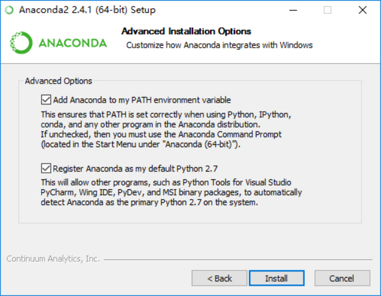
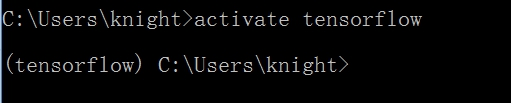
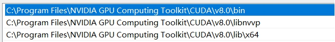
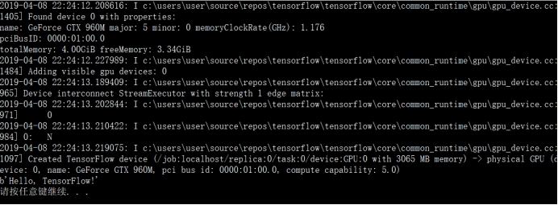

## **Visual Studio Tools for AI安装教程**

### **1.** **平台介绍**

适用于 AI 的 Visual Studio Tools 是开发、调试和部署深度学习和 AI 解决方案，它支持 [Microsoft Cognitive Toolkit (CNTK)](https://www.microsoft.com/en-us/cognitive-toolkit/)、[Google TensorFlow](https://www.tensorflow.org/)、[Theano](http://www.deeplearning.net/software/theano/)、[Keras](https://keras.io/)、[Caffe2](https://caffe2.ai/)等众多深度学习框架的扩展，同时集成了Azure Batch AI和Azure机器学习服务，可将深度学习作业提交到 Azure GPU VM、Spark 群集等，并使用TensorBoard等集成的开放工具可视化模型处理，是当下比较流行的一种用于训练模型并将 AI 融入到应用的高效 AI 开发人员工具。

### **2.** **实验目的**

在VS下配置Visual Studio Tools for AI组件

### **3.** **实验步骤**

#### **1.安装Anaconda:** 

进入Anaconda 官网进行下载，安装过程中使用默认设置即可。在进入如下安装界面时，两个选项都要勾选(如果第一个选项忘记勾选，可以在整个安装完成之后自己设置环境变量)

 

在命令提示符下输入conda -V,出现如下界面则说明Anaconda安装成功

 

#### **2.创建tensorflow环境** 

(1).创建一个名为tensorflow 的环境，指定Python版本是3.5 
	打开cmd:conda create --name tensorflow python=3.5

(2).创建完成后，使用activate激活tensorflow

(退出当前环境输入deactivate tensorflow 即可)

 

 

#### **3.安装tensorflow**

Win10下tensorflow有两个版本，gpu和cpu版本。这里需要看自己的显卡是否支持cuda运算平台(一般N卡都会支持或者百度自己的显卡是否支持)，如果显卡支持cuda那么可以下载gpu版本，不支持的话可以下载cpu版本。在刚才的tensorflow环境中输入命令如下:

 

\# GPU版本pip3 install --upgrade tensorflow-gpu

\# CPU版本pip3 install --upgrade tensorflow

接下来会自动安装tensorflow

 

\####接下来有一点很重要，慎重选择自己cuda和cudnn对应版本，否则会因为版本不兼容而导致tensorflow搭建失败，目前常用的有cuda8 + cudnn6或是cuda9 + cudnn7，在这里推荐cuda8 + cudnn6。

 

#### **4.安装CUDA**

进入CUDA官网https://developer.nvidia.com/cuda-toolkit-archive 下载，选择自己电脑所对应的版本，默认安装即可，安装完成后要在环境变量中加入bin和lib\x64这两个路径。

 

安装完成后输入nvcc -V出现如下所示说明安装成功

 

 

#### **5. 配置CUDNN** 

进入CUDNN官网 <https://developer.nvidia.com/rdp/cudnn-archive> 进行下载(需要注册账号)，这里选择的版本一定要跟刚才的CUDA版本相对应，下载压缩包后，解压刚才下下来的安装包，将这三个文件夹下的文件拷到CUDA对应的文件夹下面即可。

 

#### **6.** **安装VS2017**

进入VS2017的下载链接(注意不要选择VS2019，因Visual Studio Tools for AI暂不支持VS2019)https://visualstudio.microsoft.com/zh-hans/downloads ，下载并安装VS2017，注意在安装过程中要选择组件列表中的Python开发组件。

 

#### **7.** **安装Visual Studio Tools for AI**

进入https://visualstudio.microsoft.com/downloads/ai-tools-vs 下载并运行Visual Studio Tools for AI的安装文件，Visual Studio Tools for AI会自动集成到VS2017中。

 

#### **8.** **新建Tensorflow项目**

在安装好Visual Studio Tools for AI组件后，此时点击新建项目-->开发工具，可以看到VS2017已经为我们准备好了不同框架的AI开发项目，此时我们选择新建TensorFlow项目。

 

#### **9.** **运行项目**

在新建项目后，我们可以看到VS2017已经为我们生成了一个可运行的模板文件，我们按下Ctrl + F5，如果得到以下结果，说明Visual Studio Tools for AI配置成功。

 