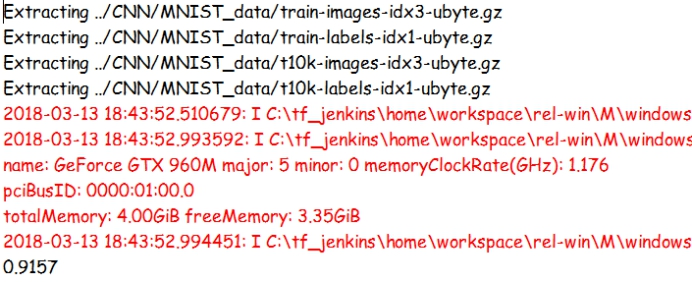

## **基于Visual Studio Tools for AI的TensorFlow编程实现DNN深度神经网络**

### **1.** **背景介绍**

   神经网络是科学家从人类大脑的思考方式中得到启发，进而应用在计算机领域的一种产物。早期，神经网络被称为感知机，虽然能够拟合很多函数，但是线性变化的能力却很弱， 无法解决异或这种线性不可分的问题。后来在1980年，BP反向传播算法提出使得神经网络性能迈出了巨大的一步，但是随着层数的增加或是初始权重的取值不当，科学家们逐渐发现了梯度弥散(随着层数增加导致靠前的层权重无法更新)，梯度爆炸(学习率的控制不当导致权重无法收敛)等等诸多问题，在2006年，深度学习领域泰斗--加拿大多伦多大学教授Geoffrey HintonHinton在《科学》上的一篇论文[1]中提出了两个观点：（1）多层人工神经网络模型有很强的特征学习能力，深度学习模型学习得到的特征数据对原始数据有更本质的代表性，这将大大便于分类和可视化问题；（2）对于深度神经网络很难训练达到最优的问题，可以采用逐层训练方法解决。这一观点提出使得深度学习发展迅速，进而广泛地应用到生活实际中。例如AlphaGo所采用的策略与估值网络震撼了我们的视野，同时图像识别与语音识别技术也正开始逐渐走入到我们的生活中。


### **2.** **相关技术简述:**

#### **什么是神经网络?**

神经网络是由激活函数(将输入信号通过线性变换或者非线性变换进行转换)，网络结构(定义了神经网络的层数，每层含有的神经元数量以及神经元之间的连接方式)和神经网络中的训练算法所组成的对输入数据和输出数据进行建模的工具，神经元可以用下图来表示，x1,x2,x3代表输入，w1,w2,w3代表输入所连接的权重, f代表将结果进行非线性变化输出的激活函数。

 

将这样的神经元进行连接，即为一个神经网络。可以说，神经网络的作用是帮助我们拟合从输入映射到输出的函数。

 


### **3.** **实验目标**

利用TensorFlow平台来实现一个简单的深度神经网络，在MNIST手写数字数据集上进行训练与测试。


### **4. 实验步骤**

本次实验我们分为四个步骤:

* 准备数据 

* 构建神经网络

* 定义损失函数和优化器

* 训练和评价神经网络模型

#### **1)准备数据:**

本次实验我们使用MNIST手写数字数据集, 该数据集总共由70000个手写数字的28*28图片样本组成，其中包含60000个训练样本和10000个测试样本。首先运行如下代码下载MNIST数据集，下载好的数据集会存放在当前路径下的MNIST_data文件夹中，其中one_hot参数为是否使用独热编码，独热编码是一串长度与分类数相同的二进制编码，其中与分类数相对应的位数置为1，其余的位数置为0，打个比方，有一个水果摊贩卖的水果种类有橘子，苹果和樱桃，那么我们可以把这些水果分别编码为100, 010, 001。采用这种编码方式便于最终输出概率分布，是在对数据集处理中经常会用到的编码方式:

```
import tensorflow as tf
from tensorflow.examples.tutorials.mnist import input_data
mnist = input_data.read_data_sets("MNIST_data/", one_hot=True)

```

#### 2)**搭建神经网络：**

对于一个多层的神经网络而言，我们需要定义每一层的输入，输出，权重及偏倚值这些参数。其中输出=输入*权重+偏倚值，我们使用tf.placeholder函数来定义一个输入并存储数据的节点x, 其中None代表不限制数据数量，该值是由实际训练中输入样本的数量来决定的。同时创建另一节点y来存储样本的分类的独热编码。接下来使用tf.Variable函数分别创建权重及偏倚值，权重及偏倚值的初始值对于一个大型的神经网络来说是至关重要的，在以后的实验中我们会讲到初始化权重的方法，对于本次实验中的这种小型神经网络而言我们将其置为0即可，最后我们使用tf.nn.softmax函数作为输出，该函数会使最终输出的概率分布在(0,1)之间，同时也增加了神经网络的非线性变化能力，可以更好地拟合分类的边界。

```
x = tf.placeholder(tf.float32, [None,784])
y_ = tf.placeholder(tf.float32, [None,10])
W = tf.Variable(tf.zeros([784,10]))
b = tf.Variable(tf.zeros([10]))
y = tf.nn.softmax(tf.matmul(x,W)+b)

```

#### **3)** **定义损失函数和优化器:**

我们知道，目前的神经网络均是基于BP算法(反向传播算法)来训练网络中的参数的，即通过优化目标值与输出值之间的损失，也就是差值，来进行参数的调整和优化。所以在这里我们定义该神经网络的损失函数及优化函数，这里我们使用交叉熵作为损失函数。在tensorFlow平台下我们可以直接使用tf.nn.sparse_softmax_cross_entropy_with_logtis函数来定义交叉熵损失函数，由于我们是要求得输入样本的损失值，(输入样本也称为一个batch块)，所以使用tf.reduce_mean函数来求得均值，到这里损失函数定义完毕，接下来是优化器的选择，在这里我们选用梯度下降法来进行优化，该方法的主要思想是首先在损失函数上选取一个点，求得该点的梯度(导数)，同时沿着该点梯度下降的方向移动，直到取得一个极小值，每次移动的距离是由叫做学习率的参数来确定，

用公式的话可以表示为 w’ = w - 学习率*梯度。在TensorFlow中我们使用tf.train.GradientDescentOptimizer即可实现这个过程，其中0.5即为我们所设置的学习率，由于之后我们所输入的样本是选取部分进行输入，所以我们实现的这个方法又称作随机梯度下降法。

```
cross = cross = tf.nn.sparse_softmax_cross_entropy_with_logits(logits=y,labels=tf.argmax(input=y_, axis=1))
cross_entropy = tf.reduce_mean(cross)
train_step = tf.train.GradientDescentOptimizer(0.5).minimize(cross_entropy)

```

#### **4)** **训练和评价神经网络模型：**

在定义完以上所有的操作后(在TensorFlow上也称为创建图的过程)，我们即可以开始神经网络的训练，首先我们设置一个会话并初始化所有变量，同时设置训练次数为1000次，每次训练我们只选取100个样本，这样可以避免神经网络的过拟合，其中op.run函数(在代码中为train_step.run函数作用是为节点所在的图或子图传入相应的输入数据并运行，在训练完成后，我们需要来评测一下我们所建立的模型的性能。我们使用tf.equal函数来比较预测值和真实值的不同，该函数会返回bool类型的向量，tf.argmax指定在维度为1，也就是列方向上返回最大的值的索引，该索引值即为分类的结果，接下来使用tf.cast函数将刚才得到bool类型的向量强制转换为float类型的向量，同时求其平均值得到分类结果。最后我们使用eval函数来输入数据并运行，那么在这里为什么不用run函数呢? 通常，run函数是针对某一个操作，而eval是针对得到一个值，这里我们要取得一个正确率的值，所以我们使用eval函数来运行节点。

```
with tf.Session() as sess:
    tf.global_variables_initializer().run()
    for i in range(1000):
        batch_x, batch_y = mnist.train.next_batch(100)
        train_step.run({x:batch_x, y_:batch_y})
         
    prediction = tf.equal(tf.argmax(y,1), tf.argmax(y_,1))
    accuracy = tf.reduce_mean(tf.cast(prediction, tf.float32))
print('正确率为: %f'%(accuracy.eval({x:mnist.test.images, y_:mnist.test.labels})))
```


### **5.** **实验结论**

结果运行如下:

 

最终我们在MNIST测试集上可以得到92%左右的正确率(每次的训练情况会有所差异)，在图像识别领域上，这个结果不是很高。但是通过本节的学习，相信你一定对于在TensorFlow上如何搭建一个神经网络以及TensorFlow平台的运行机制有了一定的了解，在接下来的学习中，我们会搭建性能表现的更加优异的神经网络。