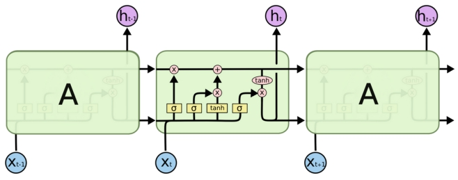

## **基于Visual Studio Tools for AI的TensorFlow编程实现LSTM循环神经网络**

### **1.** **背景介绍**

在介绍LSTM(Long short term memory)长短期记忆单元之前，先让我们来了解一下什么是循环神经网络(RNN(Recurrent Neural Network))。

循环神经网络是对序列数据进行建模的一种神经网络，那么什么是概念最早提出于19世纪80年代，但是由于当时神经网络结构发展的不成熟以及硬件条件不够，所以循环神经网络沉寂了很久，直到近几年才被实际应用到生活中，例如机器翻译，音频识别等领域。循环神经网络是基于序列数据的一种神经网络模型，什么是序列数据呢?序列数据就是数据之间存在某种关联形式而并非独立的，因此循环神经网络可以更好地利用以前的信息来进行训练，让我们来看下面的这句话，‘餐桌上有一个看起来特别可口的苹果，我很想____它’，如果给以下几个备选词，吃掉，送掉，扔掉，那么相信你肯定会选吃掉，这就利用到了上文中’’看起来特别可口“的信息，循环神经网络工作的原理就与你脑海中刚才思考选哪个词的思考方式类似，具体的工作原理我们会在后面讲到。但是传统的RNN存在着信号遗忘的问题，即信号越早被输入，那么随着训练的进行，该信号的强度就会越来越弱，还是以上面的句子为例，如果一开始说’有一个看起来特别可口的苹果’，然后插入了一大段话，最后’我很想____它’，这时你已经把苹果的事情都忘记得差不多了，当然很难选出答案。因为这个问题，RNN在早期性能很弱，远远达不到应用于生活实际的条件，后来在2012年随着LSTM的正式应用，RNN在很多领域上获得了巨大的成功，接下来让我们来看一下RNN与LSTM单元的结构。


### **2.** **相关技术简介**

#### **1.循环神经网络的结构是怎样的?**

 

如上图所示，左边即为循环神经网络，右边为展开形式，通过展开形式我们可以看到在循环神经网络中，隐藏结点之间是有相互关联的，上一时刻的输出会作为下一时刻的输入，因此这种结构很适合处理序列数据，在这里还有一个亮点，我们训练的参数不会因为迭代的次数而增加，每层的参数都是相同的，因为在循环神经网络的结构中采用了共享参数的概念，只需要学习输入层到隐含层，隐含层到输出层，隐含层到下一个时刻的隐含层这三个权重矩阵。那么我们如何对其进行训练呢?在这里由于引入了时间相关的序列，因此我们使用BP算法的推广算法BPTT(随时间反向传播)或是使用RTRL算法来更新网络中的权重，由上图结构可以知道，随着训练次数的不断增加，间隔很远的信息是很难被使用到的，这就是长期依赖问题(Long-term Dependencies)，为了解决这个问题，Schmidhuber教授在1997年提出一种解决方案，即RNN网络的一种变种——LSTM。

#### **2.** **LSTM的结构是怎样的?**

我们照例贴上一张LSTM单元结构图以助于讲解。

 

上图即为LSTM网络的展开结构，对比传统的RNN，LSTM的结构更加复杂，这里我们先引入两个概念：细胞状态(Cell State)和门(Gates)，在上图中的第一个带有*和+的直线即为细胞状态，它记录着整个LSTM单元的状态，这条线会贯穿始终，记录并更新着全局的信息，比如我们还是以之前提过的那句话为例：“餐桌上有一个看起来特别可口的苹果，我很想____它”，当输入‘餐桌上有一个看起来特别可口的苹果’时，细胞状态会记录下主语是一个苹果，定语是看起来特别可口。接着输入时，主语就从‘苹果’变成了‘我’，最后根据上文的‘既可爱又善良’信息来预测下一个词的输入，整个过程中的干预很少，因此能记录很远之前的信息。接下来我们来介绍门(Gates)的概念，门可以说是LSTM单元设计的一个亮点之一，在LSTM单元内，一共存在着三种门，以上图为例，从左到右依次为遗忘门，输入层门，输出层门，遗忘门顾名思义，是将当前输入与上一层单元的输出通过sigmoid层，这个门决定了遗忘之前信息的程度，0代表完全忘记，1代表全部保留，比如刚刚产生了一个新的主语，因此会把之前的主语信息覆盖掉，第二个门为输入门，首先通过tanh层生成候选值，然后通过sigmoid函数层来决定细胞状态的哪部分需要更新。最后，细胞状态通过tanh层并与sigmoid层的输入相乘，这样就得到了根据细胞状态而得到的输出(即根据上文的历史信息所得到的输出)，综上所述，细胞状态即为长期记忆，每一层的输出会作为输入进入下一层，为短期记忆，因此这种结构被称为长短期记忆网络，在训练的过程中，长短期记忆网络训练也采用BPTT算法，同时LSTM也可以指定哪层有输入或者输出，这部分视具体的任务目标而定。

#### **3.自然语言处理相关——Word2Vec模型**

  Word2Vec模型是Google在自然语言处理领域中提出的一个重要模型，在早期，人们将每个单词进行独one_hot编码后作为输入，不过人们也很快地发现了这种做法的弊端，首先，再词汇量很大的情况下，那么我们的one_hot编码的长度也会随之增长，同时，这种表达方式也看不出词与词之间的相关性，比如(你，我，他)这种词性很相近的词在one_hot编码中无法表达。这时科学家提出了一个新的思想，能不能将这种表达方式映射到维度更低的空间(即降维表达)，将之前的稀疏向量转换成稠密向量，同时将词性相近的词映射到空间的临近区域内，这样就能够使输入的效率大大提升，同时有助于自然语言处理模型的训练，这种表达方式我们称之为词向量。同时该论文指出，我们可以选择两种模型进行训练，第一种称为CBOW(可以称之为词袋模型)，第二种称之为Skip-Gram模型，CBOW的主要思想是将一句话中的某个词的上下文作为输入，该词作为输出，打个比方，有’I like the apple tree’和’I like the lemon tree’这两句话，根据’like’和’tree’，神经网络会根据权重值判断中间的词应该是水果。在训练的过程中，’apple’和’lemon’就会映射到临近的区域中，这是根据语境来推测目标词汇。而Skip-Gram模型与此相反，是根据目标词汇来推出上下文的语境，Skip-Gram的思想是将一句话中的某个词作为输入，该词的上下文作为输出，注意的是，这里的输入输出均是采用one_hot编码，只有在训练的时候采用词向量形式，同时这两个模型均是基于神经网络来训练完成的，如果对这方面感兴趣可以自行查阅资料。


### **3. 实验目标**

利用TensorFlow平台所搭建的LSTM网络实现PTB(penn tree bank)模型，该模型包含了上百万的英文词汇，经常用于自然语言处理中，并评测LSTM在PTB模型上的性能。


### **4.** **实验步骤**

本次实验我们分为三个步骤:

* 下载数据集并载入所需要的库

* 构建PTB模型

* 评价神经网络前馈与反馈的训练时间

(本节代码主要来源于TensorFlow的开源实现)

首先我们将本节附带的simple-examples压缩数据集解压并放到指定的工作目录下，同时载入把models/tutorials/rnn/ptb导入当前工作目录，这样可以直接调用处理数据的函数，最后载入我们本节所需要的库，其中reader是ptb库中的一个文件。

import tensorflow as tfimport numpy as npimport timeimport reader

```
import tensorflow as tf
import numpy as np
import time
import reader
```

首先我们指定batch_size为一个batch块的大小，接下来指定num_steps为LSTM的展开步数(即在LSTM网络中迭代num_steps次)，接着指定epoch_size为在一个epoch内(即遍历一遍所有样本)，所需要多少轮num_steps迭代，接下来使用reader中的ptb_producer函数来得到一块大小为[batch_size, num_steps]数据。


```
class PTBInput(object):
        def __init__(self, config, data, name=None):
            self.batch_size = batch_size = config.batch_size
            self.num_steps = num_steps = config.num_steps
            self.epoch_size = ((len(data) // batch_size) - 1) // num_steps
            self.input_data, self.targets = reader.ptb_producer(data, batch_size, num_steps, name=name)
        
```

接下来开始搭建PTB模型，首先我们定义一个PTBModel新式类来创建PTB模型，首先定义初始化函数init来设置该模型的输入input、batch_size、num_steps，以及隐藏节点的个数size，同时设置词汇表的大小vocab_size，该词汇表用来存储训练所得到的单词的词向量。

```

class PTBModel(object):
        def __init__(self, is_training, config, input_):
            self._input = input_
            batch_size = input_.batch_size
            num_steps = input_.num_steps
            size = config.hidden_size
            vocab_size = config.vocab_size
        
```

初始化完成后，接下来定义LSTM单元，这里等于定义一个具有size个隐藏节点的隐含层，注意这里的隐藏节点是串联在一起的。我们在TensorFlow平台下可以使用tf.contrib.rnn.BasicLSTMCell函数来定义LSTM单元，其中size指定了LSTM隐藏节点的数量，forget_bias指定了LSTM单元中遗忘门的偏置(如果这里forget_bias设置为1效果会更好)，state_is_tuple指定了接收和返回是否是以以二元组的形式，该二元组代表着LSTM单元的长时记忆与短时记忆(即Cell State & h outputs)

```
        def lstm_cell():
            #state_is_tuple 代表接受和返回的state是2-turple形式
            return tf.contrib.rnn.BasicLSTMCell(size, forget_bias=0.0,state_is_tuple=True)
            
```

接下来我们添加Drop_out层来防止过拟合，这里我们使用tf.contrib.rnn.DropoutWrapper函数来进行drop_out操作。

```
        if is_training and config.keep_prob < 1:
            def attn_cell():
                return tf.contrib.rnn.DropoutWrapper(lstm_cell(), output_keep_prob = config.keep_prob)
                
```

接着我们将刚才得到的LSTM进行堆叠来生成LSTM网络，这里TensorFlow为我们提供了tf.contrib.rnn.MultiRNNCell函数以便更方便地堆叠LSTM单元，其中state_is_tuple也指定了接收和返回是否是以以二元组的形式，最后将cell的初始化状态置为0

```
        cell = tf.contrib.rnn.MultiRNNCell([attn_cell() for _ in range(config.num_layers)], state_is_tuple=True)
        									self._initial_state = cell.zero_state(batch_size, tf.float32)
        
```

接下来指定设备在cpu上进行，因为在转换词向量时gpu可能无法很好地支持。我们使用get_variable函数来创建一个名为embedding的[vocab_size, size]矩阵，其中vocab_size代表词汇量，size代表每个词汇输出的维度，接下来使用tf.nn.embedding_lookup函数来将词汇转换为词向量，为了防止过拟合，我们在此加入drop_out层。

```
        with tf.device("/cpu:0"):
            #创建词汇表维数矩阵并转换为词向量
            embedding = tf.get_variable("embedding", [vocab_size, size], dtype=tf.float32)
            inputs = tf.nn.embedding_lookup(embedding, input_.input_data)
        if is_training and config.keep_prob < 1:
            inputs = tf.nn.dropout(inputs, config.keep_prob)
```

接下来我们定义一个outputs列表用来存储每次num_steps的输出，同时我们使用tf.get_vatiable_scope().reuse_variables()来复用所定义的变量，这里主要是复用变量state以用来不断地更新cell_state，接着我们向LSTM输入训练数据以及上一层的cell_state，这里自动集合了上一时刻的cell_output，因此无需cell_output参数，在这里inputs有三个维度，第一个维度代表batch的样本数，第二个维度代表每个batch的第几列单词，第三个维度代表单词的词向量维度，在每个num_steps训练完成后，将该层的输出添加到outputs集合中以便后面的反馈计算。

```
        outputs = []
        state = self._initial_state
        with tf.variable_scope('RNN'):
            for time_step in range(num_steps):
                if time_step > 0 : tf.get_variable_scope().reuse_variables()
                (cell_output, state) = cell(inputs[:, time_step, :], state)
                outputs.append(cell_output)
```

接着我们将outputs集合中所有的输出按列的方向拼接在一起(列数增加的方向)，这里使用tf.concat函数来进行拼接，指定拼接维度为1(0为行数增加)，同时将得到的新的矩阵的维度进行转换，使得新矩阵的列数为输出维度大小，行数-1代表矩阵所有元素个数/size，这个值是由TensorFlow计算得出，因此可以节省我们计算的时间。这个匹配维度的过程是为了计算最终输出和损失函数，接下来定义输出层的权重softmax_w和偏置softmax_b，由于最后我们想输出的是单词的one_hot编码，输出维度的大小为vocab_size，因此输出层的权重softmax_w大小为[size, vocab_size]，偏置softmax_b大小为[vocab_size]，然后定义输出logits，接下来定义损失函数loss，这里依然采用极大似然估计，loss = -1/N Σ(N, i=1)ln (ptarget)，然后计算每个样本的均误差cost，同时保存最终的训练状态，最后如果不是在训练中，该函数直接返回。

```
        output = tf.reshape(tf.concat(outputs, 1), [-1, size])
        softmax_w = tf.get_variable('softmax_w', [size, vocab_size], dtype=tf.float32)
        softmax_b = tf.get_variable('softmax_b', [vocab_size], dtype=tf.float32)
        logits = tf.matmul(output,softmax_w) + softmax_b
        #loss = -1/N Σ(N, i=1)ln p target 
        loss = tf.contrib.legacy_seq2seq.sequence_loss_by_example([logits], [tf.reshape(input_.targets, [-1])], 		    	        [tf.ones([batch_size*num_steps], dtype=tf.float32)])
        self._cost = cost = tf.reduce_sum(loss) / batch_size
        self._final_state = state
        
        if not is_training :
            return 
```

下面来设置优化器的学习率，在这里设置学习率不可训练，也就是学习率不随着训练而变化，首先我们使用tf.trainable_variables()获取全部的训练参数tvars，接下来使用tf.clip_by_global_norm设置梯度的最大范数，范数经常用于正则化项中，在这里的作用是限制权重的范围，不会让权重过大而导致梯度爆炸，在这里我们使用tf.gradients函数来获取损失函数对所有训练参数的梯度，在这里我们使用梯度下降法进行优化，然后使用apply_gradients函数将正则化后的梯度应用到全部的训练参数上，同时使用tf.train.get_or_create_global_step()来生成全局统一的训练步数。

```
        self._lr = tf.Variable(0.0, trainable=False)
        tvars = tf.trainable_variables()
        grads, _ = tf.clip_by_global_norm(tf.gradients(cost, tvars), config.max_grad_norm)
        optimizer = tf.train.GradientDescentOptimizer(self.lr)
```

下面来定义控制学习率的部分，首先定义一个输入tensor new_lr用以存储待更新的学习速率，然后定义一个更新操作lr_update用以将待更新的学习速率赋值给当前的学习速率。最后定义一个方法assign_lr用来执行这个操作。

```
        self._train_op = optimizer.apply_gradients(zip(grads, tvars), global_step=tf.train.get_or_create_global_step())
        self._new_lr = tf.placeholder(tf.float32, shape=[], name='new_learning_rate')
        self._lr_update = tf.assign(self._lr, self._new_lr)
    def assign_lr(self, session, lr_value):
        session.run(self._lr_update, feed_dict = {self._new_lr:lr_value})
```

接下来我们使用Python中的@property装饰器将返回变量设为只读，这样可以防止修改变量所引发的问题，类似于Java中的get方法。

```
    @property
    def input(self):
        return self._input
    
    @property
    def initial_state(self):
        return self._initial_state
    
    @property
    def cost(self):
        return self._cost
    
    @property
    def final_state(self):
        return self._final_state

    @property
    def lr(self):
        return self._lr
    
    @property
    def train_op(self):
        return self._train_op
```

最后我们定义该模型的配置，这里一共有四个配置：SmallConfig，MediumConfig，LargeConfig，TestConfig，这里我们以SmallConfig为例讲解一下各个参数，init_scale是网络权重值的初始scale，learning_rate为学习速率的初始值，max_grad_norm为最大梯度范数，num_layers是LSTM堆叠层数，num_steps是LSTM梯度反向传播的展开步数，hidden_size是LSTM的隐藏节点数，max_epoch是初始学习速率可训练的epoch，max_max_epoch是总共训练的epoch数，keep_prob是dropout层的保留比例，lr_decay是学习速率的衰减速度，batch_size是每个batch中的样本数量，vocab是词汇表的大小。

```
class SmallConfig(object):
    init_scale = 0.1
    learning_rate = 1.0
    max_grad_norm = 5
    num_layers = 2
    num_steps = 20
    hidden_size = 200
    #初始学习速率可训练的epoch数
    max_epoch = 4
    max_max_epoch = 13
    keep_prob = 1.0
    lr_decay = 0.5
    batch_size = 20
    vocab_size = 10000

class MediumConfig(object):
    init_scale = 0.05
    learning_rate = 1.0
    max_grad_norm = 5
    num_layers = 2
    num_steps = 35
    hidden_size = 650
    max_epoch = 6
    max_max_epoch = 39
    keep_prob = 0.5
    lr_decay = 0.8
    batch_size = 20
    vocab_size = 10000
    
class LargeConfig(object):
    init_scale = 0.04
    learning_rate = 1.0
    max_grad_norm = 10
    num_layers = 2
    num_steps = 35
    hidden_size = 1500
    max_epoch = 14
    max_max_epoch = 55
    keep_prob = 0.35
    lr_decay = 1 / 1.15
    batch_size = 20
    vocab_size = 10000
    
class TestConfig(object):
    init_scale = 0.1
    learning_rate = 1.0
    max_grad_norm = 1
    num_layers = 1
    num_steps = 2
    hidden_size = 2
    max_epoch = 1
    max_max_epoch = 1
    keep_prob = 1.0
    lr_decay = 0.5
    batch_size = 20
    vocab_size = 10000
```

接下来定义一个训练epoch的函数run_epoch，首先定义开始的时间，并初始化损失，迭代次数以及初始状态，接着定义fetches字典用来存储损失以及最终的状态，如果有评测操作eval_op，则把评测状态也加入到fetches中。接下来开始训练，每个epoch_size相当于训练num_steps次，在每次循环中，我们将训练产生的LSTM单元的state加入feed_dict中，其中enumerate(model.initial_state)表示LSTM的堆叠次数，最后将这些状态传入fetches中进行训练，最后得到一次训练的cost和state，之后我们将cost累加到costs上，同时累加总共的迭代次数，最后每完成10%的训练，就输出一次结果，分别显示当前进度，preplexity(平均cost自然常数指数，越低代表模型输出的概率分布在预测样本上越好)和训练速度，最后返回preplexity。

```
def run_epoch(session, model, eval_op=None, verbose=False):
    start_time = time.time()
    costs = 0.0
    iters = 0
    state = session.run(model._initial_state)
    
    fetches = {
        'cost':model.cost,
        'final_state':model.final_state,
    }
    if eval_op is not None:
        fetches['eval_op'] = eval_op
    
    print(model.initial_state)
    for step in range(model.input.epoch_size):
        feed_dict = {}
        for i, (c,h) in enumerate(model.initial_state):
            feed_dict[c] = state[i].c
            feed_dict[h] = state[i].h
        vals = session.run(fetches, feed_dict)
        cost = vals['cost']
        state = vals['final_state']
        
        costs += cost
        iters += model.input.num_steps
        
        if verbose and step % (model.input.epoch_size // 10) == 10:
            print('%.3f perplexity: %.3f speed: %.0f wps' % (step * 1.0 / model.input.epoch_size, np.exp(costs / iters), iters*model.input.batch_size / (time.time() - start_time)))
    
    return np.exp(costs / iters)
```

接下来正式开始训练，首先我们创建一个默认图，在该图下我们使用tf.random_uniform_initializer来设置参数的初始化范围在(-init_scale, init_scale)之间，然后定义训练模型，验证模型以及测试模型，接着使用tf.train.Supervisor创建训练管理器sv，并创建默认session，再执行训练多个epoch数据的循环，在每次循环内我们更新学习速率，然后进行一个epoch的训练和验证，并输出当前的学习速率，训练和验证集上的preplexity，在完成训练后，计算并输出模型在测试集上的perplexity，这里为了节省时间，我们使用TestConfig进行测试。

 

```
raw_data = reader.ptb_raw_data('simple-examples/data/')
train_data, valid_data, test_data, _ = raw_data

config = TestConfig()
eval_config = TestConfig()
eval_config.batch_size = 1
eval_config.num_steps = 1

with tf.Graph().as_default():
    #限定所有参数范围
    initializer = tf.random_uniform_initializer(-config.init_scale, config.init_scale)
    
    with tf.name_scope('Train'):
        train_input = PTBInput(config=config, data=train_data, name='TrainInput')
        with tf.variable_scope('Model', reuse=None, initializer=initializer):
            m = PTBModel(is_training=True, config=config, input_=train_input)
    
    with tf.name_scope('Valid'):
        valid_input = PTBInput(config=config, data=valid_data, name='ValidInput')
        with tf.variable_scope('Model', reuse=True, initializer=initializer):
            mvalid = PTBModel(is_training=True, config=config, input_=train_input)
            
    with tf.name_scope('Test'):
        test_input = PTBInput(config=eval_config, data=test_data, name='TestInput')
        
        with tf.variable_scope('Model', reuse=True, initializer=initializer):
            mtest = PTBModel(is_training=False, config=eval_config, input_=test_input)
    
    #创建训练管理器
    sv = tf.train.Supervisor()
    #创建默认session
    with sv.managed_session() as session:
        for i in range(config.max_max_epoch):
            lr_decay  = config.lr_decay ** max(i + 1 - config.max_epoch, 0.0)
            m.assign_lr(session, config.learning_rate * lr_decay)
            
            print('Epoch: %d Learning rate: %.3f' %(i + 1, session.run(m.lr)))
            train_perplexity = run_epoch(session, m, eval_op=m.train_op, verbose=True)
            print('Epoch: %d Train Perplexity: %.3f' % (i + 1, train_perplexity))
            valid_perplexity = run_epoch(session, mvalid)
            print('Epoch: %d Valid Perplexity: %.3f' % (i + 1, valid_perplexity))
            
        test_perplexity = run_epoch(session, mtest)
        print('Test Perplexity: %.3f' % test_perplexity)
```


### **5.** **实验结论**

实验结果如下:

 

通过本节构造的PTB模型，我们可以看到LSTM中可以利用过去的信息进行预测，同时LSTM也不仅仅用于自然语言处理，也可以用于图像识别中。在今天，同时也出现了LSTM的很多变种以达到更好的效率，比如GRU，Bi-LSTM等等，LSTM是RNN发展上的一个重要里程碑。

 