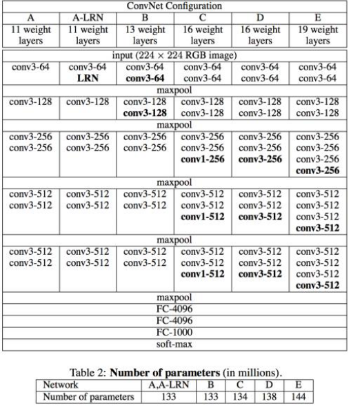
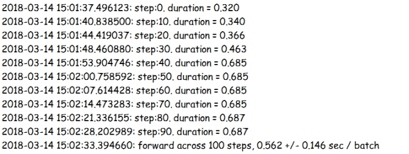

## **基于Visual Studio Tools for AI的TensorFlow编程实现RCNN区域卷积神经网络**

### **1.** **背景介绍**

RCNN(区域神经网络)经常用于图像object detection(目标检测)任务，目标检测任务即我们不但要识别图中的物体属于哪种类别，同时还要精准地框出它在图像中的位置，也就是区域神经网络涉及到了两个任务，即图像识别以及图像定位。由于模型训练很复杂，在这里主要讲解图像定位的原理并实现另一种在图像识别领域中常用的网络——VGGNet，VGGNet网络是牛津大学视觉组和Google DeepMind公司研究员一起开发出的深度卷积神经网络，该神经网络获得了2014年ILSVRC比赛分类任务的第二名和定位项目的第一名，VGGNet全部使用了3\*3的卷积核及2\*2的池化核，使得整体的架构非常简洁，直到今天VGGNet仍然有着非常广泛的应用。


### **2.** **相关技术简介**

#### **1.** **RCNN实现图像定位的原理是什么?**

RCNN对于图像定位采用了这样的一种思想，即先使用选择性搜索来选出1000~2000个大小不一的候选框区域，然后对这些候选框进行修剪，放缩等处理，使得每个候选框的尺寸达到一致，之后输入到卷积神经网络进行特征提取，提取特征后通过二分类SVM来判定候选框中的物体是否属于这个类别，最后通过一个回归器精修候选框的位置，对于每一个类找出框得最完美的那个候选框，最后复原并拼接到原图像中。

#### **2. VGGNet的组成结构是什么?**

 

通过上图所示，我们可以看到VGGNet从A到E网络逐渐加深，每个网络都拥有5段卷积，越靠后卷积核的数量越多，并且这些卷积核尺寸均为3*3，为什么采用这个设计呢?通过含有3\*3卷积核的卷积层的堆叠(相当于将这些卷积层串联在一起)，可以实现大型的卷积核的卷积效果，同时减少参数并增加了非线性变换。如下图所示

 

 

在图中我们可以看到，通过两个含有3\*3卷积核的卷积层相互堆叠，最终实现了5\*5卷积核的效果，这不仅增加了卷积层数并且参数量由5\*5 = 25 降为 3\*3\*2 = 18，使得网络可以向更深层次扩展。同时，我们还可以在图中发现一个有趣的现象，在C级网络中，有些部分使用了1*1的卷积核，这种卷积核相对于对图像每个像素点进行卷积，舍去了空间特性，那么为什么要使用1\*1的卷积核呢?一般来说，使用1\*1卷积核是为了降低维度或是增加非线性变化能力，在这里原作者是想要增加网络的非线性变化能力。同时作者对比这些网络的时候提出了如下的几个观点:

* LRN局部响应归一化层对于网络的性能来讲作用不大

* 越深的网络效果越好

* 1\*1卷积核很有效但远远不如3\*3，因为1*1卷积核并没有利用到空间特征

同时我们会发现，随着网络的不断加深，参数量并没有很明显的增长，这是因为参数量主要集中在全连接层，随着深度学习的不断发展，有些神经网络直接去掉了全连接层以追求高性能。在实际生活中，我们经常使用的是D级与E级网络，也就是VGGNet-16和VGGNet-19，本节我们仿照AlexNet，实现VGGNet-16网络。


### **3. 实验目标**

利用TensorFlow平台来实现简易的一个VGGNet-16神经网络，并测试VGGNet-16网络的前馈与反馈的时间。


### **4.** **实验步骤**

本次实验我们分为三个步骤:

* 载入所需要的库并预定义操作

* 构建神经网络

* 评价神经网络前馈与反馈的训练时间

(本节代码主要来源于TensorFlow的开源实现，并做了一些修改。)

首先我们导入本次实验所需要的库及定义所需变量，这部分与AlexNet是相同的

```
from datetime import datetime
import time
import math
import tensorflow as tf

batch_size = 10
num_batches = 100
```

由于本次实验由于涉及到的卷积操作较多，因此我们将卷积层，池化层以及全连接层单独定义一个函数以便后面使用，首先让我们来定义卷积层的函数，这里input_op参数代表输入，name代表该卷积层的名称，kh代表卷积核的宽，kw代表卷积核的高，n_out指卷积核的数量(或隐藏节点的个数), dh代表卷积核在宽方向上的步长，dw指卷积核在高方向上的步长，最后p指参数列表。同时卷积核的参数加到参数列表中，最后使用ReLu函数作为该卷积层的激活函数。

```
def conv_op(input_op, name, kh, kw, n_out, dh, dw, p):
    n_in = input_op.get_shape()[-1].value
    
    with tf.name_scope(name) as scope:
        kernel = tf.get_variable(scope+'w', shape=[kh, kw,n_in, n_out], dtype=tf.float32, initializer=tf.contrib.layers.xavier_initializer_conv2d())
        conv = tf.nn.conv2d(input_op, kernel, (1,dh,dw,1), padding='SAME')
        bias_init_val = tf.constant(0.0, shape=[n_out], dtype=tf.float32)
        biases = tf.Variable(bias_init_val, trainable=True, name='b')
        z = tf.nn.bias_add(conv, biases)
        p += [kernel, biases]
        return tf.nn.relu(z, name=scope)
```

接下来定义池化层，这里使用最大池化方式，参数与卷积层参数是类似的。

```
def mpool_op(input_op, name, kh, kw, dh, dw):
     return tf.nn.max_pool(input_op, ksize=[1, kh, kw, 1], strides=[1, dh, dw, 1], padding='SAME', name=name)
```

接下来定义全连接层，全连接层与我们AlexNet中定义的稍微有些不同，这里使用的是xavier初始化器，该初始化分布是服从以下的均匀分布，目的是让每层输出的方差相同。

```
#定义全连接层
def fc_op(input_op, name, n_out, p):
    n_in = input_op.get_shape()[-1].value
    
    with tf.name_scope(name) as scope:
        kernel = tf.get_variable(scope+'w', shape=[n_in, n_out], dtype=tf.float32, initializer=tf.contrib.layers.xavier_initializer()))
        bias_init_val = tf.constant(0.0, shape=[n_out], dtype=tf.float32)
        biases = tf.Variable(bias_init_val, trainable=True, name='b')
        p += [kernel, biases]
        return tf.nn.relu_layer(input_op, kernel, biases, name=scope)
```

接下来我们按照VGGNet的层次图开始构建VGGNet网络，构建方法与AlexNet相同，在这里不做太多叙述。

```
def mpool_op(input_op, name, kh, kw, dh, dw):
     return tf.nn.max_pool(input_op, ksize=[1, kh, kw, 1], strides=[1, dh, dw, 1], padding='SAME', name=name)   

def inference_op(input_op, keep_prob):
    p = []
    conv1_1 = conv_op(input_op, name='conv1_1', kh=3, kw=3, n_out=64, dh=1, dw=1, p=p)
    conv1_2 = conv_op(conv1_1, name='conv1_2', kh=3, kw=3, n_out=64, dh=1, dw=1, p=p)    
    pool1 = mpool_op(conv1_2, name='pool1', kh=2, kw=2, dw=2, dh=2)
    
    conv2_1 = conv_op(pool1, name='conv2_1', kh=3, kw=3, n_out=128, dh=1, dw=1, p=p)
    conv2_2 = conv_op(conv2_1, name='conv2_2', kh=3, kw=3, n_out=128, dh=1, dw=1, p=p)    
    pool2 = mpool_op(conv2_2, name='pool2', kh=2, kw=2, dw=2, dh=2)
    
    conv3_1 = conv_op(pool2, name='conv3_1', kh=3, kw=3, n_out=256, dh=1, dw=1, p=p)
    conv3_2 = conv_op(conv3_1, name='conv3_2', kh=3, kw=3, n_out=256, dh=1, dw=1, p=p)    
    conv3_3 = conv_op(conv3_2, name='conv3_2', kh=3, kw=3, n_out=256, dh=1, dw=1, p=p)    
    pool3 = mpool_op(conv3_3, name='pool3', kh=2, kw=2, dw=2, dh=2)
    
    conv4_1 = conv_op(pool3, name='conv4_1', kh=3, kw=3, n_out=512, dh=1, dw=1, p=p)
    conv4_2 = conv_op(conv4_1, name='conv4_2', kh=3, kw=3, n_out=512, dh=1, dw=1, p=p)  
    conv4_3 = conv_op(conv4_2, name='conv4_2', kh=3, kw=3, n_out=512, dh=1, dw=1, p=p)  
    pool4 = mpool_op(conv4_3, name='pool4', kh=2, kw=2, dw=2, dh=2)
    
    conv5_1 = conv_op(pool4, name='conv5_1', kh=3, kw=3, n_out=512, dh=1, dw=1, p=p)
    conv5_2 = conv_op(conv5_1, name='conv5_2', kh=3, kw=3, n_out=512, dh=1, dw=1, p=p)  
    conv5_3 = conv_op(conv5_2, name='conv5_3', kh=3, kw=3, n_out=512, dh=1, dw=1, p=p)  
    pool5 = mpool_op(conv5_3, name='pool5', kh=2, kw=2, dw=2, dh=2)
    
    #全连接
    shp = pool5.get_shape()
    flattened_shape = shp[1].value*shp[2].value*shp[3].value
    resh1 = tf.reshape(pool5, [-1, flattened_shape], name='resh1')
    
    fc6 =fc_op(resh1, name='fc6', n_out=4096, p=p)
    fc6_drop = tf.nn.dropout(fc6, keep_prob, name='fc6_drop')
    
    fc7 =fc_op(fc6_drop, name='fc7', n_out=4096, p=p)
    fc7_drop = tf.nn.dropout(fc7, keep_prob, name='fc7_drop')
    
    fc8 = fc_op(fc7_drop, name='fc8', n_out=1000, p=p)
    softmax = tf.nn.softmax(fc8)
    predict = tf.argmax(softmax, 1)
    return predict, softmax, fc8, p
```

接下来的评测方法也与AlexNet相同，本节不做太多叙述。

```
def time_tensorflow_run(session, target, feed, info_string):
    num_steps_burn_in = 10
    total_duration = 0.0
    total_duration_squared = 0.0
    
    for i in range(num_steps_burn_in + num_batches):
        start_time = time.time()
        _ = session.run(target, feed_dict=feed)
        duration = time.time() - start_time
        if i>= num_steps_burn_in:
            if not i % 10:
                print(r'%s: step:%d. duration = %.3f' % (datetime.now(), i - num_steps_burn_in, duration))
            total_duration += duration
            total_duration_squared += duration * duration
    mn = total_duration / num_batches
    vr = total_duration_squared / num_batches - mn*mn
    sd = math.sqrt(vr)
    print(r'%s: %s across %d steps, %.3f +/- %.3f sec / batch' % (datetime.now(), info_string, num_batches, mn, sd))

def run_benchmark():
    with tf.Graph().as_default():
        image_size = 224
        images = tf.Variable(tf.random_normal([batch_size,image_size,image_size,3], dtype=tf.float32, stddev=1e-1))
        
        keep_prob = tf.placeholder(tf.float32)
        predictions, softmax, fc8, p = inference_op(images, keep_prob)
        
        init = tf.global_variables_initializer()
        sess = tf.Session()
        sess.run(init)
        
        time_tensorflow_run(sess, predictions,{keep_prob:1.0}, "forward")
        objective = tf.nn.l2_loss(fc8)
        grad = tf.gradients(objective, p)
        time_tensorflow_run(sess, grad,{keep_prob:0.5}, 'Forward-backword')
        
run_benchmark()
```

### 5. **实验结论**

最终结果如下:

  

原论文中的实验结果是很均匀的，在这里发生抖动的原因是由于笔者的显存不太够引发显存命中等问题才使得时间不一致。将我们所得到的结果与AlexNet做对比，我们可以发现网络的计算用时高了很多，这是因为网络加深的缘故，但同时准确率也带来了很大的提升，这说明神经网络开始向越来越深的方向发展，VGGNet凭借较小的复杂度和优秀的分类性能，直到今天也拥有着很深的影响。在后来的发展中，更诞生了GoogLeNet，ResNet这样更加优异的卷积神经网络。同时根据RCNN的介绍，我们可以直观感受到，这是一种效率很低的做法，在后来的发展中，更是诞生了Fast RCNN与Faster RCNN这样的效率更高的区域卷积神经网络，在目标检测的领域发挥着愈来愈重要的作用。

