## 《智能之门》- 学习“深度学习”知识的痛点及解决办法

上回书说到，Xiaowu 根据自己的学习经历写下了《智能之门》一书，而在此之前，Xiaowu 也是对深度学习一无所知的。这就给广大读者一个非常强的提示：我如果按照 Xiaowu 的学习经历走一遍下来，是不是也能彻底掌握深度学习知识呢？与 Xiaowu 当初的经历不同的是，读者走的这条路，已经是“先辈们”（Xiaowu）逢山开路遇水搭桥的平凡之路了，应该可以更顺利些。

反观现在市面上的很多关于深度学习与神经网络的书，大致可以分为两类：

1. 偏重理论。

    从知识的难度看，可以分为四个等级：
    - Factual Knowledge 事实知识
    - Conceptual Knowledge 概念知识
    - Procedural Knowledge 过程知识
    - Meta-cognitive Knowledge 元认知知识

    这类书大多是罗列公式和概念，没有推导，没有解释，所以作者们是把深度学习的知识当作事实知识来写的。但实际上，要想彻底理解深度学习的知识，至少需要上升到第二等级（概念知识）甚至第三等级（过程知识）。那么我们如何才能把深度学习的知识上得到高的等级来讲解呢？

2. 偏重实践。

    这类书的作者们大多是绑定在一个深度学习框架上，比如 Tensor Flow，PyTorch，MXNet 等等。读者能学习到的是如何使用这些框架工具来搭建一个正确的神经网络模型，然后训练并推理。这种学习的结果是知其然不知其所以然，比如：读者们只知道在两个线性层之间要有一个激活层，那么为什么这样就可以解决非线性问题呢？

《智能之门》一书的作者们，带着上面这些问题，深入高校，通过与高校老师和学生面对面的交流后，总结出了学习“深度学习”知识的六大痛点，并提出了解决办法。这些写作思想贯彻于全书之中。

### 痛点一

**基础不牢，开篇就讲 DNN、CNN、RNN，导致入门门坎过高，学生不易理解。**

**解决办法：循序渐进，从一个神经元开始。**

请大家看下表，一个神经元（放大绘制的），第二个只是多了一个输出，第三个多了一个分类函数，后面增加到三个神经元加一个三分类函数；在后面就是两层的神经网络，根据第二层的形态不同而完成不同的任务；再后面才开始讲 DNN、CNN、RNN。

|网络结构|网络结构|
|--|--|
||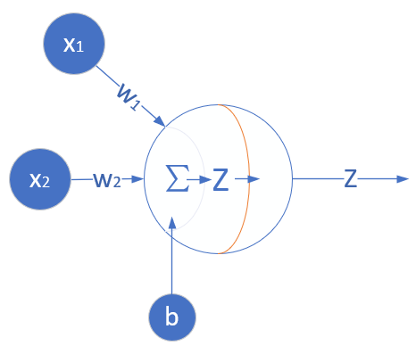|
|单入单出一层：一元线性回归|多入单出一层：多元线性回归|
|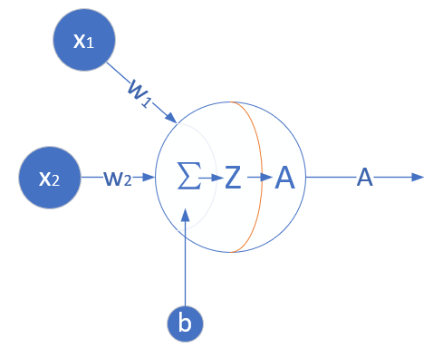|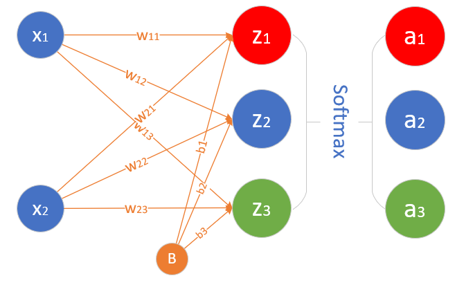|
|多入单出一层：线性二分类|多入多出一层：线性多分类|
|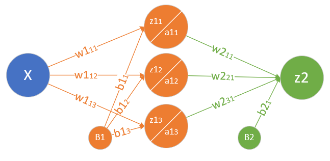|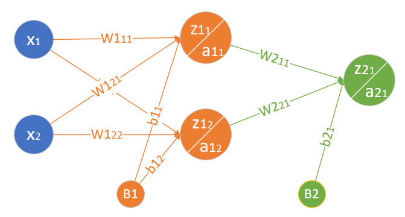|
|单入单出两层：一元非线性回归/拟合|多入单出两层：非线性二分类|
|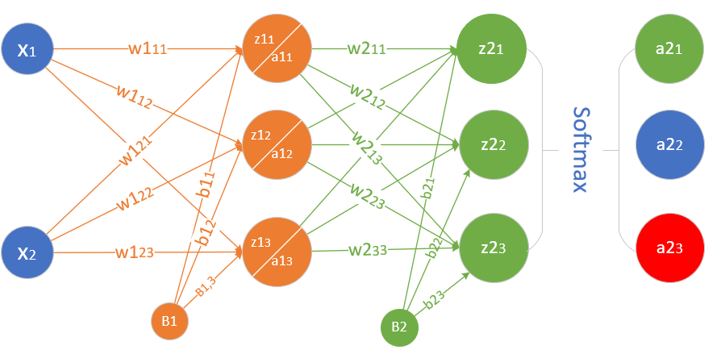|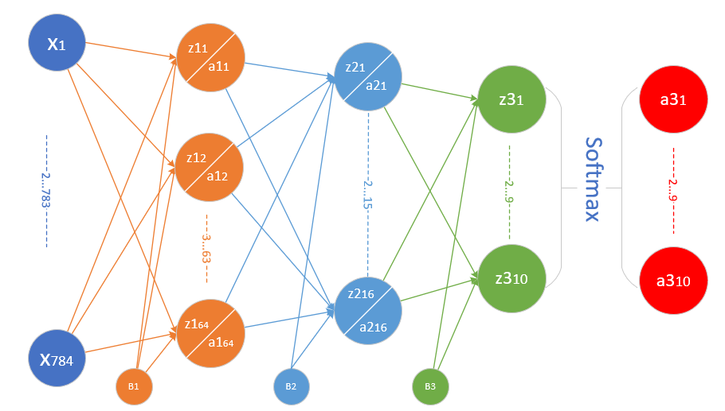|
|多入多出两层：非线性多分类|多入多出三层：非线性多分类|
|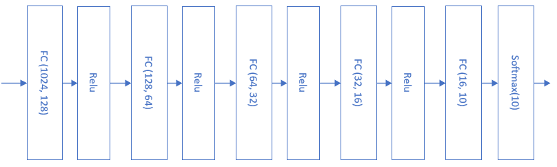|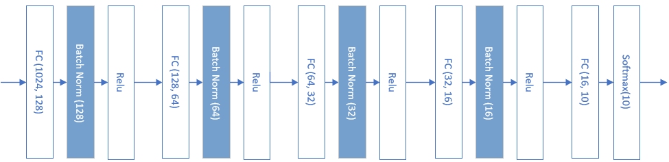|
|多层全连接网络：非线性多分类|非线性多分类：带批归一化层的多层全连接网络|
|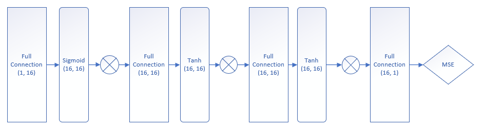|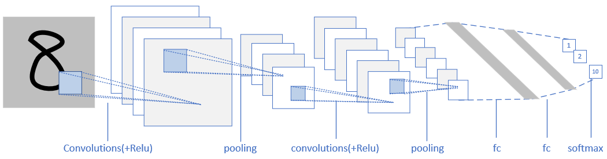|
|带丢弃层的多层全连接网络：非线性多分类|简单的卷积神经网络：非线性多分类|
|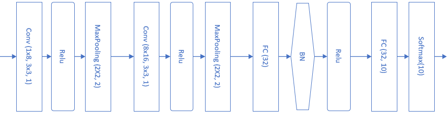|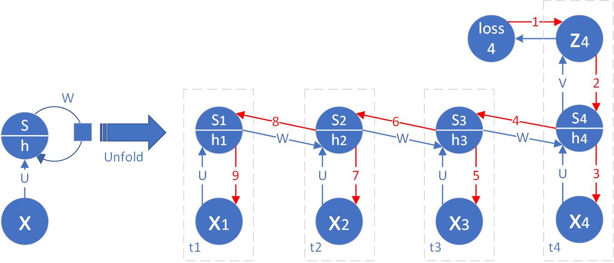|
|复杂的卷积神经网络：非线性多分类|单向循环神经网络：非线性多分类|
|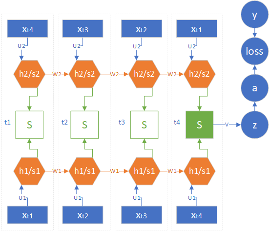|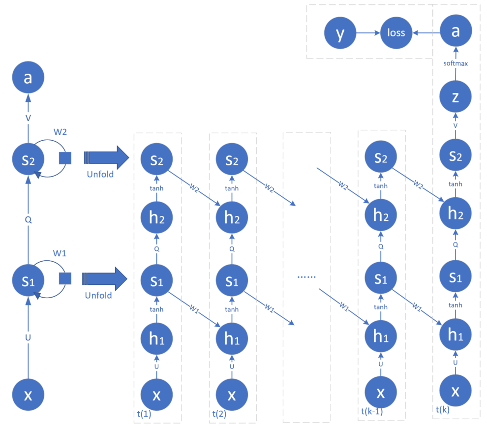|
|双向循环神经网络：非线性多分类|深度循环神经网络：非线性多分类|

这种循序渐进的讲解，从简到到复杂，符合绝大多数人的学习习惯。

### 痛点二

**缺乏案例，使用工业数据集训练模型，导致不知道什么是最佳结果，失去学习目标。**

**解决办法：自力更生，自己创建训练数据集。**

为什么工业数据不能用呢？因为里面的噪音太大了，导致用神经网络训练了很长时间也不能得到理想的分类效果，读者们就会产生怀疑：是不是神经网络有问题？或者是哪里少了什么组件？

请大家看下表：

|回归样本|分类样本|
|--|--|
|||
|||
|||
|||
|||

这里做的数据集都很“干净”，很少有噪音，这就决定了只要我们采用合适的网络结构，一定可以得到非常准确的回归和分类结果（至少在 98%）以上。而使用工业数据集，好的情况下准确度只有 90% 左右。

最关键的是，在创建这些数据集时是有目的性的：我想让神经网络达到什么效果，如果它没达到，说明我的想法是错误的；如果达到了，证明我理解对了。这对学习理解有巨大的帮助来建立自信心。

### 痛点三

**跳过原理，直接使用已有深度学习框架，导致培养出来的只是调参工程师。**

**解决办法：庖丁解牛，动手实现 mini 框架。**

整本书的每个章节都有代码，由浅入深。最开始的代码只是实现简单直接点神经网络，到了后面学习的概念越来越多，逐步都变成组件加入到逐步形成的 NeuralNet 框架之中。框架本身的代码也不复杂，几百行搞定，这比 TensorFlow、PyTorch 动辄几万行的代码相比，以学习原理为目的的难易程度可想而知。

### 痛点四

**公式堆砌，没有推导过程，导致知其然不知其所以然。**

**解决办法：化繁为简，把理论公式用实例化推导。**

我们先看看一般书籍上的关于反向传播的四大公式：

My God! 这是啥？符号怪怪的，那么多上标下标，还有多层括号，如何理解？

再看看《智能之门》书中的公式推导：

1. 有图！正向计算和反向传播都清清楚楚地画在那里，顺藤摸瓜。
2. 公式简单！每个公式推导都是根据上面的图中的箭头线来的，而且使用了实例化推导的方式。

**扫盲：什么是实例化推导？**

一般的公式理论推导时要考虑到很多种情况，假设每一步都是可以解决所有情况的。

而实例化推导，指的是使用具体的数字代替普遍适用的符号。比如，使用三个样本实例做推演，或者假设第二层网络结构（W2,B2）只有三个神经元。先把矩阵变成三行实例，最后再把结果合并成一个矩阵。

其基本原理是老子（不是Xiaowu）所说的：一生二，二生三，三生万物。也就是“三”基本可以代表普遍状态了。

### 痛点五

**资源紧缺，要求必须有GPU，导致给读者自学和上机实验带来困难。**

**解决办法：以小见大，使用 CPU 也可学习神经网络知识。**

很多人没有搞清楚，一味地被那些框架带跑了节奏：你是要学习原理，不是要训练一个大模型，那么你要 GPU 干什么？

前面说了，我们自己创建的样本很干净，特征维度都很少（不大于 5），数据量也不大（小于2000），那么用一个 CPU 就足够了。而且为了原理讲解，我们的模型也很简单，宽度和深度都不大。

稍微有些慢的地方就是后面要学习的 CNN、RNN，由于计算繁琐，所以训练要求时间较长，但是可以用算法优化、运行时编译等办法来提高速度。

### 痛点六

**没有代码，无法理解工作过程，导致神经网络被说成是黑匣子，不可解释。**

**解决办法：抽丝剥茧，以可视化手段让神经网络变得可以解释。**

请看下表：

|基本概念和回归工作原理|分类工作原理|
|--|--|
|||
|||
|||
|||
|||

所有的基本概念和工作原理，在《智能之门》所对应的 GitHub 上都有真实的 Python 代码来做示例，读者可以自行运行代码得到图像，也可以根据自己的理解改动代码，看看结果是否符合预期。而这些代码，无论是前向计算还是反向传播，都是通过公式推导的结果来实现的，这样读者可以对公式有更深刻的理解。

好了，不多说了，《智能之门》全书 400 多页，全彩印刷，因为入选了“二十一世纪人工智能教材”系列，所以定价不能太高，只有 69 元，一般网站上优惠不到 60 元就可以买到，这要是别的商业出版社，至少定价 120 元！
