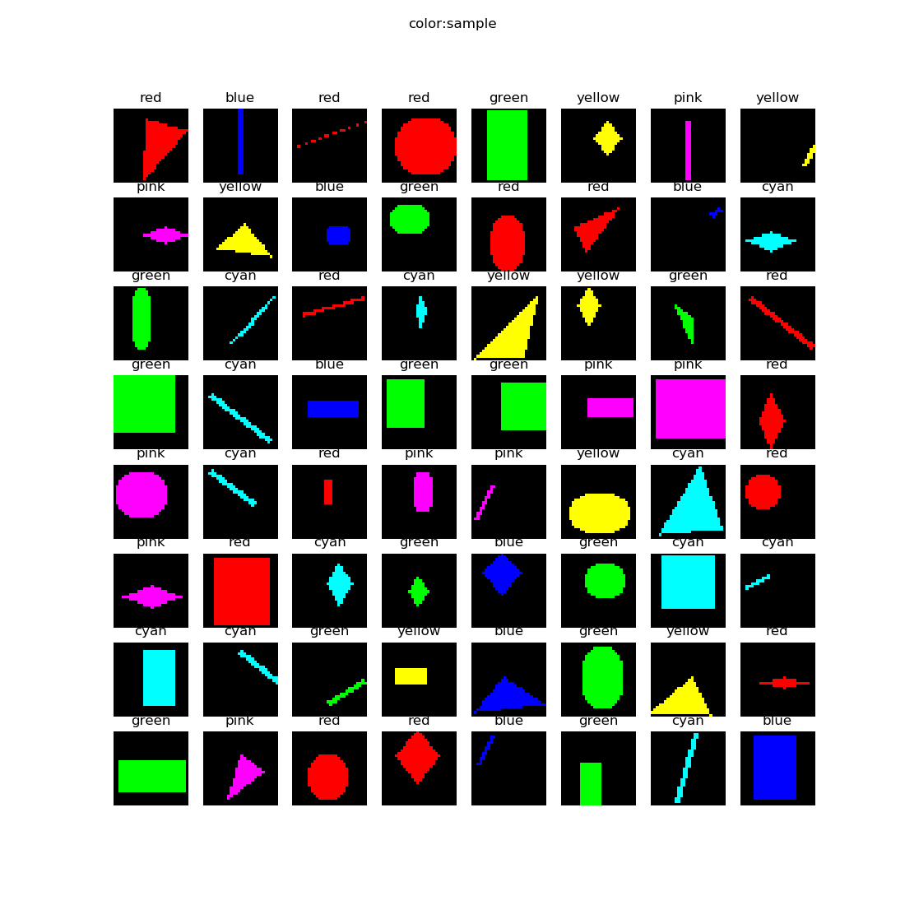

<!--Copyright © Microsoft Corporation. All rights reserved.
  适用于[License](https://github.com/Microsoft/ai-edu/blob/master/LICENSE.md)版权许可-->

## 18.1 实现颜色分类

以下为本小节目录，详情请参阅《智能之门》正版图书，高等教育出版社。

### 18.1.1 提出问题

大家知道卷积神经网络可以在图像分类上发挥作用，而一般的图像都是彩色的，也就是说卷积神经网络应该可以判别颜色的。这一节中我们来测试一下颜色分类问题，也就是说，不管几何图形是什么样子的，只针对颜色进行分类。

先看一下样本数据，如图18-14。

图18-14 颜色分类样本数据图

在样本数据中，一共有6种颜色，分别是：

- 红色 red
- 绿色 green
- 蓝色 blue
- 青色（蓝+绿） cyan
- 黄色（红+绿） yellow
- 粉色（红+蓝） pink

而这6种颜色是分布在5种形状之上的：

- 圆形
- 菱形
- 直线
- 矩形
- 三角形

我们看看神经网络能否排除形状的干扰，而单独把颜色区分开来。

### 18.1.2 用前馈神经网络解决问题

### 18.1.3 用卷积神经网络解决问题

### 18.1.4 1x1卷积

### 18.1.5 颜色分类可视化解释

### 代码位置

ch18, Level1

### 思考与练习

1. 从彩色图转换成灰度图会损失一些信息，有可能会导致DNN准确度不高。请尝试用2352(=784x3)的矢量做为样本特征值，送入DNN进行训练。
2. 从结果上看细线和大色块对DNN的影响较大，请尝试去掉细线样本，看看DNN的准确度是否可以提高。
3. 读者可以尝试使用4个以上的1x1卷积核，看看是否能提高准确度。
4. 读者可以尝试不使用第二层卷积，看看是否能完成任务。
