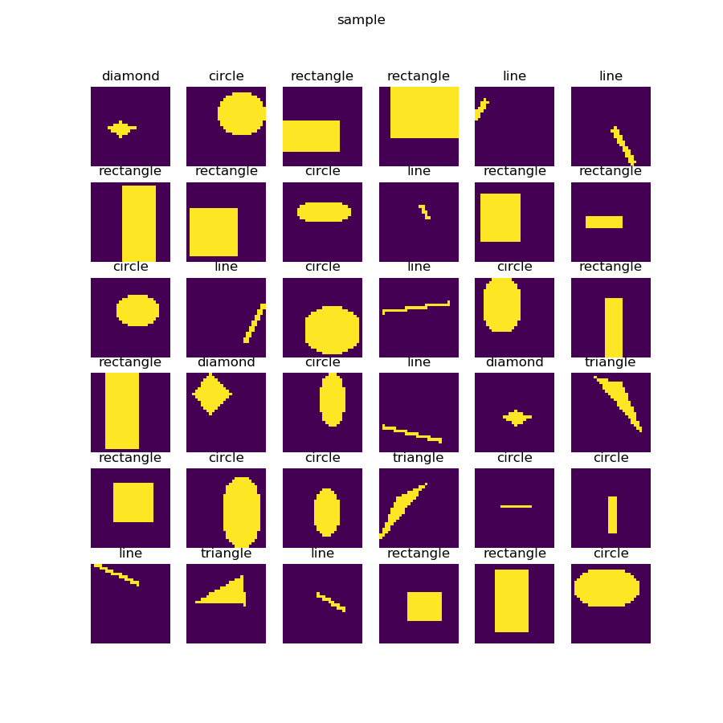

<!--Copyright © Microsoft Corporation. All rights reserved.
  适用于[License](https://github.com/Microsoft/ai-edu/blob/master/LICENSE.md)版权许可-->

## 18.2 实现几何图形分类

以下为本小节目录，详情请参阅《智能之门》正版图书，高等教育出版社。

### 18.2.1 提出问题

有一种儿童玩具：在一个平板上面有三种形状的洞：圆形、三角形、正方形，让小朋友们拿着这三种形状的积木从对应的洞中穿过那个平板就算成功。如果形状不对是穿不过去的，比如一个圆形的积木无法穿过一个方形的洞。这就要求儿童先学会识别几何形状，学会匹配，然后手眼脑配合才能成功。

人工智能现在还是初期阶段，它能否达到3岁儿童的能力呢？先看一下图18-21所示的样本数据。

图18-21 样本数据

一共有5种形状：圆形、菱形、直线、矩形、三角形。上图中列出了一些样本，由于图片尺寸是28x28的灰度图，所以在放大显示后可以看到很多锯齿，读者可以忽略。需要强调的是，每种形状的尺寸和位置在每个样本上都是有差异的，它们的大小和位置都是随机的，比如圆形的圆心位置和半径都是不一样的，还有可能是个椭圆。

其实二维几何形状识别是一个经典的话题了，如果不用神经网络的话，用一些传统的算法已经实现了，有兴趣的读者可以查询相关的知识，比如OpenCV库中就提供了一套方法。

### 18.2.2 用前馈神经网络解决问题

### 18.2.3 用卷积神经网络解决问题

### 18.2.4 形状分类可视化解释

### 代码位置

ch18, Level2

### 思考和练习

1. 我们使用了3x3的卷积核，如果用5x5的卷积核，但是在其它参数不变的情况下，其效果会不会更好？
2. 可以建立一个数据集，只包括正圆、椭圆、正方形、矩形等四种形状，看看卷积神经网络是不是能分辨出来。
