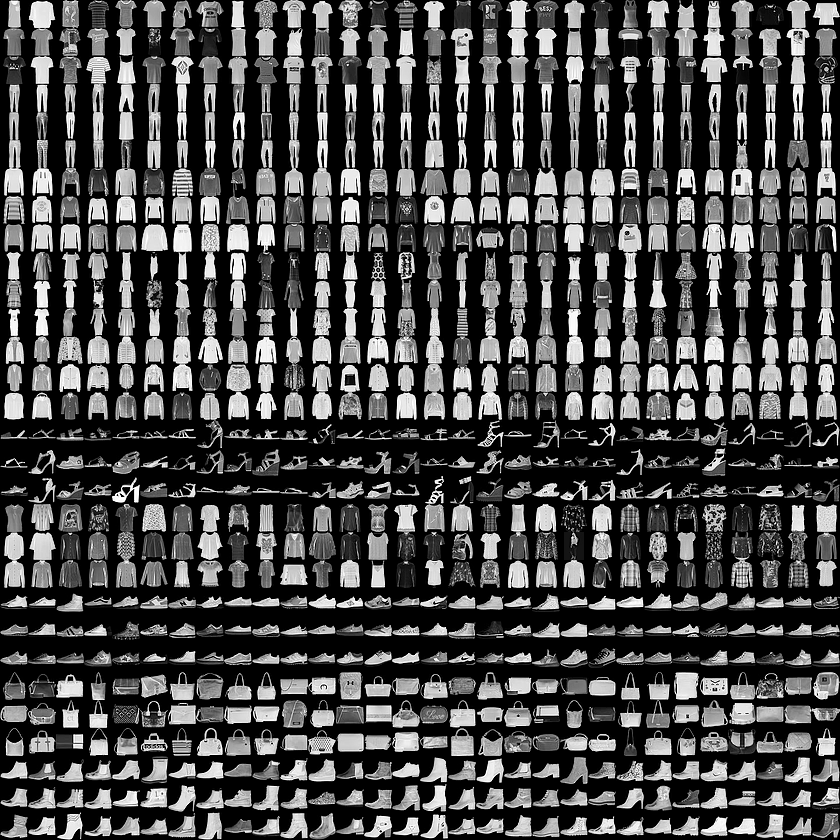

 <!--Copyright © Microsoft Corporation. All rights reserved.
  适用于[License](https://github.com/Microsoft/ai-edu/blob/master/LICENSE.md)版权许可-->

## 18.5 Fashion-MNIST分类

### 18.5.1 提出问题

MNIST手写识别数据集，对卷积神经网络来说已经太简单了，于是科学家们增加了图片的复杂度，用10种物品代替了10个数字，图18-36是它们的部分样本。

图18-36 部分样本图展示

每3行是一类样本，按样本类别（从0开始计数）分行显示：

0. T-Shirt，T恤衫（1-3行）
1. Trouser，裤子（4-6行）
2. Pullover，套头衫（7-9行）
3. Dress，连衣裙（10-12行）
4. Coat，外套（13-15行）
5. Sandal，凉鞋（16-18行）
6. Shirt，衬衫（19-21行）
7. Sneaker，运动鞋（22-24行）
8. Bag，包（25-27行）
9. Ankle Boot，短靴（28-30行）

### 18.5.2 用前馈神经网络来解决问题

### 18.5.3 用卷积神经网络来解决问题

### 代码位置

ch18, Level5

### 思考与练习

1. 读者可以尝试增加此卷积神经网络模型的卷积层数，来提高准确度。
