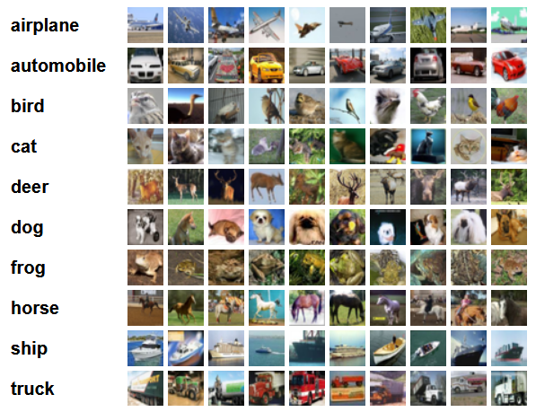

<!--Copyright © Microsoft Corporation. All rights reserved.
  适用于[License](https://github.com/Microsoft/ai-edu/blob/master/LICENSE.md)版权许可-->

## 18.6 Cifar-10分类

Cifar 是加拿大政府牵头投资的一个先进科学项目研究所。Hinton、Bengio和他的学生在2004年拿到了 Cifar 投资的少量资金，建立了神经计算和自适应感知项目。这个项目结集了不少计算机科学家、生物学家、电气工程师、神经科学家、物理学家、心理学家，加速推动了 Deep Learning 的进程。从这个阵容来看，DL 已经和 ML 系的数据挖掘分的很远了。Deep Learning 强调的是自适应感知和人工智能，是计算机与神经科学交叉；Data Mining 强调的是高速、大数据、统计数学分析，是计算机和数学的交叉。

Cifar-10 是由 Hinton 的学生 Alex Krizhevsky、Ilya Sutskever 收集的一个用于普适物体识别的数据集。

### 18.6.1 提出问题

我们在前面的学习中，使用了MNIST和Fashion-MNIST两个数据集来练习卷积网络的分类，但是这两个数据集都是单通道的灰度图。虽然我们用彩色的几何图形作为例子讲解了卷积网络的基本功能，但是仍然与现实的彩色世界有差距。所以，本节我们将使用Cifar-10数据集来进一步检验一下卷积神经网络的能力。

图18-41是Cifar-10的样本数据。

图18-41 Cifar-10样本数据

0. airplane，飞机，6000张
1. automobile，汽车，6000张
2. bird，鸟，6000张
3. cat，猫，6000张
4. deer，鹿，6000张
5. dog，狗，6000张
6. frog，蛙，6000张
7. horse，马，6000张
8. ship，船，6000张
9. truck，卡车，6000张

Cifar-10 由60000张32*32的 RGB 彩色图片构成，共10个分类。50000张训练，10000张测试。分为6个文件，5个训练数据文件，每个文件中包含10000张图片，随机打乱顺序，1个测试数据文件，也是10000张图片。这个数据集最大的特点在于将识别迁移到了普适物体，而且应用于多分类（姊妹数据集Cifar-100达到100类，ILSVRC比赛则是1000类）。

但是，面对彩色数据集，用CPU做训练所花费的时间实在是太长了，所以本节将学习如何使用GPU来训练神经网络。

### 18.6.2 环境搭建

### 18.6.3 代码实现

### 18.6.4 训练结果

### 代码位置

ch18, Level6

### 参考资料

[1] 参考 https://keras.io/examples/cifar10_cnn/
