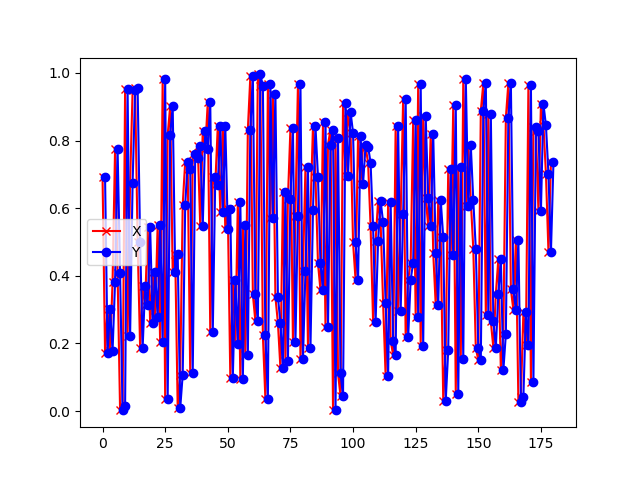
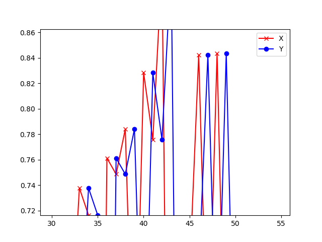

<!--Copyright © Microsoft Corporation. All rights reserved.
  适用于[License](https://github.com/Microsoft/ai-edu/blob/master/LICENSE.md)版权许可-->

## 19.1 两个时间步的循环神经网络

以下为本小节目录，详情请参阅《智能之门》正版图书，高等教育出版社。

### 19.1.1 提出问题

我们先用一个最简单的序列问题来了解一下循环神经网络的基本运作方式。

假设有一个随机信号发射器，每秒产生一个随机信号，随机值为(0,1)之间。信号发出后，碰到一面墙壁反射回来，来回的时间相加正好是1秒，于是接收器就收到了1秒钟之前的信号。对于接收端来说，接收到的数据序列如表19-1。

表19-1 每一时刻的发射信号和回波信号

|时刻|t1|t2|t3|t4|t5|t6|...|
|---|---|---|---|---|---|---|---|
|发射随机信号X|0.35|0.46|0.12|0.69|0.24|0.94|...|
|接收回波信号Y|0|0.35|0.46|0.12|0.69|0.24|...|

具体地描述此问题：当接收端接收到两个连续的值，如0.35、0.46时，系统响应为0.35；下一个时间点接收到了0.12，考虑到上一个时间点的0.46，则二者组合成0.46、0.12序列，此时系统响应为0.46；依此类推，即接收到第二个数值时，总要返回相邻的第一个数值。

我们可以把发射信号看作X，把接收信号看作是Y，则此问题变成了给定样本X和标签值Y，训练一个神经网络，令其当接收到两个序列的值时，总返回第一个值。

读者可能会产生疑问：这个问题用一个最简单不过的程序就可以解决，我们为什么还要大动干戈地使用神经网络呢？如：

```Python
def echo(x1,x2):
    return x2
```

因为这是一个最基本的序列问题，我们先用它投石问路，逐步地理解循环神经网络的精髓所在。

如果把发射信号和回波信号绘制成图，如图19-6和图19-7所示。



图19-6 信号及回波样本序列



图19-7 信号及回波样本序列局部放大图

其中，红色叉子为样本数据点，蓝色圆点为标签数据点，它总是落后于样本数据一个时间步。还可以看到以上数据形成的曲线完全随机，毫无规律。

### 19.1.2 准备数据

### 19.1.3 用前馈神经网络的知识来解决问题


### 19.1.4 代码实现


### 19.1.5 运行结果

### 代码位置

ch19, Level1

### 思考和练习

1. 如果不加bh和bz两个值，即令其衡为0，试验一下网络训练的效果。
