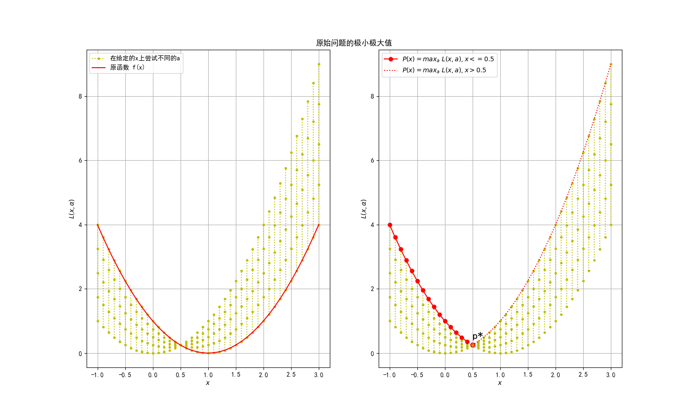
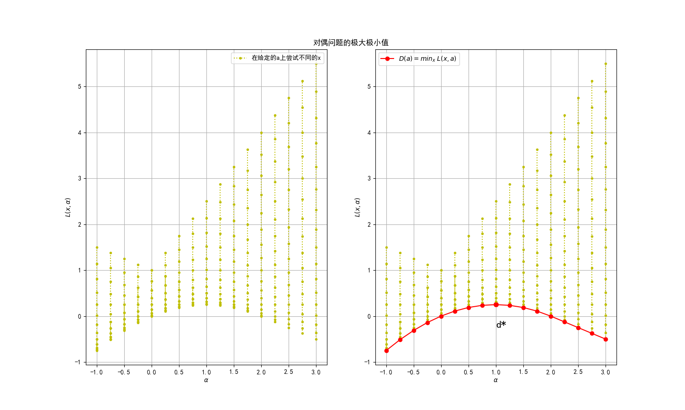
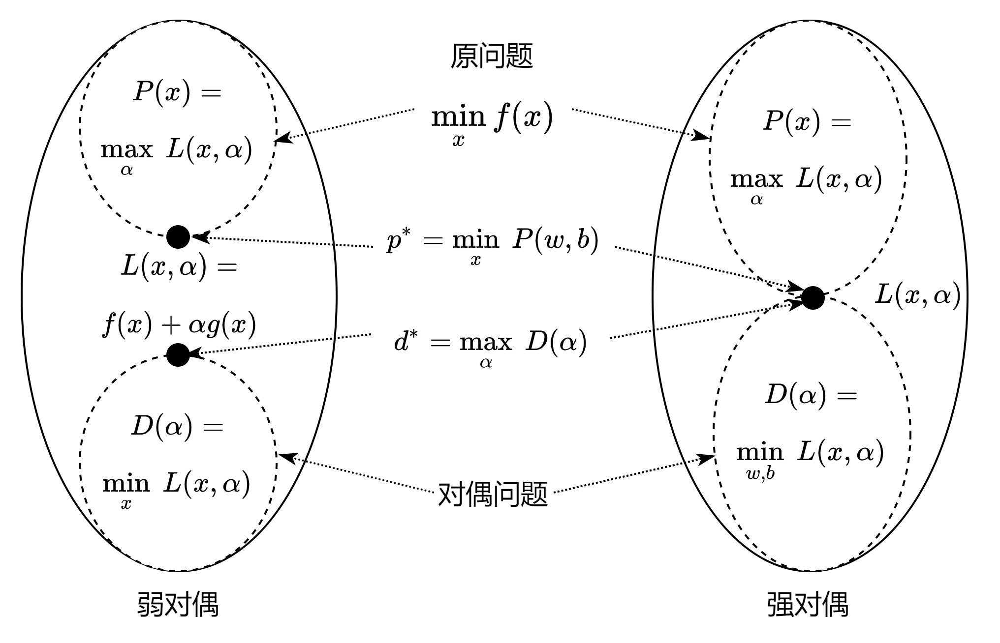

## 10.4 拉格朗日对偶问题

在本小节中，我们用一个简单的例子来理解拉格朗日对偶问题。

### 10.4.1 原始问题
  
先假设一个原始问题如下：

$$
\begin{aligned}
    \underset{x}{\min}\ & f(x)=x^2-2x+1
    \\\\
    s.t. \ & x-0.5 \le 0 \qquad \rightarrow g(x)
\end{aligned}
\tag{10.4.1}
$$

按照前面的拉格朗日乘子法，先构造拉格朗日函数。

$$
\begin{aligned}
L(x,\alpha) &= f(x) + \alpha g(x)
\\\\
&=x^2-2x+1 + \alpha (x-0.5)
\end{aligned}
\tag{10.4.2}
$$

因为这个例子比较简单，所以可以用 10.2 小节学习的知识，对 $L$ 分别求 $x,\alpha$ 的偏导，并令结果为 0（具体过程不再赘述），最终得到：

$$
\alpha = 1,\ x=0.5, \ \underset{x}{\min}\ f(x) = 0.25 \tag{10.4.3}
$$

### 10.4.2 为什么要学习对偶问题

在很多情况下，我们遇到很复杂的问题时，不能象上面那样直接得到 $\underset{x}{\min}\ f(x)$ 的解，而是要通过构造对偶问题再来求解，而对偶问题的解与原始问题的解相同（或者非常接近）。

基本的步骤为：

1. 给原始的约束问题 $f(x), g(x)$ 构造拉格朗日函数：
    $$L(x,\alpha)=f(x)+\alpha g(x) \tag{10.4.4}$$
2. 求 $L$ 关于 $\alpha$ 的最大值，生成函数 $P(x)$，但并不求解：
   
    $$P(x)=\underset{\alpha;\alpha \ge 0}{\max} \ L(x,\alpha) \tag{10.4.5}$$

3. 求 $P$ 关于 $x$ 的最小值。此时 $p^*$ 是原始问题的最终解，但是不容易得到，所以并不求解：
   
$$p^*=\underset{x}{\min}\ P(x)=\underset{x}{\min} [\underset{\alpha;\alpha \ge 0}{\max}\ L(x,\alpha)] \tag{10.4.6}$$

OK，上面的步骤 2、3 只是虚晃一枪，做一下理论推导，下面是算法中真正要实现的步骤。

4. 求 $L$ 关于 $x$ 的最小值，并求解，生成函数 $D(\alpha)$：
   
$$D(\alpha) = \underset{x}{\min}\ L(x,\alpha) \tag{10.4.7}$$

5. 求 $D$ 关于 $\alpha$ 的最小值，并求解得到 $d^*$，是对偶问题的解且较容易得到，并且 $d^* \le p^*$：

 $$d^*=\underset{\alpha;\alpha \ge 0}{\max}\ D(\alpha)=\underset{\alpha;\alpha \ge 0}{\max} [\underset{x}{\min}\ L(x,\alpha)] \tag{10.4.8}$$

由于原始问题的 $p^*$ 是通过先求极大值再求极小值得到的，而后者 $d^*$ 是通过先求极小值再求极大值得到的，二者成为镜像，所以叫做对偶问题。

下面我们会用实例说明一下原始问题和对偶问题的关系，以及为什么 $d^* \le p^*$。

### 10.4.3 求原始问题的极小极大值

令 $P(x)$ 为 $L(x,\alpha)$ 的最大值：

$$P(x)=\underset{\alpha;\alpha \ge 0}{\max} \ L(x,\alpha) \tag{同10.4.5}$$

**为了求得 $P(x)$，先构建 $L(x,\alpha)$。**

式 10.4.5 的含义是，虽然 $L$ 有两个参数 $x, \alpha$，但是我们先固定一个 $x$， 遍历 $\alpha$，寻找当 $\alpha$ 为何值时 $L$ 的值最大；然后换一个 $x$ 值并固定，再次遍历 $\alpha$ 寻找 $L$ 的最大值......

由于我们从式 10.4.3 事先知道 $x=0.5,\alpha=1$ 是该问题的解，为了简单起见，所以指定 $x$ 的搜索范围是 $[-1,3]$，$\alpha$ 的遍历范围是 $[0,2]$。

得到 $L(x,\alpha)$ 的具体步骤：

1. 设定 $\alpha$ 值的遍历范围，比如 $(start=0, stop=2, step=0.5)$，从 0 开始，每隔 0.5 取一个 $\alpha$ 的值，直到 2 为止，一共 5 个 $\alpha$ 值 $[0, 0.5, 1, 1.5, 2]$。如果想获得更精确的结果，可以令 $step=0.1$ 来获得更多（密集）的 $\alpha$ 值。
2. 设定 $x$ 的搜索范围，假设 $(start=-1, stop=3, step=0.1)$，一共 41 个 $x$ 值。
3. 取第一个 $x$ 值 $x=-1$，用步骤 1 中的 5 个 $\alpha$ 值来计算出 5 个 $L(-1,\alpha)$，存放在列表中供以后使用。

4. 然后再取第二个 $x=-0.9$，再用一系列的 $\alpha$ 值来计算出 5 个 $L(-0.9,\alpha)$，存放在列表中供以后使用。
5. 重复以上过程直到 $x=3$。


代码如下：

```Python
def draw_left_X_L(ax):
    num_alpha = 5
    num_x = 41
    L_xa = []
    # X 共 41 个等间距 x
    X = np.linspace(-1,3,num_x)
    # A=0,0.5,1,1.5,2 共 5 个选择
    A = np.linspace(0,2,num_alpha)
   
    line1 = None
    # 设定 x 的搜索范围是 X，在每个 x 遍历 alpha，遍历用矩阵 A 批量实现
    for x in X:
        # 拉格朗日函数
        l_xa = x*x - 2*x + 1 + A*(x-0.5)
        # 横坐标是 x, 纵坐标是函数值 L(x,a)，一条竖线
        line1, = ax.plot([x]*num_alpha, l_xa, color='y', marker='.')
        # 保存所有竖线的坐标点到一个列表
        # 此时也可以直接求 max (L(xa)) 得到 P(x)，即 5 个坐标点中最大的那个
        L_xa.append(l_xa)

    # 绘制原函数 f(x), 用于观察与 L(x,a) 的关系
    Y = X**2 - 2*X + 1
    line2, = ax.plot(X, Y, color='r')
    ax.legend(handles=[line1, line2], labels=[u'在给定的x上尝试不同的a', '原函数 f(x)'])

    # 列表转换成矩阵，便于后面计算极小极大值
    L = np.array(L_xa)
    return L, X
```

这段代码绘制出图 10.4.1 中的左子图，横坐标是 $x$，纵坐标是函数 $L(x,\alpha)$，**每一条竖线**都表示在一个指定的 $x$ 上尝试的 5 个 $\alpha$ 值对应的 $L(x,\alpha)$ 值，此时 $x$ 是常数，$\alpha$ 是变量。红色曲线是原函数 $f(x)$。

完整代码请运行 Code_10_4_1.py。



<center>图 10.4.1 原始问题的极小极大值</center>

**求 $P(x)$。**


令 $P(x)$ 为 $L(x,\alpha)$ 关于 $\alpha$ 的极大值：

$$
P(x)=\underset{\alpha;\alpha \ge 0}{\max} \ L(x,\alpha) \tag{同10.4.5}
$$


下面要获得 $P(x)$，观察左子图，就是要在每条竖线上的 5 个不同 $\alpha$ 的点中取最大的那个值，就是 $\underset{\alpha}{\max} L$。当然还可以取更多或更密集的 $\alpha$ 值来做试验。

取最大值用矩阵计算比较方便，所以我们把上面代码中的 L 展示在表 10.4.1 中（选取了其中的 9 行数据而不是全部的 41 行数据），用黑体表示展示当前行中的最大值（比如第一行的 **4**），斜体表示取出来的结果（最后一列）。

表 10.4.1 不同的 $\alpha$ 在给定的 $x$ 上的 $L$ 值

|给定 $x$ 值|$\alpha$=0|$\alpha$=0.5|$\alpha$=1|$\alpha$=1.5|$\alpha$=2|$P(x)=\underset{\alpha;\alpha \ge 0}{\max} \ L(x,\alpha)$|
|--|--|--|--|--|--|--|
|$x$=-1|**4**|3.25|2.5|1.75|1|*4*|
|$x$=-0.5|**2.25**|1.75|1.25|0.75|0.25|*2.25*|
|$x$= 0|**1**|0.75|0.5|0.25|0|*1*|
|$x$=0.5|0.25|0.25|**0.25**|0.25|0.25|***0.25***|
|$x$=1.0|0|0.25|0.5|0.75|**1**|*1*|
|$x$=1.5|0.25|0.75|1.25|1.75|**2.25**|*2.25*|
|$x$=2.0|1|1.75|2.5|3.25|**4**|*4*|
|$x$=2.5|2.25|3.25|4.25|5.25|**6.25**|*6.25*|
|$x$=3.0|4|4.25|6.5|7.75|**9**|*9*|

表 10.4.1 的一行数据，就代表图 10.4.1 中的一条黄色竖线，可以观察到每条竖线上有 5 个点，是在给定 $x$ 时，$\alpha$ 分别取值为 $[0, 0.5, 1, 1.5, 2]$ 得到的 $L$ 值。比如表中的第 1 行，是 $x=-1$ 时，5 个 $\alpha$ 值对应的 5 个 $L(-1,\alpha)$ 值 $[4,3.25,2.5,1.75,1]$，最大值为 4，相当于：

$$
\begin{aligned}
P(-1) &= \max \ (L(-1,0),L(-1,0.5),L(-1,1),L(-1,1.5),L(-1,2))
\\\\
&=\max (4,3.25,2.5,1.75,1) = 4
\end{aligned}
$$

得到最大值的代码如下，其中 axis=1 表示横向比较，取出一行中的最大值。

```
# P(x) = max_a L(x,a)
max_a = np.max(L, axis=1)
```
得到的值列表如下：
```
max_a L(x,a) = [4. 3.61 3.24 2.89 2.56 2.25 1.96 1.69 1.44 1.21 1. 0.81 0.64 0.49
 0.36 0.25 0.36 0.49 0.64 0.81 1. 1.21 1.44 1.69 1.96 2.25 2.56 2.89 3.24 3.61 4. 4.41 4.84 5.29 5.76 6.25 6.76 7.29 7.84 8.41 9.]
```

我们把得到的 max_a 值 $[4, \cdots, 1, \cdots, 0.25, \cdots, 1, \cdots, 4, \cdots, 9]$ 用下面的代码绘制在图 10.4.1 中的右侧子图中，因为 x 取值范围是 $(start=-1，stop=3，step=41)$，所以序号 15 正好在 X[15]=0.5 的点上：

```Python
# 用两种线型分别代表 x <= 0.5 和 x > 0.5 的部分
# x <= 0.5
ax.plot(X[0:15], max_a[0:15], color='r', marker='o', label='$P(x)=max_a \ L(x,a), x <= 0.5$')
# x > 0.5
ax.plot(X[15:], max_a[15:], color='r', linestyle=':', label='$P(x)=max_a \ L(x,a), x > 0.5$')
```

- 其中的红色带圆点的曲线，就是表 10.4.1 中的最大值，可以看到它完全与原函数重合，但是它位于 $x \le 0.5$的区域。
- 红色虚线的曲线，也是由表 10.4.1 中的最大值所构成，但是它位于 $x \gt 0.5$ 的区域。它超过了原函数的值域，随着 $\alpha$ 值的增加，会越来越大。

由上面两点事实可以有如下一般性推论：

$$
P(x)=\underset{\alpha;\alpha \ge 0}{\max} \ L(x,\alpha)=\underset{\alpha;\alpha \ge 0}{\max} [f(x)+\alpha g(x)]=
\begin{cases}
    f(x), \quad x \in 限定区域内
    \\\\
    +\infin, \quad x \in 限定区域外
\end{cases}
\tag{10.4.9}
$$

- 当样本点 $x$ 满足 $g(x)$ 的要求时，因为 $g(x) \le 0, \alpha \ge 0$，所以 $\alpha g(x) \le 0$，则 $L(x,\alpha) \le f(x)+\alpha g(x)$。所以$L(x,\alpha)$ 的值不可能超过原函数，最大值 $P(x)$ 等于原函数 $f(x)$。这也是要求 $\alpha \ge 0$ 的原因。
- 当样本点不满足 $g(x)$ 的要求时，随着乘子 $\alpha$ 的值增加，$L(x,\alpha)$ 可以越来越大，这样$P(x)$ 的值可以趋近于无穷大，没有限制。

**求 $\underset{x}{\min} \ P(x)$。**

现在确定了 $P(x)$ 的函数形态，对 $P(x)$ 取关于 $x$ 的极小值，结果记为 $p^*$：

$$
p^* = \underset{x}{\min} \ P(x)
\tag{同10.4.6}
$$

用代码实现：

```
# p* = min_x P(x)
min_x = np.min(max_a)
```
就是在表 10.4.1 的最后一列中，取最小值，就得到 $p^*$。最后得到的打印输出是：

```
p* = min_x [max_a L(x,a)] = 0.25
x = 0.5
```

可以看到 $p^*$ 的结果和式 10.4.3 的结果一致，所以有一般性推论：


$$
p^* = \underset{x}{\min} \ P(x)=  \underset{x}{\min} \ [\underset{\alpha;\alpha \ge 0}{\max} \ L(x,\alpha)] = \underset{x}{\min} \ f(x)
\tag{10.4.10}
$$

这种针对不同参数分别先求最大再求最小的方法，也被称为广义拉格朗日函数的**极小极大**问题。


### 10.4.4 求对偶问题的极大极小值

下面我们来看看对偶问题，我们依然采用刚才的例子，来看看它的对偶问题是什么形式。

令 $D(\alpha)$ 为 $L(x,\alpha)$ 关于 $x$ 的最小值：

$$
D(\alpha)= \underset{x}{\min} \ L(x,\alpha) \tag{同10.4.7}
$$

**为了求得 $D(\alpha)$，先得到 $L(x,\alpha)$。**

仔细观察式 10.4.7 与式 10.4.5 不同，这次我们是要求关于 $x$ 的最小值，所以要固定 $\alpha$，遍历 $x$。

得到 $L(x,\alpha)$ 的具体步骤如下：

1. 设定 $x$ 的遍历范围，假设 $(start=0, stop=2, step=0.25)$，一共 9 个 $x$ 值。
2. 设定 $\alpha$ 值的搜索范围，比如 $(start=-1, stop=3, step=0.5)$，从 -1 开始，每隔 0.5 取一个 $\alpha$ 的值，直到 3 为止，一共 9 个 $\alpha$ 值。
3. 取第一个 $\alpha$ 值 $\alpha=-1$，用步骤 1 中的一系列的 $x$ 值来计算出 9 个 $L(x,-1)$，存放在列表中供后面使用。
4. 然后再取第二个 $\alpha=-0.5$，再用一系列的 $x$ 值来计算出 9 个 $L(x,-0.5)$，存放在列表中供后面使用。
5. 重复以上过程直到 $\alpha=3$。

代码如下：

``` Python
def draw_left_A_L(ax):
    num_alpha = 17
    num_x = 17
    L_xa = []
    # X 共 17 个等间距 x
    X = np.linspace(0,2,num_x)
    # A 共 17 个 a 
    A = np.linspace(-1,3,num_alpha)
   
    line1 = None
    # 设定 a 的搜索范围是 A，在每个 a 上遍历 x，遍历用矩阵 X 批量实现
    for a in A:
        # 拉格朗日函数
        l_xa = X*X - 2*X + 1 + a*(X-0.5)
        # 横坐标是 a, 纵坐标是函数值 L(x,a)，一条竖线
        line1, = ax.plot([a]*num_x, l_xa, marker='.', color='y')
        # 保存竖线坐标值到列表
        L_xa.append(l_xa)

    ax.legend(handles=[line1], labels=[u'在给定的a上尝试不同的x'])
    L = np.array(L_xa)
    return L, A
```
得到图 10.4.2 的左子图。完整代码请运行 Code_10_4_2.py。



<center>图 10.4.2 对偶问题的极大极小值</center>

**求 $D(\alpha)= \underset{x}{\min} \ L(x,\alpha)$**。

与左子图对应的数据见表 10.4.2，为了节省篇幅，表中只保留了 5 行 5 列关键数据，不影响准确性。请注意，由于是对偶问题，先后顺序不同，所以表 10.4.2 中的行列定义（$\alpha,x$）与表 10.4.1 正好相反。

表 10.4.2 不同的 $x$ 在给定的 $\alpha$ 上的 $L$ 值

|给定 $\alpha$ 值|x=0|x=0.5|x=1|x=1.5|x=2|$D(\alpha)= \underset{x}{\min} \ L(x,\alpha)$|
|-------|----|--------|------|--------|------|-----|
|$\alpha$=-1|1.5|0.25|-0.5|**-0.75**|-0.5|*-0.75*|
|$\alpha$=0.0|1|0.25|**0**|0.25|1|*0*|
|$\alpha$=1.0|0.5|**0.25**|0.5|1.25|2.5|***0.25***|
|$\alpha$=2.0|**0**|0.25|1|2.25|4|*0*|
|$\alpha$=3.0|**-0.5**|0.25|1.5|3.25|5.5|*-0.5*|

表 10.4.2 的一行数据，就代表图 10.4.2 中的一条黄色竖线，就是在给定 $\alpha$ 时，$x$ 分别取值为 $[0, \cdots, 0.5, \cdots, 1, \cdots, 1.5, \cdots, 2]$ 时得到的 $L$ 值。

有了 $L$ 后可以取其最小值了：

$$D(\alpha)= \underset{x}{\min} \ L(x,\alpha) \tag{同10.4.7}$$

接下来获得每条竖线上的 $L$ 的最小值，代码如下：

``` Python
# D(a) = min_x L(x,a)
min_x=np.min(L, axis=1)
```

得到的结果放在表 10.4.2 的最后一列，并在图 10.4.2 的右子图中用红色线绘出：

```Python
# draw D(a)
ax.plot(A, min_x, label='$D(a) = min_x \ L(x,a)$', color='r', marker='o')
```

可以看到这是一条向上的弧线（凹函数），应该可以求得最大值。

**求 $\underset{\alpha;\alpha \ge 0}{\max} \ D(\alpha)$**。


下一步求 $D(\alpha)$ 关于 $\alpha$ 的最大值，并记为 $d^*$：

$$
d^*=\underset{\alpha;\alpha \ge 0}{\max} \ D(\alpha) \tag{同10.4.8}
$$

用下面的代码即可获得：

```Python
max_a = np.max(min_x)
``` 

图 10.4.2 右子图最中间的红点就是最大值点，最后的打印输出是：

```
D(a) = [-0.75 -0.3125 0 0.1875 0.25 0.1875 0 -0.25 -0.5]
d* = 0.25
a = 1.0
```

式 10.4.8 称为广义拉格朗日函数的**极大极小**问题。

到此为止，我们得到了以下值：$\alpha=1, p^*=d^*=0.25, x=0.5$，与式 10.4.3 的结果完全相同。


### 10.4.5 原始问题和对偶问题的关系

在 10.4.3 和 10.4.4 中，我们分别求解了原始问题 $P$ 和对偶问题 $D$，并且得到了相同的解。而在实际应用中，当原始问题很难求解时，可以转而去求其对偶问题的解。



<center>图 10.4.3 原始问题和对偶问题的关系</center>

如图 10.4.3 的左子图所示：

- 在函数 $L(x,\alpha)$ 内部，关于一部分参数的最小值 $D(\alpha)$（式 10.4.8），一定处于该函数解空间内的底部区域；
- 相反，关于另一部分参数的最大值 $P(x)$（式 10.4.5），一定处于该函数解空间内的顶部区域。

为什么 $D(\alpha)$ 是一个区域而不是一个点呢？因为 $D(\alpha)= \underset{x}{\min} \ L(x,\alpha)$ 只确定了 $x$，而没有确定 $\alpha$，即 $\alpha$ 是个变量，$\alpha$ 取不同的值，$D(\alpha)$ 也会跟着变化，所以 $D(\alpha)$ 是一个区域。具体见图 10.4.2 的右子图（此例中是一条曲线）。

同理可知 $P(x)$ 也是一个区域，具体见图 10.4.1 的右子图（此例中是一条曲线）。

所以有：

$$
D(\alpha) = \underset{x}{\min} \ L(x,\alpha) \le L(x,\alpha) \le \underset{\alpha;\alpha \ge 0}{\max} L(x,\alpha)=P(x) \tag{10.4.11}
$$

即：

$$
D(\alpha) \le P(x)  \tag{10.4.12}
$$

进一步可以推断，在最小值区域里面的最大值，肯定要小于（最好的情况是等于）在最大值区域里面的最小值：

$$
d^*=\underset{\alpha;\alpha \ge 0}{\max}\ D(\alpha) \le \underset{x}{\min} \ P(x)=p^* \tag{10.4.13}
$$

即：

$$
d^* \le p^*  \tag{10.4.14}
$$

所以，我们求得了对偶问题的解 $d^*$，就相当于求得了原问题的解 $p^*$。

图 10.4.3 的左子图叫做弱对偶，强对偶的情况如右子图所示，即 $d^*=p^*$。这里的符号 $d、p$ 也用得很有讲究，因为 $d$ 颠倒过来就是 $p$，但对偶问题更像是水中的倒影（镜像）问题。$d$ 向上，表示最后要求极大值；$p$ 向下，表示最后要求极小值。

### 思考与练习

1. 在计算式 10.4.4 时，取 step=0.1 来获得更多的 $\alpha$，测试最终效果。
2. 在图 10.4.1 中，$\alpha$ 的取值范围为 [0,2]。如果改为 [-1,2] 的话，会是什么效果？$P(x)$ 曲线还是当前这样的吗？
3. 表 10.4.1 和表 10.4.2 的行列定义为什么相反？
4. 图 10.4.2，如果想试验 17 组 $\alpha$ 值，如何做？
