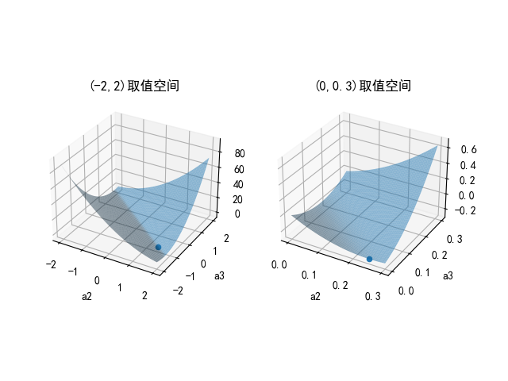

## 10.5 解决 SVM 对偶问题

本节中我们将使用拉格朗日对偶方案来解决 SVM 的优化问题。

### 10.5.1 SVM 的原始优化问题

$$
\begin{aligned}
    \underset{w,b}{\min} & \ f(w,b)=\frac{1}{2}||\boldsymbol{w}||^2
    \\\\
    s.t. & \ 1-y_i(\boldsymbol{w}  \cdot \boldsymbol{x_i}+b) \le 0, \quad i=1,...,n
\end{aligned}
\tag{10.5.1}
$$

### 10.5.2 构造拉格朗日函数

$$
\begin{aligned}
L(w,b,\alpha)&=\frac{1}{2}||\boldsymbol{w}||^2+\sum_{i=1}^n{\alpha_i}(1-y_i(\boldsymbol{w}  \cdot \boldsymbol{x_i} + b))
\\\\
&=\frac{1}{2}\boldsymbol{w} \cdot \boldsymbol{w}+\sum_{i=1}^n{\alpha_i}-\boldsymbol{w} \cdot \sum_{i=1}^n\alpha_iy_i \boldsymbol{x_i} - b\sum_{i=1}^n\alpha_iy_i
\\\\
&=\frac{1}{2}\boldsymbol{w} \boldsymbol{w}^T+\sum_{i=1}^n{\alpha_i}-\boldsymbol{w} \left ( \sum_{i=1}^n\alpha_iy_i \boldsymbol{x_i} \right )^T- b\sum_{i=1}^n\alpha_iy_i
\end{aligned}
\tag{10.5.2}
$$

由于 $\boldsymbol{w},\boldsymbol{x}$ 是**行矢量**，所以在去掉内积符号后，需要有转置符号来保证矩阵相乘运算正确，即 $\boldsymbol{w} \cdot \boldsymbol{w}=(w_1 \ w_2) \cdot (w_1 \ w_2)=(w_1 \ w_2)(w_1 \ w_2)^T=w_1^2+w_2^2$。关于 $\boldsymbol{x}$ 的计算同理。

### 10.5.3 求对偶问题的内层极小值

令 $D(\alpha)$ 为内层极小值关于 $\alpha$ 的函数：

$$
D(\alpha)= \underset{w,b}{\min} \ L(w,b,\alpha) \tag{10.5.3}
$$

按照拉格朗日函数的一般解法，求原始变量对函数的偏导数，并令其结果为 0。在本例中，原始变量是 $w,b$，所以我们求 $L$ 对 $w,b$ 的偏导。先求对 $w$ 的偏导：

$$
\begin{aligned}
\frac{\partial L}{\partial w} &=\frac{\partial}{\partial w} \left [ \frac{1}{2}\boldsymbol{w} \boldsymbol{w}^T+\sum_{i=1}^n{\alpha_i}-\boldsymbol{w} \left( \sum_{i=1}^n\alpha_i y_i \boldsymbol{x_i} \right )^T - b\sum_{i=1}^n\alpha_i y_i \right]
\\\\
&=\boldsymbol{w}+0-\sum_{i=1}^n\alpha_i y_i \boldsymbol{x}_i
\end{aligned}
\tag{10.5.4}
$$

令式 10.5.4 的结果为 0，可得：

$$
\boldsymbol{w}=\sum_{i=1}^n\alpha_i y_i \boldsymbol{x}_i 
\tag{10.5.5}
$$

计算 $L$ 对 $b$ 的偏导数：

$$
\begin{aligned}
\frac{\partial L}{\partial b} &=\frac{\partial}{\partial b} \left [ \frac{1}{2}\boldsymbol{w} \boldsymbol{w}^T+\sum_{i=1}^n{\alpha_i}-\boldsymbol{w} \left( \sum_{i=1}^n\alpha_i y_i \boldsymbol{x_i} \right )^T - b\sum_{i=1}^n\alpha_i y_i \right]
\\\\
&=0+0-0-\sum_{i=1}^n\alpha_i y_i
\\\\
&=-\sum_{i=1}^n\alpha_i y_i
\end{aligned}
\tag{10.5.6}
$$

令式 10.5.6 的结果为 0，可得：

$$
\sum_{i=1}^n\alpha_i y_i=0 \tag{10.5.7}
$$

将式 10.5.5、10.5.7 代回式 10.5.2，把第 1、3 项的 $w$ 替换，消掉第 4 项（值为 0），即得到 $L$ 无关于 $w,b$ 的表达式。此时，由于已经把偏导为 0 的结果代入了，所以不再是原始的 $L(w,b,\alpha)$ 的表达式，而是最小值表达式，定义为 $D(\alpha)$：

$$
\begin{aligned}
D(\alpha)&=\underset{w,b}{\min}\ L(w,b,\alpha)
\\\\
&=\frac{1}{2} \left(\sum_{i=1}^n\alpha_iy_i\boldsymbol{x}_i \right) \cdot \left(\sum_{i=1}^n\alpha_iy_i\boldsymbol{x}_i \right)+\sum_{i=1}^n\alpha_i- \left(\sum_{i=1}^n\alpha_iy_i\boldsymbol{x}_i \right) \cdot \left(\sum_{i=1}^n\alpha_iy_i\boldsymbol{x}_i \right)
\\\\
&=\sum_{i=1}^n\alpha_i-\frac{1}{2} \left( \sum_{i=1}^n\alpha_iy_i\boldsymbol{x}_i \right) \cdot \left(\sum_{i=1}^n\alpha_iy_i\boldsymbol{x}_i \right)
\\\\
&=\sum_{i=1}^n\alpha_i-\frac{1}{2}\sum_{i=1}^n\sum_{j=1}^n\alpha_i \alpha_j y_i y_j (\boldsymbol{x}_i \cdot \boldsymbol{x}_j)
\end{aligned}
\tag{10.5.8}
$$

到这里，式 10.5.8 中已经没有 $w,b$ 了。注意 $\boldsymbol{x}_i,y_i$ 是样本数据，不是变量，所以后面只需要面对 $\alpha_i$ 求解了。

从式 10.5.8 的第 3 行到第 4 行推导看不懂的读者，可以用实例化推导的方法帮助理解，即简单地令 n=2，展开第 3 行，然后再展开第 4 行，可以得到同样的表达式如下：

$$
\alpha_1+\alpha_2-\frac{1}{2}[\alpha_1 \alpha_1 y_1 y_1 (x_1 \cdot x_1) + \alpha_2 \alpha_2 y_2 y_2 (x_2 \cdot x_2) + 2 \alpha_1 \alpha_2 y_1 y_2 (x_1 \cdot x_2)]
$$

由于 $x_i$ 是一个矢量，所以两个 $x$ 相乘时，应该是第一个 $x$ 乘以第二个 $x$ 的转置，$x_i x_j^T$，即内积计算 $(x_i \cdot x_j)$。

### 10.5.4 实例推导

我们把样本实例表 10.3.1 中的数据代入式 10.5.8：

$$
\begin{aligned}
D(\alpha) &=\sum_{i=1}^n\alpha_i-\frac{1}{2} \left( \sum_{i=1}^n\alpha_iy_i\boldsymbol{x}_i \right) \cdot \left(\sum_{i=1}^n\alpha_iy_i\boldsymbol{x}_i \right)
\\\\
&=(\alpha_1+\alpha_2+\alpha_3)-\frac{1}{2}(\alpha_1y_1x_1+\alpha_2y_2x_2+\alpha_3y_3x_3)^2 \quad(下一步带入y_i的值)
\\\\ 
&=(\alpha_1+\alpha_2+\alpha_3)-\frac{1}{2}(-\alpha_1x_1+\alpha_2x_2+\alpha_3x_3)^2 \quad(下一步展开平方项)
\\\\
&=(\alpha_1+\alpha_2+\alpha_3)-\frac{1}{2} [ \alpha_1^2(x_1 \cdot x_1)+\alpha_2^2(x_2 \cdot x_2)+\alpha_3^2(x_3 \cdot x_3)
\\\\
& \quad -2\alpha_1\alpha_2(x_1 \cdot x_2)-2\alpha_1\alpha_3(x_1 \cdot x_3)+2\alpha_2\alpha_3(x_2 \cdot x_3) ] \quad(下一步代入x的内积计算结果)
\\\\
&=(\alpha_1+\alpha_2+\alpha_3)-\frac{1}{2}(2\alpha_1^2+18\alpha_2^2+25\alpha_3^2-12\alpha_1\alpha_2-14\alpha_1\alpha_3+42\alpha_2\alpha_3)
\end{aligned}
\tag{10.5.9}
$$

其中，($x_i \cdot x_j$) 的内积计算结果如表 10.5.2 所示。

表 10.5.2 关于 $x$ 的内积计算结果

|内积|$x_1$|$x_2$|$x_3$|
|--|--|--|--|
|$x_1$|$(1,1) \cdot (1,1)^T=2$|$(1,1) \cdot (3,3)^T=6$|$(1,1) \cdot (4,3)^T=7$|
|$x_2$|$(3,3) \cdot (1,1)^T=6$|$(3,3) \cdot (3,3)^T=18$|$(3,3) \cdot (4,3)^T=21$|
|$x_3$|$(4,3) \cdot (1,1)^T=7$|$(4,3) \cdot (3,3)^T=21$|$(4,3) \cdot (4,3)^T=25$|


还有一个附加条件，由式 10.5.7 得知：

$$
\sum_{i=1}^n \alpha_iy_i=\alpha_1 \cdot (-1) + \alpha_2 \cdot 1 + \alpha_3 \cdot 1=0，即：\alpha_1=\alpha_2+\alpha_3 \tag{10.5.10}
$$

带入式 10.5.9，消掉 $\alpha_1$：

$$
D(\alpha)=2\alpha_2 + 2\alpha_3 -(4\alpha_2^2+6.5\alpha_3^2+10\alpha_2\alpha_3) \tag{10.5.11}
$$

到目前为止，$D(\alpha)$ 就是对偶问题的内层最小值表达式了：
- 从内容看，它没有 $w,b$，只包含 $\alpha$。
- 从形式上看，它并不是一个值，而是一个凹函数。和图 10.4.2 右子图所示的红色曲线类似。

### 10.5.5 求对偶问题的外层极大值

接下来求极大值：
$$
\begin{aligned}
d^*&=\underset{\alpha;\alpha \ge 0}{\max} D(\alpha) 
\\\\
&= \underset{\alpha;\alpha \ge 0}{\max} \sum_{i=1}^n\alpha_i-\frac{1}{2}\sum_{i=1}^n\sum_{j=1}^n\alpha_i \alpha_j y_i y_j (\boldsymbol{x}_i \cdot \boldsymbol{x}_j)
\\\\
&= \underset{\alpha;\alpha \ge 0}{\min} \frac{1}{2}\sum_{i=1}^n\sum_{j=1}^n\alpha_i \alpha_j y_i y_j (\boldsymbol{x}_i \cdot \boldsymbol{x}_j) - \sum_{i=1}^n\alpha_i
\end{aligned}
\tag{10.5.12}
$$

求 $D(\alpha)$ 这个凹函数的极大值，等价于求 $[-D(\alpha)]$ 这个凸函数的极小值，所以对 $D(\alpha)$ 取负号得到：

$$
-D(\alpha)=4\alpha_2^2+6.5\alpha_3^2+10\alpha_2\alpha_3-2\alpha_2 - 2\alpha_3 \tag{10.5.13}
$$

求极小值的方法，我们前面实践过很多次了：对表达式式中的变量求偏导，再令结果为 0 即可。

对式 10.5.13 分别求 $\alpha_2、\alpha_3$ 的偏导，并令结果等于 0：

$$
\begin{cases}
\nabla_{\alpha_2} [-D(\alpha)] = 8\alpha_2+10\alpha_3-2=0
\\\\
\nabla_{\alpha_3} [-D(\alpha)]=13\alpha_3+10\alpha_2-2=0
\end{cases}
\tag{10.5.14}
$$

解得：

$$
\begin{cases}
    \alpha_2=1.5
    \\\\
    \alpha_3=-1
    \\\\
    \alpha_1=\alpha_2 + \alpha_3=0.5 \quad (根据式 10.5.10)
\end{cases}
$$

其中，$\alpha_3=-1$ 违反了公式 10.4.5 关于 $\alpha_i \ge 0$ 的约定，这是为什么呢？因为从图 5.3.1 来看，样本 $p_3$ 不是关键点（支持向量），它不参与计算，所以 $\alpha_3$ 的值应该为 0。

我们看一下公式 10.5.13 在三维空间中的形态来具体理解。运行 Code_10_5_1.py 以得到图 10.5.1，同时输出打印信息如下：

```
left: a2=1.50, a3=-1.00, d*=-0.50
right: a2=0.25, a3=0.00, d*=-0.25
```


<center>图 10.5.1 不同取值空间的函数形态</center>

图 10.5.1 的左子图，为 $\alpha_2、\alpha_3$ 在自由取值空间内（用 $[-2,2]$ 近似表示）的函数形态，极小值确实在 $(\alpha_2=1.5, \alpha_3=-1, d^*=-0.5)$ 上。

由于公式 10.4.5 的约定，我们把 $\alpha_2、\alpha_3$ 的取值限制在 $(0,+\infin)$上（用 $[0,0.3]$ 近似表示），得到右子图的形态。右子图是左子图的一部分，可以看到极值点在 $(\alpha_2=0.25, \alpha_3=0, d^*=-0.25)$ 上。

我们也可以分别令 $\alpha_2=0$ 和 $\alpha_3=0$，来得到公式 10.5.13 的解：

- 令 $\alpha_2=0$
  
  则 $-D(\alpha)=6.5\alpha_3^2-2\alpha_3$，求导：$13\alpha_3-2=0，\alpha_3=\frac{2}{13}，d^*=-\frac{2}{13}$。

  注意，这里不要错误地令 $-D(\alpha)=6.5\alpha_3^2-2\alpha_3=0$ 来求一元二次方程的解，因为我们是求函数极值，而不是求方程的解。

- 令 $\alpha_3=0$

    则 $-D(\alpha)=4\alpha_2^2-2\alpha_2$，求导： $8\alpha_2-2=0，\alpha_2=\frac{1}{4}，d^*=-\frac{1}{4}$。

由于 $-\frac{1}{4} < -\frac{2}{13}$，为极小值，所以我们最终得到：

$\alpha_2=\frac{1}{4}，\alpha_3=0，\alpha_1=\alpha_2+\alpha_3=\frac{1}{4}$，$d^*=-\frac{1}{4}$，这与代码运行的结果一致。


### 10.5.6 求解 $\boldsymbol{w}$ 值

接下来求 $\boldsymbol{w}$ 的值。

根据式 10.5.5，有：$\boldsymbol{w}=\sum_{i=1}^n\alpha_iy_i \boldsymbol{x}_i$。注意，由于 $\boldsymbol{x}_i$ 是一个向量，所以最后的 $\boldsymbol{w}$ 也是个向量，在本例中是一个二维的向量。

我们先在表 10.5.3 中列出目前的中间结果。

表 10.5.3 计算 $\boldsymbol{w}$ 所需要的各个因子

|样本 $i$|$x_{i,1}$|$x_{i,2}$|标签 $y_i$|乘子 $a_i$|
|--|--|--|--|--|
|$x_1$|1|1|-1|0.25|
|$x_2$|3|3|+1|0.25|
|$x_3$|4|3|+1|0|

表 10.5.3 给出了式 10.5.4 所需要的所有计算因子，具体计算如下：

$$
\begin{aligned}
\boldsymbol{w} &= \sum_{i=1}^3 a_i y_i \boldsymbol{x}_i = a_1 y_1 \boldsymbol{x}_1 + a_2 y_2 \boldsymbol{x}_2 + a_3 y_3 \boldsymbol{x}_3
\\\\
&=0.25 \times (-1)\times(1,1)+0.25\times1\times(3,3)+0\times1\times(4,3)
\\\\
&=(-0.25,-0.25)+(0.75,0.75)=(0.5,0.5)
\end{aligned}
$$

所以 $\boldsymbol{w}=(0.5 \ 0.5)$，即：$w_1=0.5, w_2=0.5$，$w_1=w_2$ 只是巧合，因为分界线正好是一条 -45 度的斜线。

### 10.5.7 求解 $b$ 值

对于两类样本的支持向量，存在如下关系：

$$
\begin{cases}
\boldsymbol{w} \cdot \boldsymbol{x_i}+b = +1, & y_i=+1（正类样本）
\\\\
\boldsymbol{w} \cdot \boldsymbol{x_i}+b = -1, &  y_i=-1（负类样本）
\end{cases}
\tag{10.5.12}
$$

即样本点距离分界线的距离正好是 1 或 -1。把式 10.5.12 中的两种情况，两边都乘以对应的 $y_i$，得到：

$$
\begin{cases}
1 \times (\boldsymbol{w} \cdot \boldsymbol{x_i}+b) = 1 \times 1, &  y_i=+1（正类样本）
\\\\
(-1) \times (\boldsymbol{w} \cdot \boldsymbol{x_i}+b) = (-1) \times (-1), &  y_i=-1（负类样本）
\end{cases}
\tag{10.5.13}
$$

合并两种情况，在支持向量上有：$y_i(\boldsymbol{w} \cdot \boldsymbol{x}_i+b)=1$，所以：

$$
b = \frac{1}{y_i}-\boldsymbol{w} \cdot \boldsymbol{x}_i \tag{10.5.14}
$$

我们分别用 $p_1$ 和 $p_2$ 两个支持向量验证式 10.5.14：

- 负类样本 $p_1(1,1)$
  
$$
b=\frac{1}{-1} - (0.5,0.5) \cdot (1,1)=(-1)-1=-2
$$


- 正类样本 $p_2(3,3)$

$$
b=\frac{1}{1} - (0.5,0.5) \cdot (3,3)=1-3=-2
$$

两者结果相同，所以可以确定最终的 $b=-2$。

如果在把式 10.5.14 中的 $i$ 重命名为 $j$（避免和 $\boldsymbol{w}$ 表达式中的 $i$ 冲突），两端都乘以 $y_j^2$(=1)，得到 $b=y_j- \boldsymbol{w} \cdot \boldsymbol{x}_j$，并把式 10.5.5 的 $\boldsymbol{w}$ 代入，可以得到：

$$
b=y_j - (\sum_{i=1}^n \alpha_i y_i \boldsymbol{x}_i) \cdot \boldsymbol{x}_j=y_j - \sum_{i=1}^n \alpha_i y_i (\boldsymbol{x}_i \cdot \boldsymbol{x}_j)   \tag{10.5.15}
$$


### 10.5.8 分界线方程

有了 $\boldsymbol{w}$ 和 $b$ 后，可以得到分界线方程为：

$$
\boldsymbol{w} \cdot \boldsymbol{x} + b = 0.5x_1+0.5x_2-2=0 \tag{10.5.16}
$$

从式 10.1.4 可知，正类样本位于分界线上方，$f(x)$ 都应该大于 0；而负类样本位于分界线下方，$f(x)$ 都应该小于 0。但是分类结果只有 1 和 -1，而不管具体数值是多少，所以有分类决策函数为：

$$
f(\boldsymbol{x})=sign(\boldsymbol{w} \cdot \boldsymbol{x}+b) \tag{10.5.17}
$$

其中 $sign()$ 是符号函数，当输入为正数时，返回 1；输入为负数时，返回 -1。

我们用 $p_3(4,3)$ 点验证一下：

$$
f(x)=sign(0.5 \times 4 + 0.5 \times 3 - 2) = sign(1.5)=1
$$

说明 $p_3$ 点为正类，与实际情况一致。

增加一个 $p_4(2,1)$ 点测试一下：

$$
f(x)= sign(0.5 \times 2 + 0.5 \times 1 - 2) = sign(-0.5)=-1
$$

说明 $p_4$ 点是负类，与实际情况一致。


### 思考与练习

1. 用式 10.5.15 取所有样本验算 $b$ 的值。
