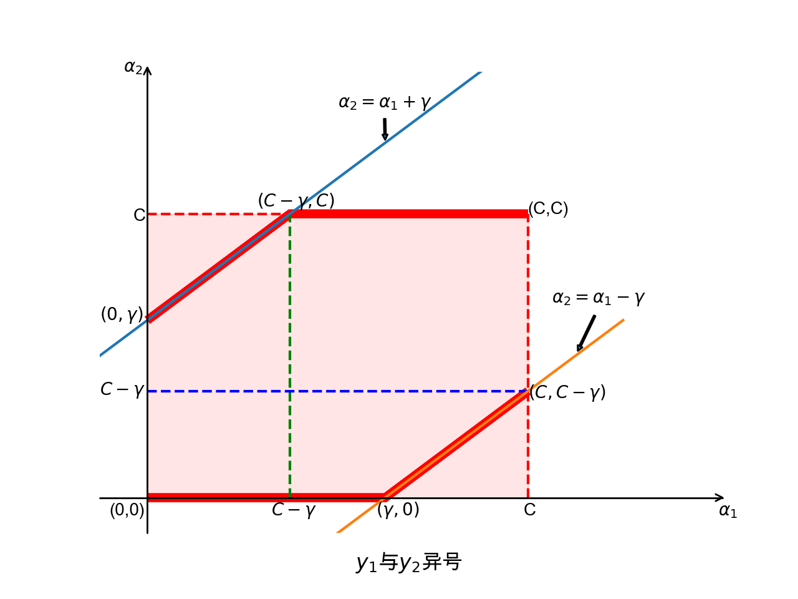
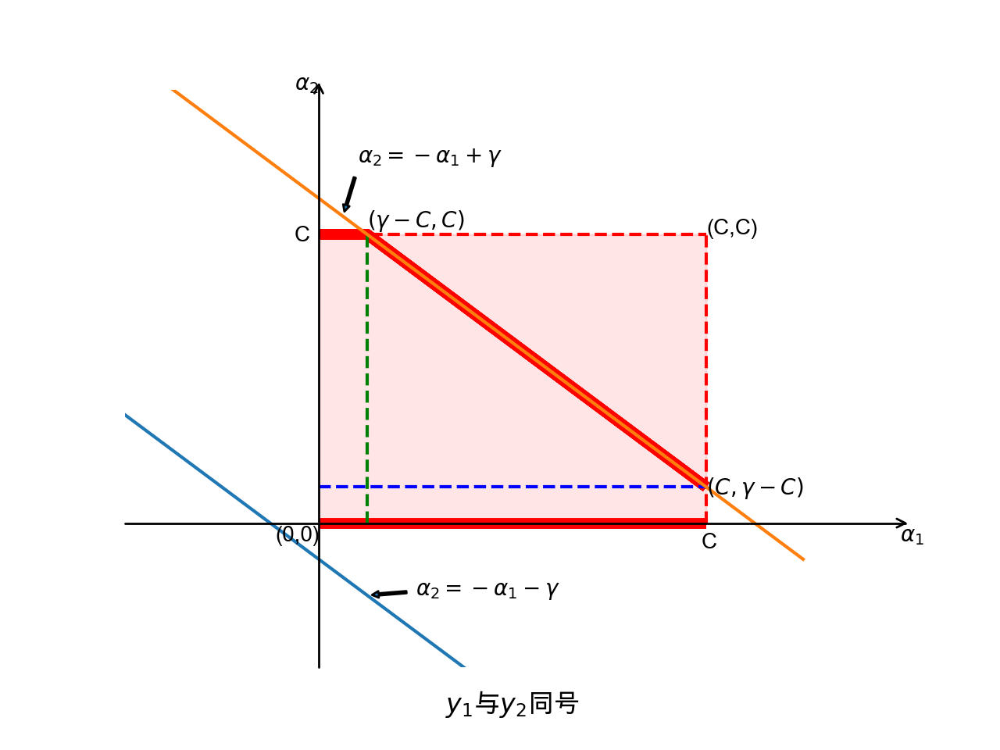

## 11.1 SMO（Sequential Minimal Optimization）序列最小最优化算法

在上一小节中，我们得到了对偶问题的内层最小值 $D(\alpha)$ 的表达式：

$$
D(\alpha)=\sum_{i=1}^n\alpha_i-\frac{1}{2}\sum_{i=1}^n\sum_{j=1}^n\alpha_i \alpha_j y_i y_j (x_i \cdot x_j)
\tag{5.5.8}
$$

然后就用样本实例代入来求解 $-D(\alpha)$ 的最小值，即 $D(\alpha)$ 的最大值，当然还有式 5.5.7 的约束条件。

当有 4 个或者更多样本参与计算时，式 5.5.9 会是一个 N 元二次方程，手工求解会变得非常繁琐。这一小节，我们将学习 SMO 算法，当样本量很大时，也会高效地得到解。

明确一下，目标问题是：

$$
\begin{aligned}
\underset{\alpha;\alpha \ge 0}{\min} & \quad \sum_{i=1}^n\alpha_i-\frac{1}{2}\sum_{i=1}^n\sum_{j=1}^n\alpha_i \alpha_j y_i y_j (x_i \cdot x_j)
\\\\
s.t. & \quad \sum_{i=1}^n\alpha_iy_i=0
\end{aligned}
\tag{5.5.8}
$$


1998年，John Platt发布了一个称为SMO的强大算法用于训练SVM。


### 简单回顾SVM

在SVM中，我们的目的是寻找两种不同类之间的超平面，使其间隔最大化，其中最大化间隔距离可以表示如下：
$$
\max\frac{1}{\| \boldsymbol w\|} \quad s.t.\; y_i( \boldsymbol w \boldsymbol x_i+b) \geqslant 1,\; i=1,\cdots ,n
$$

进一步得到需要优化的目标函数：

$$
\min_{\boldsymbol w,b} f(\boldsymbol w,b)=\frac{1}{2} {\| \boldsymbol w\|}^2 \quad s.t.\; y_i( \boldsymbol w \boldsymbol x_i+b) \geqslant 1,\; i=1,\cdots ,n
$$

该函数用拉格朗日乘子法转化成：

$$
L(\boldsymbol w,b,\alpha ) = \frac{1}{2} {\| \boldsymbol w\|}^2 + \sum_{i=1}^n \alpha_i [1-y_i(\boldsymbol w \boldsymbol x_i + b)]
$$

再由拉格朗日对偶把原问题变成：

$$
\max_{\boldsymbol\alpha} \sum_{i=1}^n \alpha_i - \sum_{i=1}^n \sum_{j=1}^n \alpha_i \alpha_j y_i y_j k_{ij}
$$

$$
    \begin{aligned}
        s.t.\; 
        &{\alpha_i \geqslant 0,i=1,\cdots,n } \\ 
        & \sum_{i=1}^n \alpha_i y_i = 0 
    \end{aligned}
$$

而SMO算法所做的，就是求解这个式子。
在这里，先给出KKT条件和核函数的概念，因为SMO算法是基于这些条件来进行的，**KKT条件为:**
$$\begin{aligned}
        \alpha_i=0 \quad \iff \quad y_i(\boldsymbol w \boldsymbol x_i + b) \geqslant 1 \\
        0 \leqslant \alpha_i \leqslant C \quad \iff \quad y_i(\boldsymbol w \boldsymbol x_i + b) = 1 \\
        \alpha_i=C \quad \iff \quad y_i(\boldsymbol w \boldsymbol x_i + b) \leqslant 1
    \end{aligned}$$ **核函数：**
在支持向量机中，我们的目的是寻找两种不同类之间的超平面的最大间隔，而这个超平面一般是通过高维映射得到的，那怎么实现高维映射呢，答案正是核函数。
核函数是一类功能性函数，能够在支持向量机中实现高维映射的函数都称为核函数，文中用$K_{ij}$表示。

### 什么是SMO算法

SMO是Sequential minimal optimization的缩写，译为序列最小优化算法，是一种用于解决支持向量机训练过程中。所产生优化问题的算法。SMO的最初版本是由微软研究院的约翰·普莱特（John
C.Platt)在《Sequential Minimal Optimization: A Fast Algorithm for Training Support Vector Machines》一文中提出的，其基本思想是将原问题求解 $(\alpha_1,\alpha_2,\alpha_3,\cdots,\alpha_n)$这$n$ 个参数的问题分解成多个子二次规划的问题分别求解，每个子问题只需要求解其中的两个参数，每次通过启发式选择两个变量进行优化，不断循环，直到达到函数的最优值。

接下来将用一个简单的例子来感受一下这个过程。

在svm3-解决优化问题中的例子，有三个样本$p_1,p_2,p_2$,其值为 ($\boldsymbol{x_i},y_i$ 分别表示$p_i$的样本值和标签值）。

$$
\boldsymbol{X}=
\begin{bmatrix}
    \boldsymbol {x}_1
\\\\
    \boldsymbol {x}_2
\\\\
    \boldsymbol {x}_3
\end{bmatrix}=
\begin{pmatrix}
    1 & 1 \\
    3 & 3 \\
    4 & 3 \\
\end{pmatrix},
\boldsymbol{Y}=
\begin{bmatrix}
    y_1 \\
    y_2 \\
    y_3 \\
\end{bmatrix}=
\begin{bmatrix}
    -1 \\
    +1 \\
    +1 \\
\end{bmatrix}
$$


当时我们通过构造拉格朗日函数$L(w,b,\alpha)$并求极值来得到优化问题下的$w,b,\alpha$值，
在这里我们通过SMO算法求解。


首先把(2)式展开： 


$$
\begin{gathered}
    \begin{aligned}
        W(\alpha) &=\alpha_1 + \alpha_2 + \alpha_3 - \frac{1}{2}[y_1y_1\alpha_1\alpha_1k_{11} + y_1y_2\alpha_1\alpha_2k_{12}+y_1y_3\alpha_1\alpha_3k_{13}+\\
        &\quad \quad \quad \quad \quad \quad \quad \quad \quad y_2y_1\alpha_2\alpha_1k_{21} + y_2y_2\alpha_2\alpha_2k_{22} + y_2y_3\alpha_2\alpha_3k_{23} + \\
        &\quad \quad \quad \quad \quad \quad \quad \quad \quad y_3y_1\alpha_3\alpha_1k_{31} + y_3y_2\alpha_3\alpha_2k_{32} + y_3y_3\alpha_3\alpha_3k_{33}]\\
        &=\alpha_1 + \alpha_2 + \alpha_3 - \frac{1}{2}k_{11}{\alpha_1}^2 - \frac{1}{2}k_{22}{\alpha_2}^2 - \frac{1}{2}k_{33}{\alpha_3}^2 -y_1y_2\alpha_1\alpha_2k_{12} - y_1y_3\alpha_1\alpha_3k_{13} - y_2y_3\alpha_2\alpha_3k_{23}
    \end{aligned}\end{gathered}
$$

把 

$$
 y_1=-1,y_2=+1,y_3=+1
$$

$$
k_{11}=\boldsymbol {x_1} \cdot \boldsymbol {x_1}^T=
\begin{bmatrix}
    1 & 1
\end{bmatrix}
\cdot
\begin{bmatrix}
    1 \\
    1 \\
\end{bmatrix}
=2$$ $$k_{22}=\boldsymbol {x_2} \cdot \boldsymbol {x_2}^T=
\begin{bmatrix}
    3 & 3
\end{bmatrix}
\cdot
\begin{bmatrix}
    3 \\
    3 \\
\end{bmatrix}
=18$$ $$k_{33}=\boldsymbol {x_3} \cdot \boldsymbol {x_3}^T=
\begin{bmatrix}
    4 & 3
\end{bmatrix}
\cdot
\begin{bmatrix}
    4 \\
    3 \\
\end{bmatrix}
=25$$ $$k_{12}=k_{21}= \boldsymbol {x_1} \cdot \boldsymbol {x_2}^T=
\begin{bmatrix}
    1 & 1
\end{bmatrix}
\cdot
\begin{bmatrix}
    3 \\
    3 \\
\end{bmatrix}
=6$$ $$k_{13}=k_{31}= \boldsymbol {x_1} \cdot \boldsymbol {x_3}^T=
\begin{bmatrix}
    1 & 1
\end{bmatrix}
\cdot
\begin{bmatrix}
    4 \\
    3 \\
\end{bmatrix}
=7$$ $$k_{23}=k_{32}= \boldsymbol {x_2} \cdot \boldsymbol {x_3}^T=
\begin{bmatrix}
    3 & 3
\end{bmatrix}
\cdot
\begin{bmatrix}
    4 \\
    3 \\
\end{bmatrix}
=21
$$ 

带入得， 
$$
\begin{gathered}
    \begin{aligned}
        W(\alpha) &=\alpha_1 + \alpha_2 + \alpha_3 - {\alpha_1}^2 - 9{\alpha_2}^2 - \frac{25}{2}{\alpha}^2 
        + 6\alpha_1\alpha_2 + 7\alpha_1\alpha_3 - 21\alpha_2\alpha_3
    \end{aligned}\end{gathered}
$$

由(2)式中的约束条件，$\alpha_1y_1+\alpha_2y_2+\alpha_3y_3=0$,即$-\alpha_1+\alpha_2+\alpha_3=0$，这里固定$\alpha_3$,即把$\alpha_3$视为常数$\gamma$, 则

$$
\alpha_1=\alpha_2-\gamma
$$

带入上式，得

$$
\begin{gathered}
    \begin{aligned}
        W(\alpha) = f(\alpha_2)= &=-4{\alpha_2}^2+(2-18\gamma )\alpha_2 - \frac{41}{2}\gamma^2
    \end{aligned}\end{gathered}
$$

对$f(\alpha_2)$ 求导得

$$
{f}'(\alpha_2)=-8\alpha_2 + 2-18\gamma
$$

令${f}'(\alpha_2)=0$，得

$$
\alpha_2=\frac{1}{4}-\frac{9}{2}\gamma , \quad \alpha_1=\frac{1}{4}-\frac{11}{2}\gamma
$$

通常$\alpha$的初始值都设置为0，所以这里$\alpha_3=\gamma =0$,进而得到

$$
\alpha_2=\frac{1}{4},\quad \alpha_1=\frac{1}{4}
$$

根据svm5-解决对偶问题一节中可知,

$$
\boldsymbol w = \sum_{i=1}^n \alpha_i y_i \boldsymbol {x_i}
$$

带入上面数据得到

$$
\boldsymbol w = -\frac{1}{4}
\begin{bmatrix}
    1 & 1
\end{bmatrix} +
\frac{1}{4}
\begin{bmatrix}
    3 & 3
\end{bmatrix} +
0 \cdot
\begin{bmatrix}
    4 & 3
\end{bmatrix}=
\begin{bmatrix}
    \frac{1}{2} & \frac{1}{2}
\end{bmatrix}
$$

同样，$b$的初始值一般为零，此时把$\alpha_1,\alpha_2,\alpha_3,\boldsymbol w,b$带入(3)式，可知满足KKT条件，从而确定它们的值。

## SMO算法的详细推导

SMO算法的目的就是求解(2)式，式子中，标签值$y_i$，核函数$k_{ij}$都是已知量，因此该式子可以写成自变量为$\boldsymbol \alpha$，因变量为$W(\boldsymbol\alpha)$的目标求解函数：

$$
\max W(\boldsymbol\alpha)= \sum_{i=1}^n \alpha_i - \frac{1}{2} \sum_{i=1}^n \sum_{j=1}^n y_i y_j \alpha_i \alpha_j k_{ij}
$$

$$
\begin{aligned}
        s.t.\; 
        &{\alpha_i \geqslant 0,i=1,\cdots,n } \\ 
        & \sum_{i=1}^n \alpha_i y_i = 0 
\end{aligned}
$$

我们来看，这个函数里有$n$个自变量$\alpha_1,\alpha_2,\cdots,\alpha_n$，若一次性计算求解，由高等数学我们知道可以分别对每个自变量$\alpha_i$求偏导，再令其偏导数等于零进而求解，这个方法在数据量很小时或许可行，
但一当遇到较大的数据量时，其计算量可想而知是非常麻烦且冗杂的。那我们能不能用其他办法来解决这个问题呢，答案是肯定的，SMO算法就是众多求解方法中的一种快速有效的方法。

回到刚刚那个问题，我们既然一次性求解$\boldsymbol \alpha$值的方法不可行，
那我们分多次求解呢，每次选择一部分$\alpha$变量进行求解，剩下的$\alpha$值我们视为常量，然后运用高等数学里面求偏导的方法求解出满足条件的$\alpha$值，不断重复以上步骤，直至矩阵$\boldsymbol \alpha$满足所需条件。
空口无凭，那我们不妨尝试一下这个方法行不行，刚开始这里就遇到个问题，我们每部分求解的$\alpha$值选几个合适呢，为了简单起见，我们就选一个吧，但这时我们回到目标函数中的约束条件$\sum_{i=1}^n \alpha_i y_i = 0$会发现，这样的话
选出来的这个$\alpha_i$就等于$-\frac{\sum_{j=1}^{n-1} \alpha_j y_j}{y_i}$，那这样$\alpha_i$也是常量了，因此，只选一个$\alpha$是不可行的，那我们选择两个呢，假设选出两个为$\alpha_1,\alpha_2$,这时$\alpha_1y_1 + \alpha_2y_2 = \sum_{j=1}^{n-2} \alpha_j y_j$,这就很好的解决了上面遇到的那个问题。

接下来，我们对选出来的$\alpha_1,\alpha_2$进行求解，
为描述方便，在这里我们定义符号 
$$
    \begin{aligned}
        K_{ij}=K(\boldsymbol{x_i},\boldsymbol{x_j}) \\
        f(\boldsymbol{x_i})=\boldsymbol w \boldsymbol{x_i} + b=\sum_{j=1}^n y_j\alpha_j K_{ij} +b \\
        \nu_i=\sum_{j=3}^n y_j \alpha_j K_{ij}
    \end{aligned}
$$ 

把$W(\alpha_1,\alpha_2)$展开得到

$$
\begin{aligned}
       W(\alpha_1,\alpha_2) &=\sum_{i=1}^n \alpha_i - \frac{1}{2} \sum_{i=1}^3\sum_{j=1}^3 y_i y_j \alpha_i \alpha_j k_{ij} \\
       &=\alpha_1 + \alpha_2 + \sum_{i=3}^n\alpha_i  - \frac{1}{2} \sum_{i=1}^n(\sum_{j=1}^2 y_i y_j \alpha_i \alpha_j k_{ij} + \sum_{j=3}^n y_i y_j \alpha_i \alpha_j k_{ij})\\
       &=\alpha_1 + \alpha_2 + \sum_{i=3}^n\alpha_i - \frac{1}{2} \sum_{i=1}^2 (\sum_{j=1}^2 y_i y_j \alpha_i \alpha_j k_{ij} + \sum_{j=3}^n y_i y_j \alpha_i \alpha_j k_{ij}) \\
       &\qquad \qquad \qquad \quad \quad - \frac{1}{2} \sum_{i=3}^n(\sum_{j=1}^2 y_i y_j \alpha_i \alpha_j k_{ij} + \sum_{j=3}^n y_i y_j \alpha_i \alpha_j k_{ij}) \\
       &=\alpha_1 + \alpha_2 + \sum_{i=3}^n\alpha_i - \frac{1}{2} \sum_{i=1}^2 \sum_{j=1}^2 y_i y_j \alpha_i \alpha_j k_{ij} - \sum_{i=1}^2\sum_{j=3}^n y_i y_j \alpha_i \alpha_j k_{ij}) - \frac{1}{2} \sum_{i=3}^n\sum_{j=3}^n y_i y_j \alpha_i \alpha_j k_{ij} \\
       &=\alpha_1 + \alpha_2 - \frac{1}{2}K_{11}{\alpha_1}^2- \frac{1}{2}K_{22}{\alpha_2}^2 - y_1y_2K_{12}\alpha_1\alpha_2 -y_1\alpha_1 \sum_{j=1}^n y_j\alpha_j K_{1j} \\
       &\qquad \qquad \qquad \quad \quad -y_2\alpha_2\sum_{j=3}^n y_j\alpha_j K_{2j} + \sum_{i=3}^n\alpha_i - \frac{1}{2}\sum_{i=3}^n\sum_{j=3}^n y_i y_j \alpha_i \alpha_j k_{ij}\\
       &=\alpha_1 + \alpha_2 - \frac{1}{2}K_{11}{\alpha_1}^2-\frac{1}{2}K_{22}{\alpha_2}^2- y_1y_2K_{12}\alpha_1\alpha_2 - y_1\alpha_1\nu_1 - y_2\alpha_2\nu_2 + Constant
\end{aligned}
$$

由上面我们知道，$\alpha_1y_1 + \alpha_2y_2 = \sum_{j=1}^{n-2} \alpha_j y_j$,因为其他的$\alpha$都视为常量，所以$\sum_{j=1}^{n-2} \alpha_j y_j$也是一个常量，令其等于$\gamma$，得到

$$\alpha_1y_1 + \alpha_2y_2 = \gamma$$ 同乘$y_1$得
$$\alpha_1 = \gamma  y_1 - y_1y_2\alpha_2$$ 令$\gamma y_1=A,y_1y_2=B$,得
$\alpha_1=A-B\alpha_2$

带入上式 
$$
\begin{aligned}
        W(\alpha_2) &= A - B\alpha_2 + \alpha_2 - \frac{1}{2}k_{11}(A-B\alpha_2)^2 - \frac{1}{2}k_{22}\alpha_2^2 - Bk_{12}y_1y_2(A-B\alpha_2)\alpha_2 \\
        &\qquad \qquad \qquad \qquad \qquad \qquad - y_1(A-B\alpha_2)\nu_1 - y_2\alpha_2\nu_2 + Constant
\end{aligned}
$$

对$W(\alpha_2)$求导得： 

$$
\begin{aligned}
        \frac{\mathrm{d}W(\alpha_2)}{\mathrm{d}\alpha_2} = -B+1+ABk_{11} - k_{11}\alpha_2 - k_{22}\alpha_2 - A B k_{12} + 2k_{12}\alpha_2 + y_2\nu_1 - y_2\nu_2
    \end{aligned}$$ 令其等于零得到： $$\begin{aligned}
        \alpha_2 &= \frac{-B+1+ABk_{11}-ABk_{12}+y_2 \nu_1 - y_2 \nu_2}{K_{11}+K_{22}-2K_{12}}\\
        &=\frac{y_2(y_2-y_1+y_1A(K_{11}-K_{12}) + \nu_1 -\nu_2)}{K_{11}+K_{22}-2K_{12}}
\end{aligned}
$$

我们把求解后的$\alpha_i$称为$\alpha_i^{new}$,求解前的$\alpha_i$称为$\alpha_i^{old}$,
由约束条件我们可得：

$$
\alpha_1^{new} y_1 + \alpha_2^{new} y_2 = \alpha_1^{old} y_1 + \alpha_2^{old} y_2 = \gamma
$$

由 

$$
\begin{aligned}
        f(\boldsymbol{x_i})=\boldsymbol w \boldsymbol{x_i} + b=\sum_{j=1}^n y_j\alpha_j K_{ij} +b \\
        \nu_i=\sum_{j=3}^n y_j \alpha_j K_{ij}
\end{aligned}
$$ 

可得

$$
\nu_1=f(x_1)-\sum_{j=1}^2 y_j\alpha_j K_{1j} -b = f(x_1)-\alpha_1y_1k_{11}-\alpha_2y_2k_{12}-b
$$
$$\nu_2=f(x_2)-\sum_{j=1}^2 y_j\alpha_j K_{2j} -b = f(x_2)-\alpha_1y_1k_{21}-\alpha_2y_2k_{22}-b
$$
所以(6)式变为: 

$$\small
    \begin{aligned}
        \alpha_2^{new} &=\frac{y_2[y_2-y_1+y_1(\alpha_1^{old} + y_1y_2\alpha_2^{old})(K_{11}-K_{12}) + (f(x_1)-\alpha_1y_1k_{11}-\alpha_2y_2k_{12}-b) -(f(x_2)-\alpha_1y_1k_{21}-\alpha_2y_2k_{22}-b)]}{K_{11}+K_{22}-2K_{12}}\\
        &=\frac{y_2(y_2-y_1+y_1(\alpha_1^{old} + y_1y_2\alpha_2^{old})(K_{11}-K_{12}) + f(x_1)-f(x_2)-\alpha_1y_1k_{11}-\alpha_2y_2k_{12}+\alpha_1y_1k_{21}+\alpha_2y_2k_{22} )}{K_{11}+K_{22}-2K_{12}}\\
        &=\frac{y_2(y_2-y_1+y_1\alpha_1^{old}k_{11}-y_1\alpha_1k_{12} + y_2\alpha_2^{old}K_{11}-y_2\alpha_2K_{12} + f(x_1)-f(x_2)-\alpha_1y_1k_{11}-\alpha_2y_2k_{12}+\alpha_1y_1k_{21}+\alpha_2y_2k_{22} )}{K_{11}+K_{22}-2K_{12}}\\
        &=\frac{y_2[\alpha_2^{old}(K_{11}+K_{22}-2k_{12}) + (f(x_1)-y_1)-(f(x_2)-y_2)]}{K_{11}+K_{22}-2K_{12}}
    \end{aligned}
$$ 

令$\eta=K_{11}+K_{22}-2K_{12}$ 进而得到迭代式：

$$
{\alpha_2}_{new}={\alpha_2}_{old}+\frac{y_2(E_1-E_2)}{\eta}
$$

回到约束条件，$\alpha_2$需满足下面两个式子

$$
0 \leqslant \alpha_2 \leqslant C
$$

$$
\alpha_1y_1 + \alpha_2y_2 = \gamma
$$ 

对第二个式子做一下变换

$$
\alpha_2=-\frac{y_1}{y_2}\alpha_1+\frac{\gamma}{y_2}
$$

当$y_1,y_2$异号时，$\alpha_2=\alpha_1 \pm \gamma$，

当$y_1,y_2$同号时，$\alpha_2=-\alpha_1 \pm \gamma$

在直角坐标系中画出相关直线可直观的看出其取值范围，如图


|||
|--|--|
|||

图1：$\alpha_2=-\frac{y_1}{y_2}\alpha_1 + \frac{\gamma}{y_2}$

$$
L=\left\{\
    \begin{array}{rcl}
        max\{0,{\alpha_1}_{old}+{\alpha_2}_{old} - \gamma\} && {y_1y_2=1} \\
        max\{0,{\alpha_2}_{old} - {\alpha_1}_{old} \} && {y_1y_2=-1}
    \end{array}\right.
$$

$$
H=\left\{\
    \begin{array}{rcl}
        min\{C,C+{\alpha_1}_{old} - {\alpha_2}_{old}\} && {y_1y_2=-1} \\
        min\{C,{\alpha_2}_{old} + {\alpha_1}_{old} \} && {y_1y_2=1}
    \end{array}\right.
$$

$$
{\alpha_j}_{new,clipped}=\left\{\
    \begin{array}{rcl}
        L && {{\alpha_j}_{new} \leqslant L} \\
        {\alpha_j}_{new} && {L<{\alpha_j}_{new} < H} \\
        H && {{\alpha_j}_{new} \geqslant H}
    \end{array}\right.
$$

$$
{\alpha_i}_{new}={\alpha_i}_{old} + y_1y_2({\alpha_j}_{old}-{\alpha_j}_{new,clipped})
$$

**阈值b的计算**

1、若$0<\alpha_2<C$,由$y_2=f(\boldsymbol{x_2})=\boldsymbol w \boldsymbol{x_2} + b=\sum_{j=1}^n y_j\alpha_j K_{2j} +b$得

$$
    \begin{aligned}
        b^{new}=b_2^{new}&=y_2-\sum_{j=3}^n y_j\alpha_j K_{2j}-\alpha_1^{new}y_1K_{21}-\alpha_2^{new}y_2K_{22}\\
        &=y_2-(f(x_2)-\alpha_1^{old}y_1K_{21}-\alpha_2^{old}y_2K_{22}-b^{old})-\alpha_1^{new}y_1K_{21}-\alpha_2^{new}y_2K_{22}\\
        &=y_2-f(x_2)+\alpha_1^{old}y_1K_{21}+\alpha_2^{old}y_2K_{22}+b^{old}-\alpha_1^{new}y_1K_{21}-\alpha_2^{new}y_2K_{22}\\
        &=y_1K_{21}(\alpha_1^{old}-\alpha_1^{new})+y_2K_{22}(\alpha_2^{old}-\alpha_2^{new})-E_2+b^{old}
    \end{aligned}
$$

2、若$0<\alpha_1<C$,同理可得
$$
b^{new}=b_1^{new}=y_1K_{11}(\alpha_1^{old}-\alpha_1^{new})+y_2K_{21}(\alpha_2^{old}-\alpha_2^{new})-E_2+b^{old}
$$

3、若1、2都满足，则$b^{new}=b_1^{new}=b_2^{new}$

4、若1、2都不满足，则$b^{new}=\frac{b_1^{new}+b_2^{new}}{2}$

至此，我们就求解出了$\alpha_1,\alpha_2$的值。
回过头来看，我们如何选择合适的$\alpha_1,\alpha_2$成为一个非常关键的问题，在SMO算法中，我们通过启发式的选择方法选出$\alpha_1$和$\alpha_2$。


**启发式的选择方法**

**第一个变量的选取**

首先遍历整个样本后选择违反KKT条件的$\alpha_i$作为
第一个变量，通常称这一过程为外循环。 违反KKT条件的$\alpha$满足下面式子：
$$
    \begin{aligned}
        \alpha_i=0 \quad \&\& \quad y_i(\boldsymbol w \boldsymbol x_i + b) <1 \\
        0 \leqslant alpha_i \leqslant C \quad \&\& \quad y_i(\boldsymbol w \boldsymbol x_i + b) \neq 1 \\
        \alpha_i=C \quad \&\& \quad y_i(\boldsymbol w \boldsymbol x_i + b) >1
    \end{aligned}
$$


**第二个变量的选取**

由(7)式可知，要加快其迭代速度，就要使其变化量最大，即$|E_1-E_2|$最大，通常确定第二个参数的方法如下：
1、在非界乘子中寻找使得$|E_1-E_2|$最大得样本；
2、如果步骤1中没有找到则从随机位置查找非界乘子样本；
3、如果步骤2中也没有找到，则从随机位置查找整个样本（包含界上和非界乘子）

以上就是SMO算法的基本思想， 通常，SMO算法的一般过程为：


1、启发式的选出两个参数$\alpha_i,\alpha_j$,所谓启发式的选择方法，即

第一个参数$\alpha_i$的选择：首先遍历整个样本后选择违反KKT条件的$\alpha_i$作为
第一个变量，通常称这一过程为外循环。 违反KKT条件的$\alpha$满足下面式子：

$$
    \begin{aligned}
        \alpha_i=0 \quad \&\& \quad y_i(\boldsymbol w \boldsymbol x_i + b) <1 \\
        0 \leqslant alpha_i \leqslant C \quad \&\& \quad y_i(\boldsymbol w \boldsymbol x_i + b) \neq 1 \\
        \alpha_i=C \quad \&\& \quad y_i(\boldsymbol w \boldsymbol x_i + b) >1
    \end{aligned}
$$

第二个参数$\alpha_j$的选择：使$\vert E_i-E_j \vert$能够取得最大值($E_i$表示误差值，等于预测值减去标签值，即$E_i=f(\boldsymbol{x_i}) - y_i,f(\boldsymbol{x_i})=\boldsymbol w \boldsymbol{x_i} + b$)。

2、更新参数$\alpha_i,\alpha_j$的值，首先在这直接给出下列式子(其中$\gamma=\alpha_i y_i + \alpha_j y_j$,$\quad$
${\alpha_i}_{old}$表示更新前的$\alpha_i$值，${\alpha_i}_{new}$表示更新后的$\alpha_i$值，${\alpha_j}_{new,clipped}$表示修剪过的满足$0 \leqslant alpha_j \leqslant C$的$\alpha_j$值，以此类推)

$$
{\alpha_j}_{new} = {\alpha_j}_{old} + \frac{y_j(E_i-E_j)}{\eta}
$$

$$
{\alpha_j}_{new,clipped}=\left\{\
    \begin{array}{rcl}
        L && {{\alpha_j}_{new} \leqslant L} \\
        {\alpha_j}_{new} && {L<{\alpha_j}_{new} < H} \\
        H && {{\alpha_j}_{new} \geqslant H}
    \end{array}\right.
$$
$$
    L=\left\{\
    \begin{array}{rcl}
        max\{0,{\alpha_i}_{old}+{\alpha_j}_{old} - \gamma\} && {y_1y_2=1} \\
        max\{0,{\alpha_j}_{old} - {\alpha_i}_{old} \} && {y_1y_2=-1}
    \end{array}\right.
$$ 
$$
    H=\left\{\
    \begin{array}{rcl}
        min\{C,C+{\alpha_i}_{old} - {\alpha_j}_{old}\} && {y_1y_2=-1} \\
        min\{C,{\alpha_j}_{old} + {\alpha_i}_{old} \} && {y_1y_2=1}
    \end{array}\right.
$$

$$
{\alpha_i}_{new}={\alpha_i}_{old} + y_1y_2({\alpha_j}_{old}-{\alpha_j}_{new,clipped})
$$

3、不断重复以上步骤，直到所有的$\alpha$都满足$0 \leqslant alpha_i \leqslant C$。

**惩罚因子$C$:**

在二分类问题中，两个类别之间并不是完全分离的，一个类别中可能包含少量另一个类别的离群点，我们称其为噪声，为了减小这些噪声对分类结果的影响，
在支持向量机中，我们引入了软间隔这一概念，即为每个样本点引入松弛变量$\xi_i$,把(1)式中的优化问题变成如下形式：

$$
\min_{\boldsymbol w,b} f(\boldsymbol w,b)=\frac{1}{2} {\| \boldsymbol w\|}^2 + C \sum_{i=1}^n \xi_i\quad s.t.\; y_i( \boldsymbol w \boldsymbol x_i+b) \geqslant 1-\xi_i,\; i=1,\cdots ,n \quad \xi_i\geqslant 0
$$

由上式可以看出，离群点的松弛变量越大，点就离间隔边距越远，没有离群的点其松弛变量即为零。
$C$被称为惩罚因子，值越大，对离群点的惩罚就越大，最终较少的离群点跨过边界，形成的模型也相对复杂，值越小，则对离群点的惩罚就越小，较多
的点会跨过间隔边界，形成的模型较为平滑。

## SMO算法的代码实现

先创建一个SMO类，

``` {.Python mathescape="" linenos="" numbersep="5pt" gobble="2" frame="lines" framesep="2mm"}
    class SMO(object):
        def __init__(self,datareader,hp):
            self.X = datareader.XTrain
            self.Y = datareader.YTrain
            self.m = datareader.m
            self.n = datareader.n
            self.alphas = np.mat(np.zeros((self.m, 1)))
            #self.alphas = mat(zeros((self.m, 1)))
            self.b = 0
            self.w = np.mat(np.zeros(self.n)).T
            #self.w=np.zeros(self.n)
            self.e_cache = np.mat(np.zeros((self.m,2)))
            #self.e_cache = mat(zeros((self.m, 2)))

            self.max_epoch=hp.max_epoch
            self.C = hp.C
            self.ksi = hp.ksi
            self.kernel_tup = hp.kernel_tup
```

计算核函数

``` {.Python mathescape="" linenos="" numbersep="5pt" gobble="2" frame="lines" framesep="2mm"}
    def __K(self,i,j):
        if self.kernel_tup[0] == 'lin':
            return self.X[i,:] * self.X[j,:].T
        elif self.kernel_tup[0] == 'rbf':
            difference_value_square = (self.X[i] - self.X[j]) \
                                * (self.X[i] - self.X[j]).T
            return math.exp(difference_value_square/(-1 * self.kernel_tup[1]**2))
```

计算期望值

``` {.Python mathescape="" linenos="" numbersep="5pt" gobble="2" frame="lines" framesep="2mm"}
    def __calculate_Ek(self,k):
        Fxk_b=0
        for i in range(self.m):
            Fxk_b+=self.Y[i]*self.alphas[i]*self.__K(i,k)
        Ek=float(Fxk_b+self.b)-float(self.Y[k])
        return Ek
```

启发式的选择第二个参数：

``` {.Python mathescape="" linenos="" numbersep="5pt" gobble="2" frame="lines" framesep="2mm"}
    def __select_alpha2(self,i,Ei):
        find_alpha_j=-1
        max_deltaE=0
        Ej=0
        self.e_cache[i]=[1,Ei]
        validE=nonzero(self.e_cache[:,0].A)[0]
        if len(validE)>1:
            for k in validE:
                if k==i:continue
                Ek=self.__calculate_Ek(k)
                deltaE=np.abs(Ei-Ek)
                if deltaE>max_deltaE:
                    find_alpha_j=k
                    Ej=Ek
                    max_deltaE=deltaE
            return find_alpha_j,Ej
        else:
            find_alpha_j=self.__select_alpha_j_rand(i)
            Ej=self.__calculate_Ek(find_alpha_j)
        return find_alpha_j,Ej
```

修剪$\alpha$参数

``` {.Python mathescape="" linenos="" numbersep="5pt" gobble="2" frame="lines" framesep="2mm"}
    def __clipAlpha(self,aj, L, H):
        if aj > H:
            aj = H
        if L > aj:
            aj = L
        return aj
```

更新期望值

``` {.Python mathescape="" linenos="" numbersep="5pt" gobble="2" frame="lines" framesep="2mm"}
    def __update_Ek(self,k):
        Ek=self.__calculate_Ek(k)
        self.e_cache[k]=[1,Ek]
```

内循环：

``` {.Python mathescape="" linenos="" numbersep="5pt" gobble="2" frame="lines" framesep="2mm"}
    def __inner_loop(self,i):
        Ei=self.__calculate_Ek(i)
        if (self.Y[i] * Ei < -self.ksi and self.alphas[i] < self.C) or \
                     (self.Y[i] * Ei > self.ksi and self.alphas[i] > 0):
            j, Ej = self.__select_alpha2(i,Ei)
            alpha_i_old = self.alphas[i].copy()
            alpha_j_old = self.alphas[j].copy()
            if (self.Y[i] != self.Y[j]):
                L = max(0, alpha_j_old - alpha_i_old)
                H = min(self.C, self.C + alpha_j_old - alpha_i_old)
            else:
                L = max(0, alpha_j_old + alpha_i_old - self.C)
                H = min(self.C, alpha_j_old + alpha_i_old)
            if L==H:
                print("L=H")
                return 0
            eta=self.__K(i,i)+self.__K(j,j)-2*self.__K(i,j)
            if eta<=0:
                print("eta<=0")
                return 0
            alpha_j_new_unclipped = alpha_j_old+self.Y[j]*(Ei-Ej)/eta
            alpha_j_new_clipped=self.__clipAlpha(alpha_j_new_unclipped,L,H)
            self.alphas[j]=alpha_j_new_clipped
            self.__update_Ek(j)
            if np.abs(alpha_j_new_clipped-alpha_j_old)<0.00001:
                print("j not moving enough")
                return 0
            alpha_i_new=alpha_i_old+self.Y[i]*self.Y[j]*\
                  (alpha_j_old - alpha_j_new_clipped)
            self.alphas[i]=alpha_i_new
            self.__update_Ek(i)
            b1=self.b - Ei - self.Y[i] * (alpha_i_new - alpha_i_old ) * self.__K(i,i)\
                    - self.Y[j] * (alpha_j_new_clipped - alpha_j_old ) * self.__K(i,j)
            b2=self.b - Ej - self.Y[i] * ( alpha_i_new - alpha_i_old ) * self.__K(i,j)\
                -self.Y[j] * (alpha_j_new_clipped-alpha_j_old ) * self.__K(j,j)
            if (0 < alpha_i_new) and (self.C > alpha_i_new):
                self.b = b1
            elif (0 < alpha_j_new_clipped) and (self.C > alpha_j_new_clipped):
                self.b = b2
            else:
                self.b = (b1 + b2) / 2.0
            return 1
        else:
            return 0
```

外循环：

``` 
{.Python mathescape="" linenos="" numbersep="5pt" gobble="2" frame="lines" framesep="2mm"}
    def __outer_loop(self):
        epoch=0
        through_all_alpha=True
        alpha_pairs_changed=0
        while (epoch < self.max_epoch) and (alpha_pairs_changed>0 or through_all_alpha):
            alpha_pairs_changed=0
            if through_all_alpha:
                for i in range(self.m):
                    alpha_pairs_changed+=self.__inner_loop(i)
                    print("through_all_alpha, epoch: %d i:%d, alpha_pairs_changed %d" \ 
                               % (epoch, i, alpha_pairs_changed))
                epoch+=1
            else:
                not_border_alphas = nonzero((self.alphas.A > 0) \ 
                                 * (self.alphas.A < self.C))[0]
                for i in not_border_alphas:
                    alpha_pairs_changed += self.__inner_loop(i)
                    print("not_border_alphas, epoch: %d i:%d, pairs changed %d" \ 
                              % (epoch, i, alpha_pairs_changed))
                epoch+=1

            if through_all_alpha:
                through_all_alpha=False
            elif alpha_pairs_changed==0:
                through_all_alpha=True
            print("epoch number: " , epoch)
```


