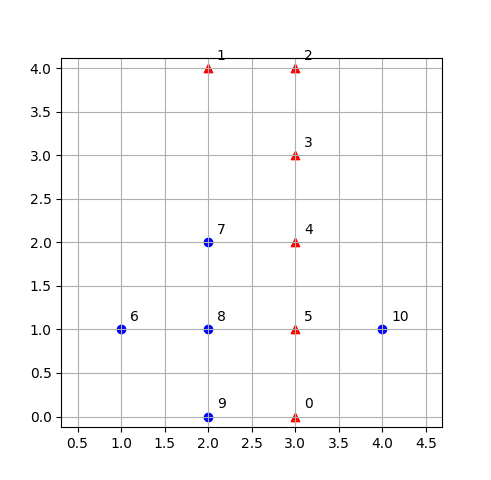
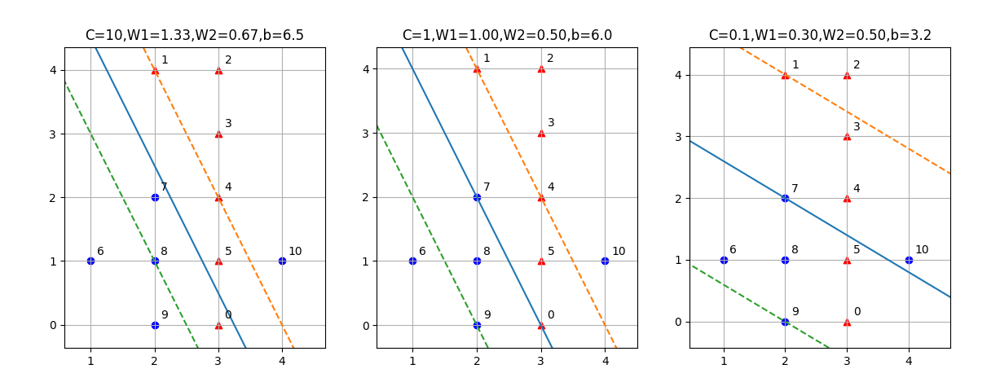
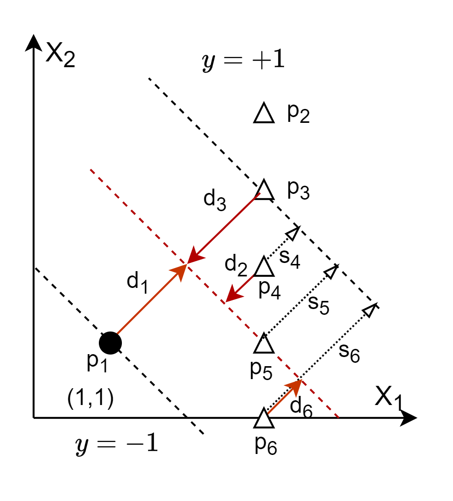

## 11.3 对松弛变量的理解

### 11.3.1 定义数据

下面我们看看图 11.3.1 所示的例子。与前面的例子不同，在这个例子中，由于有序号为 0、5、10 的样本存在，无论如何也不能做到线性可分，那么 SVM 又是如何工作的呢？

图 11.3.1 样本分布

按图 11.3.1 的右子图所示，首先列出样本值如表，有正类样本 6 个，负类样本 5 个。

表 11.3.1 样本数据

|样本|0|1|2|3|4|5|6|7|8|9|10|
|--|--|--|--|--|--|--|--|--|--|--|--|
|$x_1$|3|2|3|3|3|3|1|2|2|2|4|
|$x_2$|0|4|4|3|2|1|1|2|1|0|1|
|$y$|1|1|1|1|1|1|-1|-1|-1|-1|-1|

具体代码在 Code_11_3_1.py 中，实际上和 Code_11_2_1.py 一样，只是数据不同，所以不在赘述代码结构。

### 11.3.2 C=10 的情况

使用 sklearn 自带的 SVC 模块来进行分类，分别设置参数 C 为 10，执行 fit() 方法后，得到分类结果如表 11.3.2 所示。

表 11.3.2 C=10时的线性分类情况数据

|样本|0|1|2|3|4|5|6|7|8|9|10|
|--|--|--|--|--|--|--|--|--|--|--|--|
|$y$|1|1|1|1|1|1|-1|-1|-1|-1|-1|
|分类结果|$\times$|$\surd$|$\surd$|$\surd$|$\surd$|$\surd$|$\surd$|$\surd$|$\surd$|$\surd$|$\times$|
|距离|-0.33|1|2.33|1.66|1|0.33|-2.33|-0.33|-1|-1.66|1.66|
|位置|错边|压边线|间隔外|间隔外|压边线|间隔内|间隔外|间隔内|压边线|间隔外|错边|
|支持向量|$\surd$|$\surd$|$\times$|$\times$|$\surd$|$\surd$|$\times$|$\surd$|$\surd$|$\times$|$\surd$|
|$\alpha * y$|10|6.44|0|0|1.33|10|0|-10|-7.77|0|-10|
|$\alpha$|10|6.44|0|0|1.33|10|0|10|7.77|0|10|
|$C=10$|$\alpha=C$|$\alpha<C$|$\alpha=0$|$\alpha=0$|$\alpha<C$|$\alpha=C$|$\alpha=0$|$\alpha=C$|$\alpha<C$|$\alpha=0$|$\alpha=C$|

读者可以自行与表 11.1.1 中的定义对比，看看表 11.3.2 中关于分类结果、距离、位置、是否支持向量、$\alpha$ 值、$C$ 值，是否符合定义并且合理。

把结果可视化，便于大家理解，请看图 11.3.1 的左子图（C=10 栏）。

图 11.3.2 不同C值下的分类结果

### 11.3.3 C=1 的情况

接下来我们试验 C=1 的情况，运行结果如图 11.3.1 的中子图所示，具体数值在表 11.3.3 中。

表 11.3.3 C=1时的线性分类情况数据

|样本|0|1|2|3|4|5|6|7|8|9|10|
|--|--|--|--|--|--|--|--|--|--|--|--|
|$y$|1|1|1|1|1|1|-1|-1|-1|-1|-1|
|分类结果|两可|$\surd$|$\surd$|$\surd$|$\surd$|$\surd$|$\surd$|两可|$\surd$|$\surd$|$\times$|
|距离|0|1|2|1.5|1|0.5|-1.5|0|-0.5|-1|1.5|
|位置|压中线|压边线|间隔外|间隔外|压边线|间隔内|间隔外|压中线|间隔内|压边线|错边|
|支持向量|$\surd$|$\surd$|$\times$|$\times$|$\surd$|$\surd$|$\times$|$\surd$|$\surd$|$\surd$|$\surd$|
|$\alpha * y$|1|0.375|0|0|1|1|0|-1|-1|-0.375|-1|
|$\alpha$|1|0.375|0|0|1|1|0|1|1|0.375|1|
|$C=1$|$\alpha=C$|$\alpha<C$|$\alpha=0$|$\alpha=0$|$\alpha<C$|$\alpha=C$|$\alpha=0$|$\alpha=C$|$\alpha=C$|$\alpha<C$|$\alpha=C$|

与左子图相比，中子图的斜率没有变化，间隔上界也没有变化，分界线向左下方扩展了一些，本来是以 8 号样本为支持向量，变成了 9 号样本为支持向量，所以间隔宽度变大。

### 11.3.4 C=0.1 的情况

C=0.1 的情况中，间隔进一步扩宽，导致分类错误的样本点有 3 个，分别是 0、5、10 号。其它不再赘述，请读者自己运行代码绘制表格来理解。

### 11.3.5 松弛变量的计算

式 11.1.5 中的 $\alpha$ 值是可以计算出来的，虽然是 $\beta$ 的值计算不出来，但是我们可以看一下式 11.1.1 中关于 $C \sum_{i=1}^n s_i$ 的情况。

下面我们回顾一下软间隔的优化目标：

$$
\underset{w,b,s}{\min} \ f(w,b,s) =\frac{1}{2}||w||^2 + C \sum_{i=1}^n s_i
\tag{11.3.1}
$$

如何使用上面的例子来理解式 11.3.1 是否到达了取最小值的目的呢？

因为在前面已经从理论上证明了上面得到的结果就是最小值，所以不妨找找反例，如果找到了新的最小值，说明理论有问题；如果找不到，则从反面证明了理论的正确性。

不同的 C 值会对式 11.3.1 的结果带来显著影响，因此，我们要在 C 值相等的前提下来做上述验证。不妨就取 C=1，然后用上面的例子中 C=1 的结果做基准，来寻找反例。

首先看一下 $s_i$ 是如何计算的。

在表 11.3.2 和 11.3.3 中，“距离”这一行的数据，是这个样本到分界线的距离，而松弛变量是样本到间隔边界的距离，如图 11.3.2 所示。

图 11.3.3 各类典型样本的松弛变量计算方法

图 11.3.2 中：
- $p_1$ 是负类样本，到分界线的距离 $d_1=-1$，它到自己的负类分类间隔边界的距离 $s_1=1-|d_1|=0$；
- $p_2$ 是个正类样本，$d_2=1.5$，根据松弛变量定义，它的$s_2=0$，因为不参与支持向量的计算；
- $p_3$ 是个正类样本，$d_3=1$，它到自己的正类分类间隔边界的距离 $1-|d_3|=s_2=0$；
- $p_4$ 是个正类样本，$d_4=0.5$，它到自己的正类分类间隔边界的距离是 $s_4=1-|d_4|=0.5$；
- $p_5$ 是个正类样本，$d_5=1$，它到自己的正类分类间隔边界的距离是 $s_5=1-|d_5|=0$；
- $p_6$ 是个正类样本，但是分类错误，$d_6=-0.5$，它到自己的正类分类间隔边界的距离是 $s_6=1+|d_6|=1.5$；

总结一下计算松弛变量的方法：

- 如果分类正确，并且位置处于间隔之外或间隔线上，则 $s_i=0$；
- 如果分类正确，并且位置处于间隔之内或分界线上，则 $s_i=1-|d_i|$；
- 如果分类错误，此时位置肯定是错边，则 $s_i=1+|d_i|$。

结合“分类结果”及“位置”，我们把表 11.3.3 重新加工一下，去掉无关的行，形成表 11.3.4。

表 11.3.4 C=1 时的松弛变量

|样本|0|1|2|3|4|5|6|7|8|9|10|
|--|--|--|--|--|--|--|--|--|--|--|--|
|距离|0|1|2|1.5|1|0.5|-1.5|0|-0.5|-1|1.5|
|分类结果|两可|$\surd$|$\surd$|$\surd$|$\surd$|$\surd$|$\surd$|两可|$\surd$|$\surd$|$\times$|
|位置|压中线|压边界|间隔外|间隔外|压边界|间隔内|间隔外|压中线|间隔内|压边界|错边|
|松弛变量$s_i$|1-0=1|1-1=0|0|0|1-1=0|1-0.5=0.5|0|1-0=1|1-0.5=0.5|1-1=0|1+1.5=2.5|

C=1 时，$\boldsymbol{w}=[1,0.5]$，由此计算式 11.3.1 的值：

$$
\begin{aligned}
f(w,b,s)&=\frac{1}{2}||w||^2 + C \sum_{i=1}^n s_i
\\\\
&=(1^2+0.5^2)/2+1 \times(1+0.5+1+0.5+2.5)
\\\\
&=6.125
\end{aligned}
\tag{11.3.2}
$$

下面我们试图找一个反例，来看看是不是小于 6.125。此时，可以在图 11.3.1 的中子图的基础上，任意改变分类间隔的斜率、截距和宽度来做此验证。为了方便起见，可以只改变截距和宽度，我们发现图 11.3.1 的左子图的分类间隔的斜率与中子图相同，所以不妨先用 C=10 的结果来做一个比较，但是要假设 C=1，以排除 C 值的不同带来的影响。

计算 C=10 时的松弛变量，结果见表 11.3.4。

表 11.3.4 C=10 时的松弛变量

|样本|0|1|2|3|4|5|6|7|8|9|10|
|--|--|--|--|--|--|--|--|--|--|--|--|
|分类结果|错误|$\surd$|$\surd$|$\surd$|$\surd$|$\surd$|$\surd$|$\surd$|$\surd$|$\surd$|错误|
|距离|-0.33|1|2.33|1.66|1|0.33|-2.33|-0.33|-1|-1.66|1.66|
|位置|错边|压中线|间隔外|间隔外|压边界|间隔内|间隔外|间隔内|压边界|间隔外|错边|
|松弛变量$s_i$|1+0.33=1.33|0|0|0|0|1-0.33=0.67|0|1-0.33=0.67|0|0|1+1.6=2.66|

C=10 时，$\boldsymbol{w}=[1.33,0.67]$，由此计算式 11.3.1 的值，但要注意仍然假定 C=1，以便和式 11.3.2 的结果比较：

$$
\begin{aligned}
f(w,b,s)&=\frac{1}{2}||w||^2 + C \sum_{i=1}^n s_i
\\\\
&=(1.33^2+0.67^2)/2+1 \times (1.33+0.67+0.67+2.66)
\\\\
&=6.4389
\end{aligned}
\tag{11.3.3}
$$

可以看到式 11.3.3 的值大于式 11.3.2 的值，不是反例。

### 思考和练习

1. 修改代码 Code_11_3_1.py，观察并理解当 C=0.05 时，算法如何工作。
2. 请读者自行验证 np.dot(model.dual_coef_, model.support_vectors_) 的值是否与 $w$ 一致。
3. 请读者根据图 11.3.2 右子图的情况，自行绘制一张类似 11.3.4 的表，具体数值可以在运行 Code_11_3_1.py 后得到，然后假定 C=1，计算 $f(w,b,s)$ 的值，看看是不是小于 6.125。
 