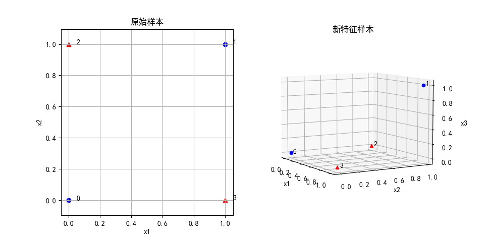
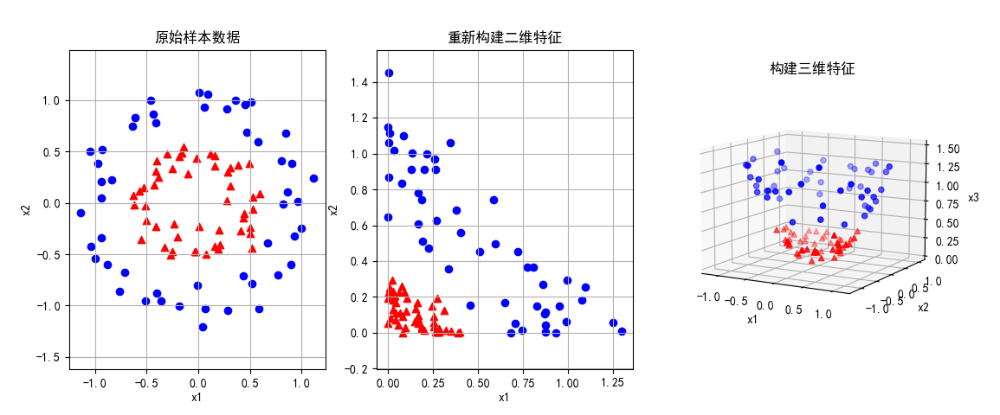

## 12.2 解决二维非线性问题

### 12.2.1 解决异或问题

众所周知，异或问题在平面问题线性不可分，原始样本定义如下：

```python
    X_raw = np.array([[0,0],[1,1],[0,1],[1,0]])
    Y = np.array([-1,-1,1,1])
```
按照 12.1 节中的经验，我们给原始样本的第三例增加一维新特征，特征映射函数是：

$$
\phi(z)=[z_1, \ z_2, \ z_1 z_2] \tag{12.2.1}
$$

即 $x_3=x_1 x_2$，代码如下：
```
    X = np.zeros((X_raw.shape[0], 3))
    X[:,0] = X_raw[:,0]
    X[:,1] = X_raw[:,1]
    # x3 = x1 * x2
    X[:,2] = X_raw[:,0] * X_raw[:,1]
```
绘制新旧样本如图 12.2.1。



<center>图 12.2.1 </center>

可以看到在图 12.2.1 右子图中，正负两类样本点已经可以线性可分了，虽然间距比较小。

表 12.2.1 增加新特征的异或样本数据

|样本序号|$x_1$|$x_2$|$y$|$x_3=x_1 x_2$|
|--|--|--|--:|--|
|1|0|0|-1|0|
|2|1|1|-1|1|
|3|1|0|1|0|
|4|0|1|1|0|

表 12.2.1 的最后一列就是新增加的特征值。

现在我们使用线性 SVC 算法来验证分类结果。

```python
def linear_svc(X,Y):
    model = SVC(C=10, kernel='linear')
    model.fit(X,Y)
```
可以看到，因为间距比较小，所以需要设置 C=10 才可以正确分类并得到一个比较窄的分类间隔。打印输出的权重和偏移值如下：

```
权重: [[ 1.99921787  1.99921787 -3.99843574]]
偏移: [-0.99960893]
```

由于数据精度问题，可以近似地认为：$\boldsymbol{w}=[2, 2, -4],b=-1$。注意在权重值中，忽略正负号，第三项的权重绝对值最大，也就是说新增加的特征 $x_3=x_1 x_2$ 的对于分类的贡献很大。

下面我们验证一下分类结果，使用 $y=wx+b$，如果 $y>0$ 为正类，如果 $y<0$ 为正类。

```python
    model = linear_svc(X, Y)
    # y = w x.T + b
    result = np.dot(model.coef_, X.T) + model.intercept_
    print("分类结果判别：", np.round(result,3))
```
由于 $\boldsymbol{w}$ 是 1x3 的矢量，$\boldsymbol{x}$ 是 4 行 3 列的矩阵，所以需要把 $\boldsymbol{x}$ 转置，变成 3x4 的矩阵，二者才能相乘，并得到 1x4 的结果，对应 4 个样本：

```
分类结果判别： [[-1. -1.  1.  1.]]
```
判别结果和原始样本的标签值一致，分类正确。

> 以上结果请运行代码 Code_12_2_Xor.py 得到。

### 12.2.2 双圆形问题

有的读者可能会有疑问：异或问题只有 4 个样本点，“随便”弄一下都可以线性可分。那么我们下面看一个稍微复杂些的二维数据的例子。

1. 原始问题

首先，我们使用 sklearn 库自带的一个 make_circle 函数来生成一组数据：

```python
from sklearn.datasets import *

X, Y = make_circles(n_samples=100, factor=0.5, noise=0.1)
Y[Y == 0] = -1
samples = np.hstack((X,Y.reshape(-1,1)))
np.savetxt(file_path, samples, fmt='%f, %f, %d', delimiter=',', header='x1, x2, y')
```
生成的 100 个样本，先把所有的 y=0 的样本的标签值变成 $y=-1$，以便和 SVM 的公式定义相同，然后保存在文件中，供下次使用时直接读出。当然也可以设置相同的随机种子值来获得相同的样本。

取出前 5 个样本列在表 11.4.2 的 $x_{1}、x_{2}、y$ 三列，其中，$x_{1}、x_{2}$ 可以理解为横纵坐标，$y$ 是标签值。

表 12.2.2 双圆形样本抽样

|样本抽样|$x_{1}$|$x_{2}$|$y$|
|:--:|--:|--:|--:|
|1|-0.182335 |-1.009643 |-1 |
|2| 0.509116 | 0.985013 |-1 |
|3|-0.567321 | 0.111492 | 1 |
|4|-0.636096 | 0.747517 |-1 |
|5|-0.381559 | 0.250026 | 1 |


我们可视化一下生成好的数据。由于样本数据把正负类混放在了一起，要根据标签数据 $y$ 区分开正负样本。

```python
def draw_2d(ax, x, y):
    ax.scatter(x[y==1,0], x[y==1,1], marker='^', c='r')
    ax.scatter(x[y==-1,0], x[y==-1,1], marker='o', c='b')
    ax.set_xlabel("x1")
    ax.set_ylabel("x2")
```

后面几行代码绘制正类样本为红色三角，负类样本为蓝色圆点。这里 sklearn 的函数把 inner（内圆） 样本作为正类，而把 outer（外圆）样本作为负类，这样会造成“负类样本大于正类样本”的假象，不利于读者理解。

最后画出图 12.2.2 的左子图。



<center>图 12.2.2 </center>

2. 替换原有特征

通过观察左子图的样本分布，可以知道是线性不可分的，但是直观上看可以用一个圆形来分开两类样本点之间。

根据圆的方程：$r^2=x^2+y^2$，我们先做第一个试验：把表 11.4.2 中的两个特征值 $x_1,x_2$ 变成它们各自的平方，有映射函数：

$$
\phi(z) = [z_1^2,\ z_2^2]   \tag{12.2.1}
$$

其中 $z_1$ 表示第一维特征，$z_2$ 表示第二维特征。得到一组新的数据后，显示在图 12.2.2 的中子图上，可以看到，由于正类样本的原始坐标绝对值较小（因为靠近原点），取平方后，两维新特征值都会比负类样本小，所以就聚集在二维坐标系第一象限的左下角。如此一来，可以有一条斜线分割两类样本。

3. 增加二次项新特征

在 12.1 节中，我们学习了升维的方法，在本例中是否能够同样适用呢？

下面做第二个试验，给样本增加一个维度：$x_{3} = x_{1}^2 + x_{2}^2$，映射函数是：

$$
\phi(z) = [z_1, \ z_2, \ z_1^2+z_2^2] \tag{12.2.2}
$$


代码如下，计算前两个特征值的平方和得到 $x_{3}$，然后加到原有的 $x$ 矩阵的最后一列，得到 $X$：

```python
    # 前两维特征不变
    X_3d = np.zeros((X_raw.shape[0], 3))
    X_3d[:,0:2] = X_raw
    # 增加一维 x1*x1 + x2*x2
    X_3d[:,2] = X_raw[:,0]**2 + X_raw[:,1]**2
```

然后在三维坐标系中绘制新的样本分布，调整观察角度后得到图 12.2.2 的右子图：

- 从顶面观察样本分布，和原始分布相同，因为此时第三维特征不起作用。
- 从侧向观察样本分布，可以看到在正负类样本点之间有一个明显的线性分隔带。

所以通过从二维到三维的升维，我们又可以顺利解决原始的线性不可分的问题。

以上结果请运行代码 Code_12_2_Circle.py 得到。

### 思考和练习

1. 请使用线性 SVM 分类器分别对图 12.2.2 的中子图和右子图的新特征样本数据做线性二分类，并绘制出分类结果（分类区域、分类间隔）。
2. 请可视化 $\phi(z)=[z_1^2,\ z_1 z_2,  \ z_2^2]$ 时，在三维空间中的样本分布情况。
