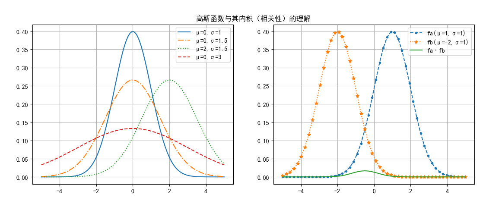
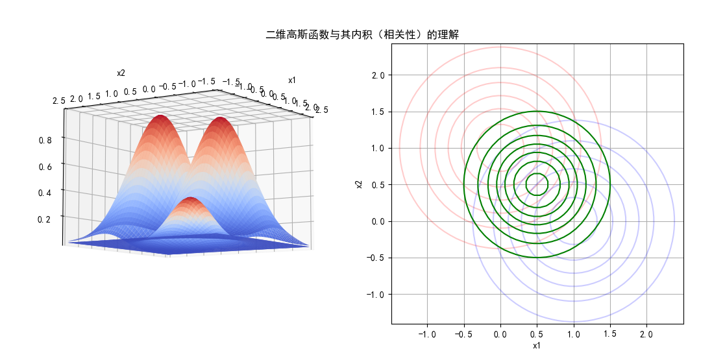

## 12.6 高斯函数的内积

### 12.6.1 连续函数的内积定义

要想透彻理解高斯核函数的含义，先从理解函数内积及高斯函数入手。

两个连续函数 $f(x),g(x)$ 在区间 $[p,q]$ 内可积且平方可积，则式 12.6.1 称作函数的内积：

$$
\langle f,g \rangle  = \int_p^q f(x) g(x) dx \tag{12.6.1}
$$

对于离散变量来说，两个相同维数的矢量的内积公式：

$$
\langle \boldsymbol{x}_i, \boldsymbol{x}_j \rangle  = \sum_{k=1}^n (x_{i,k} \ x_{j,k})  \tag{12.6.2}
$$

其中 $i,j$ 表示两个变量的序号，$n$ 是特征维数，$k$ 是特征序号。

式 12.6.1 和式 12.6.2 二者的含义是相同的，都经过两步计算：

1. 按位相乘：
   
   - 这在式 12.6.2 中很明显：相同位置 $k$ 的特征值相乘。
   - 在式 12.6.1 中，可以理解为在 $[p,q]$ 区间内的所有相同 $x$ 值对应的 $f(x)$ 和 $g(x)$ 的值相乘。

2. 把 1 的结果相加：
   
   - 在式 12.6.2 中，用求和符号实现。
   - 在式 12.6.1 中，用积分符号实现。

### 12.6.2 一维高斯函数的内积

先看高斯函数的定义：

$$
f(x)=\frac{1}{\sigma \sqrt{2\pi}} \exp \Big [-\frac{(x-\mu)^2}{2\sigma^2} \Big ] \tag{12.6.3}
$$

我们使用 Code_11_9_1_Gaussian.py 代码绘制高斯函数的形态，显示在图 12.6.1 左子图中，展示了4个不同参数组合的高斯函数的形态，其中：

1. 参数 $\mu$ 用于定位中心轴。比如值为 2 时，函数图像（绿色虚线）整体向右移动两个单位。
2. 参数 $\sigma$ 用于控制形状（高度和宽度），该值越大，函数图像越加的扁宽，比如红色虚线的 $\sigma=3$，就比其它图像要更扁宽一些。
3. $\frac{1}{\sigma\sqrt{2\pi}}$ 是归一化参数，为了让曲线下（从 $-\infty$ 到 $+\infty$）的面积为 1，所以当高度低时，宽度就大。



<center>图 12.6.1 一维高斯函数与内积</center>

接下来我们先忽略 $\sigma$ 的影响，只看 $\mu$ 值。假设有两个高斯函数的 $\mu$ 值分别为 $a,b$ ：

$$
f_a(x)=\frac{1}{\sigma \sqrt{2\pi}} \exp \left [-\frac{(x-a)^2}{2\sigma^2} \right ] \tag{12.6.4}
$$
$$
f_b(x)=\frac{1}{\sigma \sqrt{2\pi}}\exp \left [-\frac{(x-b)^2}{2\sigma^2} \right ]  \tag{12.6.5}
$$

按式 12.6.1 做计算内积，先做乘法：

$$
\begin{aligned}
f_a(x) f_b(x) &= \frac{1}{2\pi\sigma^2} \exp \left[ -\frac{(x-a)^2}{2\sigma^2} \right] \exp \left[ -\frac{(x-b)^2}{2\sigma^2} \right]
\\\\
&=\frac{1}{2\pi\sigma^2} \exp\left[ -\frac{(x-a)^2+(x-b)^2}{2\sigma^2} \right]
\\\\
&=\frac{1}{2\pi\sigma^2}\exp \left [ -\frac{2x^2+a^2+b^2-2x(a+b)}{2\sigma^2} \right ]
\\\\
&=\frac{1}{2\pi\sigma^2}\exp  \left \{ -\frac{1}{\sigma^2} \left [\left (x - \frac{a+b}{2}\right )^2+ \left(  \frac{a-b}{2}  \right )^2 \right ] \right \} \quad (令 \mu = \frac{a+b}{2})
\\\\
&=\frac{1}{2\pi\sigma^2}\exp  \left [ -\frac{\left (x - \mu \right )^2}{\sigma^2}   \right ] \exp  \left [ -\frac{(a-b)^2}{4\sigma^2}   \right]
\end{aligned} \tag{12.6.6}
$$

下面求积分以便得到内积。对式 12.6.6 中的 $x$ 求积分，后面的一项成为常数项，可以提出到积分符号之外：

$$
\begin{aligned}
\int_{-\infty}^{+\infty} f_a(x)f_b(x) &=\frac{1}{2\pi\sigma^2}\exp  \left [  -\frac{(a-b)^2}{4\sigma^2} \right] \int_{-\infty}^{+\infty} \exp  \left [ -\frac{\left (x - \mu \right )^2}{\sigma^2}   \right ] dx  
\\\\
&=\frac{1}{2\pi\sigma^2} \cdot \exp \left [  -\frac{(a-b)^2}{4\sigma^2} \right] \cdot \sigma \sqrt{\pi}
\\\\
&=\frac{1}{2 \sigma \sqrt{\pi}} \exp \left [  -\frac{(a-b)^2}{4\sigma^2} \right]
\end{aligned}
\tag{12.6.7}
$$

式 12.6.7 的函数图像如图 12.6.1 右子图所示：

- 两个较高的函数图像分别是 $f_a(x),f_b(x)$，其中 $a=1,b=-2$。
- 中间比较矮的函数图像是 $f_a(x)f_b(x)$ 的乘积，最高处的横坐标（即 $\mu$ 值）为 -0.5，因为 $(a+b)/2=-0.5$，即 $a,b$ 的中点。
- $f=f_a(x) f_b(x)$ 曲线下的面积就是式 12.6.7 的积分结果，可以验证当 $a=1,b=-2,\sigma=1$ 时，$\frac{1}{2 \sigma \sqrt{\pi}} e^{-\frac{(a-b)^2}{4\sigma^2}}=\frac{1}{2 \sqrt{\pi}} e^{-\frac{(1+2)^2}{4}} \approx 0.0297$。

我们顺带着学习一下 python 中的积分函数：如果将 $a=1,b=-2$ 带入式 12.6.6 的第三行：

$$
\begin{aligned}
f=f_a(x)f_b(x)&=\frac{1}{2\pi\sigma^2}\exp \left [ -\frac{2x^2+a^2+b^2-2x(a+b)}{2\sigma^2} \right ] 
\\\\
&= \exp \left [ -(2x^2+2x+5) / {2\sigma^2} \right ] / 2\pi\sigma^2
\end{aligned}
\tag{12.6.8}
$$

下面代码中按照式 12.6.8 定义函数 $f(x)$ 的计算公式：

```python
# 验证 fa x fb 的积分值
def f(x):
    sigma=1
    # 式 12.6.8, 令 a=1,b=-2,sigma=1
    f = np.exp(-(2*x*x + 2*x + 5)/(2*sigma*sigma)) / (2*np.pi*sigma*sigma)
    return f
```

然后调用 scipy 库中的积分函数计算积分值：

```python
# 式 11.8.12
def integrate_fab():
    return integrate.quad(f,-100,100)
```
得到：
```
积分结果：
(0.029732572305907347, 4.179708708779781e-12)
```
其中，0.0297（保留4位小数）是积分结果，后面的数值是误差，与直接计算 12.6.7 相等。这说明式 12.6.7 的推导结果是正确的。

> 以上结果请运行 Code_12_6_Gaussian.py 得到。

### 12.6.3 二维高斯函数的内积

二维高斯函数的定义是：

$$
\begin{aligned}
f(x,y)&=\exp \Big ( -\frac{(x-\mu_1)^2}{2 \sigma_1^2} - \frac{(y-\mu_2)^2}{2 \sigma_2^2} \Big ) 
\\\\
&= \exp \big (-\gamma \big[(x-\mu_1)^2+(y-\mu_2)^2 \big] \big)
\end{aligned}
\tag{12.6.9}
$$

$(\mu_1,\mu_2)$ 为其中心坐标。

根据函数内积定义，先求乘积，再求积分。

令函数 $f_1(x,y)$ 的中心坐标为 $c_1=(a,b)$：
$$
f_1(x,y) = \exp \big (-\gamma \big [(x-a)^2+(y-b)^2 \big ] \big) \tag{12.6.10}
$$
令函数 $f_2(x,y)$ 的中心坐标为 $c_2=(c,d)$：
$$
f_2(x,y) = \exp \big (-\gamma \big [ (x-c)^2+(y-d)^2 \big ] \big ) \tag{12.6.11}
$$

其乘积为：

$$
\begin{aligned}
f_1(x,y)\ f_2(x,y)&=\exp \big (-\gamma \big [(x-a)^2+(y-b)^2+(x-c)^2+(y-d)^2 \big ] \big )
\\\\
&=\exp \Big (-2\gamma \Big [ \big (x-\frac{a+c}{2}\big )^2 + \frac{(a-c)^2}{4} + \big (y- \frac{b+d}{2}\big )^2 + \frac{(b-d)^2}{4}   \Big] \Big )
\\\\
&\big (令：\mu_1=\frac{a+c}{2}, \mu_2=\frac{b+d}{2} \ 以简化公式 \big )
\\\\
&=\exp \Big (-2\gamma \Big [ \big (x-\mu_1 \big )^2 + \frac{(a-c)^2}{4} + (y- \mu_2 \big )^2 + \frac{(b-d)^2}{4}   \Big] \Big )
\\\\
&=e^{-2\gamma[(x-\mu_1)^2+(y-\mu_2)^2]} e^{ - \frac{1}{2} \gamma [(a-c)^2 + (b-d)^2]}
\end{aligned}
 \tag{12.6.12}
$$

求式 12.6.12 的积分：

$$
\begin{aligned}
\int \int f_1(x,y)\ f_2(x,y) \  dx \ dy &=\int \int e^{-2\gamma[(x-\mu_1)^2+(y-\mu_2)^2]}  e^{ - \frac{1}{2} \gamma [(a-c)^2 + (b-d)^2]} \  dx \ dy
\\\\
&= e^{ - \frac{1}{2} \gamma [(a-c)^2 + (b-d)^2]} \int \int e^{-2\gamma[(x-\mu_1)^2+(y-\mu_2)^2]} \  dx \ dy 
\\\\
&(后面的二维高斯函数积分结果是一个常数，令其为C)
\\\\
&=C  e^{ - \frac{1}{2} \gamma [(a-c)^2 + (b-d)^2]} \qquad (将c_1=(a,b), c_2=(c,d)代回)
\\\\
&=C e^{- \frac{1}{2} \gamma  ||c_1 - c_2||^2  }
\end{aligned}
\tag{12.6.13}
$$

观察式 12.6.7 和 12.6.13，可以看到指数部分的分子中有 $(a-b)^2$ 和 $||c_1-c_2||^2$ 项，这与式 11.8.1 所定义的高斯核函数的形态 $||x_i-x_j||^2$ 完全相同，其含义也相同：

- 在一维高斯函数中，$a,b$ 代表以它们为中心轴的两条高斯曲线的位置。
- 在二维高斯函数中，$c_1,c_2$ 表示以它们为中心的两个高斯曲面的位置。

由此可以得到推论：**高斯核函数（式 11.8.1）就是两个高斯函数的内积（式12.6.13）。** 



<center>图 12.6.2 二维高斯函数与内积</center>

如图 12.6.2，左子图中两个“个子”比较高的曲面分别是以 $c_1=(0,1)$ 和 $c_2=(1,0)$ 为中心的二维高斯函数，而“个子”比较矮的是它们的“孩子”，即二者相乘的结果。因为二者相交的部分在边缘地带，再加上都小于 0，所以乘积后的结果更小，因此“孩子”的个子比较矮，它的曲面下的积分体积就是内积的结果。

右子图中红色和蓝色的等高线是“高个子”高斯函数的投影，绿色的等高线是它们的乘积的投影。这张图主要是让读者理解位置的概念，在实际的内积计算中，这个绿色的“孩子”是不存在的，只是个中间的结果。

这就真正理解了高斯核函数的含义：**把 $x_i$ 看作是以样本 $x_i$ 为中心的高斯函数，把 $x_j$ 看作是以样本 $x_j$ 为中心的高斯函数，则 $e^{-\gamma||\boldsymbol{x}_i-\boldsymbol{x}_j||^2}$ 就是两个样本的高斯函数的内积。** 对一维、二维或更高维的高斯函数都是如此。

> 以上结果请运行 Code_12_6_Gaussian.py 得到。

### 思考和练习

