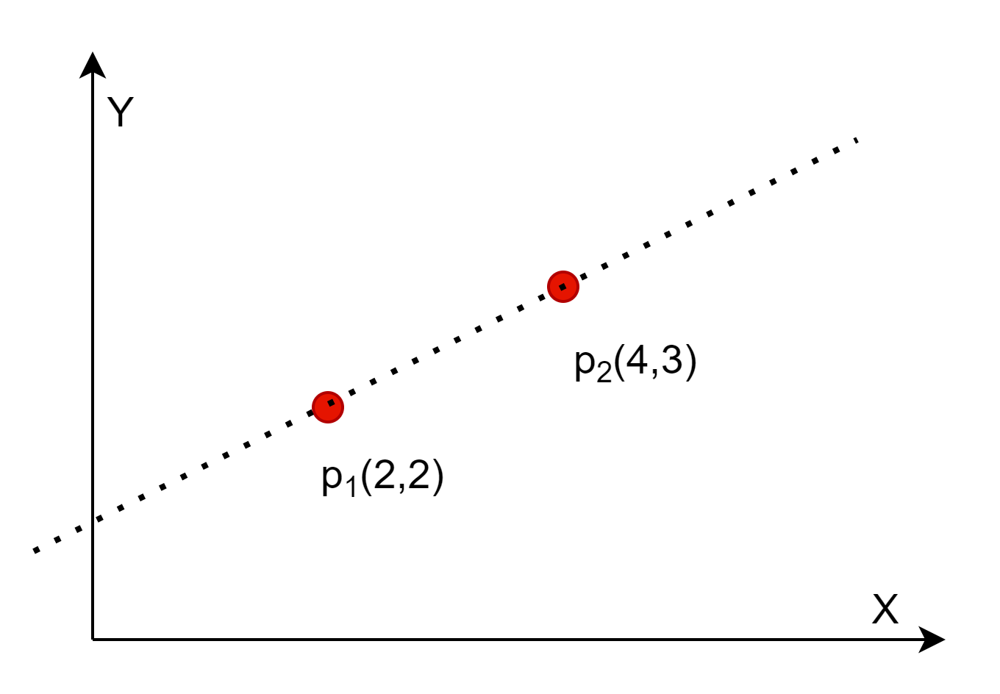

## 一元线性回归

### 简单的直线拟合问题

大家在初中就学习过这样的问题：在平面上有两个点 $p_1(2,2)$ 和 $p_2(4,3)$，求解一条直线可以同时穿过这两个点。


假设直线的方程为：

$$
y = ax + b \tag{1.1}
$$

那么就把问题转化为求解 $a$ 和 $b$ 的值，这是最简单的线性问题，只要把 $p_1$ 和 $p_2$ 的坐标值带入公式1.1，即可得到一个二元一次方程组：

$$
\begin{cases}
2=2a+b \\\\
3=4a+b
\end{cases}
$$

得到：

$$
\begin{cases}
a=0.5 
\\\\
b=1
\end{cases}
$$

则公式的实际形式为：$y=0.5x+1$，这样我们就得到了从两个样本点（$p_1,p_2$）拟合出来的直线。

平面上两点确定一条直线，这是一个常识。但是如果像图 1.2 那样有三个点，由于噪音的存在，点 $p_3$ 不在直线 $y=0.5x+1$ 上，但是依然要求我们用一条直线来拟合这些点，我们如何确定哪条直线是正确的解呢？



这就是线性回归模型要解决的问题。

### 一元线性回归模型

公式 1.1 是一个非常简单的理想化的数学问题，但是在客观世界中，由于受到各种因素的干扰，实际的公式可能是这样的：

$$
y=ax+b+\varepsilon \tag{1.2}
$$

公式 1.2 称为一元线性回归模型，$a$ 和 $b$ 是模型的参数，$x$ 是一元自变量，$y$ 是因变量。针对这一模型，有以下几个主要假定$^{[1]}$：

1. 因变量 $y$ 与自变量 $x$ 之间具有线性关系。
2. 在重复抽样中，自变量 $x$ 的取值是固定的，即假定 $x$ 是非随机的。
3. 误差项 $\varepsilon$ 是一个期望为 0 的随机变量，即 $E(\varepsilon)=0$。
4. 对于所有的 $x$ 值，$\varepsilon$ 的方差都相同。
5. 误差项 $\varepsilon$ 是一个服从正态分布的随机变量且独立，即 $\varepsilon \sim N(0,\sigma^2)$

上述假定意味着对于任何一个给定的 $x$，$y$ 的取值都对应着一个分布，所以 $y$ 的期望值 $E(y)=ax+b$，而 $y$ 的方差等于 $\varepsilon$ 的方差 $\sigma^2$。当 $\sigma^2$ 较小时，$y$ 的观测值非常靠近直线；当 $\sigma^2$ 较大时，$y$ 的观测值将偏离直线。


从图 1.2 可以看到，$y$ 的期望值处于 $y=ax+b$ 直线之上，但是其实际的取值却是个正态分布。比如，$x1=2$ 时，$y$ 的取值可能是 $1.9, 1.93, 1.99, 2, 2.01, 2.02......$ 中的任何一个值。

### 制作数据集

根据公式 1.2，下面我们来自己制作一个数据集，来探讨一元线性回归模型的解法。

这里有人可能会有疑问：为什么要自己制作数据集？不是有很多现有的工业数据集可以使用吗？

自己制作数据集，是本书的一个自学、教学方法。以本例来说，我们会根据公式 1.2，令 $a=0.5$ 且 $b=1$ 外加噪音来制作样本数据。在解出回归模型的 $\hat a$ 和 $\hat b$ 后，与原始的 $a=0.5$ 和 $b=1$ 来对比，如果非常值接近，就说明我们的算法是正确的。如果直接用工业数据集来验证算法，即使通过测试数据达到比较满意的准确率，依然不能得知其 ground truth（真实数值）。

先假设一个应用场景：在一个机房里，有 346 台计算机，需要空调来制冷，使得机房的温度保持在 20 摄氏度左右。假设空调的功率（千瓦/小时）与计算机的数量是相关的，而且是线性关系。需要解决的问题是找到这种线性关系，这个问题用定量的数学方法是很难解出来的，因为每台计算机的散热量不是一个定值，与其繁忙程度有关，所以一般会用现场实测空调功率的方式来解决。

针对公式 1.2，假设 $a=0.5$，$b=1$，$\varepsilon \sim N(0,0.1)$，$x$（某个机房内的计算机数量）是一个从 0 到 1000 的随机数，一共有需要 100 个机房的样本数据，于是有代码如下：

```Python
a = 0.5         # 参数a
b = 1           # 参数b
m = 100         # 模拟100个机房的样本
def generate_samples_1(a, b, m):
    # m个[0,1)之间随机数，表示机房内计算机数量/1000
    X = np.random.random(size=(m, 1))
    # 返回均值为0，方差为0.1的误差的一组值
    Epsilon = np.random.normal(loc=0, scale=0.1, size=X.shape)
    Y = a * X + b + Epsilon
    return X,Y
```
这里的 $\bold X$ 和 $\bold Y$ 各是一个 $(100 \times 1)$ 的一维数组，分别表示样本的训练数据和标签数据。

且慢！上面的代码并不正确，有两个地方的假设是错误的：

1. 关于 $X$ 的生成方法

大家都知道正态分布无处不在，所以机房中服务器的数量也应该服从这一分布。这一行代码：
```Python
    X = np.random.random(size=(m, 1))
```
是在 $[0,1)$ 之间均匀分布生成了 $m$ 个随机值，这与实际情况不符。

2. 关于 $Y$ 的生成方法

在生成 Epsilon 时，只生成了一组（100个）正态分布的噪音数据，然后就在最后一行代码通过矩阵相加的形式，顺序地分配给了 $\bold X$ 数组。这就相当于不同的 $x$ 取值，其所有的 $y$ 值整体的噪音是一个正态分布，而不是基于每个 $y$ 的独立的正态分布。

所以，我们改变代码如下：
```Python
def generate_samples_2(a, b, m):
    # 以0.5为中心的正态分布，表示机房内计算机数量/1000
    X = np.random.normal(loc=0.5, scale=0.15, size=(m, 1))
    Y = np.zeros_like(X)
    for i in range(m):
        # 返回均值为0，方差为0.1的误差的一个值
        epsilon = np.random.normal(loc=0, scale=0.05, size=None)
        # 对于每个特定的x值，都从N(0,0.1)中取出一个随机值作为噪音添加到y上
        Y[i,0] = a * X[i,0] + b + epsilon
    return X,Y
```

在生成数据后，我们可以取出前几行浏览一下，得到表1.1，并用 matplotlib 库来做一下可视化，得到图1.3。

表1.1

|No.|x=服务器数量(千台)|y=空调功率(千瓦)|
|--|--|--|
|1|0.690586|1.312095|
|2|0.366986|1.261951|
|3|0.673172|1.316155|
|4|0.463276|1.174213|
|5|0.378678|1.144099|
|...|......|......|


在图1.3中，上面的两张子图分别是 $X$ 和 $Y$ 的分布，可以看到它们都是呈正态分布的，满足我们制作数据集的假设。下面的子图中，每个样本点代表某个机房的情况：

- 横坐标是计算机的数量，用“千台”作为单位；
- 纵坐标是需要空调的功率，用“千瓦”作为单位。

从散点图的密度也可以看出，处于中间的部分密度较大，因为是处于正态分布的中间地带，所以样本数较多。
