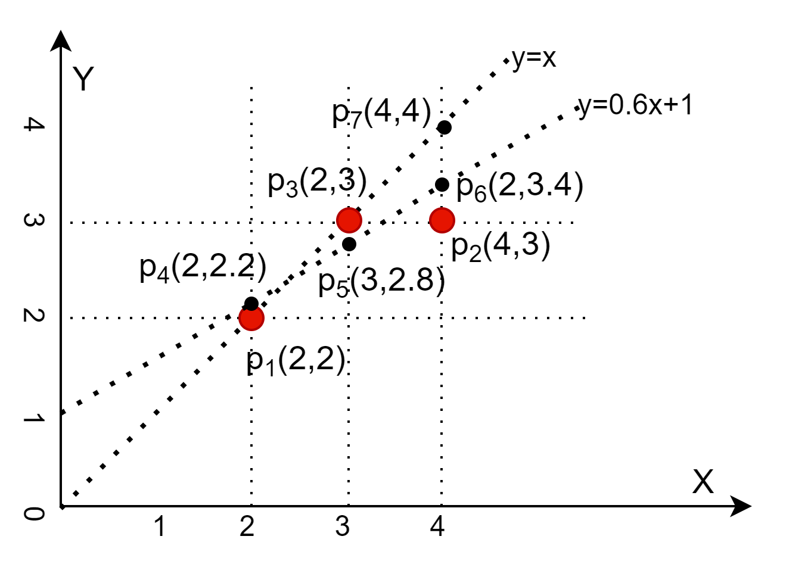

## 1.2 损失函数

### 如何衡量拟合的误差

回到图 1.1.2 的问题上：如何评价哪一条直线是最好的拟合结果呢？

这就要引入误差的概念，见图 1.2.1。

图 1.2.1 误差的计算方法

在得到一条拟合直线后，即初步确定了参数值 $a、b$ 后，此时我们把这些初步的参数值称作 $\hat{a}、\hat{b}$（读作a hat，b hat），那么拟合的线性模型是：

$$
\hat y = \hat a x + \hat b \tag{1.2.1}
$$

$\hat y$（读作y hat）表示是估算出来的结果值，而不是原始的标签值 $y$。那么标签值到拟合直线的距离，就可以作为拟合误差。

点到直线的距离本来应该用“垂直”距离来计算，但是那样的话计算量太大了，而“竖直”距离用一个减法就可以得到，而且和垂直距离是正相关的，完全可以代替垂直距离。所以，德国科学家卡尔·高斯（Karl Gauss，1777-1855）提出用图 1.2.1 中竖直方向的距离 error 作为误差，表示每个样本点的标签值 $y$ 与估算值 $\hat{y}$ 的误差：

$$
error = y - \hat{y}=y -  (\hat a x + \hat b) \tag{1.2.2}
$$

当拟合直线距离某一个特定的样本点较近时，只能代表该点的误差项较小，而其他点的误差项可能会较大，所以我们要用所有样本的的误差和来计算总体误差。但是，这些误差有正有负，我们不希望在做加法时正负抵消，所以用误差值做平方运算后再相加，令$J=\sum\limits_{i=1}^n error_i^2$，则：

$$
J = \sum_{i=1}^n [y_i -  (\hat a x_i + \hat b)]^2 \tag{1.2.3}
$$

在机器学习中，$J$ 被称作损失函数。公式 1.2.3 叫做均方差损失函数。

用竖直距离的另外一个好处是，当回归结果为一条曲线时，同样适用，计算依然简单。如果计算点到曲线的垂直距离，就非常麻烦了。

现在有了损失函数，我们可以回答图 1.1.2 的问题了：

1. 计算拟合直线 $y=x$ 的损失函数值 $J_1$
2. 计算拟合直线 $y=0.5x+1$ 的损失函数值 $J_2$
3. 由于损失函数值是标量，所以可以直接比较 $J_1、J_2$ 的值，越小越好。

图 1.2.2 比较两条直线的拟合效果

在图 1.1.4 中，我们绘制出两条拟合直线，并把其所经过的点列在表 1.2.1 中，然后计算其损失函数值。

表 1.2.1 比较损失函数值

||样本1|样本2|样本3|损失函数 $J=\sum_{i=1}^3 (y_i-\hat{y}_i)^2$|
|--|--|--|--|--|
|特征值 $x$|2|3|4|
|标签值 $y$|2|3|3|
|结果1：$\hat{y}=x$|2|3|4|$J_1=(2-2)^2+(3-3)^2+(3-4)^2=1$|
|结果2：$\hat{y}=0.5x+1$|2|2.5|3|$J_2=(2-2)^2+(3-2.5)^2+(3-3)^2=0.25$|

由于 $J_2 \lt J_1$，所以第二条直线拟合效果较好。

可以看到，虽然结果 1 可以准确地拟合 $p_1$ 和 $p_3$，但是在 $p_2$ 上的误差太大了；结果 2 准确地拟合了 $p_1、p_2$，在 $p_3$ 上误差相对较小，总体的误差也会比 1 好。所以我们可以得出结论，$\hat{y}=0.5x+1$ 的拟合效果要好。

当样本较多的时候，误差项多，均方差的数值也会比较大，所以无法用一个固定的数值来衡量均方差是否达到要求了，只能自己和自己比。

均方差损失函数的另外两种常用的写法是：

$$
J= \frac{1}{n}\sum_{i=1}^n (y_i-\hat{y}_i)^2 \tag{1.2.4}
$$

或

$$
J= \frac{1}{2n}\sum_{i=1}^n (y_i-\hat{y}_i)^2 \tag{1.2.5}
$$

前者除以 n 后，可以解决样本数量较大时 $J$ 值较大的问题。后者在前者的基础上分母乘以 2，是为了在求导后约掉那个从平方项上导过来的多余的 2，计算方便。

有些读者会担心除以 2 以后，损失函数值变小了，不能正确反映真实情况。其实这种担心大可不必，因为随着问题、样本、模型的不同，损失函数值从来就不会相同，还是那句话：自己和自己比。同一个问题，同一批样本，同一个模型，如果以前除以 2 了，那么后面也要除以 2，反之亦然。

### 思考与练习

1. 在图 1.2.2 中，假设回归模型的结果为 $y=0.6x+1$，请计算它的损失函数值，并与 $J1、J2$ 比较。
