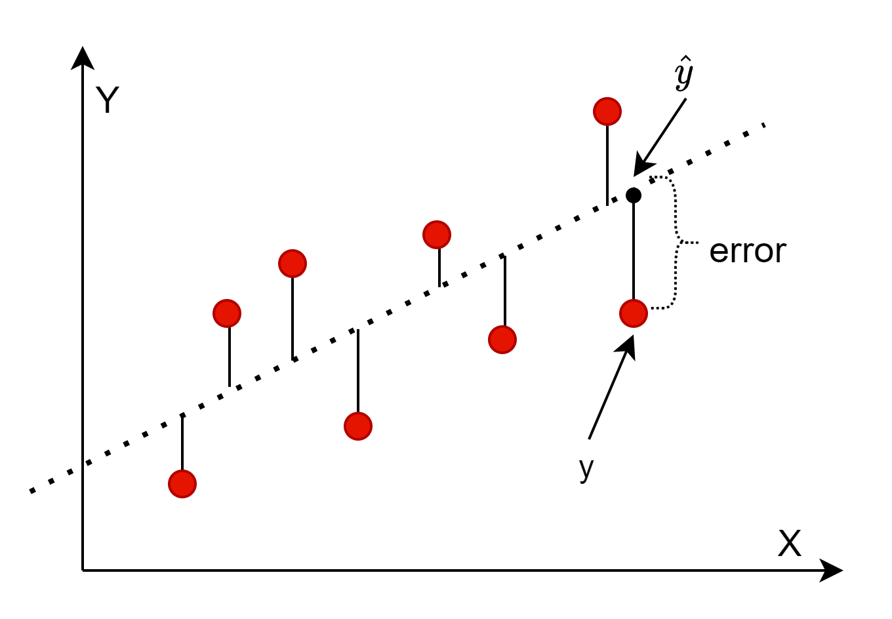
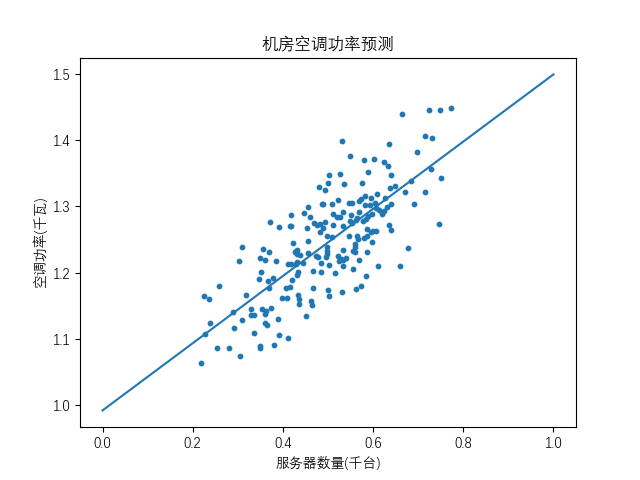

## 1.3 最小二乘法

### 如何找到最好的回归结果

在上个小节中，我们可以比较两条线的回归效果了，**但是如何判定它是不是最好的结果呢？**

我们可以从接着损失函数入手来解决这个问题，来理解最小二乘法的原理。1806 年，法国科学家勒让德发明了最小二乘法，或叫做最小平方法；1829年，高斯提供了最小二乘法的优化效果强于其他方法的证明。

图 1.3.1 是均方差损失函数在一元线性回归问题上的表现，使用的原始数据依然是图 1.1.2 中的三个样本。这些图都是用代码生成的，请运行 1-3-LossFunction.py 来验证。


<center>图 1.3.1 均方差损失函数的理解</center>

- 左上子图
   
    当参数 $b$ 固定为 1 时，让 $a$ 从 0.2 到 0.9 之间等距变化，取 50 个 $a$ 的备选值，导致的损失函数的变化，是一条 U 型二次曲线。曲线底部最小值为0.173。

    实现代码如下：
```Python
# 参数b固定为1，遍历参数a=(start=0.2, stop=0.9, num=50)
def traversal_a(X,Y,scope_a):
    loss_a = []
    value_a = []
    for a in np.linspace(start=scope_a[0], stop=scope_a[1], num=scope_a[2]):
        Y_hat = a * X + 1       # b值固定为1
        loss = mse(Y, Y_hat)    # 计算均方差损失函数
        loss_a.append(loss)     # 保存好便于后面绘图
        value_a.append(a)       # 保存好便于后面绘图
    return value_a, loss_a
```

- 右上子图
  
  当参数 $a$ 固定为 0.5 时，让 $b$ 从 0 到 2.3 之间等距变化，取 50 个 $b$ 的备选值，导致的损失函数的变化，也是一条 U 型二次曲线。曲线底部最小值为0.167。
  
  实现代码如下：
```Python
# 参数a固定为0.5，遍历参数b=(start=0, stop=2.3, num=50)
def traversal_b(X,Y,scope_b):
    loss_b = []
    value_b = []
    for b in np.linspace(start=scope_b[0], stop=scope_b[1], num=scope_b[2]):
        Y_hat = 0.5 * X + b     # a值固定为0.5
        loss = mse(Y, Y_hat)    # 计算均方差损失函数
        loss_b.append(loss)     # 保存好便于后面绘图
        value_b.append(b)       # 保存好便于后面绘图
    return value_b, loss_b
```

- 左下子图
  
  当参数 a、b 同时变化导致的损失函数的变化，是一个中间低四周高的曲面，从目前这个角度来看，两侧坡度变化较快，前后坡度变化较慢。
  
  实现代码如下：
```Python
# 遍历参数a=[0.2, 0.9, 50] 同时 遍历参数b=[0, 2.3, 50]
def traversal_ab(X, Y, value_a, value_b):
    R = np.zeros((len(value_a), len(value_b)))
    # 遍历 a 和 b 的组合
    for i in range(len(value_a)):
        for j in range(len(value_b)):
            Y_hat = value_a[i] * X + value_b[j] # 计算回归值
            loss = mse(Y, Y_hat)                # 计算损失函数
            R[i,j] = loss                       # 保存好便于后面绘图
    return R
```

- 右下子图
  
  是左下子图在底平面上的投影，用等高线表示损失函数的数值。等高线中心最小值为0.167。

**到此，我们可以认为均方差损失函数是一个凸函数。根据微分极值定理，对 $J$ 分别求 $a$ 和 $b$ 偏导，然后令导数公式为 0，就可以得到最佳的 $\hat a$ 和 $\hat b$，使得 $J$ 的值最小，即总体误差最小。**

针对本例，最小损失函数值为 0.167 左右。

图 1.3.2 说明了微分极值的原理：$p_2$ 点为极小值点，其微分（切线）结果为 0；$p_1$ 和 $p_3$ 的微分结果分别小于 0 和 大于 0，所以不是极值点。


<center>图 1.3.2 对损失函数求最小值的方法</center>


### 实例化推导

仍然用图 1.1.2 的例子做实例化推导，来说明最小二乘法的原理。

首先基于公式 $\hat{y}=\hat{a}x+\hat{b}$ 和 $error=y-\hat{y}$ 列出损失函数计算时所需要的各个子项，把实际的 $x、y$ 值带入，如表 1.3.1 所示。

表 1.3.1 三个样本的实例化推导
|样本|$x$|$y$|$\hat{y}=\hat{a}x+\hat{b}$|$error=y-\hat{y}$|
|--|--|--|--|---|
|1|2|2|$\hat{y}_1=2\hat{a}+\hat{b}$|$error_1=2-(2\hat{a}+\hat{b})$|
|2|3|3|$\hat{y}_2=3\hat{a}+\hat{b}$|$error_2=3-(3\hat{a}+\hat{b})$|
|3|4|3|$\hat{y}_3=4\hat{a}+\hat{b}$|$error_3=3-(4\hat{a}+\hat{b})$|

用公式 1.2.3 求这三个样本的总体损失函数值：

$$
\begin{aligned}
J &= \sum_{i=1}^n (y_i - \hat{y}_i)^2 = \sum_{i=1}^n error_i^2
\\\\
&=[2-(2\hat{a}+\hat{b})]^2+[3-(3\hat{a}+\hat{b})]^2+[3-(4\hat{a}+\hat{b})]^2
\\\\
&=29\hat{a}^2+3\hat{b}^2+18\hat{a}\hat{b}-50\hat{a}-16\hat{b}+22
\end{aligned}
\tag{1.3.1}
$$

对 $J$ 分别求 $\hat{a}$ 和 $\hat{b}$ 的偏导数，并令结果为 0（微分极值）：

$$
\begin{cases}
\frac{\partial J}{\partial \hat{a}}=58\hat{a}+18\hat{b}-50=0
\\\\
\frac{\partial J}{\partial \hat{b}}=6\hat{b}+18\hat{a}-16=0
\end{cases}
\tag{1.3.2}
$$

解得：

$$
\begin{cases}
\hat{a}=0.5
\\\\
\hat{b}=\dfrac{7}{6}
\end{cases}
\tag{1.3.3}
$$

即：

$$
y = 0.5x+\frac{7}{6} \tag{1.3.4}
$$

用公式 1.3.1 验证一下公式 1.3.4 作为拟合结果的损失函数值：

$$
\begin{aligned}
J &=29\hat{a}^2+3\hat{b}^2+18\hat{a}\hat{b}-50\hat{a}-16\hat{b}+22
\\\\
&=29·(\frac{1}{2})^2+3·(\frac{7}{6})^2+18·\frac{1}{2}·\frac{7}{6}-50·\frac{1}{2}-16·\frac{7}{6}+22
\\\\
&=0.16667
\end{aligned}
\tag{1.3.5}
$$

该值小于表 1.2.1 中另外两条拟合直线的损失函数值（分别是 1 和 0.25），并且与图 1.3.1 中遍历所得的最小损失函数值 0.167 基本吻合。所以，到目前为止，我们可以认为找到了最好的拟合参数。

### 理论推导

求解目标为损失函数：

$$
J = \sum_{i=1}^n [y_i -  (\hat a x_i + \hat b)]^2 \tag{1.3.6}
$$


对 $J$ 分别求 $a$ 和 $b$ 偏导，然后令导数公式为 0，就可以得到最佳的 $\hat a$ 和 $\hat b$，使得 $J$ 的值最小，即总体误差最小。

$$
\begin{cases}
\frac{\partial J}{\partial a} = -2 \sum\limits_{i=1}^n(y_i - \hat a x_i - \hat b)x_i =0
\\\\
\frac{\partial J}{\partial b} = -2\sum\limits_{i=1}^n(y_i - \hat a x_i - \hat b) =0
\end{cases}
\tag{1.3.7}
$$

解得：

$$
\begin{cases}
\hat b = \frac{1}{n} \sum\limits_{i=1}^n (y_i - \hat a x_i)
\\\\
\hat a = \frac{n\sum\limits_{i=1}^n x_i y_i - \sum\limits_{i=1}^n x_i \sum\limits_{i=1}^n y_i}{n\sum\limits_{i=1}^nx_i^2 - (\sum\limits_{i=1}^nx_i)^2}
\end{cases}
\tag{1.3.8}
$$

公式推导详见 1.5 小节。

下一节我们用一个数据集来验证最小二乘法的效果。


### 思考与练习

1. 运行 1-3-LossFunction.py 来获得直观结果。
2. 图 1.3.1 左上子图的 U 型损失函数值，为什么最小值只有 0.173，而不是 0.167 ?
3. 手工计算方程组 1.3.1，以深刻理解算法原理。
4. 推导公式 1.3.7，来获得公式 1.3.8。
