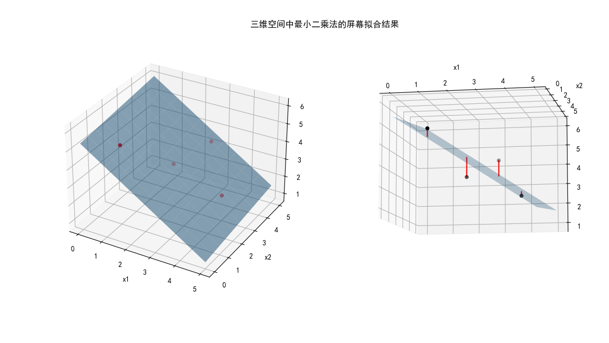

## 2.2 最小二乘法与三维线性空间

前面学习了用最小二乘法在二维平面直角坐标系中拟合直线，模型为 $y=ax+b$。那么在三维空间中，最小二乘法是什么样的表现呢？在 1.3 小节中，我们用三个样本点在二维空间做了实例化推导，扩展到三维空间中，因为三个点确定一个平面，无需拟合，所以我们用四个样本点做一下试验。根据一般性公式 2.1.1，我们可以知道三维空间的回归模型为：

$$
y = a_1 x_1 + a_2 x_2 + b \tag{2.2.1}
$$

其中：
- $a_1、a_2、b$ 是参数。
- $x_1、x_2$ 是样本的第 1 个和 第 2 个特征值，并非第 1 个和第 2 个样本，因为作为回归模型，它并不关心有多少样本，只关心有多少特征。

随意选取的数据样本如表 2.2.1 所示。

表 2.2.1 三维空间中四个点的样本数据

|样本序号 $i$|$x_{i,1}$|$x_{i,2}$|$y_i$|
|--|--|--|--|
|1|1|1|5|
|2|2|3|3|
|3|3|4|4|
|4|4|3|2|

假设我们有了对参数的初步估计，并记为：$\hat{a}_1、\hat{a}_2、\hat{b}$，把公式 2.2.1 实例化后，得到如下公式：

$$
\hat{y}_i = \hat{a}_1 x_{i,1} + \hat{a}_2 x_{i,2}+\hat{b} \tag{2.2.2}
$$

公式 2.2.2 中关于 $x$ 的下标与公式 2.2.1 稍有不同，此处增加了一维下标 $i$，表示样本，而逗号后面的序号表示样本特征值。如 $x_{i,2}$ 的含义就是第 $i$ 个样本的第 2 个特征值。

$\hat{y}_i$ 是根据估计的参数计算出来的回归值。初学者往往分不清楚 $y_i$ 和 $\hat{y}_i$ 的区别，请大家牢记：
- $y_i$ 是标签值，是回归的目标，由采样得到。
- $\hat{y}_i$ 是估计值，是回归的结果，根据估计的参数计算得到。

按照公式 2.2.2，对表2.2.1 中的 4 个样本做实例化代入值后得到公式组：

$$
\hat{y}_1=1·\hat{a}_1+1·\hat{a}_2+\hat{b}
\\\\
\hat{y}_2=2·\hat{a}_1+3·\hat{a}_2+\hat{b}
\\\\
\hat{y}_3=3·\hat{a}_1+4·\hat{a}_2+\hat{b}
\\\\
\hat{y}_4=4·\hat{a}_1+3·\hat{a}_2+\hat{b}
\tag{2.2.3}
$$

均方差损失函数在这里仍然适用。求均方差损失函数值 $J$，并把公式组 2.2.3 代入：

$$
\begin{aligned}
J &= \sum_{i=1}^n error_i^2 = \sum_{i=1}^n (y_i - \hat{y}_i)^2
\\\\
&=[5-(\hat{a}_1+\hat{a}_2+\hat{b})]^2 +[3-(2\hat{a}_1+3\hat{a}_2+\hat{b})]^2
\\\\
&+[4-(3\hat{a}_1+4\hat{a}_2+\hat{b})]^2 +[2-(4\hat{a}_1+3\hat{a}_2+\hat{b})]^2
\end{aligned}
\tag{2.2.4}
$$

根据 1.3 小节的经验，对损失函数 $J$ 分别求 $\hat{a}_1、\hat{a}_2、\hat{b}$ 的偏导数，并令其结果为 0，得到方程组 2.2.5：

$$
\begin{cases}
\begin{aligned}
\frac{\partial J}{\partial \hat{a}_1} &= -2(5-\hat{a}_1-\hat{a}_2-\hat{b})-4(3-2\hat{a}_1-3\hat{a}_2-\hat{b})
\\\\
&-6(4-3\hat{a}_1-4\hat{a}_2-\hat{b})-8(2-4\hat{a}_1-3\hat{a}_2-\hat{b})=0
\\\\
\frac{\partial J}{\partial \hat{a}_2} &= -2(5-\hat{a}_1-\hat{a}_2-\hat{b})-6(3-2\hat{a}_1-3\hat{a}_2-\hat{b})
\\\\
&-8(4-3\hat{a}_1-4\hat{a}_2-\hat{b})-6(2-4\hat{a}_1-3\hat{a}_2-\hat{b})=0
\\\\
\frac{\partial J}{\partial \hat{b}} &= -2(5-\hat{a}_1-\hat{a}_2-\hat{b})-2(3-2\hat{a}_1-3\hat{a}_2-\hat{b})
\\\\
&-2(4-3\hat{a}_1-4\hat{a}_2-\hat{b})-2(2-4\hat{a}_1-3\hat{a}_2-\hat{b})=0
\end{aligned}
\end{cases}
\tag{2.2.5}
$$

合并同类项得到 2.2.6：

$$
\begin{cases}
60\hat{a}_1+62\hat{a}_2+20\hat{b}=62
\\\\
62\hat{a}_1+70\hat{a}_2+22\hat{b}=72
\\\\
20\hat{a}_1+22\hat{a}_2+8\hat{b}=28
\end{cases}
\tag{2.2.6}
$$

解方程组并保留两位小数得到：

$$
\begin{cases}
b=5.37
\\\\
\hat{a}_1=-0.89
\\\\
\hat{a}_2=0.13
\end{cases}
\tag{2.2.7}
$$

所以最后的回归模型为：

$$
y = -0.89 x_1 + 0.13 x_2 + 5.37 \tag{2.2.8}
$$

公式 2.2.8 代表了三维空间的一个超平面，使用如下代码，可以生成图 2.2.2，其中 show_result() 是一个可视化函数，详情请参看 2-2-FourPoints.py。

```Python
if __name__ == '__main__':
    X = np.array([[1,1],[2,3],[3,4],[4,3]])
    Y = np.array([5, 3, 4, 2]).reshape(4,1)
    a1, a2, b = -0.89, 0.13, 5.37
    print(str.format("a1={0:.2f}, a2={1:.2f}, b={2:.2f}", a1, a2, b))
    show_result(X, Y, a1, a2, b)
```


<center>图 2.2.2 三维空间中的样本点及其拟合平面</center>

- 图 2.2.2 左子图展示了 4 个样本点的位置及公式 2.2.8 所代表的拟合平面的位置。
- 右子图从另一个角度展示了样本点到拟合平面的距离（红色短直线），该距离并非样本点到拟合平面的“垂直”距离，而是到（x1-x2）底面的方向的“竖直”距离，即公式 2.2.4 中的 $y_i-\hat{y}_i$。

用这种方法，可以保证该拟合平面是最优解，即 4 个样本点到拟合平面的竖直距离的平方和为最小。这说明最小二乘法在三维或者更高维空间都是适用的。

### 思考与练习

1. 自己设计 4 个样本点，手工完成公式 2.2.6 的计算。
2. 修改代码 2-2-FourPoints.py 的主程序，把练习 1 中的四个点的坐标和手工计算的参数值代入，运行以理解三维空间最小二乘法的拟合效果。
