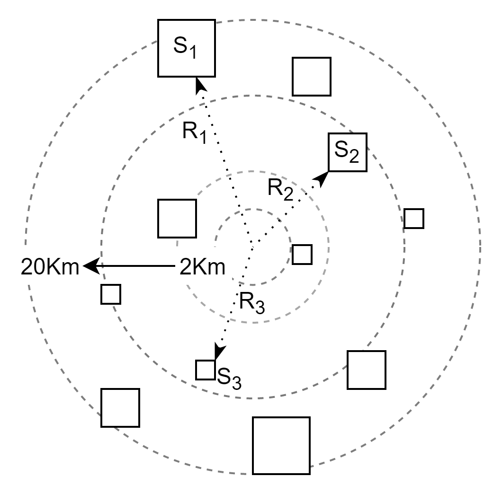

## 2.4 编程验证

### 提出问题

影响北京通州房价的因素有很多，居住面积、地理位置、朝向、学区房、周边设施、建筑年份等等，其中，面积（S）和地理位置是两个比较重要的因素。地理位置信息一般采用经纬度方式表示，但是经纬度是两个特征值，联合起来才有意义，因此，我们把它转换成了到通州区中心的距离 R。


<center>图 2.4.1 房价与地理位置及面积的关系</center>

在图 2.4.1 中，房屋面积（大小）近似用方形 S 来表示，距离用 R 来表示。

所以，房屋价格应该是 $S、R$ 的函数，即 $Price = f(S,R)$。在这个问题中，我们假设 $f$ 是一个线性函数，即：

$$
f(x_1,x_2)=y = a_1x_1 + a_2x_2 + b + \varepsilon \tag{2.4.1}
$$

- $x_1$ 是房屋距离市中心的距离 R，取值范围为 $0 \sim 20$ 公里，越靠近市中心的房价越高，所以 $x_1$ 是个反向指标。
- $x_2$ 是房屋的面积 S，取值范围为 $40 \sim 120$ 平方米，面积越大房价越高，所以 $x_2$ 是个正向指标。
- $y$ 标签值，是房屋价格，单位万元。
- $\varepsilon$ 是一个噪音，$\varepsilon \sim N(0, \sigma^2)$

**正向/反向指标**的含义是：该特征值 $x$ 越大，标签值 $y$ 也越大，即正相关关系；否则就是反向指标。

### 制作数据集

参数假设：

- $a_1 = 2$，表示每距离市中心近 1 公里，总价就会多 2 万元。
- $a_2 = 5$，表示每平米均价 5 万元。
- $b = 10$，表示房屋基本价是 10 万元起。

注意 $x_1$ 是反向指标，所以我们要用 $20-x_1$（表示 $x_1$ 越小，因变量 $y$ 越大），再乘以 $a_1$：

$$
\begin{aligned}
y &= 2(20-x_1) + 5 x_2 + 10 
\\\\
&=-2 x_1 + 5 x_2 + 50
\end{aligned}
\tag{2.4.2}
$$

关于反向指标的更一般性的处理方式，我们将在后面的章节中学习。

生成数据集的代码如下（详见 2-4-GenerateSamples.py）：

```Python
def generate_samples(a1,a2,b,n):
    # 模拟一个距离市中心的正态分布
    loc_R = 20/2
    X1 = np.random.normal(loc=loc_R, scale=3.4, size=(n, 1))
    # 模拟一个房屋面积的正态分布
    loc_S = (40+120)/2
    X2 = np.random.normal(loc=loc_S, scale=11.2, size=(n, 1))
    
    Y = np.zeros_like(X1)
    for i in range(n):
        # 返回均值为0，方差为20的误差的一个值
        epsilon = np.random.normal(loc=0, scale=10, size=None)
        # 对于每个特定的x值，都从N(0,0.05)中取出一个随机值作为噪音添加到y上
        Y[i,0] = a1 * (20-X1[i,0]) + a2 * X2[i,0] + b + epsilon

    return X1, X2, Y
#end def

a1 = 2
a2 = 5
b = 10
n = 500
X1, X2, Y= generate_samples(a1, a2, b, n)
```

由此得到了 500 个样本，每个样本有两个特征值，一个标签值，示例如表 2.4.1。

表 2.4.1 房价问题样本示例

|样本序号|距离 $x_1$|面积 $x_2$|房价 $y$|
|--|--|--|--|
|1|20.922014 | 98.860146 | 452.128786|
|2|11.742079 | 83.686204 | 373.487686|
|3|14.574086 | 80.328539 | 365.477199|
|4|6.653045 | 65.807237 | 291.611815|
|5|8.890379 | 81.919936 | 360.511960|
|...|...... |......|......|

打印出来样本数据的一些基本统计信息如下，审查一下，避免出现意想不到的值：

```
距离：最小值=0.59，最大值=24.12，均值=10.94
面积：最小值=46.73，最大值=116.65，均值=80.10
```

在 Pandas 中有一些函数可以方便地列出样本数据的所有统计指标，建议尝试一下。

在图 2.4.2 中，我们用三维图可视化的方式来展示这 500 个样本。其中，左侧子图是从斜上方视角来看整体样本分布，右子图从“侧面”看 Z 轴上样本标签值的分布情况。读者可以自己运行代码，然后在三维图上用鼠标拖拽调整角度进行观察。


<center>图 2.4.2 房价与地理位置及面积的关系</center>

### 编程实现正规方程

下面进入验证正规方程算法的时候了。

根据公式 2.3.7，代码实现：

```Python
def normal_equation(X,Y):
    num_example = X.shape[0]
    # 在原始的 X 矩阵最左侧加一列 1
    ones = np.ones((num_example,1))
    x = np.column_stack((ones, X))    
    # X^T * X
    p = np.dot(x.T, x)
    # (X^T * X)^{-1}
    q = np.linalg.inv(p)
    # (X^T * X)^{-1} * X^T
    r = np.dot(q, x.T)
    # (X^T * X)^{-1} * X^T * Y
    A = np.dot(r, Y)
    # 按顺序
    b = A[0,0]
    a1 = A[1,0]
    a2 = A[2,0]
    return a1, a2, b
```
运行代码 2-4-NormalEquation.py，得到如下输出：

```
a1=-2.0729, a2=5.0063, b=50.2910
```

比较一下公式 2.4.2 的预设值，非常接近，结果合理，误差是由于样本数据中的噪音造成的。


<center>图 2.4.3 房价预测拟合结果</center>

图 2.4.3 是回归平面的拟合结果，左子图是一个正视图，右子图换了一个角度，可以看到回归平面正好穿过了样本点的中间，这和图 1.4.2 是异曲同工的，只不过前者在三维空间，后者在二维空间，无论是拟合直线还是拟合平面，在术语上都叫做**超平面**。

### 计算逆矩阵失败时的小窍门

用正规方程解决问题时，可能会遇到 Numpy 函数对某些矩阵不能求逆的问题，这是正常的，需要修改代码来绕过这个问题：

```Python
def normal_equation(X,Y):
    ......
    # X^T * X
    p = np.dot(x.T, x)
    # 给p的对角线增加一个很小的值，防止求逆时出错
    I = np.eye(p.shape[0]) * 1e-6
    p = p + I
    ......
```
因为输入的 $\boldsymbol{X}$ 很有可能在经过前面的一些列操作后，得到代码中的 p 矩阵时，无法求逆（行列式为 0），所以需要给矩阵 p 增加一个很小的单位阵，对于最后的计算结果没有影响：
```
a1=-0.89, a2=0.13, b=5.37
```
这个结果和 2.2 小节中的手工计算结果吻合。

## 思考与练习

1. 用正规方程解一下 2.2 小节中手工计算的结果，看看是否一致。
2. 用正规方程法来解决 1.3 中的一元线性回归问题，注意返回的 A 值只有两个元素（a、b），而不是三个（a1、a2、b）。
3. 给正规方程代码中的单位阵 $I$ 设置一个稍微大一些的值，比如 1e-3，看看对最后的结果有多大影响。
