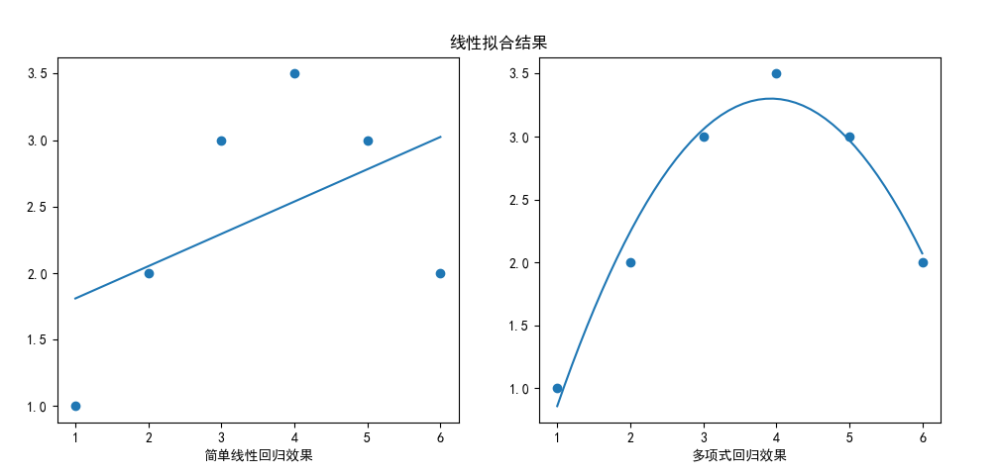

https://zhuanlan.zhihu.com/p/71725190

4 最小二乘法的局限性和适用场景
从上面可以看出，最小二乘法适用简洁高效，比梯度下降这样的迭代算法似乎方便很多，下面讨论最小二乘法的局限性。

首先，最小二乘法需要计算 [公式] 的逆矩阵，有可能它的逆矩阵不存在，这样就没有办法直接用最小二乘法了，此时梯度下降法仍然可以使用。可以通过对样本数据进行整理，去掉冗余特征，让 [公式] 的行列式不为0，然后继续使用最小二乘法。

第二，当样本特征 [公式] 非常大的时候，计算 [公式] 的逆矩阵是一个非常耗时的工作，甚至不可行。此时以梯度下降为代表的迭代法仍然可以使用。那这个n到底多大就不适合最小二乘法呢？如果你没有很多的分布式大数据计算资源，建议超过10000个特征就用迭代法吧。或者通过主成分分析降低特征的维度后再用最小二乘法。

第三，如果拟合函数不是线性的，这时无法使用最小二乘法，需要通过一些技巧转化为线性才能使用，此时梯度下降仍然可以用。

第四，讲一些特殊情况。当样本量 [公式] 很少，小于特征数 [公式] 的时候，这时拟合方程是欠定的，常用的优化方法都无法去拟合数据。当样本量 [公式] 等于特征数 [公式] 的时候，用方程组求解就可以了。当 [公式] 大于 [公式] 时，拟合方程是超定的，也就是我们常用与最小二乘法的场景了。


在图 2.1.1 安斯库姆四重奏中，右上角子图，明显是一个曲线拟合的例子，

https://zhuanlan.zhihu.com/p/138381360#:~:text=%E7%BA%BF%E6%80%A7%E5%9B%9E%E5%BD%92%E7%9A%84%E5%BA%94%E7%94%A8%E6%9C%89%E5%9B%9B%E4%B8%AA%E5%89%8D%E6%8F%90%E6%9D%A1%E4%BB%B6%EF%BC%9A%E7%BA%BF%E6%80%A7%20%28linear%29%E3%80%81%E7%8B%AC%E7%AB%8B%20%28independent%29%E3%80%81%E6%AD%A3%E6%80%81,%28normal%29%E3%80%81%E7%AD%89%E6%96%B9%E5%B7%AE%20%28equal%20variance%29%E3%80%82%201.%E7%BA%BF%E6%80%A7%E6%8C%87%E5%9B%A0%E5%8F%98%E9%87%8F%E4%B8%8E%E8%87%AA%E5%8F%98%E9%87%8F%E5%91%88%E7%BA%BF%E6%80%A7%E5%85%B3%E7%B3%BB%EF%BC%8C%E5%8D%B3%E5%9B%A0%E5%8F%98%E9%87%8F%E4%B8%8E%E8%87%AA%E5%8F%98%E9%87%8F%E5%9C%A8%E6%95%A3%E7%82%B9%E5%9B%BE%E4%B8%8A%E5%BA%94%E5%A4%A7%E8%87%B4%E5%91%88%E4%B8%80%E7%9B%B4%E7%BA%BF%E8%B6%8B%E5%8A%BF%E3%80%82

线性回归的应用有四个前提条件：线性(linear)、独立(independent)、正态(normal)、等方差(equal variance)。

1.线性指因变量与自变量呈线性关系，即因变量与自变量在散点图上应大致呈一直线趋势。这一条件可通过绘制散点图来观察。如果这一条件不满足，不应盲目套用线性回归，可选择其他更为合适的模型，如非参数回归等。

2.独立性指观察值之间应相互独立。这一条件通常可根据专业知识来判断。

3.正态性指线性模型的残差应符合正态分布。这一条件可通过残差的正态概率图来看，还可对残差进行正态性检验。这一条件如不满足，可考虑对因变量进行数据变换，使其服从正态分布后再拟合线性回归模型，也可采用非参数回归。

4.等方差性指在自变量取值范围内，对于任意自变量取值，因变量都有相同的方差。线性回归中，等方差性实际上要比正态性重要。这一条件可通过绘制残差与因变量预测值的散点图来看。理论上，残差的分布与预测值应是不相关的，即残差应在零水平线上下波动，不应有任何趋势，否则可能提示方差不齐。如果这一条件不满足，可对因变量进行变量变换，使其满足方差齐性条件，或可采用加权回归分析，消除方差的影响。


toy samples:  sin, 1-10

why: x,x2,x3,x4,x5, np.random.random(5)->A, Y = XA, 展示Y, 奇形怪状，能做任何事

先用正规方程

然后梯度下降

归一化

过拟合

L1, L2


<center>图 3.1.1 各种形式的非线性拟合</center>

在图 3.1.1 中，我们可以看到几种典型的非线性拟合的情况：

- 左上角图 A
  
  右侧的两个点改变了前面四个点的前进方向，掉头向下。我们下面会学习尝试使用多项式回归的方法来拟合。

- 右上角图 B
  
  与左图相反，右侧的两个点改变了前面四个点的前进方向，掉头向上。如果左图可以被回归算法拟合的话，那么本图就是一个正负号的问题，也应该可以解决。

- 左下角图 C
  
  与上图相比，最后的两个点再次改变了方向，掉头向上，即使上图可以拟合得很好，本图也不一定能拟合。

- 右下角图 D

  与左图不规则的走向相比，本图是一条很规律的正弦曲线，我们要检验的是回归算法的精确度问题，以及在样本范围之外的扩展问题。


我们先看图 A，其 6 个样本点的坐标按从左到右的顺序如表 3.1.1 所示：

表 3.1.1 原始样本点

|样本序号|$x$|$y$|
|--|--|--|
|1|1|1|
|2|2|2|
|3|3|3|
|4|4|3.5|
|5|5|3|
|6|6|2|


如果用直线拟合，根据我们以前的知识，最好的情况下也就是可以得到图 3.1.2 左图的效果。但是我们观察这些点的分布形状，是不是和图 3.1.2 右图所示的 $y=-x^2$ 的函数图很像呢？这就提示我们也许可以用 $x^2$ 作为特征值来做回归试验，而不是仅仅是用原始的 $x$ 做特征值。


<center>图 3.1.2 猜想的拟合曲线</center>

根据这一提示，我们在原始样本点的基础上增加一列，如表 3.1.2 所示：

表 3.1.2 增加 $x^2$ 后的样本

|样本序号|$x$|$x^2$|$y$|
|--|--|--|--|
|1|1|1|1|
|2|2|4|2|
|3|3|9|3|
|4|4|16|3.5|
|5|5|25|3|
|6|6|36|2|

这样的话，就变成了多项式回归模型：

$$
y = a_1 x + a_2 x^2 + b \tag{3.1.1}
$$

扩展到一般性：

$$
y = a_1 x + a_2 x^2 + \dots + a_k x^k + b   \tag{3.1.2}
$$

如果和公式 2.1.1 做对比，只要令 $x_k = x^k$，二者就一摸一样了。所以，这就又进一步提示了我们，解决公式 3.1.2 的问题时，完全可以用第二章中的正规方程方法。

试验

我们先用如下代码实现表 3.1.2 中增加样本的功能：

```Python
# 给原始的一维 X 增加到 m 维多项式
def make_Xm(X1, m):
    count = X1.shape[0]
    Xm = np.zeros((count, m))
    for i in range(m):
        Xm[:,i:i+1] = np.power(X1, i+1)
    return Xm
```
这段代码可以依次增加任意列的关于 $x$ 多项式，比如当 m = 2 时，会在原始 $x$ 的右侧增加一列 $x^2$；同理，当 m = 3 时，会在原始 $x$ 的右侧增加一列 $x^2$ 和一列 $x^3$。

得到数组 Xm 后，带入正规方程公式，就可以得到参数值，具体做法请看代码 3-1-FigureA.py。



<center>图 3.1.3 简单线性回归与多项式回归的比较</center>

这是两种回归方程的参数：

```
a=0.2429, b=1.5667
a1=2.2429, a2=-0.2857, b=-1.1000
```

即：

- 左图的结果为： $y = 0.2429x+1.5667$
- 右图的结果为： $y = 0.2429x-0.2857x^2 - 1.1000$

从右图的结果看，就是在一个抛物线 $y=-0.2857x^2$ 的基础上，再增加一个线性变换。


### 思考与练习

1. 如果图 A 中样本点的坐标顺序不是从左到右，而是乱序的，对回归算法有影响吗？
