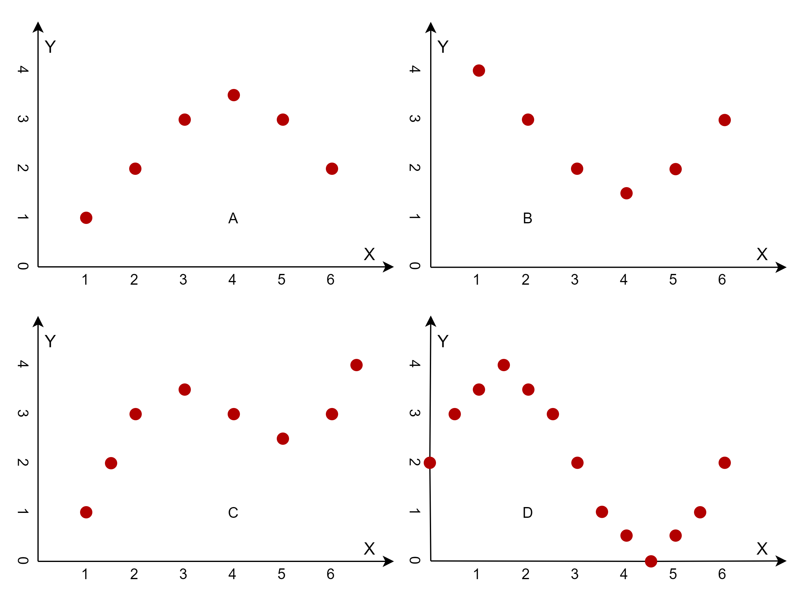

## 3.1 多项式回归

### 线性回归的前提条件

线性回归的应用有四个前提条件$^{[1]}$：线性(linear)、独立(independent)、正态(normal)、等方差(equal variance)。

1. 线性指因变量与自变量呈线性关系，即因变量与自变量在散点图上应大致呈一直线趋势。这一条件可通过绘制散点图来观察。如果这一条件不满足，不应盲目套用线性回归，可选择其他更为合适的模型，如非参数回归等。

2. 独立性指观察值之间应相互独立。这一条件通常可根据专业知识来判断。

3. 正态性指线性模型的残差应符合正态分布。这一条件可通过残差的正态概率图来看，还可对残差进行正态性检验。这一条件如不满足，可考虑对因变量进行数据变换，使其服从正态分布后再拟合线性回归模型，也可采用非参数回归。

4. 等方差性指在自变量取值范围内，对于任意自变量取值，因变量都有相同的方差。线性回归中，等方差性实际上要比正态性重要。这一条件可通过绘制残差与因变量预测值的散点图来看。理论上，残差的分布与预测值应是不相关的，即残差应在零水平线上下波动，不应有任何趋势，否则可能提示方差不齐。如果这一条件不满足，可对因变量进行变量变换，使其满足方差齐性条件，或可采用加权回归分析，消除方差的影响。

### 多项式回归（Polynomial Regression）

研究一个因变量与一个或多个自变量间多项式的回归分析方法，称为多项式回归（Polynomial Regression）。如果自变量只有一个时，称为一元多项式回归；如果自变量有多个时，称为多元多项式回归。在一元回归分析中，如果依变量 y 与自变量 x 的关系为非线性的，但是又找不到适当的函数曲线来拟合，则可以采用一元多项式回归。

在很多情况下，数据并不总是线性的，不过我们仍然可以使用线性回归的方法来拟合非线性数据，只不过我们需要事先处理一下输入数据，然后使用多项式回归模型来解决问题。

多项式回归的最大优点就是可以通过增加 x 的高次项对实测点进行逼近，直至满意为止。事实上，多项式回归可以处理相当一类非线性问题，它在回归分析中占有重要的地位，因为任一函数都可以分段用多项式来逼近。因此，在通常的实际问题中，不论依变量与其他自变量的关系如何，我们总可以用多项式回归来进行分析。

### 四个问题

图 3.1.1 各种形式的非线性拟合

在图 3.1.1 中，我们可以看到几种典型的非线性拟合的情况：

- 左上角，问题 A
  
  右侧的两个点改变了前面四个点的前进方向，掉头向下。我们下面会学习尝试使用多项式回归的方法来拟合。

- 右上角，问题 B
  
  与左图相反，右侧的两个点改变了前面四个点的前进方向，掉头向上。如果左图可以被回归算法拟合的话，那么本图就是一个正负号的问题，也应该可以解决。

- 左下角，问题 C
  
  与上图相比，最后的两个点再次改变了方向，掉头向上，即使上图可以拟合得很好，本图也不一定能拟合。

- 右下角，问题 D

  与左图不规则的走向相比，本图是一条很规律的正弦曲线，我们要检验的是回归算法的精确度问题，以及在样本范围之外的扩展问题。

toy samples:  sin, 1-10

然后梯度下降

归一化

过拟合

L1, L2

1. 

https://zhuanlan.zhihu.com/p/71725190

4 最小二乘法的局限性和适用场景
从上面可以看出，最小二乘法适用简洁高效，比梯度下降这样的迭代算法似乎方便很多，下面讨论最小二乘法的局限性。

首先，最小二乘法需要计算 [公式] 的逆矩阵，有可能它的逆矩阵不存在，这样就没有办法直接用最小二乘法了，此时梯度下降法仍然可以使用。可以通过对样本数据进行整理，去掉冗余特征，让 [公式] 的行列式不为0，然后继续使用最小二乘法。

第二，当样本特征 [公式] 非常大的时候，计算 [公式] 的逆矩阵是一个非常耗时的工作，甚至不可行。此时以梯度下降为代表的迭代法仍然可以使用。那这个n到底多大就不适合最小二乘法呢？如果你没有很多的分布式大数据计算资源，建议超过10000个特征就用迭代法吧。或者通过主成分分析降低特征的维度后再用最小二乘法。

第三，如果拟合函数不是线性的，这时无法使用最小二乘法，需要通过一些技巧转化为线性才能使用，此时梯度下降仍然可以用。

第四，讲一些特殊情况。当样本量 [公式] 很少，小于特征数 [公式] 的时候，这时拟合方程是欠定的，常用的优化方法都无法去拟合数据。当样本量 [公式] 等于特征数 [公式] 的时候，用方程组求解就可以了。当 [公式] 大于 [公式] 时，拟合方程是超定的，也就是我们常用与最小二乘法的场景了。