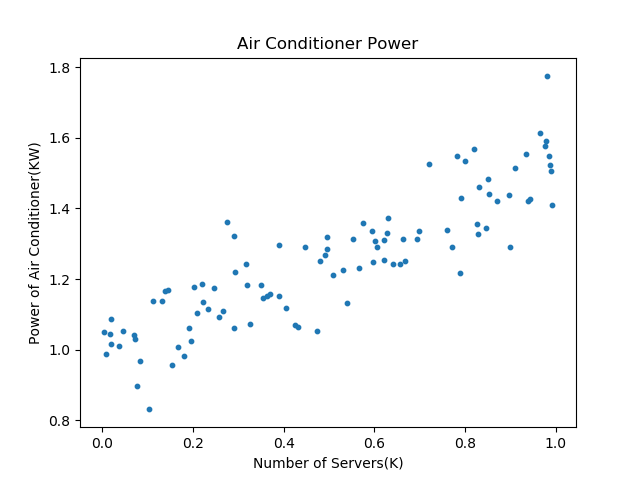
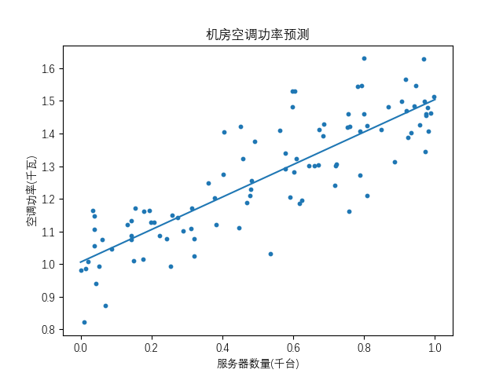

### 简单的直线拟合问题

大家在初中就学习过这样的问题：在平面上有两个点 $p_1(2,2)$ 和 $p_2(4,3)$，求解一条直线可以同时穿过这两个点。


假设直线的方程为：

$$
y = ax + b \tag{1.1}
$$

那么就把问题转化为求解 $a$ 和 $b$ 的值，这是最简单的线性问题，只要把 $p_1$ 和 $p_2$ 的坐标值带入公式1.1，即可得到一个二元一次方程组：

$$
\begin{cases}
2=2a+b \\\\
3=4a+b
\end{cases}
$$

得到：$a=0.5，b=1$，则公式的实际形式为：$y=0.5x+1$，这样我们就得到了从两个样本点（$p_1,p_2$）拟合出来的直线。

### 一元线性回归模型

这是一个非常简单的理想化的数学问题，但是在客观世界中，由于受到各种因素的干扰，实际的公式可能是这样的：

$$
y=ax+b+\varepsilon \tag{1.2}
$$

公式1.2称为一元线性回归模型，$a$ 和 $b$ 是模型的参数，$x$ 是一元自变量，$y$ 是因变量。针对这一模型，有以下几个主要假定$^{[1]}$：

1. 因变量 $y$ 与自变量 $x$ 之间具有线性关系。
2. 在重复抽样中，自变量 $x$ 的取值是固定的，即假定 $x$ 是非随机的。
3. 误差项 $\varepsilon$ 是一个期望为 0 的随机变量，即 $E(\varepsilon)=0$。
4. 对于所有的 $x$ 值，$\varepsilon$ 的方差都相同。
5. 误差项 $\varepsilon$ 是一个服从正态分布的随机变量且独立，即 $\varepsilon \sim N(0,\sigma^2)$

上述假定意味着对于任何一个给定的 $x$，$y$ 的取值都对应着一个分布，所以 $y$ 的期望值 $E(y)=ax+b$，而 $y$ 的方差等于 $\varepsilon$ 的方差 $\sigma^2$。当 $\sigma^2$ 较小时，$y$ 的观测值非常靠近直线；当 $\sigma^2$ 较大时，$y$ 的观测值将偏离直线。


从图1.2可以看到，$y$ 的期望值处于 $y=ax+b$ 直线之上，但是其实际的取值却是个正态分布。比如，$x1=2$ 时，$y$ 的取值可能是 $1.9, 1.93, 1.99, 2, 2.01, 2.02......$ 中的任何一个值。

### 制作数据集

根据公式1.2，下面我们来自己制作一个数据集，来探讨一元线性回归模型的解法。

这里有人可能会有疑问：为什么要自己制作数据集？不是有很多现有的工业数据集可以使用吗？

自己制作数据集，是本书的一个自学、教学方法。以本例来说，我们会令$a=0.5$ 且 $b=1$ 外加噪音来制作样本数据，在解出回归模型的 $\hat a$ 和 $\hat b$ 后，与原始的$a=0.5$ 和 $b=1$ 来对比，如果非常值接近，就说明我们的算法是正确的。如果直接用工业数据集来验证算法，即使通过测试数据达到比较满意的准确率，依然不能得知其 ground truth（真实数值）。

先假设一个应用场景：在一个机房里，有 346 台计算机，需要空调来制冷，使得机房的温度保持在20度左右。假设空调的功率（千瓦/小时）与计算机的数量是相关的，而且是线性关系。需要解决的问题是找到这种线性关系，这个问题用定量的数学方法是很难解出来的，因为每台计算机的散热量不是一个定值，与其繁忙程度有关，所以一般会用现场实测空调功率的方式来解决。

针对公式1.2，假设 $a=0.5$，$b=1$，$\varepsilon \sim N(0,0.1)$，$x$（某个机房内的计算机数量）是一个从 0 到 1000 的随机数，一共有需要 100 个机房的样本数据，于是有代码如下：

```Python
a = 0.5         # 参数a
b = 1           # 参数b
m = 100         # 模拟100个机房的样本
def generate_samples_1(a, b, m):
    # m个[0,1)之间随机数，表示机房内计算机数量/1000
    X = np.random.random(size=(m, 1))
    # 返回均值为0，方差为0.1的误差的一组值
    Epsilon = np.random.normal(loc=0, scale=0.1, size=X.shape)
    Y = a * X + b + Epsilon
    return X,Y
```
这里的 $\bold X$ 和 $\bold Y$ 各是一个 $(100 \times 1)$ 的一维数组，分别表示样本的训练数据和标签数据。

且慢！上面的代码并不正确，在生成 Epsilon 时，只生成了一组（100个）正态分布的噪音数据，然后就在最后一行代码通过矩阵相加的形式，顺序地分配给了 $\bold X$ 数组。这就相当于不同的 $x$ 取值，其所有的 $y$ 值整体的噪音是一个正态分布，而不是基于每个 $y$ 的独立的正态分布。

所以，我们改变代码如下：
```Python
def generate_samples_2(a, b, m):
    # m个[0,1)之间随机数，表示机房内计算机数量/1000
    X = np.random.random(size=(m, 1))
    Y = np.zeros_like(X)
    for i in range(m):
        # 返回均值为0，方差为0.1的误差的一个值
        epsilon = np.random.normal(loc=0, scale=0.1, size=None)
        # 对于每个特定的x值，都从N(0,0.1)中取出一个随机值作为噪音添加到y上
        Y[i,0] = a * X[i,0] + b + epsilon
    return X,Y
```

在生成数据后，我们用 matplotlib 库来做一下可视化，得到图1.3。



在图1.3中，每个样本点代表某个机房的情况：

- 横坐标是计算机的数量，用“千台”作为单位；
- 纵坐标是需要空调的功率，用“千瓦”作为单位。

### 最小二乘法（Method of least squares）

有了样本数据后，我们通过可视化可以看到这个问题应该可以通过线性回归的问题来解决。如果在高维空间没有可视化手段时，一般也是先用简单的线性回归来尝试解决，如果效果不令人满意的话，再尝试非线性的模型。

在图1.3中，我们发现有很多条直线可以穿过整个样本区来拟合，它们的 $a, b$ 值各不相同，哪一条是最佳的呢？

德国科学家卡尔·高斯（Karl Gauss，1777-1855）提出用图1.4中竖直方向的距离 Error 的平方和来估计参数 $a$ 和 $b$，该方法称为最小二乘法或最小平方法。


用最小二乘法拟合的直线具有一些优良的性质$^{[1]}$：

1. 该方法得到的回归直线能使离差平方和最小，虽然这并不能保证它就是拟合数据的最佳直线，但也是足够好的。
2. 该方法可以得知 $a$ 和 $b$ 的估计量的抽样分布。
3. 在某些条件下，与其他方法相比，其抽样分布具有较小的标准差。

在图1.4中，用虚线表示的拟合的直线方程是：

$$
\hat y = \hat a x + \hat b \tag{1.3}
$$

其中，$\hat a$ 和 $\hat b$（读作a hat，b hat），表示是通过算法估计出来的 $a$ 值和 $b$ 值，而不是原始的 $a=0.5$ 及 $b=1$，$\hat y$ 表示是估算出来的结果值，而不是原始的标签值 $y$。

图1.4中的error表示每个样本点与估算值的误差：

$$
error = y - \hat{y}=y -  (\hat a x + \hat b) \tag{1.4}
$$

这些误差有正有负，我们不希望在做加法时它们正负抵消，所以我们用误差的平方再相加，
令$E=\sum\limits_{i=1}^n error^2:$

$$
E = \sum_{i=1}^n (y_i -  (\hat a x_i + \hat b))^2 \tag{1.5}
$$

公式1.5被称为均方差，是一个凸函数，根据微分极值定理，对 $E$ 分别求 $a$ 和 $b$ 偏导，然后令导数公式为 0，就可以得到 $\hat a$ 和 $\hat b$：

$$
\begin{cases}

\frac{\partial E}{\partial a} = -2 \sum\limits_{i=1}^n(y_i - \hat a x_i - \hat b)x_i =0 \\

\frac{\partial E}{\partial b} = -2\sum\limits_{i=1}^n(y_i - \hat a x_i - \hat b) =0\\

\tag{1.6}
\end{cases}
$$

先从1.6的第二个方程整理后得到：

$$
\hat b = {1 \over n} \sum_{i=1}^n (y_i - \hat a x_i) \tag{1.7}
$$

再把1.7带入1.6的第一个方程中得到：

$$
\hat a = \frac{n\sum\limits_{i=1}^n x_i y_i - \sum\limits_{i=1}^n x_i \sum\limits_{i=1}^n y_i}{n\sum\limits_{i=1}^nx_i^2 - (\sum\limits_{i=1}^nx_i)^2} \tag{1.8}
$$

下面用代码实现一下，首先计算 $\hat a$ 的值：

```Python
# 根据公式1.8
def calculate_a(X,Y):
    n = X.shape[0]
    numerator = n * np.sum(X*Y) - np.sum(X) * np.sum(Y)
    denominator = n * np.sum(X*X) - np.sum(X) * np.sum(X)
    a = numerator / denominator
    return a
```

其中 np.sum(X\*Y)，相当于公式中的 $\sum\limits_{i=1}^n x_i y_i$，由于 $\bold X$ 和 $\bold Y$ 都是（100x1）的数组，所以 X\*Y 会按元素相乘，得到一个新的（100X1）的数组，然后求和。

再计算 $\hat b$ 的值：
```Python
# 根据公式1.7
def calculate_b(a,X,Y):
    n = X.shape[0]
    b = (np.sum(Y - a * X))/n
    return b
```

最后得到结果是：

```
a_hat=0.4979025971577149, b_hat=1.006126993107113
```
把拟合结果变成直线方程，绘制在原始的样本图上，得到图1.5。



还记得我们在制作数据集时设置的参数值吗？$a=0.5$，$b=1$，由于在制作样本数据集时有 $\varepsilon$ 的存在，所以最后估计出来的结果 $\hat a=0.4979...$，$\hat b=1.0061...$，非常接近真实值。

### 几个基本的数学概念(可以考虑单独一个章节)

为了继续学习后面的知识，我们先回顾一下以下几个基本的数学概念。

- 均值

一个离散序列的算术平均数：

$$
\bar x = \frac{1}{n}\sum\limits_{i=1}^n x_i \tag{1.9}
$$

比如一个数组（向量）$x=[1,2,3,4,5,6]$，其均值为 $(1+2+3+4+5+6)/6=3.5$。

- 数学期望

对于离散的随机变量，其一切的可能的取值 $x_i$ 与对应的可能出现的概率 $p_i$ 的乘积之和就是该离散序列的数学期望。

$$
E(x) = \sum_{i=1}^n p_i x_i \tag{1.10}
$$

比如一个六面的骰子（1到6），掷出每个数字的概率都是$\frac{1}{6}$，即$p_i=\frac{1}{6}$，则：

$$
E(x) = \frac{1}{6}\times 1+\frac{1}{6}\times 2+\frac{1}{6}\times 3+\frac{1}{6}\times 4+\frac{1}{6}\times 5+\frac{1}{6}\times 6=3.5
$$

如果是个有机关的骰子，掷出1至6的概率分别为$p=[0.1,0.1,0.1,0.3,0.4,0.0]$，则 $E(x)=0.1 \times 1+0.1 \times 2+0.1 \times 3+0.3 \times 4+0.4 \times 5+0.0 \times 6=3.8$。

- 偏差
- 方差

方差（variance）这一词语率先由罗纳德·费雪（Ronald Fisher）提出。

统计中的方差（样本方差）是每个样本值与全体样本值的平均数之差的平方值的平均数。

当总体数量已知为 $n$ 时，总体方差为：

$$
\begin{aligned}
\sigma^2 &=\frac{1}{n} \sum_{i=1}^n(x_i-\bar x)^2 \\
&=\frac{1}{n} \sum_{i=1}^n x_i^2 - (\frac{1}{n} \sum_{i=1}^n x_i)^2

 \tag{1.11}    
\end{aligned}

$$

当总体数量未知时，用抽取的样本数量代替，经校正后，样本方差为：

$$
S^2=\frac{1}{n-1}\sum_{i=1}^n (x_i-\bar x)^2 \tag{1.12}
$$

在概率分布中，随即离散变量的方差公式是：

$$
Var(x) = E([x-E(x)]^2)=E(x^2)-E^2(x) \tag{1.13}
$$

（如何推导）

- 协方差

在概率论和统计学中，协方差用于衡量两个变量的总体误差。而方差是协方差的一种特殊情况，即当两个变量是相同的情况。

期望值分别为 $E(x)$ 与 $E(y)$ 的两个实随机变量 $x$ 与 $y$ 之间的协方差 $Cov(x,y)$ 定义为：

$$
Cov(x,y) = E([x-E(x)][y-E(y)])=E(xy)-E(x)E(y) \tag{1.14}
$$

（如何推导）

比较公式1.13和1.14，把公式1.14中的x换成y，就变成了公式1.13，可见方差是协方差的特殊形式。

对于离散变量，公式如下：

$$
\begin{aligned}
cov(x,y) &= \frac{1}{n} \sum_{i=1}^n (x_i -\bar x)(y_i - \bar y)    \\
&= \frac{1}{n}\sum_{i=1}^nx_iy_i - \frac{1}{n^2}\sum_{i=1}^nx_i \sum_{i=1}^ny_i
\end{aligned}

\tag{1.15}
$$


### $\hat a$ 和 $\hat b$ 的特殊解法

我们把公式1.8的分子分母都除以 $n^2$，会得到下面的公式：

$$
\hat a = \frac{\frac{1}{n}\sum\limits_{i=1}^n x_i y_i - \frac{1}{n^2}\sum\limits_{i=1}^n x_i \sum\limits_{i=1}^n y_i}{\frac{1}{n}\sum\limits_{i=1}^nx_i^2 - (\frac{1}{n}\sum\limits_{i=1}^nx_i)^2} \tag{1.16}
$$

观察公式1.16，我们可以发现其分子部分就是公式1.15的第二种形式，其分母部分就是公式1.11的第二种形式，于是，$\hat a$ 可以这样得到：


$$
\hat a = \frac{cov(x, y)}{var(x)} \tag{1.17}
$$

再从公式1.7变形得到：

$$
\hat b = {1 \over n} \sum_{i=1}^n (y_i - \hat a x_i) = \bar{y}-\hat{a}\bar{x}  \tag{1.18}
$$

```Python
def least_square_2(X,Y):
    # 公式1.17
    numerator = np.cov(X, Y, rowvar=False)[0,1]
    denominator = np.var(X)
    a_hat = numerator / denominator
    # 公式1.18
    b_hat = np.mean(Y) - a_hat * np.mean(X)
```
最后得到的结果是：
```
a_hat=0.5029319163209244, b_hat=1.0034950491991041
```
与真实值非常接近。
