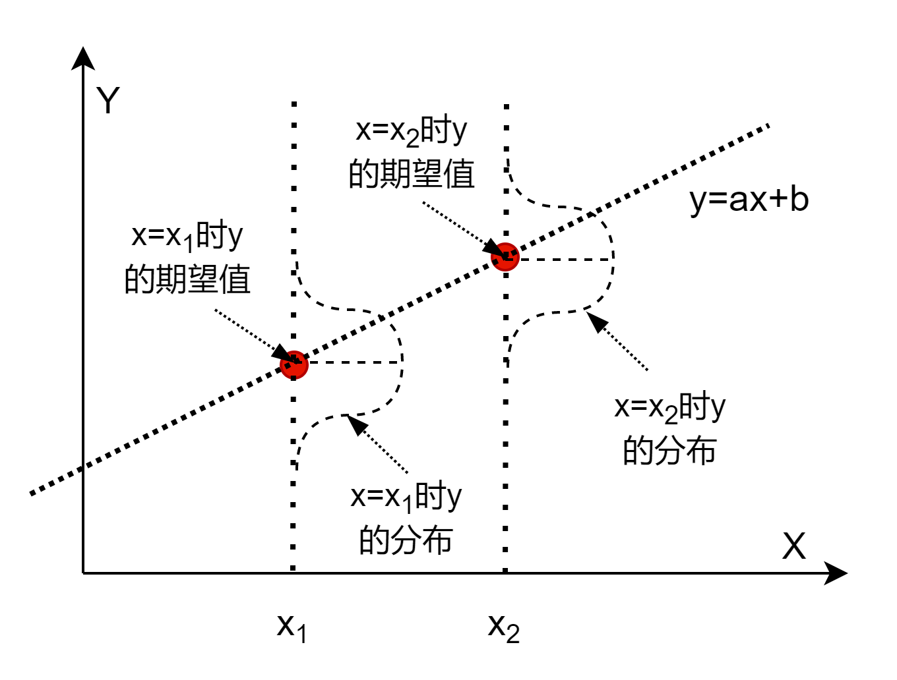

## 1.1 简单线性回归

### 简单的直线求解问题

大家在初中就学习过这样的问题：在平面上有两个点 $p_1(2,2)$ 和 $p_2(4,3)$，求解一条直线可以同时穿过这两个点，见图 1.1.1。

图 1.1.1 一条穿过两点的直线

直线的方程为：

$$
y = ax + b \tag{1.1.1}
$$

那么就把问题转化为求解 $a$ 和 $b$ 的值，这是最简单的线性问题，只要把 $p_1$ 和 $p_2$ 两个点的坐标值带入公式 1.1.1，即可得到一个二元一次方程组：

$$
\begin{cases}
2=2a+b
\\\\
3=4a+b
\end{cases}
$$

解此方程组得到：

$$
\begin{cases}
a=0.5 
\\\\
b=1
\end{cases}
$$

则公式的实际形式为：$y=0.5x+1$，这样我们就得到了从两个样本点表示出来的直线。

### 线性回归问题

平面上两点确定一条直线，这是一个常识。但是如果像图 1.1.2 那样有三个点，由于噪音的存在，点 $p_3$ 不在直线 $y=0.5x+1$ 上，而是与点 $p_1$ 形成了另外一条直线 $y=x$。但是依然要求我们用一条直线来表示这些点，我们如何确定哪条直线是正确的解呢？

图 1.1.2 一条直线拟合多个点

**这就是线性回归模型要解决的问题：如何用一条直线来表示并非精确地排列在一条直线上的点。通常我们把求解这条直线的过程叫做“回归”，也可以叫做“拟合”。**

### 一元线性回归模型

公式 1.1.1 是一个非常简单的理想化的数学问题，但是在客观世界中，由于受到各种因素的干扰，实际的公式可能是这样的：

$$
y=ax+b+\varepsilon \tag{1.1.2}
$$

公式 1.1.2 称为一元线性回归模型，其中：

- $a$ 和 $b$ 是模型的参数，是标量，也是我们讨论的算法要解决的目标。
- $x$ 是一元自变量，在机器学习中叫做样本特征值。
- $y$ 是因变量，在机器学习中叫做样本标签值。
- $\varepsilon$ 是误差项，服从正态分布的随机变量且独立，即 $\varepsilon \sim N(0,\sigma^2)$

针对这一模型，有以下几个主要假定$^{[1]}$：

1. 因变量 $y$ 与自变量 $x$ 之间具有线性关系。
2. 在重复抽样中，自变量 $x$ 的取值是固定的，即假定 $x$ 是非随机的。
3. 误差项 $\varepsilon$ 是一个期望为 0 的随机变量，即 $\mathbb{E}[\varepsilon]=0$。
4. 对于所有的 $x$ 值，$\varepsilon$ 的方差都相同。

上述假定意味着对于任何一个给定的 $x$，$y$ 的取值都对应着一个分布，所以 $y$ 的期望值 $\mathbb{E}[y]=ax+b$，而 $y$ 的方差等于 $\varepsilon$ 的方差 $\sigma^2$。当 $\sigma^2$ 较小时，$y$ 的观测值（期望值加噪音后的采样值）非常靠近直线；当 $\sigma^2$ 较大时，$y$ 的观测值将偏离直线。

注意，虽然公式 1.1.2 中含有 $\varepsilon$，但这个噪音不是模型本身要解决的问题，模型只能在给定样本 $x、y$ 的情况下，解出参数值 $a、b$。因为我们认为 $\varepsilon$ 已经包含在样本标签值 $y$ 中了。

图 1.1.3 对于指定的 x 值的 y 值的分布

从图 1.1.3 可以看到，$y$ 的期望值处于 $y=ax+b$ 直线之上，但是其实际的取值却是个正态分布。比如，$x1=2$ 时，$y$ 的取值可能是 $1.9$、$1.93$、$1.99$、$2$、$2.01$、$2.02$ ...... 中的任何一个值。
